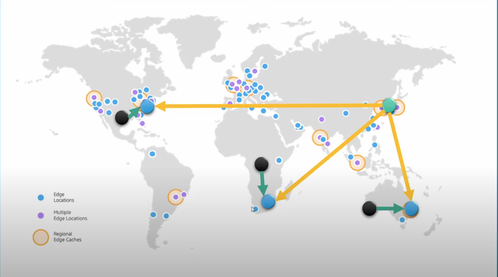
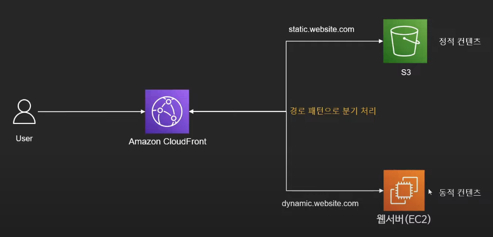
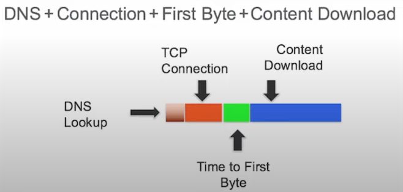
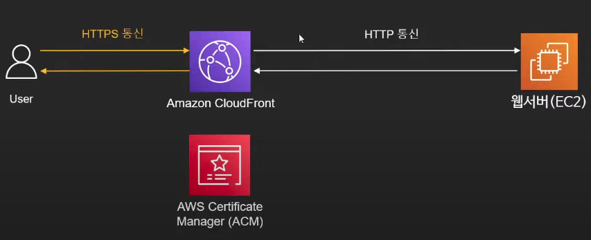
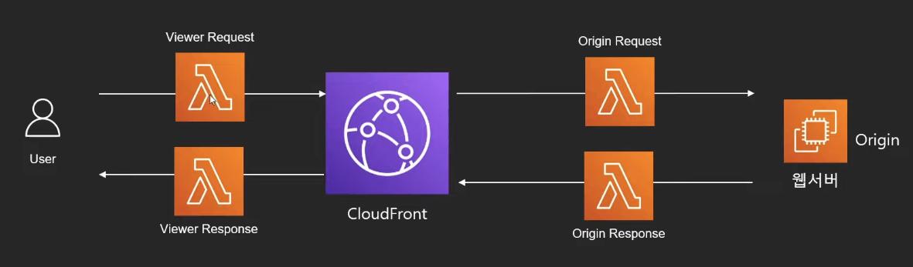
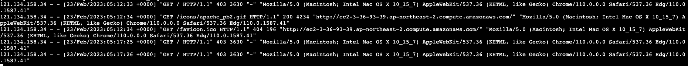
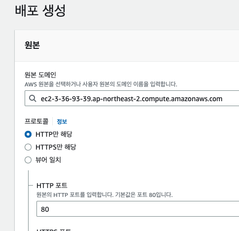
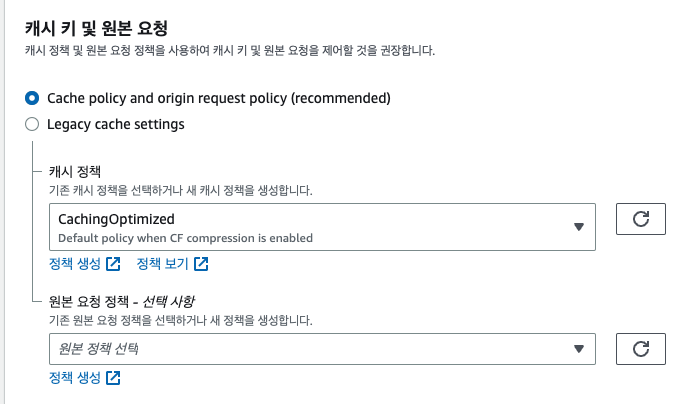
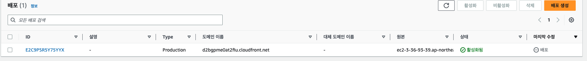
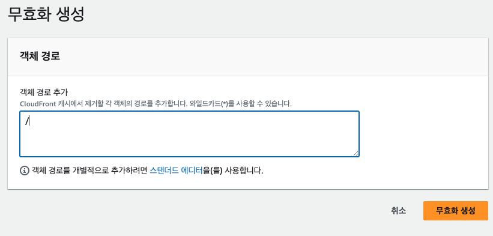

# Amazon CloudFront

## 정의 

CDN(Content Delivery Network) 서비스 

* 웹페이지, 이미지, 동영상 등의 컨텐츠를 서버에서 받아 캐싱
* 요청이 들어오면 캐싱에서 제공
* 서버와 요청의 거리가 멀거나, 통신 환경이 안 좋은경우 근처의 CDN을 통해 빠르게 응답 가능
* 서버의 부하를 낮출 수 있음.

## Amazon Edge Location

아마존에서 만든 컨텐츠가 캐싱되고 유저에게 제공되는 지점

## 동작 방식 

* 요청 받은 컨텐츠가 엣지 로케이션에 있다면, 바로 전달
* 없다면, 근원 서버에서 제공받아 전달 (캐싱도 진행)

## 구성 

### Origin
    실제 컨텐츠가 존재하는 근원 (ec2, s3)
    AWS 서비스
    온프레미스 서버

### Distribution

CloudFront의 CDN 구분 단위. 여러 엣지 로케이션

## 설정 및 용어

#### TTL
* time to live
* 캐싱된 아이템이 살아 있는 시간. (TTL초 이후 캐싱에서 삭제됨)

#### 파일 무효화(invalidate)
* TTL이 지나기 전에 강제로 캐시 삭제
* 잘못된 파일이 캐싱됐을 경우.
* 대신 비용이 발생함. 1000건 이상부터

#### Cache Key
* 캐싱 기준
* URL
* header, cookie, 쿼리스트링 등등 

## 기능 

#### 1. 정적/동적 컨텐츠 모두 최적화 

* 정적(static)
이미지/css/서버가 필요없는 내용들
캐싱으로 접근 속도 최적화

* 동적(Dynamic)
서버계산, DB조회가 필요한 내용
네트워크 최적화(DNS Lookup, TCP connection, Time to First Byte 최적화) : 서버로부터 파일을 받기 전에 하는 전처리 과정

#### 2. HTTPS 지원

* origin에서 HTTPS를 지원하지 않더라도 HTTPS통신을 지원하도록 구성 가능
* s3 static hosting 할 때, 특히 유용

#### 3. Lambda@edge

* 람다 사용 

#### 4. 리포팅
* cloudfront 이용지표 확인
* 캐시상태, 가장 많은 요청받은 컨텐츠, top referrer

#### 5. 정책 설정

* cache control
  * 캐싱 방법 및 압축
  * TTL / Cache key 

* Origin Request
  * Origin에 쿠키, 헤더, 쿼리스트링 중 어떤 것을 보낼지

* 뷰어에게 보낼 HTTP header 정의

#### 6. Origin Access Identity
* S3의 컨텐츠를 CloudFront를 사용해서만 볼 수 있도록 제한
* CloudFront만 권한을 가지고 S3에 접

### 오리진 프로토콜 정책
CloudFront가 **오리진 서버(예: S3 버킷, EC2 인스턴스, 또는 다른 웹 서버)와 통신할 때** 어떤 프로토콜을 사용할지를 결정하는 설정

1. 오리진 프로토콜 정책의 옵션

CloudFront의 오리진 프로토콜 정책에는 세 가지 주요 옵션이 있습니다:

HTTP만 (HTTP Only):
•	CloudFront가 **오리진 서버로 항상 HTTP 프로토콜을 사용하여 요청** 을 보냅니다.
•	이 설정을 사용할 경우, 오리진 서버와 CloudFront 간의 통신은 암호화되지 않습니다.
•	오리진 서버가 HTTP만 지원하거나, 보안이 덜 중요한 콘텐츠를 제공할 때 사용할 수 있지만, 보안 취약점이 있어 HTTPS 통신이 필요한 경우에는 적합하지 않습니다.
HTTPS만 (HTTPS Only):
•	CloudFront는 **오리진 서버로 항상 HTTPS 프로토콜을 사용하여 요청**을 보냅니다.
•	이 설정은 오리진 서버와 CloudFront 간의 모든 통신을 암호화하므로, 오리진 서버와의 통신이 암호화된 상태로 유지됩니다.
•	오리진 서버가 민감한 데이터를 포함하거나, 클라이언트-서버 간의 통신이 암호화되어야 하는 경우에 적합한 설정입니다.
매칭된 뷰어 (Match Viewer):
•	이 옵션은 CloudFront가 **사용자(뷰어)로부터 받은 요청에 따라 오리진 서버에 요청을 보낼 때 같은 프로토콜을 사용**합니다.
•	예를 들어, 클라이언트가 HTTPS로 요청을 보냈다면, CloudFront도 오리진 서버에 HTTPS로 요청을 보냅니다. 반면에 클라이언트가 HTTP로 요청을 보냈다면 CloudFront는 HTTP로 요청합니다.
•	이 설정은 뷰어가 어떤 프로토콜을 사용하느냐에 따라 유연하게 오리진 서버와의 통신 방식을 조절할 수 있습니다. 그러나 보안 측면에서는, 모든 요청을 암호화하지 않으므로 HTTPS Only보다는 덜 안전할 수 있습니다.

2. 각 옵션의 사용 사례

HTTP Only:
•	오리진 서버에서 제공하는 데이터가 **보안이 요구되지 않는 정적 콘텐츠인 경우** 사용됩니다.
•	예를 들어, 공개적으로 접근 가능한 정적 웹사이트 파일을 호스팅하는 경우 HTTP를 사용할 수 있습니다.
•	그러나 HTTP는 암호화되지 않으므로, 민감한 데이터 전송에는 적합하지 않습니다.
HTTPS Only:
•	오리진 서버와의 모든 통신을 암호화할 수 있습니다. **보안이 중요한 애플리케이션**에서 사용됩니다.
•	사용자의 개인 정보, 금융 정보, 또는 로그인 정보를 처리하는 애플리케이션에 적합합니다.
•	이 옵션을 사용하려면 오리진 서버가 HTTPS를 지원해야 하고, SSL/TLS 인증서를 갖추고 있어야 합니다.
Match Viewer:
•	**유연성이 필요한 경우**, 클라이언트의 요청 방식에 따라 CloudFront가 오리진 서버에 접근할 수 있게 합니다.
•	보안이 덜 중요하거나, 다양한 클라이언트 환경에서 HTTP와 HTTPS 모두를 지원할 필요가 있는 경우 사용할 수 있습니다.
•	그러나 보안에 민감한 애플리케이션에는 적합하지 않으며, 오리진과 CloudFront 간 통신의 일관성을 보장할 수 없습니다.

3. 오리진 프로토콜 정책의 고려사항

	•	오리진 서버의 HTTPS 지원 여부: 오리진 서버가 HTTPS를 지원해야만 HTTPS Only나 Match Viewer에서 HTTPS 요청을 보낼 수 있습니다.
	•	SSL 인증서 관리: 오리진 서버가 HTTPS를 지원하는 경우, SSL/TLS 인증서가 올바르게 설정되어 있어야 합니다. 특히 HTTPS Only 옵션을 사용하는 경우, 오리진 서버가 SSL 인증서를 통해 신뢰할 수 있는 보안 연결을 지원해야 합니다.
	•	보안 요구사항: HTTPS는 데이터를 암호화하여 전송하므로, 민감한 정보가 포함된 애플리케이션이나 웹사이트에서는 반드시 HTTPS Only를 사용하는 것이 좋습니다. HTTP Only는 보안 취약점을 초래할 수 있으므로 피하는 것이 좋습니다.

4. 전체 설정 흐름 예시

	•	HTTPS Only 설정 시: CloudFront는 사용자의 요청과 관계없이 항상 오리진 서버와 HTTPS로 통신합니다. 이를 통해 CloudFront와 오리진 서버 간의 데이터는 항상 암호화되어 안전하게 전송됩니다.
	•	Match Viewer 설정 시: 만약 사용자가 HTTP로 요청을 보냈다면 CloudFront도 HTTP로 오리진에 요청을 보내고, HTTPS로 요청이 오면 CloudFront도 오리진에 HTTPS로 요청을 보냅니다. 따라서 클라이언트의 요청 방식에 따라 프로토콜이 동적으로 결정됩니다.

결론

	•	HTTPS Only는 보안이 가장 중요한 상황에서 추천되며, 모든 트래픽이 암호화됩니다.
	•	HTTP Only는 보안이 필요 없는 상황에서만 사용해야 합니다.
	•	Match Viewer는 사용자 편의성을 중시하지만, 보안 측면에서는 덜 안전할 수 있습니다.

### 뷰어 프로토콜 정책
CloudFront가 **뷰어(사용자)와 통신할 때** 어떤 프로토콜을 사용할지를 결정

HTTP와 HTTPS 허용 (Allow All):
•	사용자(뷰어)가 HTTP 또는 HTTPS 프로토콜 중 어느 쪽이든 사용하여 CloudFront에 요청할 수 있습니다.
•	보안이 상대적으로 덜 중요하거나, 모든 종류의 트래픽을 허용하고자 할 때 선택합니다.
•	그러나 HTTP는 암호화되지 않으므로 보안 상의 위험이 있습니다.
HTTPS로 리디렉션 (Redirect HTTP to HTTPS):
•	사용자가 HTTP를 통해 요청을 보낸 경우, CloudFront가 **자동으로 HTTPS로 리디렉션**합니다.
•	이 설정은 보안을 강화하면서도 사용자 경험을 해치지 않도록 HTTP 요청을 안전한 HTTPS로 전환하는 방식입니다.
•	이를 통해 HTTP로 접근하는 사용자가 있더라도, 보안이 유지되도록 강제할 수 있습니다.
HTTPS만 허용 (HTTPS Only):
•	사용자가 반드시 **HTTPS 프로토콜을 사용해 CloudFront에 요청**해야 합니다.
•	HTTP 요청은 전혀 허용되지 않으며, 이를 통해 더욱 강력한 보안이 제공됩니다.
•	보안에 민감한 데이터나 중요한 애플리케이션에 적합한 설정입니다.

2. 각 옵션의 사용 사례

•	Allow All (HTTP와 HTTPS 허용): 보안이 그렇게 중요하지 않거나, 오래된 브라우저나 클라이언트를 지원해야 하는 경우 사용됩니다. 예를 들어, 일부 내부 시스템에서 HTTP만 사용 가능한 경우가 있을 수 있습니다. 그러나 일반적인 경우에는 보안 취약점이 있으므로 권장되지 않습니다.
•	Redirect HTTP to HTTPS (HTTPS로 리디렉션): 대부분의 웹사이트와 애플리케이션에서 일반적으로 사용되는 옵션입니다. 이 설정은 보안을 보장하면서도 HTTP로 접근하는 사용자를 HTTPS로 리디렉션하므로 사용자 경험을 해치지 않고 안전한 연결을 유지할 수 있습니다. 웹사이트나 애플리케이션이 HTTPS만을 사용해야 하지만, 사용자가 실수로 HTTP로 접근할 가능성이 있는 경우 유용합니다.
•	HTTPS Only (HTTPS만 허용): 보안이 매우 중요한 환경에서 사용됩니다. 예를 들어, 금융 서비스, 의료 데이터, 로그인 시스템 등 HTTPS를 강제로 사용하여 모든 트래픽을 암호화하는 것이 중요한 경우 이 옵션을 사용합니다. 이 설정은 모든 트래픽을 HTTPS로만 처리하므로 완벽한 암호화를 보장합니다.

3. CloudFront 및 SSL 인증서

•	HTTPS 연결을 지원하려면 SSL/TLS 인증서가 필요합니다. CloudFront에서는 AWS Certificate Manager(ACM) 또는 외부에서 발급받은 인증서를 사용할 수 있습니다.
•	특히, HTTPS Only 또는 Redirect HTTP to HTTPS 옵션을 사용하면, 반드시 CloudFront에 SSL 인증서를 설정해야 합니다.

4. 결론

•	Allow All은 보안이 필요하지 않은 경우에만 사용해야 하고, Redirect HTTP to HTTPS는 대부분의 웹 애플리케이션에 적합한 중간 단계입니다.
•	HTTPS Only는 보안이 필수적인 경우 권장됩니다.
•	최신 애플리케이션에서는 대개 HTTPS Only나 Redirect HTTP to HTTPS 설정을 사용하는 것이 표준입니다.

## 실습 
amazon linux
ec2 접속
~~~sh
sudo -s
yum install httpd
service httpd start
~~~

샘플 페이지 접속 

~~~sh
cd /var/log/httpd
tail -f access_log
~~~
새로고침을 누르면 접속 로그가 갱신되는 것을 볼 수 있음. 

CloudFront 배포 생성

* ec2 dns 주소 입력

배포

index.html 생성
~~~sh
sudo -s
vim /var/www/html/index.html
hello world
~~~

ec2 주소와 cloudFront 주소로 모두 접속해보기

cloudFront로 접속하면 최초에만 로그가 남고 

그뒤로는 아무리 새로고침을 해도 로그가 남지 않는다. 

캐싱에서 접근하기 때문

index.html 내용을 바꾸면?

hello world2라고 변경 후, 접속하면 ec2에서는 hello world2라고 보이지만 cloudFront에서는 여전히 hello world라고 보인다.

이때, invalidation 무효화를 해줘야 한다. 

캐싱된 파일이 삭제되고 cloudFront는 새롭게 요청을 보내 새롭게 캐싱을 한다.

## 출처

https://us-east-1.console.aws.amazon.com/cloudfront/v3/home?region=ap-northeast-2#/welcome

https://www.youtube.com/watch?v=6C9284C-zP4
