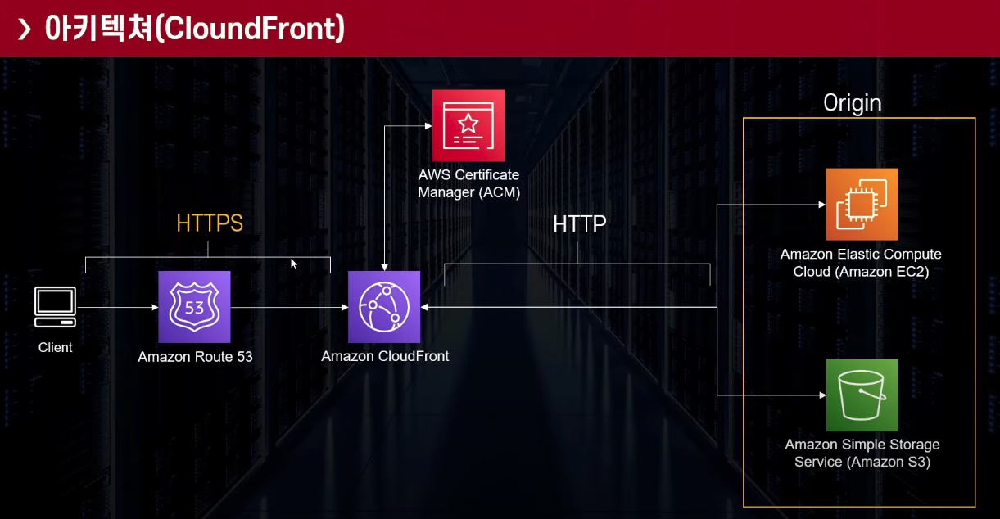
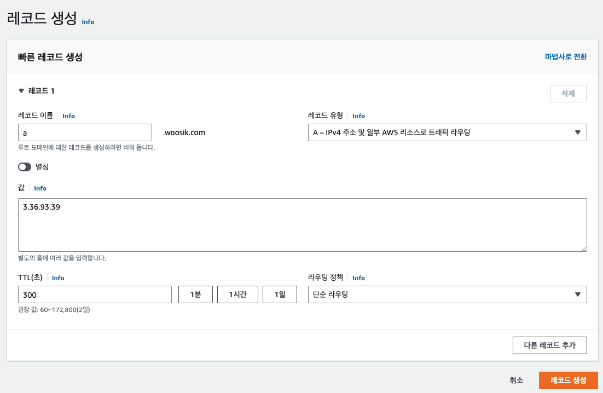
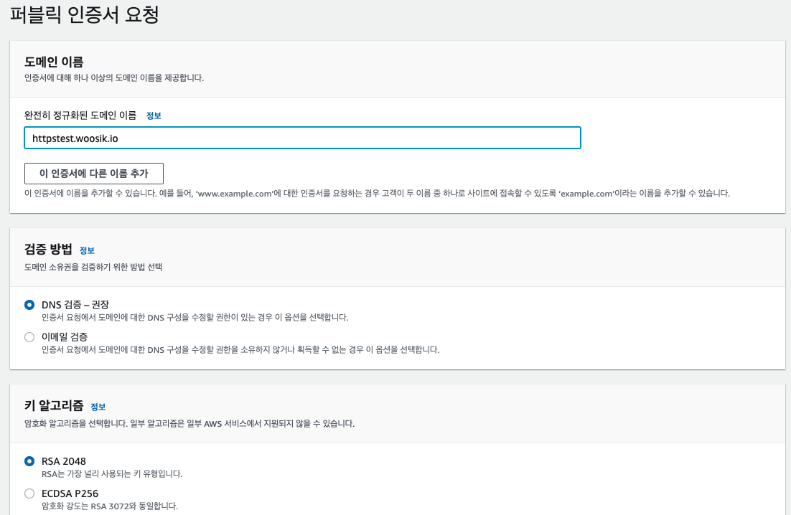

# CloudFront로 HTTPS 웹사이트 제공하기

## 아키텍쳐

서버에 별도로 HTTPS를 구현할 필요 없음. 

ACM에서 인증서 제공. 

## 실습 

* EC2 생성
* Route53 레코드 생성 
  * 
  * 값에 ec2 퍼블릭 IPv4 주소 적어줌.

* ACM 생성
  * 인증서 요청 > 퍼블릭 인증서 요청
  * 
  * Route 53에서 레코드 자동 생성