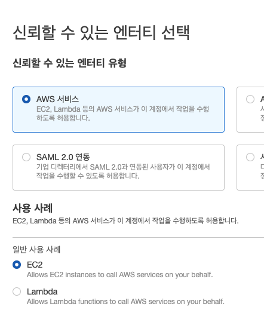
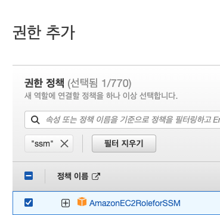
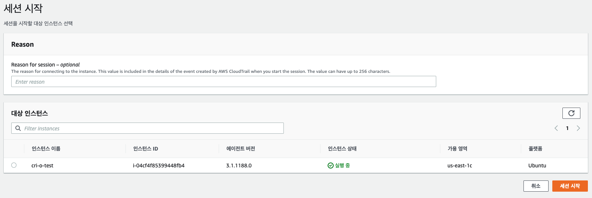
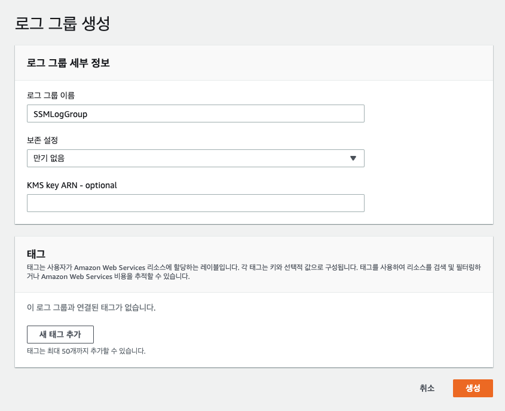
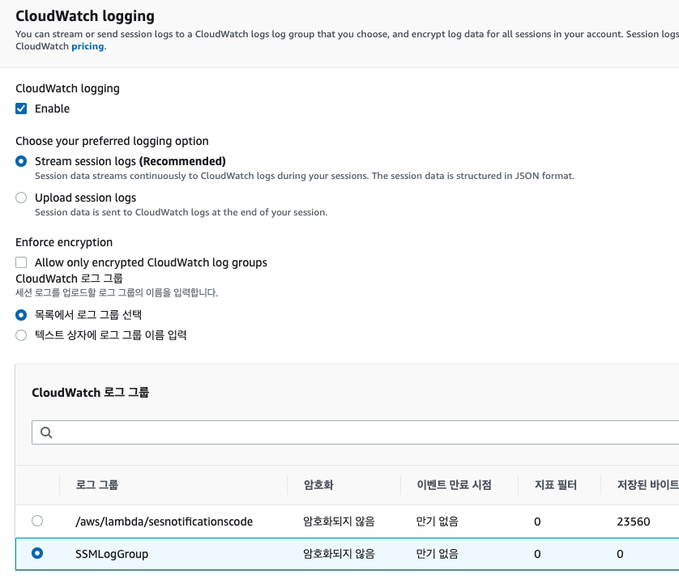
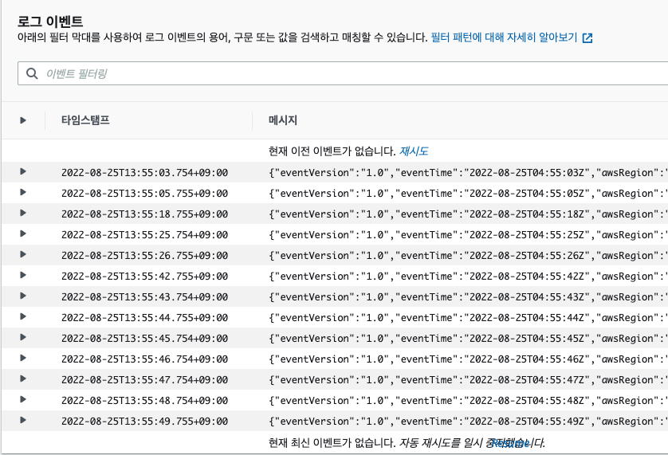

# Seesion Manager 

Bastion 서버 없이 EC2 인스턴스에 직접 터미널 세션을 열 수 있다. 
퍼블릭 IP 없이도 EC2에 안전하게 접근할 수 있으며, IAM 권한을 사용하여 세밀하게 접근을 제어할 수 있다. 
Bastion 서버를 대체할 수 있는 방식으로 점차 많이 사용된다.

## 장점 

인스턴스에 대해 원클릭 액세스 제공하는 관리형 서비스 

SSH연결, 포트 open 필요 없이 인스턴스에 로그인 가능

IAM 유저 단위로 제어 가능. key 파일 필요없음. 

웹브라우저 기반으로 OS와 무관하게 사용 가능. 

로깅과 감사 
    CloudTrail 연동

    접속기록, 사용한 모든 커맨드 및 출력내역을 S3, CloudWatch 전송가능.

    EventBridge등과 연동해서 알림받기 

## 실습 

1. 역할 만들기 

2. 권한 정책 연결 

3. Ec2에 역할 부착 

    ubuntu 사용시, 20.04 버전써야됨.
   
4. Systems Manager > 세션 관리자 > 세션 시작 

5. 로그그룹 만들기 

    
    CloudWatch > 로그 그룹 생성 

6. session manager > 기본설정 > 편집 

7. log 확인 

