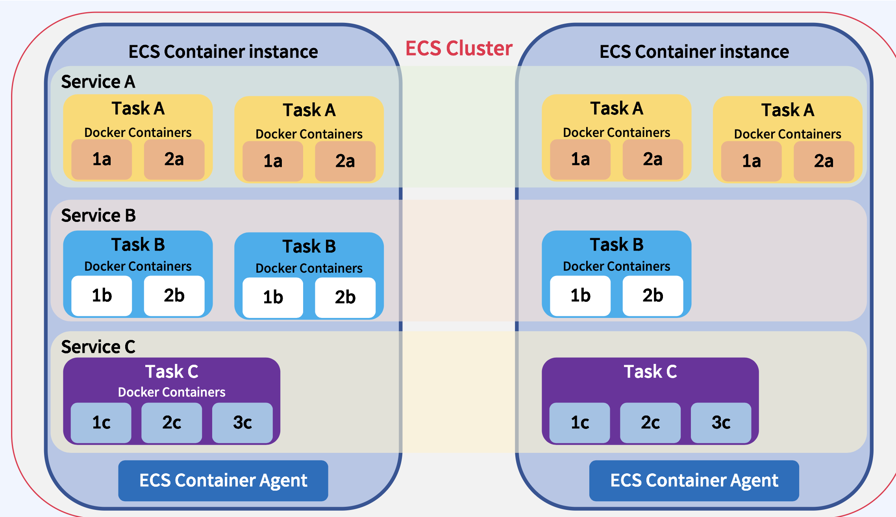

# ECS (Amazon Elastic Container Service)

## 개념

**완전 관리형 컨테이너 오케스트레이션 서비스**

Docker 컨테이너를 실행하고 관리할 수 있도록 설계되었으며, 애플리케이션을 손쉽게 배포, 관리, 확장할 수 있도록 지원

ECS는 서버리스 방식으로 동작하거나 EC2 인스턴스에서 컨테이너를 실행가능

## 주요 특징:

1. 완전 관리형 서비스: 
   1. ECS는 컨테이너 오케스트레이션을 자동으로 관리하며, 사용자는 인프라 관리 부담을 덜 수 있습니다. 
   2. 클러스터 구성과 클러스터 내부 컨테이너 실행,중지,배포 모니터링 가능
2. EC2 및 Fargate 지원:
   1. EC2 모드: 사용자가 직접 EC2 인스턴스를 관리하면서 컨테이너를 배포.
   2. Fargate 모드: 서버리스 방식으로, 사용자가 인프라를 관리하지 않아도 컨테이너를 실행할 수 있습니다.
3.	통합된 AWS 서비스: ECS는 Amazon VPC, ELB(Elastic Load Balancing), IAM, CloudWatch 등과 통합되어 보안, 네트워킹, 모니터링 등을 간편하게 설정할 수 있습니다.
4.	Auto Scaling: 필요에 따라 컨테이너 인스턴스를 자동으로 확장하거나 축소할 수 있습니다.
5.	유연한 작업 스케줄링: 사용자는 지정한 작업(Tasks)을 원하는 방식으로 실행할 수 있으며, 단일 작업 실행, 예약 작업, 지속적인 서비스 실행 등을 지원합니다.
6.	보안: IAM 역할을 통해 세밀한 권한 제어를 제공하고, 컨테이너 간 네트워크 통신을 보호합니다.

## ECS 구성 요소:

### ECS 클러스터(Cluster)

-	정의: ECS 클러스터는 **ECS 작업(Task)을 실행하기 위한 논리적 그룹**입니다. ECS의 가장 상위 구조
- 구성:
  -	컨테이너 인스턴스(Container Instance): 클러스터 내에서 작업을 실행하는 EC2 인스턴스 또는 Fargate 인프라.
  -	작업(Task): 태스크 정의에 기반하여 실행되는 컨테이너 인스턴스.
  -	서비스(Service): 특정 수의 작업을 지속적으로 실행하고 관리하는 구성 요소.

### 태스크 정의(Task Definition)

-	정의: 컨테이너를 실행하기 위한 **설정을 정의하는 JSON 템플릿**.
- 구성 요소:
  -	컨테이너 정의: 실행할 Docker 이미지, 메모리, CPU, 환경 변수, 네트워크 설정 등을 포함.
    - 이름:
      - 태스크 내의 고유한 컨테이너 이름  
    - 이미지(Image) URI:
      -	실행할 Docker 이미지의 이름과 태그를 지정합니다.
      -	예: nginx:latest, myapp:v1.0, 123456789012.dkr.ecr.us-west-2.amazonaws.com/my-app:latest
    - CPU 및 메모리(CPU and Memory):
      - 개별 컨테이너에 대한 세부적인 리소스 제약을 설정
      -	ECS에서 CPU와 메모리는 태스크 수준과 컨테이너 수준에서 설정할 수 있습니다.
    - 포트 매핑(Port Mappings):
      - 컨테이너 포트(Container Port)
        - 컨테이너 내부에서 애플리케이션이 수신 대기(listening)하는 포트
        - Docker 컨테이너 내에서 애플리케이션이 바인딩된 포트를 설정
      - 호스트 포트(Host Port)
        - 외부 트래픽이 호스트(EC2 인스턴스 또는 Fargate ENI)의 특정 포트로 들어올 때 컨테이너로 전달
        - 0: 동적으로 호스트 포트를 할당.
      -	컨테이너 포트를 호스트 포트 또는 awsvpc 네트워크 모드의 ENI에 매핑합니다.
      -	예: 컨테이너 포트 80을 호스트 포트 8080에 매핑.
    - 환경 변수(Environment Variables):
      -	컨테이너에 전달할 환경 변수를 설정합니다.
      -	예: 데이터베이스 연결 정보, 애플리케이션 설정 값.
    - 커맨드 및 엔트리포인트(Command and EntryPoint):
      -	컨테이너가 시작될 때 실행할 명령어와 엔트리포인트를 설정합니다.
    - 로깅(Logging):
      -	컨테이너에서 생성된 로그를 어디로 보낼지 정의합니다.
    -	Amazon CloudWatch Logs와의 통합을 설정하여 로그를 중앙에서 관리할 수 있습니다.
  - 볼륨 정의: 컨테이너 간 공유할 볼륨 설정.
  - 인프라 요구 사항
    - 태스크 크기
      - 태스크 전체(즉, 태스크 내 모든 컨테이너가 공유할 수 있는 리소스)의 CPU와 메모리를 정의
      - ECS 태스크와 컨테이너가 사용할 CPU와 메모리 자원을 제어
  - 네트워크 모드: 컨테이너의 네트워크 설정(bridge, host, awsvpc 등).
    - Bridge: Docker의 기본 브리지 네트워크 모드.
      - 컨테이너 포트와 호스트 포트를 매핑하여, 외부에서 호스트 시스템의 특정 포트로 접근하면 컨테이너의 지정된 포트로 트래픽이 전달
      - 예: 호스트 포트 8080을 컨테이너 포트 80으로 매핑하면, 외부 클라이언트가 http://<host-ip>:8080에 접속하면 컨테이너의 80 포트로 트래픽이 전달
    - Host: 
      - 컨테이너가 호스트와 동일한 네트워크 네임스페이스를 공유
      - 컨테이너 포트와 호스트 포트가 동일하게 설정되어야 하며, 포트 매핑이 필요하지 않습니다.
    - awsvpc: 
      - 컨테이너에 고유한 Elastic Network Interface(ENI)와 고유한 사설 IP 주소를 할당.
      - 컨테이너가 VPC 내에서 독립적으로 네트워크를 구성
      - 포트 매핑은 필요하지만, 컨테이너 포트와 ENI에 대한 포트 간 매핑이 이루어집니다.
    - None: 네트워크를 비활성화.

### 서비스(Service)

-	정의: 지속적으로 실행되어야 하는 **작업(Task)을 관리하는 ECS 구성 요소**.
- 기능:
  - 서비스가 지정한 **태스크 정의(Task Definition)에 따라 작업을 생성**
  -	특정 수의 작업을 유지.
  -	실패한 작업을 재시작.
  -	**Auto Scaling**: 트래픽 변화에 따라 작업 수를 자동 조정.
  -	로드 밸런싱: **ELB(Elastic Load Balancer)를 사용하여 트래픽을 작업에 분산**.

### 작업(Task)

-	정의: 태스크 정의에 따라 실행되는 컨테이너 인스턴스.
- 구성:
  -	태스크 정의(Task Definition)에 설정된 내용을 바탕으로 **하나 이상의 컨테이너가 포함**될 수 있음.
  -	특정 리소스(CPU, 메모리)를 할당받아 실행.
  -	작업이 실행되는 동안 ECS 클러스터와 통신하여 상태를 보고.
  - ECS는 클러스터 내의 컨테이너 인스턴스(즉, EC2 인스턴스 또는 Fargate)에 이 태스크를 배포

#### 컨테이너
- **태스크 내에서 실제 애플리케이션이 실행되는 단위**. 컨테이너는 **태스크 정의에서 설정한 Docker 이미지**를 사용하여 애플리케이션을 실행합니다.
- Docker 컨테이너를 시작
-	태스크 내의 컨테이너는 서로 네트워크와 볼륨을 공유할 수 있으며, 각 컨테이너는 독립적으로 실행됩니다.
-	예를 들어, web과 db라는 두 개의 컨테이너를 하나의 태스크에 설정할 수 있습니다.

### 컨테이너 인스턴스(Container Instance)

-	정의: ECS 클러스터 내에서 태스크와 컨테이너를 실제로 실행하는 물리적 또는 가상 컴퓨팅 리소스 **EC2 인스턴스, Fargate 리소스**. 작업(Task)을 실행하는 공간
- 구성:
  -	**EC2 인스턴스**: ECS 에이전트가 설치된 EC2 인스턴스로, **작업과 컨테이너를 실행**. 내부적으로 autoscaling 그룹으로 구성되어있음.
  -	**ECS 에이전트**: **인스턴스와 ECS 서비스 간의 통신을 담당하는 소프트웨어**.
    -	작업 상태 보고
    -	작업 배포 및 관리
  -	**Docker 데몬**: ECS가 컨테이너를 실행하고 관리할 수 있도록 지원.
  -	**IAM 역할**: 인스턴스가 AWS 리소스에 접근할 수 있도록 권한을 부여.
-	상태: 컨테이너 인스턴스는 등록 상태(Registered), 활성 상태(Active), 중지 상태(Deregistered)로 관리.

## 생성 흐름
1. ECS 클러스터 생성 시 컨테이너 인스턴스 준비

-	ECS 클러스터를 생성할 때 EC2 기반으로 클러스터를 구성하는 경우, 클러스터 내에서 컨테이너 인스턴스(EC2 인스턴스)를 준비합니다.
-	컨테이너 인스턴스는 EC2 인스턴스에 ECS 에이전트가 설치되어 있어, ECS 클러스터와 통신하며 **작업(Task)**을 실행할 수 있습니다.
-	클러스터가 Fargate 기반이라면, 개별 컨테이너 인스턴스를 직접 생성하지 않고, AWS가 필요에 따라 인프라 리소스를 자동으로 관리합니다.

2. 서비스 생성 및 태스크 정의(Task Definition) 설정

-	클러스터가 준비되면 **서비스(Service)**를 생성할 수 있습니다.
-	서비스 생성 시, **태스크 정의(Task Definition)**를 지정하여 서비스가 실행할 작업(Task)에 대한 설정(컨테이너 이미지, 포트, CPU, 메모리, 환경 변수 등)을 제공합니다.
-	서비스는 태스크 정의를 바탕으로 작업(Task)을 생성하고, 이를 클러스터 내의 컨테이너 인스턴스에 배치합니다.

3. 서비스가 작업(Task)을 컨테이너 인스턴스에 배치

-	서비스는 태스크 정의에 따라 필요한 수의 작업(Task)을 생성하고, 이를 클러스터 내 컨테이너 인스턴스에 자동으로 배치합니다.
-	ECS는 클러스터 내에서 사용 가능한 컨테이너 인스턴스를 탐색하고, 작업(Task)을 적절히 분산하여 배치합니다.
-	예를 들어, 서비스에서 4개의 작업을 실행하도록 설정했다면, **ECS는 클러스터 내 컨테이너 인스턴스들에 4개의 작업을 균형 있게 배치**합니다.

4. 서비스의 작업(Task) 관리 및 스케일링

-	서비스는 설정된 작업 수를 지속적으로 유지하며, 작업이 실패하거나 종료되면 자동으로 새로운 작업을 생성해 클러스터 내 컨테이너 인스턴스에 재배치합니다.
-	서비스에 Auto Scaling을 설정할 경우, 트래픽 변화에 따라 작업 수를 자동으로 조정하고, 작업이 클러스터 내 적절한 인스턴스에 배치되도록 관리합니다.

### asg와 alb
1. Auto Scaling Group과 Launch Template

-	ECS 클러스터를 생성할 때, Auto Scaling Group을 사용하도록 설정하면, ASG는 Launch Template을 기반으로 컨테이너 인스턴스(EC2 인스턴스)를 자동으로 생성합니다.
-	이 과정에서 생성된 EC2 인스턴스들은 ECS 클러스터의 리소스로 등록되어, ECS 에이전트가 설치된 상태로 클러스터에 연결됩니다.
-	ASG와 Launch Template에 설정된 내용에 따라, ASG는 클러스터에 필요한 인스턴스를 동적으로 확장하거나 축소할 수 있습니다.

2. ALB 설정과 ECS 서비스의 통합

-	ECS 서비스 생성 시 ALB를 설정하면, 서비스는 자동으로 ALB와 연동되도록 구성됩니다.
-	ECS는 서비스가 생성되면 ALB의 **대상 그룹(Target Group)**을 자동으로 생성하거나 기존의 대상 그룹에 ECS 작업(Task)을 등록하여 트래픽을 분산할 준비를 합니다.
-	ECS와 ALB 간의 연동을 설정할 때, ALB 대상 그룹을 지정하고 트래픽을 전달할 리슨 포트 및 대상 포트를 설정할 수 있습니다.

3. 컨테이너 인스턴스와 ALB 대상 그룹의 자동 연결

-	ECS에서 서비스에 ALB를 설정할 때, ECS 서비스에 연결된 컨테이너 인스턴스들이 자동으로 ALB 대상 그룹에 등록되도록 AWS가 설정을 자동으로 수행합니다.
-	이 동작은 ECS와 ALB가 통합되어 있기 때문에 가능한데, ECS 서비스는 대상 그룹의 상태를 지속적으로 모니터링하며, 서비스에 연결된 컨테이너 인스턴스(EC2 인스턴스)가 대상 그룹에 자동으로 등록되도록 관리합니다.
-	만약 컨테이너 인스턴스가 추가되거나 삭제되는 경우, ALB 대상 그룹은 이에 맞춰 자동으로 업데이트됩니다.

4. 자동 등록 메커니즘의 핵심 요소

-	Auto Scaling Group: 컨테이너 인스턴스 수를 관리하며, 인스턴스가 추가되면 ALB 대상 그룹에 자동으로 등록되도록 설정.
-	ECS Service와 ALB 연동: ECS 서비스에 ALB를 연결할 때, ALB의 대상 그룹이 자동으로 생성되거나 지정됩니다. 서비스에 설정된 **태스크 정의(Task Definition)**의 컨테이너 포트가 ALB 대상 포트로 자동 매핑됩니다.
-	컨테이너 인스턴스 자동 등록: ECS 서비스가 설정된 인스턴스들을 ALB 대상 그룹에 자동으로 등록하고, 로드 밸런서가 컨테이너 인스턴스의 상태를 관리합니다.