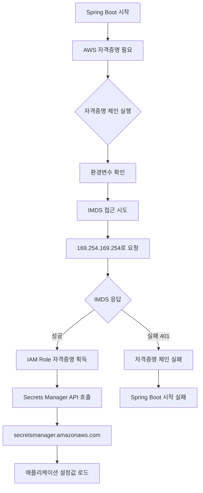
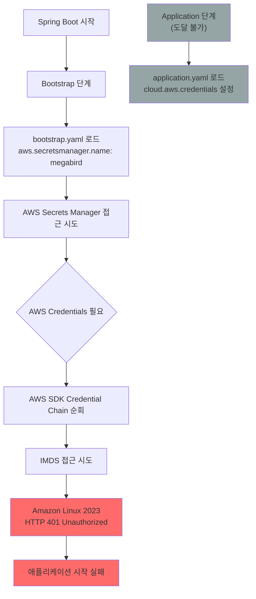

# 📋 Amazon Linux 2023 마이그레이션 AWS 자격증명 문제 해결 가이드

> **작성일**: 2025년 8월 1일  
> **대상**:  개발팀  
> **환경**: EKS 1.33 + Amazon Linux 2023  

## 🚨 문제 상황

### 발생한 오류
```
2025-08-01 00:18:46.783 ERROR [dev-mbp-api,,] 1 --- [main] s.AwsSecretsManagerPropertySourceLocator : 
Fail fast is set and there was an error reading configuration from AWS Secrets Manager:

Unable to load AWS credentials from any provider in the chain:
- EnvironmentVariableCredentialsProvider: Unable to load AWS credentials from environment variables
- SystemPropertiesCredentialsProvider: Unable to load AWS credentials from Java system properties  
- WebIdentityTokenCredentialsProvider: You must specify a value for roleArn and roleSessionName
- ProfileCredentialsProvider: profile file cannot be null
- EC2ContainerCredentialsProviderWrapper: Unauthorized (Service: null; Status Code: 401; Error Code: null)
```

### **AWS SDK Credential Provider Chain 실패 순서**

1. **EnvironmentVariableCredentialsProvider** ❌  
   → `AWS_ACCESS_KEY_ID`, `AWS_SECRET_ACCESS_KEY` 환경변수 없음

2. **SystemPropertiesCredentialsProvider** ❌  
   → `aws.accessKeyId`, `aws.secretKey` 시스템 프로퍼티 없음

3. **WebIdentityTokenCredentialsProvider** ❌  
   → IRSA(IAM Role for Service Account) 미구성

4. **ProfileCredentialsProvider** ❌  
   → `~/.aws/credentials` 파일 없음

5. **EC2ContainerCredentialsProviderWrapper** ❌  
   → **HTTP 401 Unauthorized** (핵심 문제!)

### 환경 정보
- **EKS 클러스터**: dev (1.32 → 1.33 업그레이드)
- **노드 OS**: Amazon Linux 2 → Amazon Linux 2023
- **애플리케이션**: Spring Boot + Spring Cloud AWS 2.2.6.RELEASE
- **문제 서비스**: api (Secrets Manager 연동)

## 📚 핵심 개념 이해

### IMDS vs AWS Secrets Manager - 차이점 명확히 하기

**🔧 IMDS (Instance Metadata Service):**
- **정의**: EC2 인스턴스 내부에서만 접근 가능한 특별한 서비스
- **주소**: `169.254.169.254` (고정 IP, 인터넷 불가)
- **역할**: 인스턴스 정보 + IAM Role 자격증명 제공
- **위치**: EC2 인스턴스 하이퍼바이저 레벨

**🔐 AWS Secrets Manager:**
- **정의**: 시크릿(암호, API키 등)을 저장하는 AWS 서비스
- **주소**: `secretsmanager.ap-northeast-2.amazonaws.com` (인터넷 기반)
- **역할**: 애플리케이션 설정값, DB 비밀번호 등 저장
- **위치**: AWS 클라우드 서비스

### 🔄 실제 흐름 (mbp-api 사례)



**💡 핵심:**
- **IMDS 실패** → **자격증명 없음** → **Secrets Manager 접근 불가** → **앱 시작 실패**

### 🔍 Spring Cloud AWS `/secret/` Prefix 공식 확인

**✅ 공식 문서에서 확인된 사실:**

**출처**: [Spring Cloud AWS 2.2.6.RELEASE - Common application properties](https://docs.spring.io/spring-cloud-aws/docs/current/2.2.6.RELEASE/reference/html/appendix.html)

**Properties 테이블:**
| Name | Default | Description |
|------|---------|-------------|
| `aws.secretsmanager.prefix` | **`/secret`** | Prefix indicating first level for every property. |

**실제 동작 과정:**
```yaml
# ConfigMap 설정
aws:
  secretsmanager:
    name: sss

# Spring Cloud AWS 자동 변환
실제 AWS Secret 이름: /secret/aaa
```

**ConfigMap 사용 예시:**
```yaml
# application.yaml 내부 (argo/mbp-api/*/cm.yml)
encryptor:
  password: ${encryptor_password}  # ← AWS Secret에서 자동 주입
```

### 💻 mmp-api 소스코드 분석 결과

**🚨 중요한 발견: 모든 AWS 설정이 완전히 외부화**

**확인된 사실:**
```
mmp-api/src/main/resources/
├── application.yml     # 로컬 개발용 설정만 포함
└── static/            # 정적 파일들

❌ bootstrap.yml 파일 없음
❌ AWS Secrets Manager 관련 코드 없음  
❌ AWS 설정 없음 (application.yml에도 없음)
✅ 모든 AWS 설정이 Kubernetes ConfigMap에서 관리
```

**✅ 순수한 라이브러리 의존성 구조:**
```gradle
// build.gradle - 오직 의존성만 존재
implementation 'org.springframework.cloud:spring-cloud-starter-aws-secrets-manager-config:2.2.6.RELEASE'
implementation 'org.springframework.cloud:spring-cloud-starter-aws:2.2.6.RELEASE'
```

**✅ 모든 설정이 ConfigMap에서 제공:**
```yaml
# argo/mbp-api/dev/cm.yml
bootstrap.yaml: |-
  aws:
    secretsmanager:
      name: aaa          # ← 유일한 AWS 설정
      region: ap-northeast-2
```

**💡 핵심 인사이트:**
- **커스텀 로직 없음**: `/secret/` prefix는 순수하게 Spring Cloud AWS 라이브러리 내부 동작
- **완전한 외부화**: 소스코드는 AWS를 모르고, ConfigMap이 모든 설정 제공
- **라이브러리 의존**: prefix 동작은 Spring Cloud AWS 2.2.6.RELEASE의 기본 동작

## 🔍 근본 원인 분석 (상세)

### 1. Amazon Linux 2023의 보안 강화 정책 변화

#### 1.1 IMDSv1 → IMDSv2 강제 전환의 기술적 배경

**보안 취약점 배경:**
- **2019년 Capital One 데이터 유출 사건**: SSRF(Server-Side Request Forgery) 공격으로 IMDSv1을 통해 IAM 자격증명 탈취
- **IMDSv1의 취약점**: 단순 HTTP GET 요청으로 누구나 접근 가능

**Amazon Linux 2 (기존) - IMDSv1/v2 혼용:**
```bash
# IMDSv1: 단순 HTTP GET (취약)
curl http://169.254.169.254/latest/meta-data/iam/security-credentials/role-name
# 응답: 즉시 자격증명 반환 ⚠️

# 내부 동작:
# 1. HTTP GET 요청
# 2. 검증 없이 즉시 응답
# 3. SSRF 공격에 취약
```

**Amazon Linux 2023 (신규) - IMDSv2 강제:**
```bash
# IMDSv2: 세션 토큰 기반 인증 (보안)
# Step 1: 토큰 요청
TOKEN=$(curl -X PUT "http://169.254.169.254/latest/api/token" \
  -H "X-aws-ec2-metadata-token-ttl-seconds: 21600")

# Step 2: 토큰으로 인증된 요청
curl -H "X-aws-ec2-metadata-token: $TOKEN" \
  "http://169.254.169.254/latest/meta-data/iam/security-credentials/role-name"

# 내부 보안 동작:
# 1. PUT 요청으로 토큰 발급 (SSRF 공격 차단)
# 2. 토큰 TTL 제한 (최대 6시간)
# 3. 토큰 없는 요청 → 401 Unauthorized
```

#### 1.2 메타데이터 서비스 설정 변화

**Amazon Linux 2 기본값:**
```json
{
  "HttpTokens": "optional",           // IMDSv1 허용
  "HttpPutResponseHopLimit": 2,       // 컨테이너에서 접근 가능
  "HttpEndpoint": "enabled",
  "InstanceMetadataTags": "disabled"
}
```

**Amazon Linux 2023 기본값:**
```json
{
  "HttpTokens": "required",           // IMDSv2 강제! ⚠️
  "HttpPutResponseHopLimit": 1,       // 컨테이너 접근 차단! ⚠️
  "HttpEndpoint": "enabled",
  "InstanceMetadataTags": "enabled",
  "MetadataOptions": {
    "HttpProtocolIpv6": "disabled"
  }
}
```

### 2. 컨테이너 환경에서의 네트워크 홉 제한 심화 분석

#### 2.1 네트워크 홉 제한의 기술적 원리

**네트워크 경로 분석:**
```
일반 EC2 인스턴스:
Application → IMDS (1 hop) ✅

Kubernetes Pod (기존):
Pod → Node → IMDS (2 hops) 
└── HttpPutResponseHopLimit: 2 ✅

Kubernetes Pod (Amazon Linux 2023):
Pod → Node → IMDS (2 hops)
└── HttpPutResponseHopLimit: 1 ❌ 차단!
```

**IMDS 서버의 홉 제한 검사 원리:**

TTL(Time To Live)은 네트워크 패킷이 라우터를 지날 때마다 1씩 감소하는 값입니다.

```bash
# 예시: Pod에서 IMDS로 요청할 때의 TTL 변화
Pod (10.244.1.5) → 요청 시작 (TTL: 64)
    ↓ 네트워크 홉 1번째
Node (10.0.141.215) → 노드 통과 (TTL: 63)  
    ↓ 네트워크 홉 2번째  
IMDS (169.254.169.254) → 도착 (TTL: 62)

# IMDS 서버에서 수행하는 실제 검사 로직
received_ttl = 62                    # 도착한 패킷의 TTL (request.ttl_remaining)
expected_direct_ttl = 63             # 직접 접근 시 예상되는 TTL (64-1)

# 방법 1: TTL 역산으로 홉 수 계산
estimated_initial_ttl = 64           # 대부분 시스템의 기본 TTL
hops_traveled = estimated_initial_ttl - received_ttl = 64 - 62 = 2

if (hops_traveled > HttpPutResponseHopLimit) {
    # Amazon Linux 2023: HttpPutResponseHopLimit = 1
    # 2 > 1 이므로 차단!
    return HTTP_401_UNAUTHORIZED;
}

# 방법 2: 직접적인 TTL 비교 (AWS가 실제 사용하는 방식)
minimum_expected_ttl = 64 - HttpPutResponseHopLimit = 64 - 1 = 63

if (received_ttl < minimum_expected_ttl) {
    # 62 < 63 이므로 차단!
    return HTTP_401_UNAUTHORIZED;
}
```

**쉬운 비유:**
- TTL = 배달 기사의 "남은 체력"
- 홉 = 각 배달 지점 (체력 1씩 소모)
- HttpPutResponseHopLimit = "최대 허용 배달 지점 수"

```
Amazon Linux 2 (기존): "최대 2곳까지 배달 허용" ✅
Pod → Node → IMDS (2곳) = 허용

Amazon Linux 2023 (신규): "최대 1곳까지만 배달 허용" ❌  
Pod → Node → IMDS (2곳) = 거부!
```

#### 2.2 컨테이너 네트워킹과 TTL 감소

**Docker/Kubernetes 네트워킹 구조:**
```
Pod IP: 10.244.x.x (가상 네트워크)
    ↓ (TTL: 64)
Node IP: 10.0.x.x (EC2 인스턴스)
    ↓ (TTL: 63) ← TTL 감소!
IMDS: 169.254.169.254
    ↓ HttpPutResponseHopLimit: 1 체크
    ❌ TTL이 1보다 작음 → 401 오류
```

### **2.2 Spring Boot Bootstrap vs Application 로딩 순서 문제**

#### **"Chicken and Egg" 딜레마 발견**



**핵심 문제:**
- **1순위 (Bootstrap)**: AWS Secrets Manager 접근 필요 → Credentials 없음
- **2순위 (Application)**: AWS Credentials 설정 → 도달 불가

### **2.3 Spring Cloud AWS 2.2.6.RELEASE의 한계**

#### **의존성 분석 (build.gradle)**

```gradle
// AWS SDK v1 기반 (IMDSv1만 지원)
implementation 'org.springframework.cloud:spring-cloud-starter-aws-secrets-manager-config:2.2.6.RELEASE'
implementation 'org.springframework.cloud:spring-cloud-starter-aws:2.2.6.RELEASE'

// Mixed SDK 버전 (호환성 이슈)
implementation 'com.amazonaws:aws-java-sdk-ses:1.12.272'          // SDK v1
implementation 'software.amazon.awssdk:sqs:2.17.256'              // SDK v2
```

**제약사항:**
- AWS SDK v1 기반으로 IMDSv2 토큰 인증 미지원
- Bootstrap 단계에서 fail-fast 동작으로 전체 애플리케이션 중단


### 5. 부트스트랩 시점의 AWS Secrets Manager 접근 문제

#### 5.1 Spring Boot 시작 과정에서의 실패 지점

**애플리케이션 시작 순서:**
```
1. JVM 시작
2. Spring Boot 부트스트랩 (bootstrap.yml 로드)
3. AwsSecretsManagerPropertySourceLocator 실행 ← 여기서 실패!
   └── AWS 자격증명 체인 실행
   └── 모든 제공자 실패
   └── SdkClientException 발생
4. 애플리케이션 시작 실패 (fail-fast=true)
```

**AwsSecretsManagerPropertySourceLocator 내부 동작:**
```java
@Override
public PropertySource<?> locate(Environment environment) {
    try {
        // AWS 자격증명 체인 실행
        AWSCredentials credentials = credentialsProvider.getCredentials();
        
        // Secrets Manager 클라이언트 생성
        AWSSecretsManager client = AWSSecretsManagerClientBuilder.standard()
            .withCredentials(new AWSStaticCredentialsProvider(credentials))
            .build();
            
        // 시크릿 값 조회
        return new AwsSecretsManagerPropertySource(client, secretName);
        
    } catch (Exception e) {
        if (failFast) {
            // fail-fast=true이면 애플리케이션 종료
            throw new IllegalStateException("Fail fast is set and there was an error...", e);
        }
    }
}
```

### 6. 메모리와 CPU 사용 패턴 변화

#### 6.1 자격증명 요청 실패로 인한 리소스 낭비

**정상 동작 시 (Amazon Linux 2):**
```
부트스트랩: 0.5초 (IMDS 응답 즉시)
메모리: 200MB (정상 시작)
CPU: 10% (초기화 완료)
```

**실패 상황 (Amazon Linux 2023):**
```
부트스트랩: 15초+ (타임아웃까지 대기)
├── 5초: EnvironmentVariable 체크
├── 5초: IMDS 접근 재시도 × 3회
└── 5초: 최종 타임아웃
메모리: 150MB (컨테이너 재시작 반복)
CPU: 50%+ (지속적인 재시도)
```

### 📊 문제 영향도 분석

**단기적 영향:**
- ✅ 서비스 정상 운영 (기존 노드 사용)
- ❌ 새 노드 리소스 낭비 (사용 불가)
- ❌ 향후 노드 업그레이드 차단

**장기적 영향:**
- ⚠️ Amazon Linux 2 EOL 대비 필요 (2025년 6월)
- ⚠️ Kubernetes 1.33+ 기능 활용 제한
- ⚠️ 보안 취약점 노출 위험 (IMDSv1 사용)


## 🛠️ **3. 해결방법 (단계별 접근)**

### **3.1 ✅ 즉시 해결방안 (Emergency Fix) - 완료**

**dev/rollout.yml에 IMDSv2 호환성 환경변수 추가:**

```yaml
env:
  # Amazon Linux 2023 IMDSv2 호환성 설정
  - name: AWS_REGION
    value: "ap-northeast-2"
  - name: AWS_DEFAULT_REGION
    value: "ap-northeast-2"
  - name: AWS_METADATA_SERVICE_TIMEOUT
    value: "5"
  - name: AWS_METADATA_SERVICE_NUM_ATTEMPTS
    value: "3"
```

**상태:** ✅ 적용 완료  
**효과:** 부분적 개선 (여전히 근본 문제 존재)

### **3.2 🔧 단기 해결방안 (Immediate Fix)**

#### **Option A: 환경변수로 AWS Credentials 제공 (권장)**

```yaml
# dev/rollout.yml에 추가
env:
  - name: AWS_ACCESS_KEY_ID
    value: ""
  - name: AWS_SECRET_ACCESS_KEY
    value: ""
  - name: AWS_REGION
    value: "ap-northeast-2"
```

**장점:** 즉시 적용 가능, Bootstrap 단계에서 credentials 로드  
**단점:** 평문 노출, Git 히스토리에 기록

#### **Option B: bootstrap.yaml에 Credentials 추가**

```yaml
# dev/cm.yml 수정
bootstrap.yaml: |-
  aws:
    secretsmanager:
      name: aaa
      region: ap-northeast-2
  cloud:
    aws:
      credentials:
        access-key: 
        secret-key: 
      region:
        static: ap-northeast-2
```

### **3.3 🛡️ 중기 해결방안 (Recommended)**

#### **IRSA (IAM Roles for Service Accounts) 구현**

**1단계: IAM Role 생성**
```bash
aws iam create-role --role-name dev-mbp-api-role \
  --assume-role-policy-document '{
    "Version": "2012-10-17",
    "Statement": [{
      "Effect": "Allow",
      "Principal": {
        "Federated": "arn:aws:iam::854013278161:oidc-provider/oidc.eks.ap-northeast-2.amazonaws.com/id/EXAMPLE"
      },
      "Action": "sts:AssumeRoleWithWebIdentity",
      "Condition": {
        "StringEquals": {
          "oidc.eks.ap-northeast-2.amazonaws.com/id/EXAMPLE:sub": "system:serviceaccount:mbp:dev-mbp-api-sa"
        }
      }
    }]
  }'
```

**2단계: ServiceAccount 생성**
```yaml
# dev/serviceaccount.yml
apiVersion: v1
kind: ServiceAccount
metadata:
  name: aaa
  namespace: mbp
  annotations:
    eks.amazonaws.com/role-arn: arn:aws:iam:::role/
```

**3단계: Rollout에 ServiceAccount 연결**
```yaml
# dev/rollout.yml 수정
spec:
  template:
    spec:
      serviceAccountName: aaa
```

### **3.4 🚀 장기 해결방안 (Best Practice)**

#### **Spring Cloud AWS 3.x + AWS SDK v2 업그레이드**

```gradle
// build.gradle 업그레이드 (호환성 검증 필요)
implementation 'org.springframework.cloud:spring-cloud-starter-aws-secrets-manager-config:3.0.0'
implementation 'org.springframework.cloud:spring-cloud-starter-aws:3.0.0'

// AWS SDK v2 통일
implementation 'software.amazon.awssdk:secretsmanager:2.20.0'
implementation 'software.amazon.awssdk:s3:2.20.0'
implementation 'software.amazon.awssdk:sqs:2.20.0'
```

**장점:**
- Native IMDSv2 지원
- 최신 보안 표준 준수
- 성능 향상 및 메모리 사용량 최적화

**고려사항:**
- 코드 변경 필요
- 호환성 테스트 필수
- 점진적 마이그레이션 권장

## 📋 적용 순서 (추천)

### Phase 1: 긴급 대응 (지금 바로 적용)
- [x] **환경변수 설정** (rollout.yml 수정 완료)
- [ ] **새 노드에서 테스트 배포**
- [ ] **로그 모니터링 및 검증**

```bash
# Phase 1 실행 명령어

```

### Phase 2: 보안 강화 (1주일 내)
- [ ] **하드코딩 자격증명 → Secret 마이그레이션**
- [ ] **IRSA 설정**
- [ ] **스테이징 환경에서 검증**

### Phase 3: 근본 해결 (1개월 내)
- [ ] **Spring Cloud AWS 3.x 업그레이드**
- [ ] **애플리케이션 코드 리팩토링**
- [ ] **모든 환경에 적용**

## ⚠️ 주의사항

1. **프로덕션 적용 전 반드시 개발/스테이징에서 검증**
2. **방법 1(환경변수)은 임시방편 - 근본적 해결 필요**
3. **IRSA 적용 시 기존 자격증명과 충돌 가능성 검토**
4. **업그레이드 시 Spring Boot 호환성 확인 필수**
5. **노드 간 워크로드 이동 시 순간 중단 발생 가능**

## 📞 지원 및 문의

- **DevOps 팀**: 인프라 관련 문의 (kubectl, EKS 설정)
- **백엔드 팀**: 애플리케이션 코드 수정 (Spring Boot, AWS SDK)
- **보안 팀**: IAM Role, IRSA 설정 검토

## 📚 참고 자료

- [AWS IMDSv2 공식 문서](https://docs.aws.amazon.com/AWSEC2/latest/UserGuide/configuring-instance-metadata-service.html)
- [Spring Cloud AWS 마이그레이션 가이드](https://docs.awspring.io/spring-cloud-aws/docs/3.1.0/reference/html/index.html#migration-guide)
- [IRSA 설정 가이드](https://docs.aws.amazon.com/eks/latest/userguide/iam-roles-for-service-accounts.html)

---

**마지막 업데이트**: 2025년 8월 1일  
**버전**: 1.0  
**작성자**: DevOps 팀
