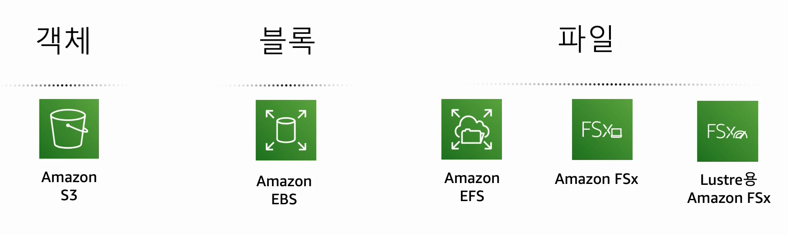

# AWS 스토리지 개요 알아보기

## 스토리지에 AWS를 사용하는 이유

### S3

    점점 증가되는 데이터셋이 있을 때, 객체 스토리지가 있다면 확장성을 가지고 사용할 수 있음. 

    S3는 어디서나 원하는 양의 데이터를 이용할 수 있도록 구축된 객체 스토리지. 

    AWS 관리 콘솔, cli, sdk를 통해 관리할 수 있음. 

    매우 뛰어난 확장성, 내구성, 보안, 성능 제공. 

    논리적인 저장소인 버킷을 만듦.

    버킷 안에 5테라 이하의 객체를 무제한 갯수로 저장가능.

    저장된 데이터는 여러 가용영역에 저장되어 중복성을 가지게되어 높은 내구성을 갖추게 됨.

    IAM과 통합하여 액세스 제어 가능. 

## 비용 절감 및 최적화

## AWS 스토리지의 주요 사례

## 링크

https://summits-korea.virtual.awsevents.com/media/AWS%20%EC%8A%A4%ED%86%A0%EB%A6%AC%EC%A7%80%20%EA%B0%9C%EC%9A%94%20%EC%95%8C%EC%95%84%EB%B3%B4%EA%B8%B0/1_yta8xakj/252281623