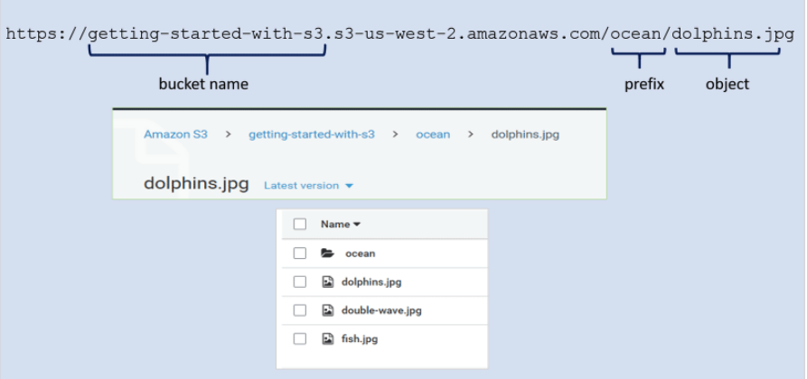

# Amazon Simple Storage Service

## 개념

    S3는 어디서나 원하는 양의 데이터를 이용할 수 있도록 구축된 객체 스토리지. 

## 특징

    데이터를 버킷 내에 객체 단위로 저장.

    점점 증가되는 데이터셋이 있을 때, 객체 스토리지가 있다면 확장성을 가지고 사용할 수 있음. 

    AWS 관리 콘솔, cli, sdk를 통해 관리할 수 있음. 

    매우 뛰어난 확장성, 내구성, 보안, 성능 제공. 

    저장된 데이터는 여러 가용영역에 저장되어 중복성을 가지게되어 높은 내구성을 갖추게 됨.

    IAM과 통합하여 액세스 제어 가능. 

## 용어

### 객체(object)

    데이터가 저장되는 기본 단위.

    파일과 메타데이터로 이뤄져있음.

    메타데이터는 객체를 설명하는 이름-값 집합.

    객체는 키(이름)를 통해 버킷 내에서 고유하게 식별됨.

    객체 하나의 크기는 1byte부터 5TB

    메타데이터는 MIME 형식으로 파일 확장자를 통해 자동으로 설정. 사용자 임의 지정도 가능.

### 객체 URL

    키 이름 접두사와 구분 기호를 사용하여 계층을 모방한 폴더 구조를 만들 수 있음.

    ocean/dolphins.jpg 가 해당 객체의 key가 됨.

### 버킷(bucket)

    연관된 객체들을 그룹핑한 최상위 디렉토리.

    flat storage 구조

    저장된 객체에 대한 컨테이너.

    버킷 단위로 지역을 지정, 인증과 접속 제한을 걸 수 있음.

    버킷의 이름은 유일해야 함.

    버킷 생성 후, 이름과 리전 변경 불가.

    계정별로 100개 까지 생성 가능.

    버킷에 저장할 수 있는 객체수와 총용량은 무제한

### 표준스토리지 

    S3 서비스 수준 계약으로 객체에 대해 99.9999%의 내구성을 보장 

    99.999%의 가용성을 제공. 

    그만큼 비용이 높으므로 중요한 데이터를 저장하는 것이 알맞음. 

### RRS(Reduced Rdundancy Storage)    

    표준 스토리지보다 저렴한 비용.

    원본을 복제한 데이터나 가공한 데이터(썸네일)의 저장에 알맞음.

## 참고

https://aws.amazon.com/ko/s3/getting-started/?nc=sn&loc=6&dn=1

https://docs.aws.amazon.com/ko_kr/AmazonS3/latest/userguide/Welcome.html