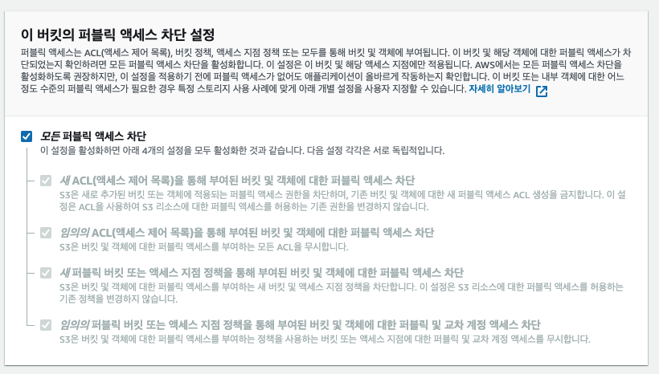

# S3 권한설정 

## Public Access



    모두에게 액세스 권한을 오픈할 것인지 아니면 임의의 사용자는 제한할 것인지 설정.

## ACL 

    버킷이나 객체에 대해 요청자의 권한 허용 범위를 어디까지 설정할 것인지. 

    퍼블릭 액세서를 차단했으면 ACL 적용 안됨.

## Bucket Policy

alb 로그 넣을 수 있게 권한 추가 
```json
{
  "Version": "2012-10-17",
  "Statement": [
    {
      "Effect": "Allow",
      "Principal": "*",
      "Action": "s3:*",
      "Resource": [
        "arn:aws:s3:::your-bucket-name",
        "arn:aws:s3:::your-bucket-name/*"
      ]
    }
  ]
}
```

퍼블릭 액세스 해제

## 참고

https://techblog.woowahan.com/6217/