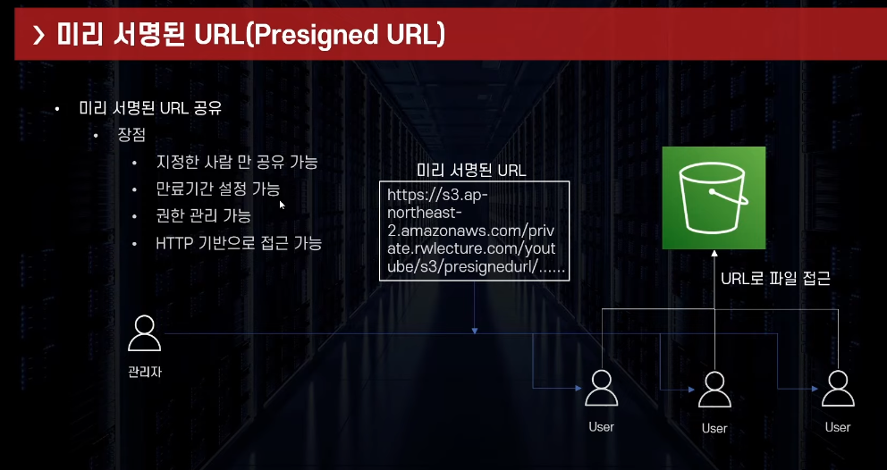

# 미리 서명된 URL

## 정의 

관리자가 권한을 담아서 URL을 생성해서 줌.

## 특징

1. 만료시간 설정 가능
2. Get/Post 설정 가능.
   1. 파일 다운로드/업로드 권한 부여 가능

## 실습 

* IAM 역할 생성
  * AWS 서비스 > EC2
  * 권한 > AmazonS3FullAccess
  * 생성

* EC2에 역할 부여 

* presigned Url 생성 (aws cli 방법)
  * aws configure set default.s3.addressing_style virtual
  * aws S3 presign s3://버킷명/파일경로 --region 리전 --expires-in 15초

## 출처

https://www.youtube.com/watch?v=v2yJLMltX1Y