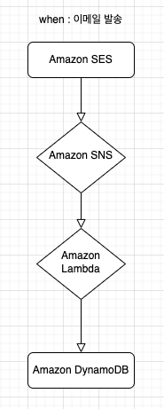
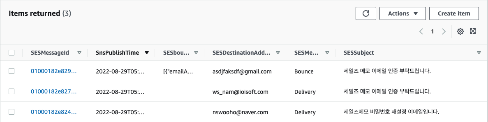

# Amazon SES 로그 DynamoDB에 저장하기 

## 사용 이유 

    1. Amazon SES 자체적으로는 이메일 발송 상세 내용을 확인할 수 없음. 

    2. 추후 PASSWORD_RESET_TOKEN 테이블을 삭제하고 휘발성있는 방식으로 
       저장할 경 이메일 발송 기록을 남길 필요

## Flow 

사용 서비스 

Amazon SES
Amazon SNS
Amazon CloudWath - SNS 전송 로그 확인
Amazon Lambda
Amazon DynamoDB  - 추출한 데이터 테이블 확인

**!!현재 리전 : 버지니아 북부**

## 결과물

DynamoDB에서 CSV 파일로 추출.

## 특이사항 
1  

    Amazon SNS 주제는 Amazon SES의 리전과 동일해야함. 
    기존에 존재하던 SES의 region이 버지니아 북부이기 때문에 SNS역시 버지니아 북부 리전에 위치. 
    연장선상으로 Lambda, DynamoDB 모두 버지니아 북부 region
 
2

    SESMessageType을 통해 Delivery, Bounce는 구분이 가능하지만, 회원가입 인증 이메일인지, 
    비밀번호 재설정 이메일인지 구분할 수 있는 직관적인 column이 없음.  제목으로 구분할 수 있는 정도

## 세팅

1. Amazon SES 세팅
 
2. Amazon SNS 알림 구성
   1. 유형은 표준만 지원
      1. https://docs.aws.amazon.com/ko_kr/sns/latest/dg/sns-create-topic.html
 
   2. SNS 액세스 정책 변경 
      1. 해당 SES에서만 접근 가능하도록.
      2. https://docs.aws.amazon.com/ko_kr/ses/latest/dg/configure-sns-notifications.html
 
   3. SES Identities - Notifications - Feedback notifications
      1. 위에서 만들어둔 SNS TOPIC 선택.

3. DynamoDB 세팅 
    1. 파티션 키 - SESMessageId, 정렬 키 - SnsPublishTime 
    2. 보조 인덱스 설정해주기 
       1. https://aws.amazon.com/ko/premiumsupport/knowledge-center/lambda-sns-ses-dynamodb/
 
4. Lambda 세팅
   1. 생성한 Dynamo유 테이블에 접근할 수 있도록 IAM 역할 생성 후 추가 
      1. https://aws.amazon.com/ko/premiumsupport/knowledge-center/lambda-sns-ses-dynamodb/
   2. 함수 생성 
        ~~~node
        console.log("Loading event");

        var aws = require("aws-sdk");
        var ddb = new aws.DynamoDB({ params: { TableName: "SESNotifications" } });

        exports.handler = function (event, context, callback) {
        console.log("Received event:", JSON.stringify(event, null, 2));

        var SnsPublishTime = event.Records[0].Sns.Timestamp;
        var SnsTopicArn = event.Records[0].Sns.TopicArn;
        var SESMessage = event.Records[0].Sns.Message;

        SESMessage = JSON.parse(SESMessage);

        var SESMessageType = SESMessage.notificationType;
        var SESMessageId = SESMessage.mail.messageId;
        var SESDestinationAddress = SESMessage.mail.destination.toString();
        var SESCommonHeaders = SESMessage.mail.commonHeaders;
        var SESSubject = SESCommonHeaders.subject;
        var LambdaReceiveTime = new Date().toString();

        if (SESMessageType == "Bounce") {
            var SESreportingMTA = SESMessage.bounce.reportingMTA;
            var SESbounceSummary = JSON.stringify(SESMessage.bounce.bouncedRecipients);
            var itemParams = {
            Item: {
                SESMessageId: { S: SESMessageId },
                SnsPublishTime: { S: SnsPublishTime },
                // SESreportingMTA: { S: SESreportingMTA },
                SESDestinationAddress: { S: SESDestinationAddress },
                SESbounceSummary: { S: SESbounceSummary },
                SESMessageType: { S: SESMessageType },
                SESSubject: {S: SESSubject}
            },
            };
            ddb.putItem(itemParams, function (err, data) {
            if (err) {
                callback(err)
            } else {
                console.log(data);
                callback(null,'')
            }
            });
        } else if (SESMessageType == "Delivery") {
            var SESsmtpResponse1 = SESMessage.delivery.smtpResponse;
            var SESreportingMTA1 = SESMessage.delivery.reportingMTA;
            var itemParamsdel = {
            Item: {
                SESMessageId: { S: SESMessageId },
                SnsPublishTime: { S: SnsPublishTime },
                // SESsmtpResponse: { S: SESsmtpResponse1 },
                // SESreportingMTA: { S: SESreportingMTA1 },
                SESDestinationAddress: { S: SESDestinationAddress },
                SESMessageType: { S: SESMessageType },
                SESSubject: {S: SESSubject}
            },
            };
            ddb.putItem(itemParamsdel, function (err, data) {
            if (err) {
                callback(err)
            } else {
                console.log(data);
                callback(null,'')
            }
            });
        } else if (SESMessageType == "Complaint") {
            var SESComplaintFeedbackType = SESMessage.complaint.complaintFeedbackType;
            var SESFeedbackId = SESMessage.complaint.feedbackId;
            var itemParamscomp = {
            Item: {
                SESMessageId: { S: SESMessageId },
                SnsPublishTime: { S: SnsPublishTime },
                SESComplaintFeedbackType: { S: SESComplaintFeedbackType },
                SESFeedbackId: { S: SESFeedbackId },
                SESDestinationAddress: { S: SESDestinationAddress },
                SESMessageType: { S: SESMessageType },
                SESSubject: {S: SESSubject}
            },
            };
            ddb.putItem(itemParamscomp, function (err, data) {
            if (err) {
                callback(err)
            } else {
                console.log(data);
                callback(null,'')
            }
            });
        }
        };
        ~~~
    3. SNS 구독 생성
       1. 만들어준 Lambda ARN 입력
 
    4. Lambda 트리거 설정
       1. 위에 만들어준 SNS 주제 선택 