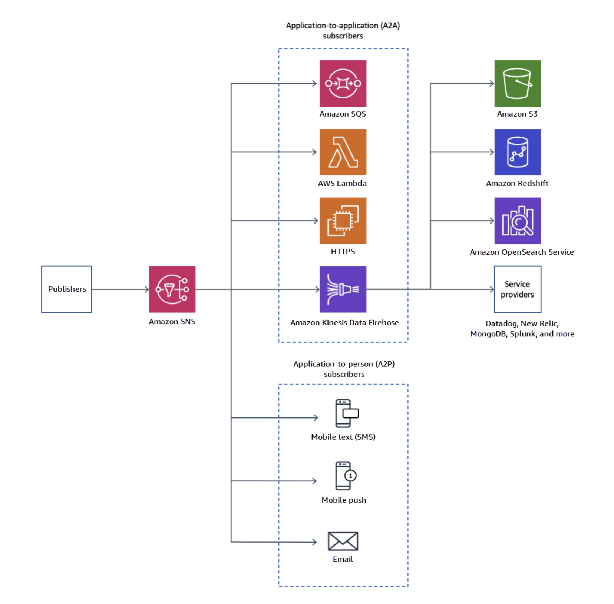
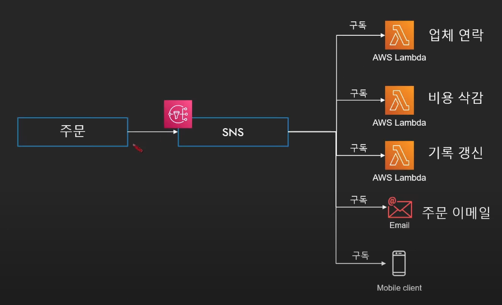
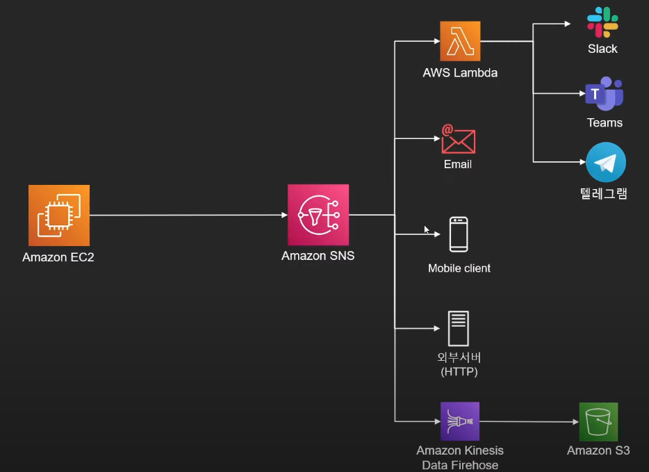
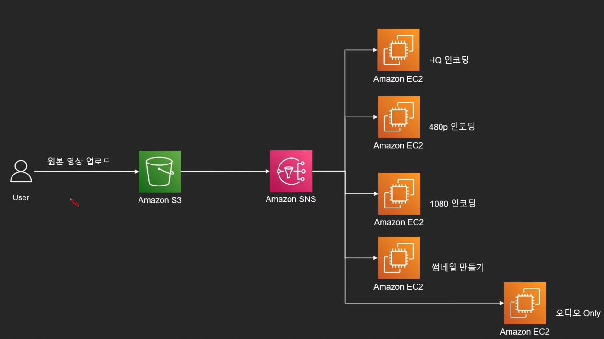

# Amazon SNS

Amazon Simple Notification Service

## 개념

A2A(애플리케이션 간, SNS -> Lambda) 및 A2P(애플리케이션과 사용자 간) 통신 모두를 위한 완전관리형 메시징 서비스

## 특징

아키텍처에서 굉장히 중요한 역할

### Pub/Sub 기반의 메시징 서비스

하나의 토픽을 여러 주체가 구독.

토픽에 전달된 내용을 구독한 모든 주체가 전달받아 처리

### 다양한 프로토콜로 메시지 전달 가능

이메일
HTTP(S)
SQS
SMS
Lambda
App

### 하나의 메시지를 여러 서비스에서 처리

SQS와의 가장 큰 차이점

하나의 토픽(메시지)가 여러 주체에 의해 처리됨

### 메시지를 따로 저장하지 않는다.

메시지를 저장하는 SQS와 가장 큰 차이점.

## 로직 플로우

주문을 하면 SNS로 보냄.

SNS 토픽으로 주문 내용이 들어옴.

이 토픽에 관심이 있는 모든 서비스들이 구독을 하고 있다가 주문이 들어오자마자 행동을 함.

## 구독자 종류

## Fan Out Architecture

1. 동영상 업로드 -> S3 -> Lambda -> SNS
2. SNS -> 각각의 인코딩할 수 있는 EC2로 메세지를 보냄
3. 각각 EC2가 작업이 다름
4. S3에서는 하나의 메세지가 전달되었지만, **SNS에서 증폭시킴.**
