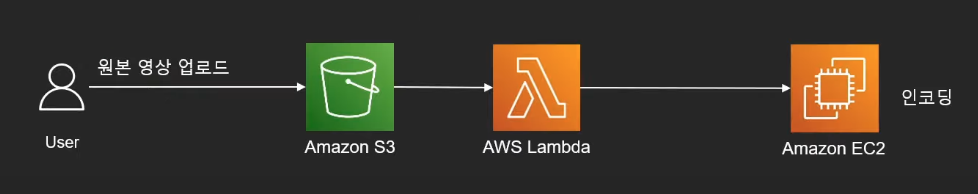
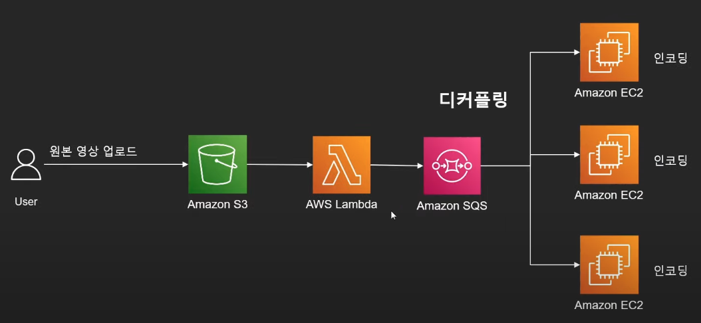
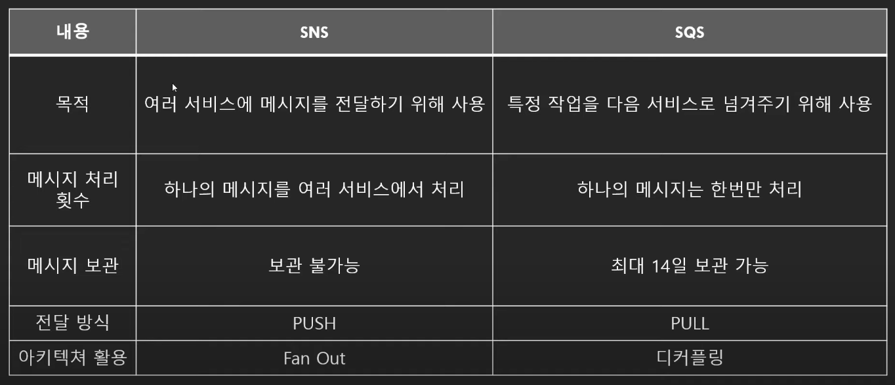
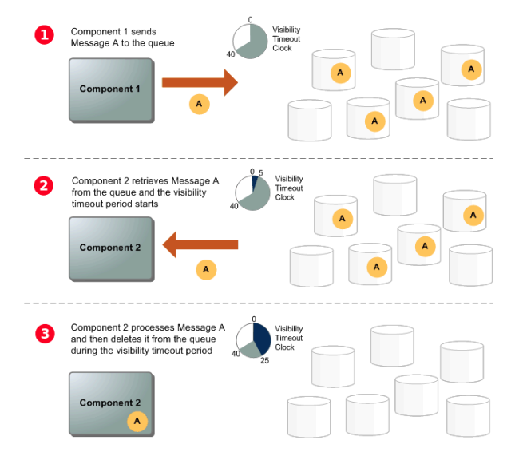
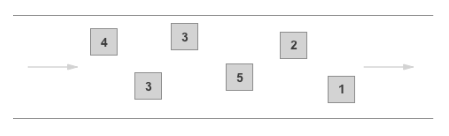

# Amazon SQS

## 정의

마이크로 서비스, 분산 시스템 및 서버리스 애플리케이션을 쉽게 분리하고 확장할 수 있도록 지원하는 완전관리형 메시지 대기열 서비스

## 개념

- AWS에서 제공하는 큐 서비스

* 다른 서비스에서 사용할 수 있도록 메시지를 잠시 저장하는 용도
* 최대 256kb, **최대 14일 저장 가능**

  - AWS SNS는 따로 메시지를 저장하지 않는다. 이게 큰 차이
  - XML, JSON, TXT 형태의 메시지

* 디커플링 : 주로 AWS 서비스들의 **느슨한 연결**을 수립하려 사용

* 하나의 메시지를 한번만 처리

  - 한 주체에서만 처리

* AWS에서 제일 오래된 서비스

## 디커플링(분산)

- 한 이벤트 발생으로 인해 후속을 조치해줘야 하는 이벤트들을 분산해서 처리할 수 있도록 도와주는 것.

1. 원본동영상 -> S3 -> Lambda -> EC2
2. 만약 갑자기 EC2가 다운되면, 거기서 끝나는 거임. 메시지 전달 실패에 대한 처리 매커니즘이 없다.

1. Lambda가 SQS에 메세지를 전달한다.
2. SQS는 메세지를 저장한다.
3. 그러면 EC2들이 SQS에서 메세지를 빼서 사용한다.
4. 이러면 EC2가 모두 다운되더라도, 메세지는 유실되지 않는다.
5. 또한 추후 아키텍처가 바뀌더라도, SQS 이전 부분은 바꾸지 않아도 된다.

## SNS 와의 차이

전달방식
SNS는 직접 서비스들에게 PUSH, 전달해준다.

SQS는 서비스에서 PULL, SQS에서 요청을 보내서 메세지를 가져간다.

## 아키텍처

- 전송
  - Server에서 보낸 요청이 Queue에 저장
- 수신
  - Worker에서 수신하여 작업 처리
- 삭제
  - Worker에서 작업을 마치면 queue에 메시지 삭제 요청
- 장점
  - server와 worker 사이에 queue가 존재하기 때문에
  - worker에 장애가 발생하더라도, server가 메시지 큐에 요청을 저장하는 일은 여전히 정상적으로 수행된다.
  - 메시지는 queue에서 worker가 재가동될 때까지 안전하게 보관된다.

## SQS 메시지 수명 주기

1. server가 메시지를 SQS에 전송하면, 메시지는 SQS 서버에서 중복 분산된다.
2. worker가 메시지를 SQS에서 가져간다. 이때부터, 메시지의 보존기간이 차감된다.
3. worker가 SQS에 메시지 삭제한다. SQS에서 분산된 메시지가 사라진다.

## Polling

- 하나의 프로그램이 충돌, 회피, 동기화 처리 등을 목적으로 다른 프로그램의 상태를 주기적으로 검사하여 일정한 조건을 만족할 때, 송수신 등을 처리하는 방식.

## SQS 종류

### Standard Queue (default)

- 무제한 처리량.
  - **SendMessage**, **ReceiveMessage**
- 최소 한번은 꼭 메시지를 전달시킴.
  - 메시지는 한 번 이상 전달되지만 경우에 따라 메시지 사본이 두개 이상 전달됨
- 최대한 메시지가 들어온 순서대로 나갈 수 있도록.
  - 하지만 들어온 순서와 다르게 나갈 수 있다.
- 처리량이 중요할 때 사용
  -

### FIFO Queue

- 높은 처리량.
  - 일
- 메시지가 들어온 순서대로 나감.
- 딱 한번만 메시지를 전다.
  - 실패하든 안하든 상관하지 않음.
- 메시지 중복이 안된다.

## 출처

https://velog.io/@gmlstjq123/AWS-SQS-%EC%82%AC%EC%9A%A9%ED%95%98%EA%B8%B0

https://namunamu1105.medium.com/sqs-sns-ses-%EA%B0%84%EB%8B%A8%ED%9E%88-%EC%82%B4%ED%8E%B4%EB%B3%B4%EA%B8%B0-9a1578d051f
