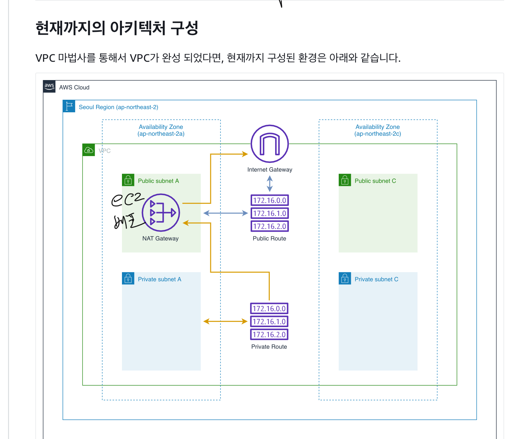
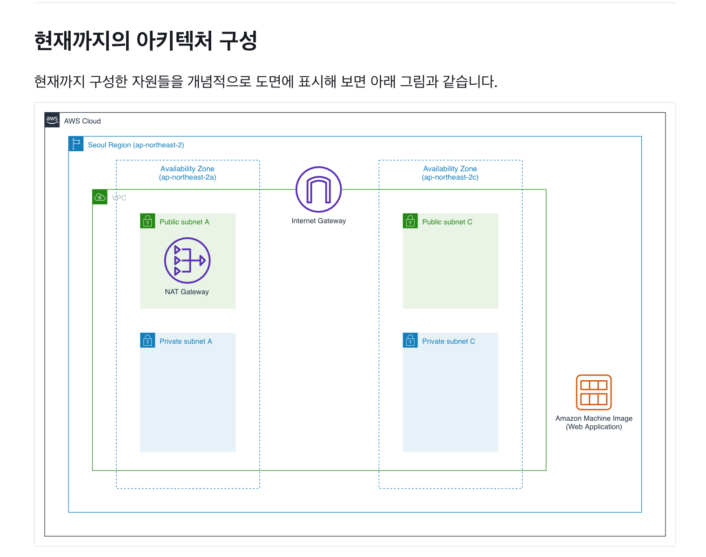
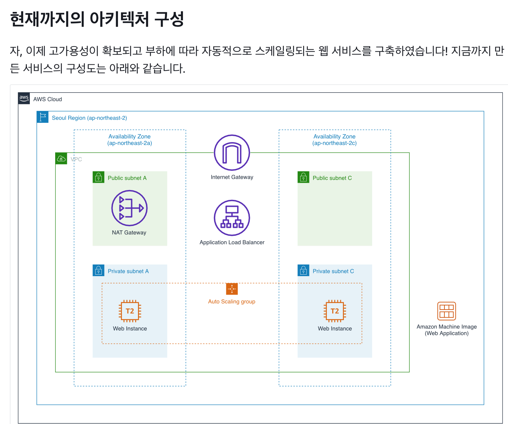

# VPC 설정 

## VPC 만들기 

### NAT Gateway 

    가용성에 따라 개수 정하기. 

    1개쓰면 가용성을 보장할 수 없음. 

Amazon AMI 사용 

키페어 없이 세션 매니저를 잘 사용하기. 

퍼블릭 ip 할당하기 위해 enable 해주기 

인스턴스 동작 확인 하고 이미지 만드는 용으로 만들고 삭제

## 로드밸런서 

internet-facing 

    인터넷 통신이 가능한.

internal 

    인터넷 통신 필요 없는 경우 

로드밸런서가 인스턴스에 보낼 때, 인스턴스의 80번 포트로  health check를 할거다.

3번정도 핑을 보내고 인스턴스의 응답이 없으면 인스턴스로 연결 안 보냄. 

오토 스케일링을 사용하면 해당 인스턴스를 지우고 새로 만들게 됨. 

시작템플릿용 보안그룹 

    alb에 적용했던 보안 그룹 가져오기. 

    내부의 인스턴스는 로드밸런서랑만 통신 할 수 있도록. 

인스턴스 프로파일 

    역할 정해주는거

## auto scaling

가용 영역 및 서브넷 

    private 2개로 설정. 

    이 안에 인스턴스가 생성된게 됨. 

로드밸런서가 타겟 그룹을 만들었고 

오토스케일링 그룹을 만들고 타겟그룹에 매핑시켜주는 것.

## DB 생성 

보안그룹 - 오토스케일링 그룹들만 접속 할 수 있도록. 

## 참조 

https://catalog.workshops.aws/general-immersionday/ko-KR/advanced-modules/network/10-index