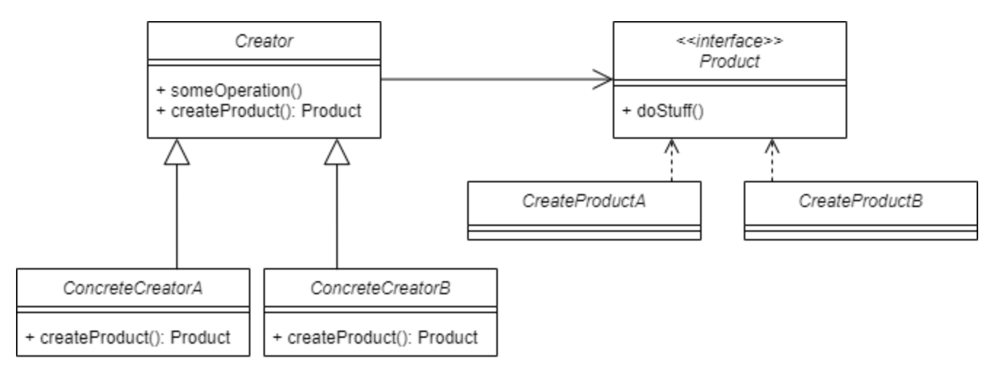

# Facotry Method Pattern

## 개념


- 구현체를 생성하는 코드와 해당 구현체를 사용하는 코드를 분리해서 결합 코드를 느슨하게 하는 것이 목표
- 새로운 구현체를 도입하더라도 기존 코드의 수정없이 할 수 있음.

## 사용법
```java
public interface MotorVehicle {
    void build();
}
```
- 기본 인터페이스를 만든다. 

```java
public class Motorcycle implements MotorVehicle {
    @Override
    public void build() {
        System.out.println("Build Motorcycle");
    }
}
public class Car implements MotorVehicle {
    @Override
    public void build() {
        System.out.println("Build Car");
    }
}
```
- 인터페이스를 구현하는 구체적인 클래스들을 구현해준다. 구현체에 따라 메서드 구현내용이 다르다.

- 부모 클래스에서 객체들을 생성할 수 있는 인터페이스 제공
- 자식 클래스들이 생성될 객체들의 유형을 변경할 수 있도록 하는 생성 패턴

```java
public abstract class MotorVehicleFactory {
    public MotorVehicle create() {
        MotorVehicle vehicle = createMotorVehicle();
        vehicle.build();
        return vehicle;
    }
    protected abstract MotorVehicle createMotorVehicle();
}
```
- 새로운 구현체를 생성하는 역할을 하는 추상클래스.
- 특정 factory에서 특정 구현체를 만들게 하기 위해 추상클래스로 만든다.


- 팩토리 메서드 패턴은 (new 연산자를 사용한) 객체 생성 직접 호출들을 특별한 팩토리 메서드에 대한 호출들로 대체하라고 제안
- 객체들은 여전히 new 연산자를 통해 생성되지만 팩토리 메서드 내에서 호출

- factory method를 사용하는 코드를 종종 클라이언트 코드라고 한다. 
  - 클라이언트 코드는 실제 동작이 어떻게 되는지 알지 못한다.
   
- 