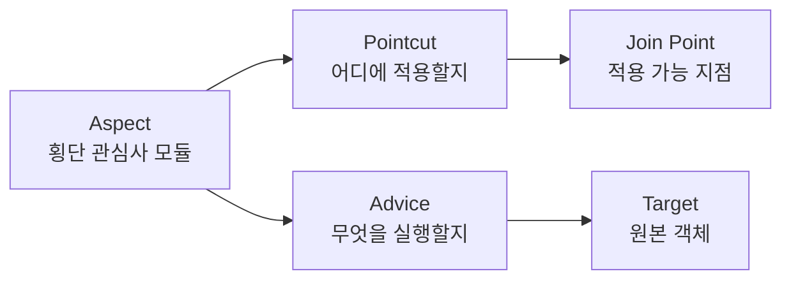

# AOP (Aspect-Oriented Programming, 관점 지향 프로그래밍)

> 최종 업데이트: 2026-05-03 | 언어 독립 패러다임 / Spring 특화는 [Spring AOP 프록시](../../Spring/AOP/Spring-AOP-프록시.md) 참조

## 개념

AOP는 **여러 모듈에 흩어져 반복되는 부가 기능(횡단 관심사)을 별도의 단위(Aspect)로 분리해, 핵심 로직과 독립적으로 관리하는 프로그래밍 패러다임**이다. 특정 언어의 기능이 아니라 **사고방식**.

> 비유: 건물의 전기·수도·환기는 모든 방을 가로질러 지난다. 방마다 따로 깔지 않고 **건물 전체에 한 번** 설계해 적용한다. AOP의 Aspect도 마찬가지 — 로깅·트랜잭션·보안 같은 "건물 전체 인프라"를 한 곳에 정의하고, 각 모듈(방)은 자기 일만 한다.

핵심 명제: **OOP가 "객체 단위 모듈화"라면, AOP는 "관심사 단위 모듈화"**. 둘은 보완적이지 대체 관계가 아니다.

## 배경/역사

AOP는 단일 시점에 발명된 게 아니라 여러 흐름이 합쳐져 정립된 개념이다.

- **1980년대 후반** **Lisp의 CLOS**(Common Lisp Object System)에 `:before`/`:after`/`:around` method 도입 — **사실상 AOP의 원형**. 메서드 호출을 가로채 부가 코드를 끼워 넣는 메커니즘이 이미 존재
- **1990년대 초** Xerox PARC에서 메타프로그래밍·반사(reflection) 연구. Kiczales가 CLOS 메타오브젝트 프로토콜(MOP) 작업
- **1997** **Gregor Kiczales et al.**, ["Aspect-Oriented Programming"](https://www.cs.ubc.ca/~gregor/papers/kiczales-ECOOP1997-AOP.pdf) (ECOOP 1997) 발표 — 언어 독립 패러다임으로 일반화·명명. **AOP의 공식 출범**
- **2001** **AspectJ** 출시 — Java용 첫 본격 AOP 도구. AspectJ 컴파일러로 바이트코드 위빙
- **2003** **Spring 1.0** — 가벼운 프록시 기반 Spring AOP 도입. 자바 진영에서 AOP 대중화
- **2004** **PostSharp** (.NET) 출시 — C#/F#/VB용 AOP 도구
- **2005** Spring 2.0 — `@AspectJ` 어노테이션 스타일 채택
- **2010년대** 다언어 확산 — AspectC++, aspectlib(Python), Aquarium(Ruby), meld.js(JavaScript) 등

> AOP의 사상적 뿌리는 **Lisp**다. Kiczales 본인이 CLOS 작업자였고, 그 경험을 일반 OOP 언어로 확장한 것이 AOP 패러다임. AspectJ는 그 첫 본격 자바 구현체일 뿐, AOP 자체와 자바를 동일시하면 안 된다.

## AOP가 풀려는 문제: Cross-Cutting Concerns

OOP로는 잘 모듈화되지 않는 **여러 클래스/모듈에 걸쳐 반복되는 코드**를 **횡단 관심사(cross-cutting concerns)**라 부른다.

### Before (OOP만 사용, 의사코드)

```
function placeOrder(order):
    log("placeOrder start")                # 로깅
    startTime = now()                       # 성능 측정
    if not securityCheck(): throw           # 보안
    tx = beginTransaction()                 # 트랜잭션
    try:
        repository.save(order)              # ← 진짜 비즈니스 로직 1줄
        commit(tx)
    catch e:
        rollback(tx); throw
    log("elapsed:", now() - startTime)
```

→ **본 로직 1줄, 부가 기능 10줄**. 모든 함수가 비슷하게 반복. 부가 기능 변경 시 수많은 파일 수정 필요.

### After (AOP 적용, 의사코드)

```
# 핵심 로직만
function placeOrder(order):
    repository.save(order)

# 부가 기능은 한 곳에 정의
aspect CrossCuttingAspect:
    around (모든 Service 함수) {
        log("start")
        startTime = now()
        if not securityCheck(): throw
        tx = beginTransaction()
        try:
            result = proceed()      # 타깃 함수 실행
            commit(tx)
            log("elapsed:", now() - startTime)
            return result
        catch e:
            rollback(tx); throw
    }
```

→ 부가 기능이 **한 곳(Aspect)에 모이고**, 핵심 로직은 깨끗해진다. 변경도 한 곳에서 끝.

## 횡단 관심사의 대표 예

언어·프레임워크 무관하게 거의 모든 시스템에 등장:

| 관심사 | 흩어지는 모습 |
|---|---|
| **로깅** | 모든 함수 시작/끝에 로그 |
| **트랜잭션** | begin / commit / rollback 반복 |
| **보안·인증** | 함수마다 권한 체크 |
| **캐싱** | get → cache check → set 반복 |
| **재시도** | try-catch + 대기 + 재호출 |
| **성능 측정** | 시작 시각 - 종료 시각 |
| **예외 변환** | 하위 계층 예외 → 상위 계층 예외 |
| **모니터링** | 메트릭 카운터 증가 |
| **감사 로그** (Audit) | "누가 언제 무엇을 했나" 기록 |
| **파라미터 검증** | 진입점마다 입력 검증 |

## AOP 핵심 용어 (언어 독립)

| 용어 | 의미 |
|---|---|
| **Aspect** | 횡단 관심사를 모듈화한 단위 |
| **Join Point** | Aspect가 끼어들 수 있는 *지점* (메서드 호출, 필드 접근, 예외 발생, 객체 생성 등) |
| **Pointcut** | Join Point를 *선택*하는 표현식·조건 |
| **Advice** | Pointcut에서 실제 *실행할 부가 코드* |
| **Target** | Advice가 적용되는 *원본 객체/함수* |
| **Weaving** | Aspect를 Target에 *엮어 넣는 과정* |
| **Introduction** | 객체에 새 메서드/필드를 *추가*하는 기법 (AOP의 한 갈래, 드물게 사용) |



## Advice 종류 (개념적 분류)

| 종류 | 시점 | 용도 |
|---|---|---|
| **Before advice** | 타깃 메서드 *전* | 사전 검증, 로깅 시작 |
| **After-returning advice** | 정상 반환 *후* | 결과 가공, 캐시 저장 |
| **After-throwing advice** | 예외 발생 시 | 예외 변환, 알림 |
| **After (finally) advice** | 성공·실패 무관 | 자원 정리 |
| **Around advice** | 전후 *모두* | 가장 강력. 타깃 호출을 직접 제어 (호출 안 할 수도 있음) |

> 거의 모든 AOP 구현이 이 5종을 비슷한 이름으로 제공. CLOS는 `:before` / `:after` / `:around`로, AspectJ/Spring은 `@Before`/`@After`/`@Around` 등으로.

## Weaving 시점 — 언제 Aspect를 엮는가

Aspect를 타깃에 결합하는 시점은 구현체마다 다르며, 각자 트레이드오프가 있다.

| 시점 | 방법 | 장점 | 단점 |
|---|---|---|---|
| **컴파일타임 위빙** | 소스→바이트코드 변환 시 삽입 | 가장 빠름. 모든 join point 가능 | 전용 컴파일러 필요 |
| **포스트 컴파일 위빙** | 이미 빌드된 바이너리에 삽입 | 외부 라이브러리에도 적용 가능 | 빌드 파이프라인 복잡 |
| **로드타임 위빙** | 클래스 로딩 시 변환 | 컴파일 변경 없이 적용 | 에이전트 설정 필요. 시작 시 비용 |
| **런타임 프록시** | 객체 생성 시 대리자 객체 생성 | 가장 단순. 표준 언어로 구현 가능 | 메서드 실행 join point만. 자기 호출 불가 |

각 언어/프레임워크가 채택한 방식:

| 도구 | Weaving 방식 |
|---|---|
| AspectJ | 컴파일타임 / 포스트컴파일 / 로드타임 모두 |
| Spring AOP | **런타임 프록시만** (가장 가벼움) |
| PostSharp (.NET) | 컴파일타임 (IL 위빙) |
| AspectC++ | 컴파일타임 |
| Python aspectlib | 런타임 (Monkey patching) |
| Lisp CLOS | 런타임 (메서드 콤비네이션) |

## 언어별 AOP 구현체

AOP는 **언어 독립 패러다임**이다. 다양한 언어에 구현체가 있다.

| 언어 | 대표 구현체 | 특징 |
|---|---|---|
| **Lisp / CLOS** | `:before`·`:after`·`:around` method | AOP의 사상적 뿌리 (1980s) |
| **Java** | AspectJ, Spring AOP, JBoss AOP | 가장 활발한 생태계 |
| **.NET (C#·F#·VB)** | PostSharp, Castle DynamicProxy, Unity Interception | 컴파일타임 위빙 강력 |
| **C++** | AspectC++ | 시스템 프로그래밍용 |
| **Python** | aspectlib, pytilities, decorator 패턴 | 데코레이터로 가벼운 AOP 가능 |
| **Ruby** | Aquarium | OOP·메타프로그래밍 친화 |
| **JavaScript** | meld.js, Proxy/decorator | ES6 Proxy로 동적 AOP |
| **PHP** | Go! AOP, AOP-PHP | 런타임/컴파일타임 |
| **Smalltalk** | AspectS | OO의 원조 언어용 |

> **데코레이터 패턴**(Python·JS·TypeScript)은 사실상 AOP의 가벼운 형태. 함수를 감싸 부가 기능을 추가하는 발상이 같다.

## AOP의 한계와 비판

AOP는 강력하지만 학술·실무 양쪽에서 비판도 있다.

| 한계 / 비판 | 설명 |
|---|---|
| **추적성(traceability) 저하** | 코드만 봐선 어디서 부가 기능이 끼어드는지 안 보임. "마법" 같이 동작 |
| **디버깅 난이도 ↑** | 스택 트레이스에 Aspect 호출이 섞여 어디가 원인인지 추적 어려움 |
| **Aspect 간 충돌** | 여러 Aspect가 같은 Pointcut에 걸리면 순서·상호작용이 비결정적 |
| **Quantification problem** | "모든 Service 메서드"같은 광범위 Pointcut이 의도치 않은 곳에 적용 |
| **Fragile pointcut problem** | 메서드 시그니처 변경 시 Pointcut이 조용히 매칭 실패 |
| **러닝 커브** | Pointcut 표현식·Advice 종류·Weaving 시점 모두 학습 필요 |
| **OOP 대안 제시 부족** | "OOP의 문제 해결"로 등장했지만, 함수형 프로그래밍·믹스인·미들웨어 등 다른 해결책도 존재 |

> 대안 패러다임: **함수형 합성(function composition)**·**미들웨어 체인**(Express.js·Rails)·**데코레이터 패턴**·**의존성 주입(DI)** 등도 횡단 관심사를 다른 방식으로 해결한다. AOP가 유일한 답은 아니다.

## 안티패턴

| 안티패턴 | 왜 위험 |
|---|---|
| **모든 함수에 무차별 Aspect** | 성능·디버깅 지옥. 좁은 Pointcut부터 시작 |
| **Aspect 안에서 핵심 비즈니스 로직** | 부가 기능 모듈인데 본 로직이 들어가면 응집도 붕괴 |
| **Around에서 proceed 호출 누락** | 타깃 메서드 실행이 안 됨. 결과 누락 |
| **Aspect가 다른 Aspect의 타깃** | 무한 재귀·예측 불가 동작 |
| **순서 미지정** | 여러 Aspect 적용 시 비결정적. 명시적 우선순위 필요 |
| **Pointcut 표현식 사방에 산재** | 명명된 Pointcut으로 한 곳에 집약 |
| **AOP 남용** | 모든 횡단 관심사를 AOP로 — 데코레이터·미들웨어가 더 적합한 경우 다수 |

## AOP를 쓸지 판단 기준

| 상황 | 권장 |
|---|---|
| 부가 기능이 **여러 모듈에 반복**되고 변경 시 일괄 수정 필요 | AOP 적합 |
| 부가 기능이 **소수 함수에만 적용** | 데코레이터·고차 함수가 더 단순 |
| 요청/응답 흐름의 부가 처리 (인증·로깅 등) | 미들웨어가 더 직관적 |
| 함수형 언어 환경 | 함수 합성으로 해결 가능 |
| 디버깅·추적이 매우 중요한 시스템 | AOP 신중히 (마법 적용 최소화) |

## 한 줄 요약

> **AOP = "여러 모듈에 흩어지는 횡단 관심사를 별도 단위(Aspect)로 분리"하는 언어 독립 패러다임.** 사상적 뿌리는 1980년대 Lisp CLOS의 `:around` method이며, **Kiczales가 1997년 ECOOP 논문으로 일반화**했다. **AspectJ**(Java, 2001), **PostSharp**(.NET), **AspectC++**, **aspectlib**(Python) 등 다언어 구현체가 존재. 핵심 용어는 **Aspect / Pointcut / Advice / Target / Weaving**. AOP가 만능은 아니며 **데코레이터·미들웨어·함수 합성** 등 대안 패러다임도 같은 문제를 다른 방식으로 해결한다.

## 관련 문서

- [Spring AOP 프록시](../../Spring/AOP/Spring-AOP-프록시.md) — 자바 Spring의 런타임 프록시 구현 상세 (CGLIB/JDK Dynamic Proxy, self-invocation 함정)
- [객체지향](../객체지향/) — AOP의 보완 대상인 OOP

## 참조

- Gregor Kiczales et al., ["Aspect-Oriented Programming"](https://www.cs.ubc.ca/~gregor/papers/kiczales-ECOOP1997-AOP.pdf) (ECOOP 1997) — AOP 원전 논문
- [Wikipedia — Aspect-oriented programming](https://en.wikipedia.org/wiki/Aspect-oriented_programming)
- [AspectJ 공식](https://eclipse.dev/aspectj/) (Java)
- [PostSharp 공식](https://www.postsharp.net/) (.NET)
- [AspectC++ 공식](https://www.aspectc.org/) (C++)
- [aspectlib (Python)](https://github.com/ionelmc/python-aspectlib)
- [Common Lisp Hyperspec — Method Combination](https://www.lispworks.com/documentation/HyperSpec/Body/07_ff.htm) — CLOS의 :around method
- Robert Filman & Daniel Friedman, ["Aspect-Oriented Programming is Quantification and Obliviousness"](https://www.cs.iastate.edu/~tsa/cs515/aop-is-qo.pdf) (2000) — AOP의 본질에 대한 영향력 있는 논문
- https://sabarada.tistory.com/94
