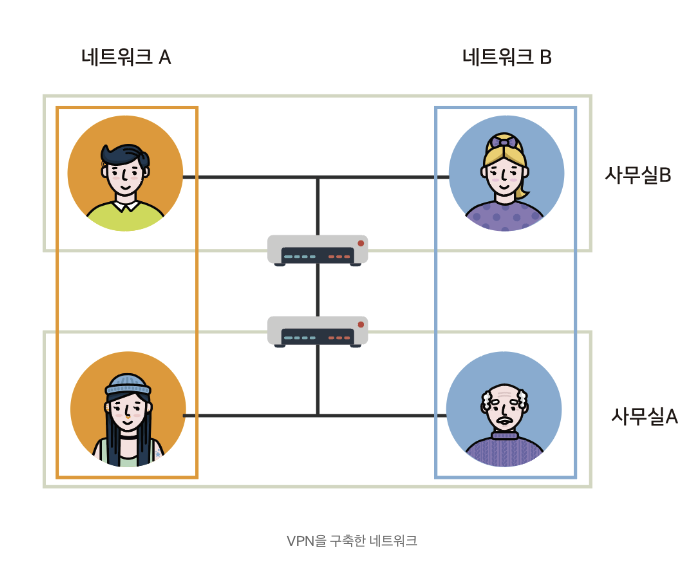
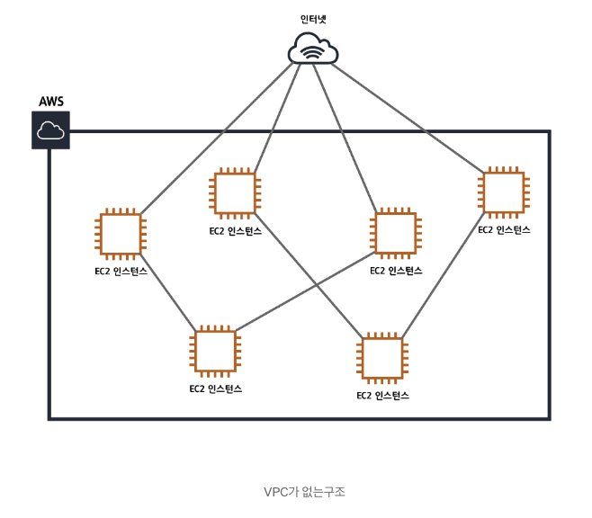
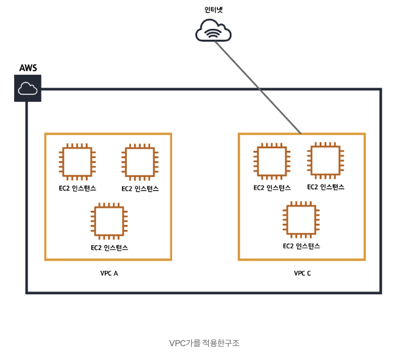
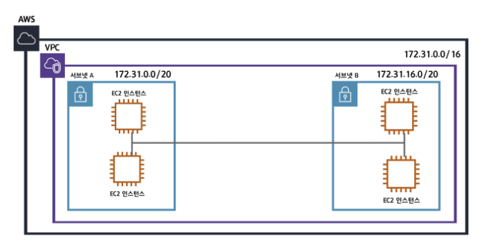

# VPC

## VPN이란?

Virtual Private Network

가상사설망

실제가 아닌 가상의 사설망. 

네트워크A와 네트워크B가 실제로는 같은 네트워크 상에 있지만, 마치 다른 네트워크인 것 처럼 동작.

## VPC란?

Virtual Private Cloud

    vpc가 없다면 EC2를 추가해줄 떄 마다 모든 연결을 다 직접 해줘야 함.

    

    각각의 VPC는 완전히 독립된 네트워크처럼 동작.

 
     

VPC를 사설 아이피 대역에 맞춰야 함. 

    10.0.0.0 ~ 10.255.255.255

    172.16.0.0 ~ 172.31.255.255

    192.168.0.0 ~ 192.168.255.255

## 서브넷 

    VPC를 구분해놓는 단위. 

    아이피범위가 더 작은값을 가지게 됨. 

    더 많은 네트워크망을 만들기 위해.

## 라우팅 테이블/라우터 

    네트워크 요청이 발생하면 먼저 라우터로 향하게 됨. 

    라우팅 테이블 : 목적지 테이블
    
    라우터 : 목적지

## 출처

https://medium.com/harrythegreat/aws-%EA%B0%80%EC%9E%A5%EC%89%BD%EA%B2%8C-vpc-%EA%B0%9C%EB%85%90%EC%9E%A1%EA%B8%B0-71eef95a7098
