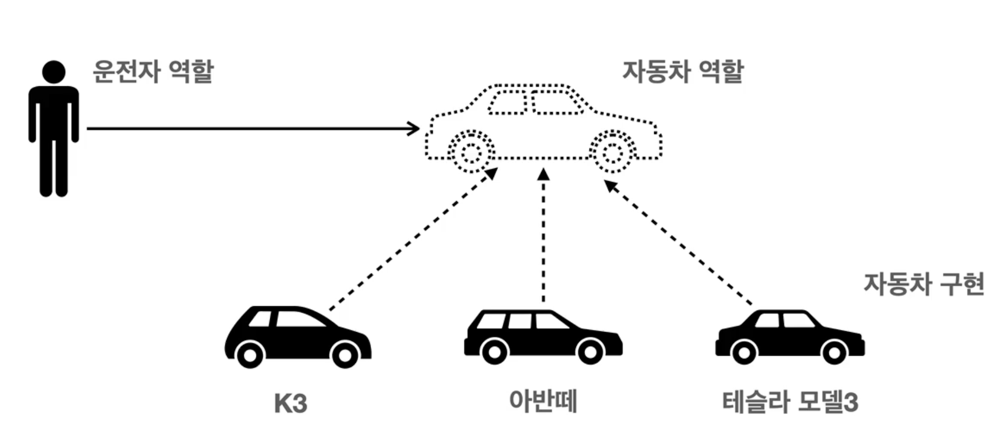

# 객체지향

## 특징
- 클래스 단위로 모듈화 되어있다.
- 클래스라는 역할을 배정받으면 인스턴스 또는 객체라고 부른다.

## 추상화

## 캡슐화 (Encapsulation)
- 각 클래스의 메서드가 어떻게 구현되어 있는지 참여하지 않는다.

## 상속 (Inheritance)
- 

## 다형성 Polymorphism

객체지향에서 가장 중요한 개념.

역할과 구현으로 세상을 구분

자동차가 바뀌어도 운전자가 운전을 하는데에는 영향이 없다.

클라이언트는 구현대상에 대해 몰라도 된다. 역할(인터페이스)만 알면 된다.

역할 == interface 
구현 == 구현 Class

Java에서는 `Overriding`으로 다형성을 나타냄.

#### 다형성의 본질
클라이언트를 변경하지 않고, 서버의 구현 기능을 유연하게 변경 가능.

#### 다형성의 한계
다형성 만으로는 OCP, DIP를 지킬 수 없다.

~~~java
public class MemberService{
    private MemberRepository m = new MemoryRepository();
}

public class MemberService{
    //private MemberRepository m = new MemoryRepository();
    private MemberRepository m = new JdbcRepository();
}
~~~
다형성을 지키기위하려면, 구현체를 바꿔줘야 하는데 이러면 MemberService의 코드를 수정해야 한다. 

근데, 이러면 또 **OCP원칙이 깨진다**. 클라이언트에 변경이 생겨버렸기 때문에.

또한, **DIP도 위반**하고 있다. MemberService는 MemberRepository라는 interface에 의존하고 있지만, 동시에 구현 클래스도 의존하고 있다. 

직접 구현클래스를 선택하고 있기 때문이다. 구현클래스에 대해 클라이언트가 알고 있게되는 상황. 

이를 해결하기 위해, 연관관계를 맺어주는 별도의 설정자가 필요하다.

이것이 스프링 DI

## 출처
https://www.youtube.com/watch?v=yQowAn2xyPg