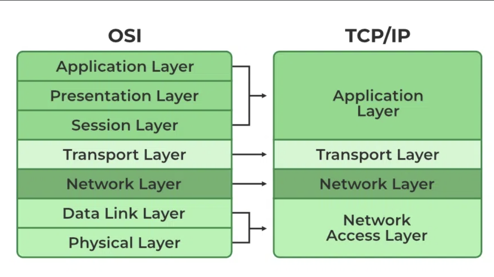

# 네트워크 모델

## OSI (Open Systems Interconnection) 모델

### 정의
- **국제표준화기구(ISO)**에서 1970년대 후반과 1980년대 초반에 개발
- 다양한 시스템과 기술 간의 상호 운용성을 촉진하기 위해 다양한 유형의 컴퓨터 네트워크에 대한 일반적인 표준
- OSI 모델은 네트워킹 시스템의 기능을 설명하는 이론적 프레임워크에 가까움.

### 7계층

------------------------------------

## TCP/IP (Internet protocol suite) 모델

### 정의
- Transmission Control Protocol/Internet Protocol
- 미국에서 개발됨 현대 인터넷의 전신인 ARPANET 창설의 일환으로 1970년대 국방부에 의해 만들어짐
- 인터넷과 대부분의 최신 네트워크를 통해 데이터가 전송되는 방식에 대한 기본 프레임워크
- 특히 인터넷 환경에서 실제로 널리 사용되는 프로토콜을 기반으로 하기 때문에 실제 애플리케이션에 더욱 실용적이다.

### 4계층

#### 1. Network Access Layer (네트워크 엑세스 계층)
  - 데이터를 전달하는 전선, 케이블 또는 무선 신호(Wi-Fi)와 같은 장치 간의 물리적 연결을 다룬다.
  - 동일한 네트워크에 있는 한 장치에서 다른 장치로 데이터를 가져오는 일도 담당
  - 편지를 픽업하여 지역 우체국으로 배달하는 우편 서비스

##### 주요 프로토콜
  - 이더넷(NIC 주소 표기하는 방법), Wi-Fi, PPP, NIC(Network Interface Controller)

##### 생성하는 데이터
  - **프레임**
    - 네트워크로 가기전 최종 캡슐화된 데이터
    - bit 단위
    - 프레임에는 전송되는 데이터와 오류 감지 코드 등 성공적인 전달에 필요한 추가 정보가 포함됨.
    - 네트워크 장치를 식별하는 역할

##### MAC 주소
[설명](./Protocol.md/#이더넷-프레임-구조)

#### 2. Internet Layer
  - 다양한 네트워크를 통해 발신자에서 수신자로 데이터를 라우팅하는 역할을 담당
  - 데이터(패킷이라고 하는 작은 조각으로 분할됨)가 네트워크를 통해 올바른 대상으로 가는 길을 찾도록 함.
  - 우체국이 편지를 분류하여 올바른 도시와 거리 주소로 라우팅하는 계층

##### 주요 프로토콜
- IP, ICMP, RP, RARP

##### 데이터 단위
- **패킷**
  - 데이터 페이로드와 소스 및 대상 IP 주소와 같은 추가 정보가 포함

##### IP 주소
- 대상 IP 주소를 기반으로 패킷을 전달

#### 3. Transprot Layer
  - 장치 간에 데이터가 안정적이고 정확하게 전송되도록 하는 역할
  - 장치와 데이터를 보내는 장치 간의 통신을 관리하여 모든 패킷이 도착하고 올바르게 다시 결합될 수 있는지 확인
  - 편지가 분실되거나 손상되지 않았는지 확인하고 메시지의 모든 부분이 함께 도착하는지 확인하는 우편 서비스

##### 주요 프로토콜
- TCP, UDP

##### 데이터 단위
- **세그먼트** (segments) : TCP 일 때
- **데이터그램** (datagrams) : UDP 일 때

##### Port
- 운영체제는 네트워크 통신을 원하는 응용프로그램에게 포트번호를 할당함과 동시에 관리
- 포트 번호를 사용하여 데이터를 수신 장치의 올바른 애플리케이션으로 전달
- HTTP의 경우 포트 80을 사용하고 HTTPS의 경우 포트 443

#### 4. Application Layer
  -  실제 데이터(예: 웹페이지, 이메일, 동영상)가 애플리케이션(예: 웹 브라우저 또는 이메일 클라이언트)에서 생성되고 사용되는 최상위 계층
  -  네트워크 서비스와 사용자 애플리케이션 간의 통신이 이루어지는 곳
  -  편지를 쓰고 도착하면 읽는 단계

##### 주요 프로토콜
- HTTP/HTTPS, FTP, SMTP, DNS, SSH

##### 데이터 단위
-  데이터

### 동작 흐름
* 
1. Application Layer : 데이터가 애플리케이션(예: 웹 브라우저)에 의해 생성됨.
2. Transport Layer: 데이터가 더 작은 조각으로 분할되어 전송을 위해 준비. TCP 또는 UDP는 데이터가 올바르게 전달되도록 보장.
3. Internet Layer : 세그먼트는 패킷으로 캡슐화되고 IP 주소가 부여되며 네트워크를 통해 라우팅됨.
4. Link Layer : 패킷은 프레임으로 변환되어 물리적 네트워크 매체(예: 이더넷 또는 Wi-Fi)를 통해 전송됨.

| 계층        | 데이터 이름 |
|-------------|-------------|
| Application | 데이터      |
| Transport   | 세그먼트    |
| Internet    | 패킷        |
| Link        | 프레임      |

- 각 단계에서 캡슐화가 이뤄지고 반대로 역캡슐화가 이뤄짐
  - 데이터가 다음 계층에 의해 포장돼서 이더넷에 도착한 뒤에, 다시 거꾸로 다음 계층에 의해 포장을 풀면서 돌아오는 것.
  - 컴퓨터의 운영체제가 1,2,3 단계를 거치면서 데이터를 캡슐화 한다.
  - NIC가 4단계에서 캡슐화를 한 후에 네트워크로 보낸다.

### 요약 
Link Layer: 물리적 전송 및 MAC 주소 지정을 처리합니다.
Internet Layer: IP 주소 지정 및 라우팅을 관리합니다.
Transport Layer: TCP 및 UDP와 같은 프로토콜을 사용하여 안정적인 데이터 전송을 보장합니다.
Application Layer: 최종 사용자 애플리케이션에 네트워크 서비스를 제공합니다.

## 출처
https://en.wikipedia.org/wiki/Internet_protocol_suite
https://www.geeksforgeeks.org/tcp-ip-model/