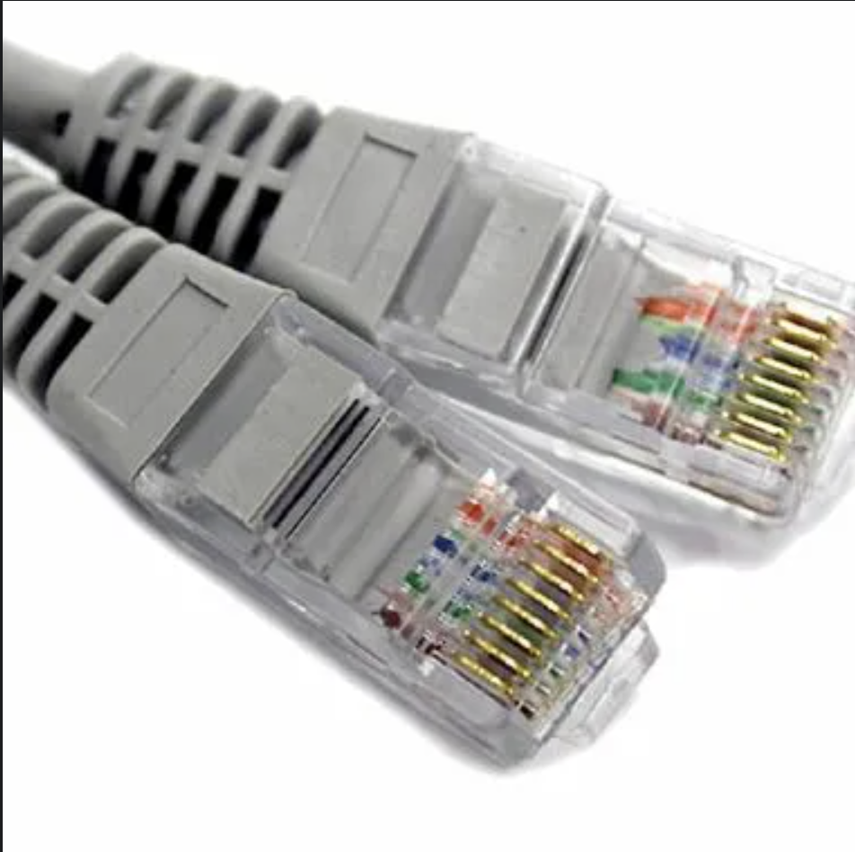
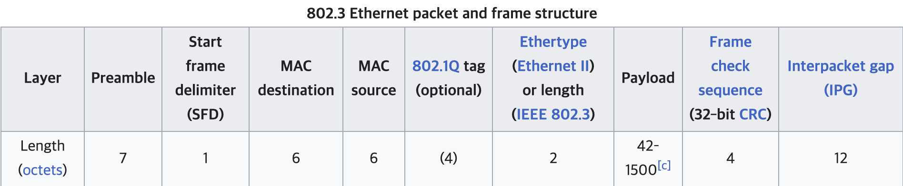

<!-- TOC -->

- [Network Protocol](#network-protocol)
  - [정의](#정의)
  - [구성 요소](#구성-요소)
  - [특징](#특징)
  - [종류](#종류)
    - [Ethernet](#ethernet)
      - [이더넷 프레임 구조](#이더넷-프레임-구조)
    - [IP (Internet Protocol)](#ip-internet-protocol)
      - [역할](#역할)
      - [특징](#특징-1)
      - [IP 패킷 구조](#ip-패킷-구조)
        - [IP 주소](#ip-주소)
    - [HTTP/HTTPS](#httphttps)
      - [SSL/TLS](#ssltls)
      - [HTTPS](#https)
      - [Resource](#resource)
      - [URI](#uri)
    - [TCP](#tcp)
    - [UDP](#udp)
    - [FTP](#ftp)
    - [SMTP](#smtp)
  - [출처](#출처)

<!-- /TOC -->
<!-- /TOC -->
<!-- /TOC -->

# Network Protocol

## 정의
- 컴퓨터가 서로 통신하기 위해 따르는 규칙 집합
- 데이터가 패키지되는 방식과 데이터의 각 부분에 포함된 정보를 포함한 데이터의 구조 또는 형식

## 구성 요소
- **구문(Syntax)**
  - 데이터의 구조나 형식 
  - 예를 들어, 프로토콜은 데이터를 헤더 및 페이로드와 같은 섹션으로 나눌 수 있다.
  - 헤더에는 보낸 사람의 주소와 같은 정보가, 페이로드에는 전송되는 실제 데이터가 포함되게 할 수 있다.
- **의미(Semantics)**
  - 데이터의 각 섹션의 의미 정의
  - 예를 들어, 헤더에는 데이터가 요청인지 응답인지 또는 전송되는 데이터의 종류(예: 텍스트 파일, 이미지 등)를 나타내는 플래그가 포함될 수 있다.
- **타이밍(Timing)**
  - 데이터가 전송 및 수신되는 순서와 전송 속도에 대한 규칙이 포함

## 특징
* 일관성
  * 장치가 다른 제조업체에서 제조되었거나 다른 소프트웨어를 사용하더라도 모든 장치가 수신되는 데이터를 이해할 수 있도록 보장
* 통신 규칙
  * 네트워크의 장치는 프로토콜을 사용하여 동일한 언어를 "말한다"
* 예시
  * HTTP/HTTPS, TCP, UDP, FTP, SMTP, IP

## 종류

### Ethernet 
- 이더넷 프로토콜
- 건물이나 캠퍼스와 같은 제한된 영역 내에서 컴퓨터, 프린터, 라우터와 같은 장치를 연결하는 데 사용되는 네트워킹 기술 제품군
- 프레임 데이터를 가지고 LAN에서 네트워크 장치를 식별하는 프로토콜
- OSI 2계층, **TCP/IP 네트워크 액세스 계층**

- 구성 요소
  - 장치(노드)
    - 컴퓨터, 프린터, 스위치, 라우터와 같은 네트워크에 연결된 장치.
    - 각 장치에는 고유 식별자인 MAC 주소가 부여된다.
  - 케이블 및 커넥터
    - 연선 케이블 : Cat5e, Cat6 일반적으로 이더넷 연결에 사용
      - 

#### 이더넷 프레임 구조
  - 
  - 목적지/출발지 **MAC** 주소
    - Media Access Control
    - 제조업체에서 디바이스에 내장한 고유한 일련 번호
    - 하드웨어에 입력되어있는 물리적인 주소
    - 6bytes로 이뤄짐.
    - 컴퓨터, 스마트폰, 스마트 냉장고 등 네트워크에 연결할 수 있는 모든 장치에는 MAC 주소가 있다.
    - **00:1A:2B:3C:4D:5E**와 같이 일반적으로 콜론이나 하이픈으로 구분된 문자와 숫자의 문자열. 12자로 구성되며, 각 문자는 숫자(0-9) 또는 문자(A-F)
    - 마지막 값은 **브로드캐스트**
      - 모든 컴퓨터에게 전달하라는 의미
      - FF:FF:FF:FF:FF:FF
  - Ethertype
    - 상위 계층 프로토콜 유형
    - 인터넷 계층에서 어떤 프로토콜을 사용했는지.
  - Payload
    - 상위 계층의 데이터
    - 인터넷 계층의 데이터인 패킷.

### IP (Internet Protocol)
- 인터넷 프로토콜
- IP주소를 이용하여 다른 LAN의 경로를 식별
- TCP/IP 인터넷 계층에서 사용

#### 역할
- 넘어온 세그먼트/데이터그램 패킷화
- 네트워크에 연결된 각 장치에 IP 주소를 부여합니다
- 라우팅 기능을 제공

#### 특징
- 신뢰성 없는 전송 방식 : 데이터가 목적지에 안전하게 도달했는지 확인하지 않고, 순서도 보장하지 않는다.

#### IP 패킷 구조

- 상위 프로토콜 정보 (Protocol) : 1byte
  - 0x06(TCP)
- 출발지 IP 주소 (Source address) : 4bytes
- 목적지 IP 주소 (Destination address) : 4bytes
   
##### IP 주소
- 소프트웨어에 의해 관리되는 논리적인 주소
- 변경가능한 값
- 
- IPv4 
  - 32비트 주소 체계를 사용하여 최대 약 43억 개의 고유 주소를 제공
  - 4개의 8비트 세그먼트(옥텟)로 나뉘며, 각각은 0에서 255 사이의 10진수로 표시됨
  - 192.168.0.1과 같은 형식
  - CIDR 표기법
    - IP 주소 뒤에 /숫자 형태
    - 서브넷 마스크의 1이 연속된 개수를 의미
    - IP 주소를 이진수로 표현한 후, CIDR 표기법에서 지정한 자리수까지는 그대로 유지하고 나머지 자리는 모두 0으로 바꾸면 시작 IP 주소
    - 마지막 IP주소 구하는 법은 CIDR 표기법에서 지정된 자리수까지는 그대로 유지하고, 나머지 자리는 모두 1로 채우면 된다.
    - /24 표기법
      - IP 주소의 앞 24비트는 네트워크를 나타내고, 나머지 8비트는 호스트
      - IP 주소 256개
      - '192.168.1.0/24'와 같은 IP의 경우 범위는 '192.168.1.0'에서 '192.168.1.255'
    - /32 표기법
      - IP 주소 1개
      - '192.168.1.1/32'와 같은 IP의 경우 '192.168.1.1' IP만 지정
    - **ipcalc** 명령어를 쓰면 쉽게 알 수 있다.
        ```sh
        ipcalc 10.10.1.2/26
        Address:   10.10.1.2            00001010.00001010.00000001.00 000010
        Netmask:   255.255.255.192 = 26 11111111.11111111.11111111.11 000000
        Wildcard:  0.0.0.63             00000000.00000000.00000000.00 111111
        =>
        Network:   10.10.1.0/26         00001010.00001010.00000001.00 000000
        HostMin:   10.10.1.1            00001010.00001010.00000001.00 000001
        HostMax:   10.10.1.62           00001010.00001010.00000001.00 111110
        Broadcast: 10.10.1.63           00001010.00001010.00000001.00 111111
        Hosts/Net: 62                    Class A, Private Internets
        ```
- IPv6
  - 128비트 주소 체계를 사용하여 IPv4의 주소 부족 문제를 해결
  - ex) 2001:0db8:85a3:0000:0000:8a2e:0370:7334

### HTTP/HTTPS
- HyperText Transfer Protocol

#### SSL/TLS
- Secure Sockey Layer/Transfer Layer Security
- 데이터를 안전하게 전송하기 위한 인터넷 암호화 통신 프로토콜
- 전자상거래의 보안을 위해 netscape에서 개발
- SSL을 표준화하여 만든 것이 TLS

#### HTTPS
- HyperText Transfer Protocol over Secure Socket
- HTTP의 보안이 강화된 버전
- SSL/TLS 프로토콜로 세션 데이터 암호화

####  Resource
- 클라이언트는 특정 resource와 관련된 요청을 보낸다.
- resource는 HTML 웹사이트, 파일, 코드 등등 일 수 있다.
- 각 Resource에는 고유 식별자가 있는데 이것을 URI 라고 한다.

#### URI


### TCP

### UDP

### FTP

### SMTP 

## 출처
https://brunch.co.kr/@growthminder/79

https://www.baeldung.com/cs/rest-architecture

https://www.baeldung.com/cs/rest-vs-http