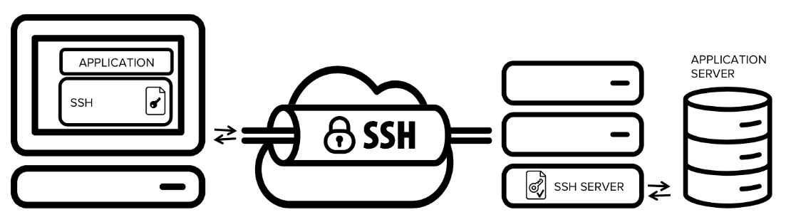
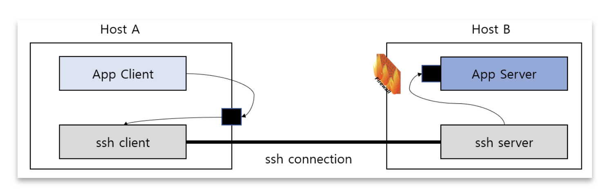
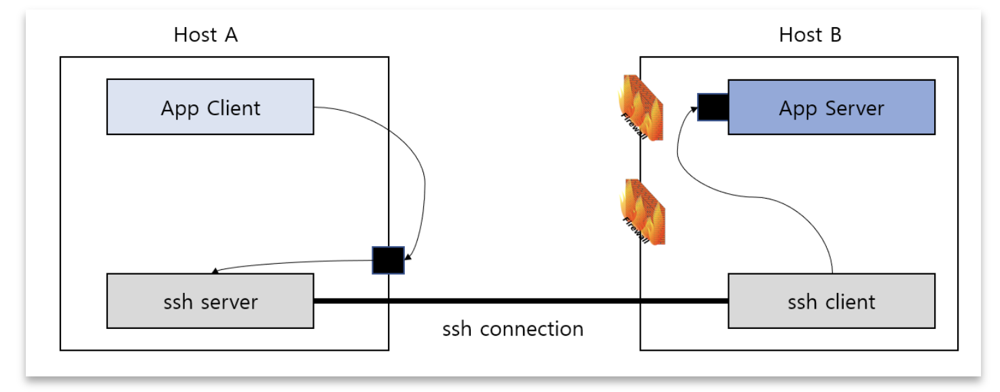

# SSH Tunneling

[공식문서](https://www.ssh.com/academy/ssh/tunneling)

## 정의

SSH 터널링, SSH 포트 포워딩

암호화된 SSH 연결을 통해 임의의 네트워킹 데이터를 전송하는 방법

서비스 포트를 릴레이할 수 있는 클라이언트와 서버 시스템 간에 암호화된 SSH 연결을 생성하는 방법.

SSH를 통해 모든 TCP/IP를 터널링 한다.

## 특징 
SSH 터널링을 사용하면 기본적으로 암호화를 지원하지 않는 레거시 애플리케이션에 네트워크 보안을 추가할 수 있다.

VPN을 구현하고 방화벽을 통해 인트라넷 서비스에 엑세스할 때.

## 구조

App Client가 App Server에 바로 연결되는 게 아니라 SSH를 한번 거친다.

1. App Client에서 App Server에 접근하고 싶지만, 방화벽 등으로 막혀있음. 
2. 이를 허용하기 위해서는, 다른 포트를 사용하거나 규칙을 바꾸는 등 번거롭다.
3. Application은 SSH Client가 수신 대기하는 local host의 port에 연결한다.
4. SSH Client는 암호화된 터널을 통해 SSH Server로 application을 forward 한다.
5. SSH Server는 실제 Application Server에 연결한다. (보통 같은 서버에 있음.)
6. Application 통신이 안전하게 보호된다.

## 종류
### Local Tunneling

~~~sh
$ ssh -L PORT1:HOSTNAME(App Server가 있는):PORT2 user@hostB

$ ssh -L 1234:HostB:8080 user@hostB
~~~
ex) App Server의 네트워크에서 8080을 차단해두어서, 바로 접근이 불가능할 때.

1. SSH Client는 port:1234를 리슨함.
2. localhost:1234에 요청이 들어오면 SSH Client가 SSH Server로 요청을 보낸다.
3. SSH Server는 Host B의 port:8080 으로 요청을 다시 보낸다.

### Remote Tunneling

ex) App Server의 들어오는 모든 포트가 막혀있을 때. 대신, Host B에서 외부로의 연결은 가능하다면.

~~~sh
$ ssh -R PORT1:HOSTNAME:PORT2 user@hostA

$ ssh -L 1234:HostB:8080 user@hostB
~~~

1. 이때는 SSH 연결도 못 들어온다.
2. 그래서 App Server Host에 `SSH Client`를 둔다.
3. 그리고 App Client Host에 `SSH Server`를 둔다.
4. Host B에서 Host A로 SSH 연결을 한다.
5. 이때, SSH Server에게 port:1234를 리슨하라고 정보르 준다.
6. 이후 과정은, Local Tunneling과 동일하다.
7. 즉, **SSH Client와 Server의 역할만 바뀐 셈이다.**

## 장점
애플리케이션을 수정하지 않고도 SOX, HIPAA, PCI-DSS 및 기타 표준을 준수할 수 있다.

## 단점
일종의 방화벽 우회이기 때문에, 보안 구멍이 생길 수 있다.

## 참고
https://hbase.tistory.com/328