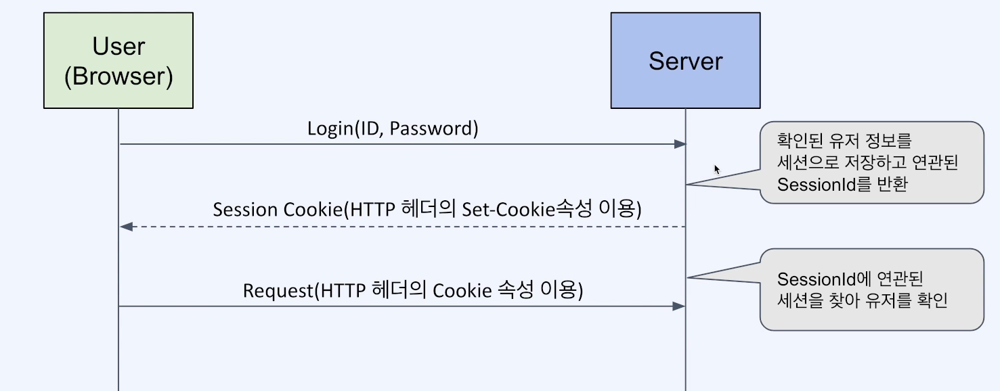

# Session

## 정의

- 네트워크 상에서 2개의 통신장치간에 유지되는 상호 연결
- 적용 대상에 따라 여러 의미를 가진다
  - OIS 7계층에서의 세션 계층
  - TCP 커넥션맺을 때 3way handshake 이후 연결된 상태를 말하는 세션
  - HTTP level에서의 세션
  - Web 로그인 세션

## Web 로그인 세션

- Web 상에서 특정 유저가 로그인했음을 나타내는 정보
- 브라우저는 Cookie, 서버는 해당 Cookie에 대응되는 세션 정보를 저장.
  - 서버로 가는 요청들은 모두 독립적이고, 서버는 클라이언트를 특정할 수 없음
  - 이때, 클라이언트에 관한 정보를 저장할 수 있는 것이 세션.
- 주로 Redis를 세션DB로 사용
- 기본적으로 http는 stateless.

### Web 로그인 과정

### 특징

    현재 로그인한 유저들의 모든 세션ID를 DB에 저장해야 함.

    요청이 있을 때 마다 DB와 연결해야 됨. 

### 장점 

    특정 유저를 쫓아내고 싶을 떄, 세션을 삭제하기만 하면 됨. 

    인스타그램처럼 로그인된 디바이스에서 강제 로그아웃 가능

    넷플릭스 계정 공유 제한 둘 수 있음.  

### 단점 

    세션 DB를 사고 유지해야함. 

    유저가 늘어날 수 록 DB도 늘려야 함.

### 분산 환경에서의 세션 처리

- RDB를 사용하는 방법
- Redis를 사용하는 방법