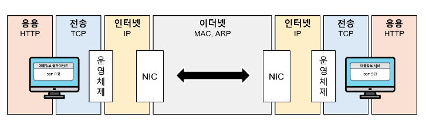
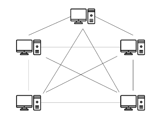
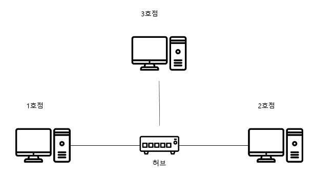
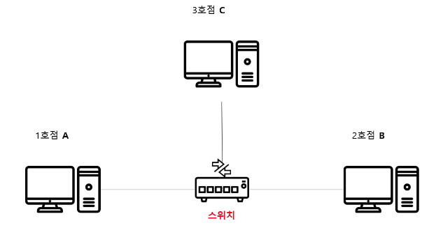
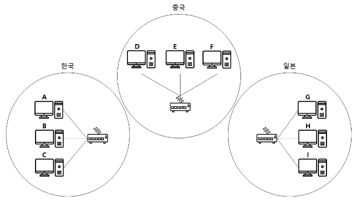
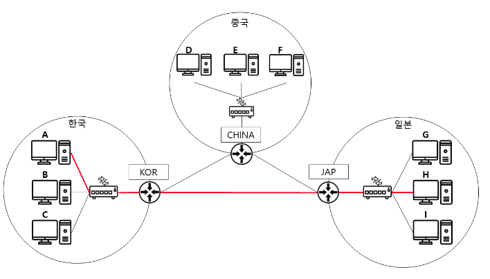
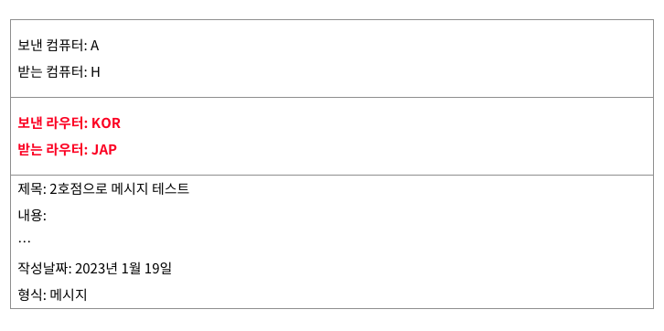

# 네트워크 기본

## 네트워크
- 서로 통신할 수 있는 상호 연결된 디바이스의 집합

## 프로토콜(약속)
* 약속된 데이터 형식
* 주고 받을 때, 내용이 섞이지 않도록

#### TCP/IP
* 표준 프로토콜
* 
* 주소창에 url을 입력하면 데이터가 4계층을 걸쳐서 만들어지고 다시 역으로 거치는 과정이 일어남. 
* 응용-전송-인터넷-이더넷-인터넷-전송-응용
* 이 과정에서 캡슐화가 이뤄짐. 
  * 데이터가 4단계에 걸쳐 포장된 뒤, 다시 거꾸로 과정을 거쳐서 전달되는 것.

* 우편의 형식과 유사함. 
  * 편지지(전달하고자 하는 내용) -캡슐화- 편지봉투(보내는 이, 받는 이) -캡슐화- 택배상자(보내는 아파트, 받는 아파트) -캡슐화- 우체국(실제 주소를 할당)
  * 도착 후, 역캡슐화가 이뤄짐

* 이전 단계의 내용물을 다른 곳으로 이동시키기 위해 캡슐화가 존재

## 허브 
* 연결되는 컴퓨터가 많아질수록 이들이 각각 모두 연결되는 것은 불가능
* 
* 아래처럼 중앙에 연결장치를 두게됨.
* 

## 스위치
* 특정 컴퓨터에게만 데이터를 전달하기 위해 생김.
* 또한 데이터의 방향 전환이 가능해짐
* 
* 스위치가 생기면서 프로토콜에 특정 컴퓨터를 지정하는 정보가 추가됨.

## LAN(Local Area Network)
* 
* 지역별로 형성된 네트워크 

## 라우터 
* LAN을 서로 잇기 위해서 어떻게 해야 할까 ? 
* 각 LAN의 스위치를 잇는 방법 
  * 스위치가 늘어날 때 마다, 각각 연결이 늘어나게 된다. 허브와 같은 상황 발생
* 
* 각 LAN을 대표하는 장치를 두게됨. 이것이 라우터
* 라우터가 추가되면서 프로토콜에 라우터를 특정하는 정보가 추가됨. 
* 

## 출처 
https://yozm.wishket.com/magazine/detail/1875/