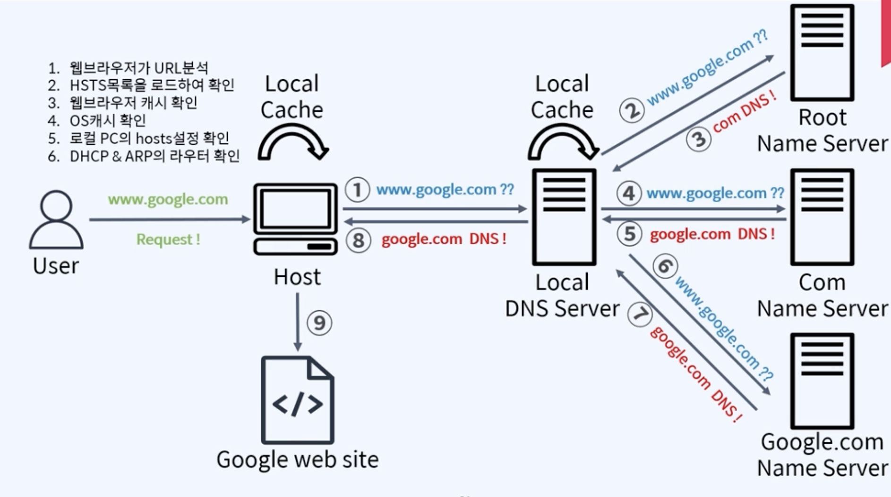

# URL 입력 후 플로우

브라우저는 URL을 분석하여 요청이 안전한지(예: HTTP 또는 HTTPS) 확인하고 도메인 이름을 식별합니다.
HSTS(HTTP 엄격한 전송 보안) 목록 확인:

브라우저는 도메인이 HSTS(HTTP Strict Transport Security) 목록에 나열되어 있는지 확인합니다. 목록에 있으면 사용자가 "HTTP"를 입력한 경우에도 연결이 HTTPS를 사용하는지 확인합니다.
브라우저 캐시 조회:

브라우저는 내부 캐시에서 요청된 URL의 DNS 레코드를 검색합니다. 이전 요청에서 캐시된 IP 주소를 찾으면 전체 DNS 조회를 피하고 즉시 사용할 수 있습니다.
OS 캐시 조회:

DNS 레코드가 브라우저 캐시에 없으면 운영 체제의 캐시를 확인합니다. 이 캐시는 최근 확인된 도메인 이름의 IP 주소를 저장합니다.
로컬 hosts 파일 조회:

OS 캐시에서 DNS 항목을 찾을 수 없는 경우 시스템은 로컬 시스템의 hosts 파일을 확인합니다. 'hosts' 파일에는 도메인 이름을 IP 주소에 매핑하는 수동 항목이 있을 수 있으며, 이는 일반적인 DNS 확인을 우회합니다.
라우터의 DHCP 및 ARP 확인:

호스트는 DHCP(동적 호스트 구성 프로토콜), ARP(주소 확인 프로토콜) 등 로컬 네트워크 라우터의 설정을 확인하여 게이트웨이 및 라우터 구성의 IP를 확인합니다.
로컬 DNS 서버 쿼리:

로컬에서 DNS 레코드를 찾을 수 없는 경우 브라우저는 로컬 DNS 서버(일반적으로 ISP에서 제공하거나 네트워크 설정에서 수동으로 구성)에 쿼리를 보냅니다. 로컬 DNS 서버는 필요한 경우 다른 DNS 서버에 쿼리하여 도메인 확인을 시도합니다.
DNS 재귀: 루트 서버:

로컬 DNS 서버에 DNS 레코드가 없으면 루트 네임 서버에 쿼리합니다. 루트 서버는 특정 도메인에 대한 정보를 갖고 있지 않지만 관련 최상위 도메인(TLD) DNS 서버(이 경우 .com TLD 서버)로 쿼리를 보냅니다.
TLD DNS 서버 조회:

TLD DNS 서버는 '.com'으로 끝나는 도메인에 대한 신뢰할 수 있는 정보를 어디서 찾을 수 있는지 알고 있습니다. 특정 도메인(예: google.com)에 대한 신뢰할 수 있는 DNS 서버로 쿼리를 전달합니다.
신뢰할 수 있는 DNS 서버:

google.com에 대한 권한 있는 서버는 도메인의 IP 주소를 제공합니다.
로컬 DNS 서버 캐싱:

로컬 DNS 서버는 권한 있는 DNS 서버가 제공한 IP 주소를 캐시하여 동일한 도메인에 대한 향후 요청 속도를 높이는 데 도움이 됩니다.
브라우저에 IP 주소 반환:

로컬 DNS 서버는 확인된 IP 주소를 사용자의 컴퓨터로 반환한 후 브라우저에 제공합니다.
연결 설정:

브라우저는 일반적으로 포트 80(HTTP) 또는 포트 443(HTTPS)을 통해 확인된 IP 주소를 사용하여 웹 서버에 대한 TCP 연결을 설정합니다.
HTTP 요청 보내기:

브라우저는 웹 페이지의 콘텐츠를 요청하기 위해 웹 서버에 HTTP/HTTPS 요청을 보냅니다.
콘텐츠 수신 및 표시:

웹 서버는 요청을 처리하고 HTML 콘텐츠를 다시 전송하며, 브라우저는 콘텐츠를 렌더링하여 요청된 웹페이지를 사용자에게 표시합니다.