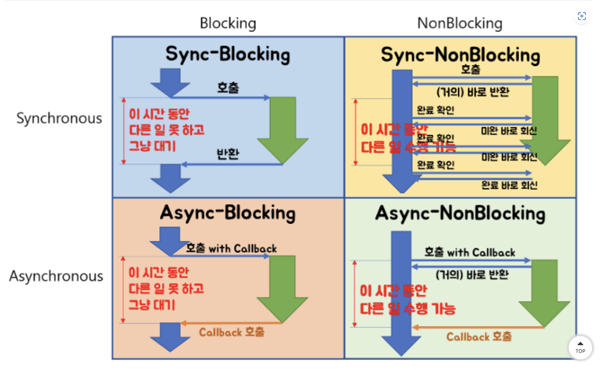

# 동기/비동기 & 블로킹&논블로킹

## 동기/비동기
### 동기(Synchronous) 
- 한 작업이 완료될 때까지 다음 작업이 시작되지 않는다. 
- 작업들이 순차적으로 이뤄짐
- 코드의 흐름을 이해하기 쉽고, 작업들이 예측가능한 순서로 실행됨

### 비동기(Asynchronous)
- 한 작업이 완료되기를 기다리지 않고, 다음 작업을 시작할 수 있음.
- 콜백, 프로미스, 이벤트를 사용하여 완료를 처리함.
- 작업들이 동시다발적으로 실행
- A 작업의 완료를 기다리는 동안 B 작업을 수행할 수 있어서, 리소스 활용도가 높다.
- 대신, 코드의 흐름이 복잡해지고 작업들의 완료 순서를 예측하기 어려움
- 