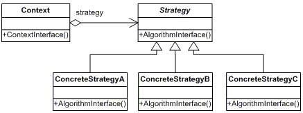

# Strategy Pattern (전략 패턴)

## 배경
객체가 여러 알고리즘이나 행동 중 하나를 선택하여 실행해야 할 때가 있습니다. 이 경우, 모든 알고리즘을 하나의 클래스에 담으면 그 클래스는 책임이 너무 많아지고 변경에 취약해집니다. 변경할 때마다 해당 클래스의 소스를 수정해야 하므로 유지보수가 어려워지죠.

예를 들어, 어떤 소프트웨어에서 결제 방식을 구현해야 한다고 생각해봅시다. 결제 방식으로는 신용카드, 페이팔, 암호화폐 등이 있을 수 있습니다. 결제 클래스에 모든 결제 방식을 직접 구현하면 코드가 복잡해지고 새로운 결제 방식이 추가될 때마다 결제 클래스를 수정해야 하는 문제점이 발생합니다.

## 개념
- 행동(알고리즘)을 캡슐화하여 동적으로 객체에 주입할 수 있다.
- 즉, 각 알고리즘을 별도의 클래스로 분리하고, 이러한 알고리즘을 사용하는 컨텍스트(Context)는 알고리즘의 변경에 영향을 받지 않게된다.

## 구조

### Strategy 인터페이스
- 공통의 알고리즘을 정의하는 인터페이스 또는 추상 클래스

### ConcreteStrategy 클래스
- 인터페이스를 구현하여 실제 알고리즘을 정의하는 클래스
- Strategy 인터페이스의 자리에 들어갈 수 있게됨.

### Context 클래스
- Strategy 객체를 사용.
- Strategy 인터페이스를 통해 알고리즘을 실행하고, 알고리즘의 구체적인 구현을 모름
- 따라서 새로운 알고리즘을 추가하더라도 Context 클래스는 변경되지 않는다.

## 장점
- OCP
  - 새로운 알고리즘을 추가할 때 기존 코드를 수정하지 않고도 새로운 알고리즘(ConcreteStrategy 클래스)을 추가할 수 있음
- SRP
  - 알고리즘이 별도의 클래스로 분리되어 있기 때문에, 각 클래스는 하나의 책임만 갖게됨.

## 예시
- Collections.sort(), Java Streams API

## 출처
https://refactoring.guru/design-patterns/strategy
https://www.youtube.com/watch?v=xlaAiHrZN3U&t=116s