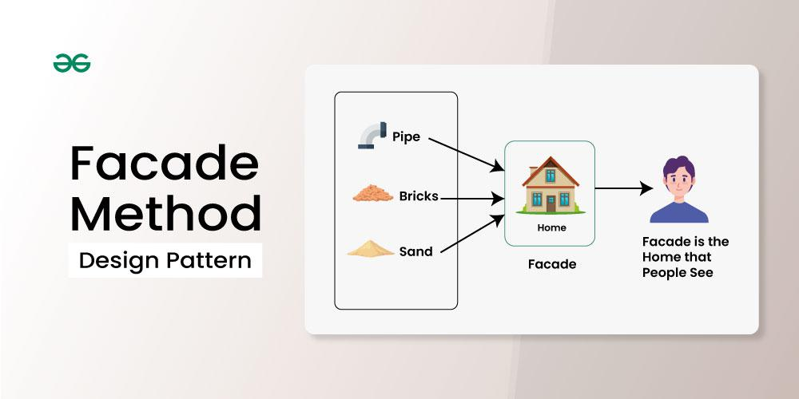

# Facade Pattern

- 파사드 패턴
- 가장 쉬운 패턴
- facade : 외벽이라는 뜻
- 복잡한 시스템이나 서브시스템을 간단한 인터페이스로 감싸서, 외부에서 그 복잡성을 숨기고 사용하기 쉽게 만드는 패턴

## 구조

### Facade
- 클라이언트와 복잡한 시스템 간의 단순화된 인터페이스를 제공
- 서브시스템의 여러 기능을 간단한 메서드로 묶어서 제공함으로써, 클라이언트가 서브시스템의 복잡성을 모르고도 쉽게 사용할 수 있게 해줌
### Subsystem classes
- Facade가 감싸고 있는 실제 복잡한 시스템의 구성 요소들. 서브시스템은 Facade에 제공되는 단순화된 인터페이스와 관계없이 여전히 복잡한 인터페이스를 통해 서로 상호작용할 수 있다.
- 서브시스템은 Facade에 대해 전혀 모르는 상태로 존재하며, Facade는 이들을 제어하는 역할을 한다.
### Client
- Facade의 단순화된 인터페이스를 사용하여 서브시스템과 상호작용하는 사용자. 클라이언트는 서브시스템의 복잡한 내부 동작을 알 필요가 없다.

## 구현방법

- 패턴을 최대한 활용하려면 모든 클라이언트 코드가 퍼사드 패턴을 통해서만 하위시스템과 통신하도록 한다.

## 장단점
- facade 클래스가 god object가 되지않도록 주의해야 한다.

## 예시 
- Java의 java.sql.Connection 인터페이스, java.util.logging.Logger 클래스, java.net.URL 클래스가 대표적인 예시이다.

## 참고
https://en.wikipedia.org/wiki/God_object