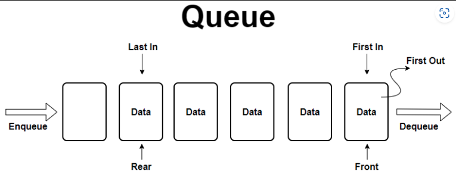
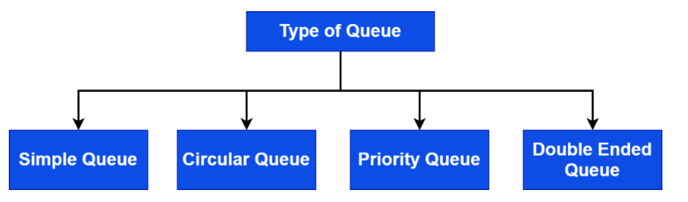

# Queue 큐

## 정의

선형 ADT

## 특징
표를 사기 위해 줄서있는 것을 생각하면 된다.

**FIFO(First In First Out)**
먼저 들어온 데이터가 먼저 나간다.

data를 일시적으로 저장하고 관리하는데 유용

하나의 data type만 저장할 수 있다.

## 용어

### front
데이터가 나가는 위치.
Queue 제일 앞에 있는 data값.

제일 먼저 들어온 값이기도 하다. (먼저 들어왔으니까 제일 앞에 있다.)

### Rear
데이터가 들어오는 위치.
Queue 제일 뒤에 있는 data값

### Enqueue 
Queue에 data를 추가한다. 
만약, Queue가 가득 차있으면 추가되지 않음.

### Dequeue
Queue에서 data를 제거한다.
FIFO이기 때문에, Front부터 제거된다.

## 큐의 종류

> **Simple Queue**
가장 간단한 형태. FIFO 엄격하게 준수한다.

> **Circualr Queue**
첫번째 요속 마지막 요소를 가리키므로 원형구조이다. Simple Queue보다 메모리를 더 효율적으로 활용한다.

> **Priority Queue**
큐의 요소에 대해 우선순위를 정한다. 이 우선순위에 따라 삽입/제거를 처리한다.

> **Double Ended Queue**
FIFO를 따르지 않는다. front/rear 어디서나 삽입/제거 가능하다.

## 큐의 기본 동작
> **is_Queue_Empty**
큐가 비어있는지 아닌지 확인

> **insertion_in_Queue(value)**
주어진 값을 큐에 삽입. 특정 위치를 지정할 순 없다.

> **deletion_in_Queue()**
큐에서 요소 제거. 특정 위치의 요소를 제거할 순 없다.

> **traverse_Queue()**
큐에 있는 모든 요소를 읽는다. front에서 부터 rear까지.

## 큐 구현

가장 간단한 구현 방법은 **배열**을 사용하는 것이다.

배열을 사용하면, 요소를 삽입할 때마다 요소를 하나씩 front로 직접 이동시켜줘야 한다.

배열로 큐를 구현하면 생기는 가장 큰 문제는 큐의 크기를 알아야만 작동한다는 것이다. 또한 큐의 크기는 고정되어야 한다.

보통 배열을 사용하면, Enqueue/Dequeue 할 때마다 데이터가 계속 앞으로 밀려나는 문제가 생겨서 원형 버퍼를 사용.

시작 부분과 끝 부분을 포인터로 지정한 뒤 Enqueue/Dequeue를 하는 형태. 대신 

## 주 사용처
1. 운영체제에서는 `프로세스 스케줄링`에 사용되어 CPU의 시간을 할당받기를 대기하는 프로세스들을 큐에 유지.
 
2. `네트워크 패킷` 처리에 사용되어 패킷들이 도착한 순서대로 처리되는데 사용됨.
 
3. 버퍼링이 필요한 상황.
 
4. 멀티스레드 환경에서 작업의 실행 순서를 제어하는 용도
 
5. Message System에서 메시지를 임시적으로 저장하고 관리하는 Message Queue

## 참고
https://www.baeldung.com/cs/adt