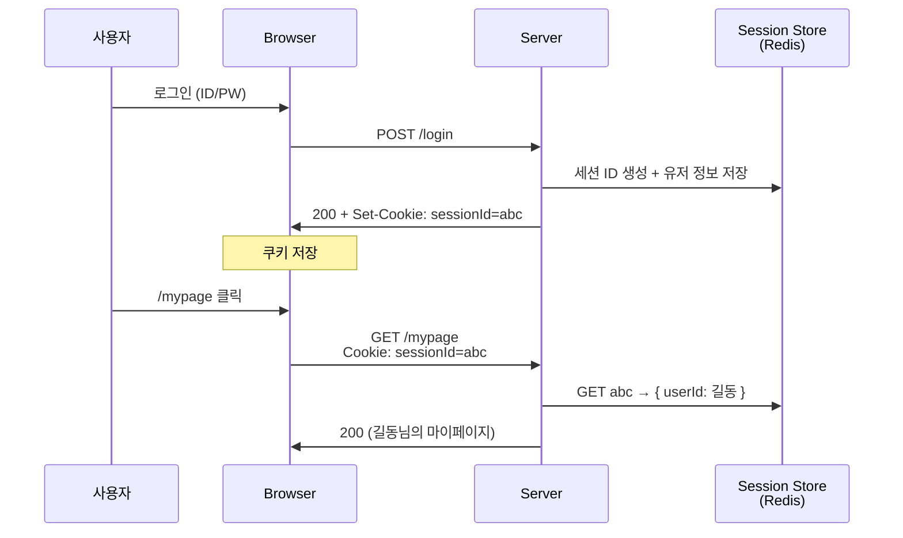

# Session

> 최종 업데이트: 2026-06-02 | 기준: 웹/HTTP 세션 중심

## 개념

**Session**은 두 통신 주체가 일정 기간 동안 유지하는 **상호작용의 맥락**을 가리킨다. 단일 요청-응답을 넘어 "지금 우리는 같은 대화 중"임을 양쪽이 기억하게 해주는 추상 개념이다.

> 비유하자면 **카페에서 회원으로 입장해 머무는 시간 전체**. 입장(로그인)에서 퇴장(로그아웃)까지가 한 세션이고, 그 사이의 모든 주문·이용 내역은 한 묶음으로 다뤄진다.

문맥에 따라 "세션"이 가리키는 게 달라지므로 의미별로 구분이 필요하다.

## 세션의 여러 의미

| 의미 | 위치 | 내용 |
|---|---|---|
| **OSI 5계층 세션** | 통신 모델 | OSI 모델의 세션 계층 (L5). 양 끝단의 통신 세션을 수립·유지·종료 |
| **TCP 세션** | 전송 계층 | 3-way handshake로 수립된 TCP 연결 상태 자체. `ESTABLISHED` 상태가 유지되는 동안 |
| **TLS 세션** | 보안 계층 | TLS 핸드셰이크로 합의된 세션 키와 파라미터. 재사용으로 핸드셰이크 생략 가능 |
| **HTTP 세션** | 응용 계층 | 한 클라이언트가 서버와 주고받는 일련의 HTTP 요청들의 묶음 (대표 사례가 웹 로그인 세션) |
| **Web 로그인 세션** | 애플리케이션 | "이 사용자가 로그인했음"을 서버가 기억하는 상태. 보통 세션 ID + 저장소로 구현 |

이 문서는 **Web 로그인 세션**을 중심으로 다룬다. 다른 의미의 세션은 각각 다음 문서 참고:

- TLS 세션 → [보안/TLS/TLS.md](보안/TLS/TLS.md)
- TCP 핸드셰이크/연결 → 통신-프로토콜 관련 문서

## 배경/역사

세션 개념 자체는 RFC 단일 표준이 따로 없다. **각 웹 프레임워크가 쿠키 위에 구현**한 추상 개념으로 발전해왔다.

- **Java EE `HttpSession`** (1999, Servlet 2.2) — 자바 표준
- **PHP `$_SESSION`** (2000, PHP 4) — 가장 대중적
- **ASP.NET Session State** (2002)
- **Ruby on Rails `session[]`** (2004)
- **Express `express-session`** (Node.js 진영)
- **Spring Session** (2014) — 다중 서버 환경에서 Redis 등 외부 저장소로 세션을 추출하는 표준 모듈

초기에는 모두 **서버 메모리(JVM/PHP 프로세스)** 에 세션을 저장했고, 다중 서버·재시작 이슈로 점차 **외부 세션 스토어(Redis)** 가 표준이 됐다.

## Web 로그인 세션

### 동작 원리

1. 사용자가 로그인 → 서버가 **세션 ID 발급** (예: `abc123`)
2. 서버는 세션 저장소에 `abc123 → { userId: 길동, role: admin, ... }` 기록
3. 응답에 `Set-Cookie: sessionId=abc123; HttpOnly; Secure`
4. 다음 요청부터 브라우저가 자동으로 쿠키 전송
5. 서버는 세션 ID로 저장소 조회 → 유저 식별

핵심: **민감 정보는 모두 서버에 있고**, 클라가 가진 건 의미 없는 식별자(세션 ID)뿐이다. 클라가 쿠키를 위조해도 저장소에 없는 ID면 즉시 거부.

> 세션 ID를 운반하는 표준 도구는 쿠키지만, 쿠키 자체에 대한 자세한 내용(속성·SameSite·종류 등)은 [Cookie.md](Cookie.md) 참고.

### 인증 흐름

## 세션 저장소

세션 정보를 어디에 둘 것인가의 선택지.

| 저장소 | 장점 | 단점 | 쓰임새 |
|---|---|---|---|
| **In-Memory** (서버 메모리) | 가장 빠름, 구현 단순 | **서버 재시작 시 소멸**, 다중 서버 공유 불가 | 단일 서버 / 개발 환경 |
| **DB (RDB)** | 영속성, 어디서나 조회 | 매 요청마다 DB 접근 → 느림, 부하 큼 | 권장 X |
| **Redis** | 빠름(인메모리) + 영속화 + 클러스터 공유 + TTL 자동 만료 | 별도 인프라 필요 | **사실상 표준** |
| **Sticky Session** (LB 고정) | 인메모리 그대로 쓰면서 다중 서버 운용 | 특정 서버 죽으면 그 세션 전부 소실, 부하 불균등 | 레거시 운영 |

> 다중 서버 환경에서 인메모리 세션을 그대로 쓰면 "어느 서버에 붙느냐"에 따라 로그인이 풀리는 현상이 생긴다. 그래서 **Redis 같은 외부 세션 스토어**가 표준이 됐다.

### Redis가 표준이 된 이유

- **속도**: 인메모리라 마이크로초 단위 응답
- **TTL 내장**: `EXPIRE` 명령 한 줄로 자동 만료 관리
- **클러스터 공유**: 모든 앱 서버가 같은 Redis를 보므로 어느 서버에 붙어도 동일 세션
- **영속화 옵션**: RDB/AOF로 재시작 시 복구
- **단순한 key-value 모델**: 세션 ID → 직렬화된 사용자 정보 매핑에 딱

## 세션이 주는 운영적 이점

상태를 **서버가 보유**하기 때문에 가능한 것들. 토큰(JWT) 방식 대비 세션의 핵심 강점.

- **즉시 강제 로그아웃**: 세션 저장소에서 해당 ID 삭제 → 다음 요청부터 거부. 인스타그램·구글 "기기에서 로그아웃" 기능의 원리
- **동시 접속 제한**: 같은 유저의 세션 개수를 카운트해서 차단 (넷플릭스 동시 시청 제한)
- **실시간 권한 변경**: 관리자 권한 박탈 즉시 반영 (다음 요청부터 새 권한 적용)
- **세션 하이재킹 탐지**: 같은 세션 ID가 갑자기 다른 IP/UA에서 사용되면 차단

## 세션 단점

- **저장소 인프라 필요**: Redis 등을 별도로 운영·모니터링해야 함
- **저장소 비용**: 동시 접속자 수만큼 메모리 차지. 대규모 서비스에선 무시 못 함
- **저장소 장애 = 전체 로그아웃**: Redis 죽으면 모든 사용자가 풀림
- **수평 확장 시 일관성**: Redis 클러스터·복제 구성 필요

## Session vs Token (JWT)

같은 인증 문제를 푸는 두 접근. 어느 게 우월하다기보단 트레이드오프.

| 항목 | Session (서버 저장) | Token / JWT (자체 포함) |
|---|---|---|
| 상태 위치 | **서버** (Redis 등) | **클라이언트** (토큰 자체에 정보 포함) |
| 서버 메모리 | 유저 수만큼 필요 | 거의 없음 |
| 확장성 | 세션 스토어 인프라 필요 | 무상태 → 수평 확장 쉬움 |
| 즉시 무효화 | ✅ 저장소에서 지우면 끝 | ❌ 만료 전까진 유효 (블랙리스트 따로 필요) |
| 정보 변경 반영 | ✅ 즉시 | ❌ 토큰 재발급 전까지 옛 정보 |
| 전송 방식 | 보통 쿠키 | 보통 `Authorization: Bearer ...` 헤더 |
| CSRF 노출 | ⚠️ 쿠키 자동 전송 → SameSite 필수 | ✅ 헤더 직접 첨부 → 자동 전송 안 됨 |
| XSS 노출 | ✅ `HttpOnly`로 JS 접근 차단 가능 | ⚠️ localStorage에 두면 JS로 탈취 가능 |
| 모바일 친화 | 쿠키 자동 관리 어려움 | **헤더 방식이 모바일 표준** |

> 안드로이드·iOS 같은 네이티브 앱은 쿠키 자동 처리 메커니즘이 없어 직접 관리하기 번거롭다. 그래서 모바일 API는 보통 **토큰 + Authorization 헤더** 방식을 쓴다.

## 세션 메커니즘의 보안 위협

세션 ID 자체가 인증 자격을 대체하므로, ID 탈취·심기가 핵심 공격 표면이다.

| 공격 | 내용 | 방어 |
|---|---|---|
| **Session Hijacking** | 네트워크 도청·XSS 등으로 세션 ID 탈취 → 가로채기 | `Secure` + `HttpOnly` 쿠키, HTTPS 강제, 짧은 만료, IP/UA 변화 감지 |
| **Session Fixation** | 공격자가 미리 만든 세션 ID를 피해자에게 심어 로그인 유도 → 같은 ID 공유 | **로그인 성공 시 세션 ID 재발급** (가장 중요) |
| **Insufficient Session Expiration** | 세션이 너무 오래 살아남음 | 짧은 절대 만료 + 활동 기반 갱신 |
| **Predictable Session ID** | 세션 ID가 추측 가능 (단순 증가값 등) | 암호학적 난수 생성기로 충분히 긴 ID (128bit+) |

> 쿠키 운반 자체에 대한 위협(CSRF, XSS)은 [Cookie.md](Cookie.md) 참고.

## 분산 환경에서의 세션 처리

마이크로서비스·다중 앱 서버 환경에서 세션을 어떻게 공유할지의 선택지.

| 방식 | 동작 | 트레이드오프 |
|---|---|---|
| **공유 Redis** | 모든 앱 서버가 같은 Redis 본다 | 가장 일반적. Redis 가용성이 곧 인증 가용성 |
| **공유 RDB** | 세션 테이블을 모든 서버가 본다 | 느림, DB 부하 |
| **Sticky Session** | LB가 같은 클라를 같은 서버로 라우팅 | 인스턴스 죽으면 그 세션 다 잃음 |
| **JWT로 전환** | 세션을 없애고 토큰 기반으로 | 무상태 확장 쉬움. 즉시 무효화 포기 |
| **하이브리드** | 짧은 JWT + 서버 측 refresh token 저장소 | 둘의 장점 절충. 가장 흔한 실제 패턴 |

## 관련 문서

- [Cookie.md](Cookie.md)
- [통신-프로토콜/HTTP/](통신-프로토콜/HTTP/)
- [보안/TLS/TLS.md](보안/TLS/TLS.md)
- [../../인증/](../../인증/)
- [../../Redis/Redis-Session.md](../../Redis/Redis-Session.md)
