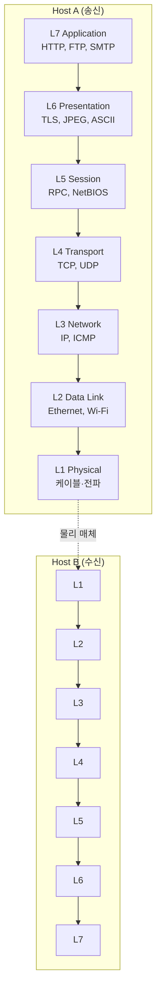
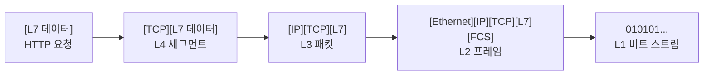

# OSI 7계층 모델

> 최종 업데이트: 2026-06-06 | 기준: ISO/IEC 7498-1 (1994 개정판)

## 개념

**OSI(Open Systems Interconnection) 모델**은 컴퓨터 네트워크의 통신 기능을 **7개의 계층으로 나눈 이론적 참조 모델**이다. ISO가 1984년에 정식 표준(ISO 7498)으로 채택했고, "네트워크가 어떻게 동작하는지" 설명하고 가르치는 **사실상의 공용어**가 됐다.

> 비유하자면 **국제 우편물의 7단계 처리 과정**과 비슷하다. 편지를 쓰고(L7) → 봉투 양식 통일(L6) → 발송 세션 관리(L5) → 분실되지 않게 추적(L4) → 어느 도시로 갈지(L3) → 어느 우체국 지점까지 운반(L2) → 실제 트럭/항공기로 이동(L1). 각 단계는 자기 일만 하고 다음 단계에 넘긴다.

핵심 가치는 **관심사 분리**. 각 계층은 위·아래 계층의 인터페이스만 알면 되고, 한 계층의 기술이 바뀌어도(예: 이더넷 → Wi-Fi) 위 계층은 영향받지 않는다.

> ⚠️ 중요: OSI는 **이론 모델**이고, 실제 인터넷은 **TCP/IP 4계층 모델**로 동작한다. OSI는 "표준이 되려다 실패했지만 교육·설계 어휘로는 살아남은" 모델이다. TCP/IP 모델 상세는 [TCP-IP-Model.md](TCP-IP-Model.md) 참고.

## 배경/역사

- **1977년**: ISO(국제표준화기구)가 컴퓨터 네트워크 표준화를 위한 위원회 결성. 당시 IBM SNA, DEC DNA 등 **벤더별 폐쇄형 네트워크 스택**이 난립하던 시기 → 개방형 표준의 필요
- **1984년**: ISO 7498로 **OSI 모델 정식 표준화**. ITU-T도 X.200으로 채택
- **1980년대 후반~1990년대**: ISO·정부 주도로 OSI 프로토콜(X.400 메일, X.500 디렉토리 등)을 보급 시도
- **결과**: **TCP/IP에 패배**. 인터넷이 폭발적으로 성장하며 단순하고 이미 동작하던 TCP/IP 스택이 사실상 표준으로 굳어짐
- **현재**: 프로토콜로서의 OSI는 사어(死語). 하지만 **7계층 모델**은 네트워크 교육·트러블슈팅·설계 어휘로 살아남음 — "L4 로드밸런서", "L7 방화벽"처럼 일상 용어

> "표준은 졌지만 어휘는 이겼다." 라우터 광고에 "OSI L3 스위칭"이라고 적혀 있어도, 그 라우터가 실제로 돌리는 건 TCP/IP다.

## 전체 구조

각 계층은 **헤더를 추가해 캡슐화(encapsulation)** 하고, 수신 측에서 역순으로 헤더를 벗기며(decapsulation) 올라간다.

| 계층 | 이름 | 데이터 단위(PDU) | 주소 | 대표 프로토콜 | 대표 장비 |
|---|---|---|---|---|---|
| **L7** | Application | Data | — | HTTP, FTP, SMTP, DNS, SSH | — |
| **L6** | Presentation | Data | — | TLS/SSL, JPEG, ASCII, MIME | — |
| **L5** | Session | Data | — | NetBIOS, RPC, SQL 세션 | — |
| **L4** | Transport | Segment(TCP) / Datagram(UDP) | 포트 | TCP, UDP, QUIC* | L4 LB, 방화벽 |
| **L3** | Network | Packet | IP | IP, ICMP, ARP*, OSPF | 라우터, L3 스위치 |
| **L2** | Data Link | Frame | MAC | Ethernet, Wi-Fi(802.11), PPP | 스위치, 브리지 |
| **L1** | Physical | Bit | — | 100BASE-T, RS-232, 광섬유 | 허브, 리피터, 케이블 |

> *ARP·QUIC 같은 일부 프로토콜은 모델의 어느 계층에 정확히 속하는지 합의가 갈린다. OSI는 이론 모델이라 현실 프로토콜이 깔끔히 안 들어맞는 게 흔한 일.

## 계층별 상세

### L1 Physical (물리 계층)

비트(0/1)를 **실제 신호**(전압, 빛, 전파)로 바꿔서 매체 위로 흘려보내는 계층.

- **다루는 것**: 케이블 종류, 커넥터 모양, 전압 레벨, 주파수, 비트 인코딩(NRZ, Manchester 등)
- **대표 규격**: 100BASE-T(이더넷 100Mbps 동선), 1000BASE-SX(광섬유), Wi-Fi PHY, RS-232
- **장비**: 허브, 리피터, 케이블, 광 트랜시버
- **고장 예시**: 케이블 단선, 커넥터 접촉 불량 → "Link Down"

> 비유: 우체국 트럭·항공기. 편지의 내용엔 관심 없고 "어떻게 물리적으로 이동시킬지"만 담당.

### L2 Data Link (데이터 링크 계층)

같은 네트워크 안의 **인접한 두 장비 사이**에서 프레임을 안전하게 주고받는 계층. **MAC 주소**로 식별.

- **다루는 것**: 프레이밍, 에러 감지(CRC), 흐름 제어, 매체 접근 제어(MAC) — 누가 언제 케이블을 쓸지
- **대표 프로토콜**: Ethernet(IEEE 802.3), Wi-Fi(IEEE 802.11), PPP
- **장비**: 스위치, 브리지, 무선 AP
- **주소**: MAC 주소 (`AA:BB:CC:DD:EE:FF`, NIC에 박힌 48bit 식별자)
- **세부 분할**: LLC(Logical Link Control) + MAC(Media Access Control) 부계층

> L2 스위치는 MAC 주소 테이블을 보고 "이 프레임은 어느 포트로 보낼지" 결정. 같은 LAN 안에서만 통한다.

### L3 Network (네트워크 계층)

**서로 다른 네트워크들을 가로질러** 패킷을 목적지까지 라우팅하는 계층. **IP 주소**로 식별.

- **다루는 것**: 라우팅(경로 선택), 패킷 단편화/재조립, 논리적 주소 지정
- **대표 프로토콜**: IPv4, IPv6, ICMP(ping), ARP(IP→MAC 변환), 라우팅 프로토콜(OSPF, BGP)
- **장비**: 라우터, L3 스위치
- **주소**: IP 주소 (`192.168.0.1`, `2001:db8::1`)

> 인터넷이라는 이름 그대로 "**Inter-net**(망과 망 사이)" 통신을 담당. L2가 동네 안 배달이면 L3는 도시 간 운송.

### L4 Transport (전송 계층)

종단(end-to-end) 간의 **신뢰성/속도 트레이드오프**를 책임지는 계층. **포트 번호**로 어느 애플리케이션인지 식별.

| 항목 | TCP | UDP |
|---|---|---|
| 연결 | 연결 지향 (3-way handshake) | 비연결 |
| 신뢰성 | 재전송·순서 보장 | 없음 (best-effort) |
| 흐름 제어 | ✅ | ❌ |
| 혼잡 제어 | ✅ | ❌ |
| 오버헤드 | 큼 | 작음 |
| 쓰임 | HTTP, SSH, 메일 | DNS, VoIP, 게임, 영상 스트리밍 |

- **PDU**: TCP는 세그먼트, UDP는 데이터그램
- **포트**: 0~65535 (HTTP 80, HTTPS 443, SSH 22, ...)
- **L4 LB**: 포트·IP만 보고 분배. L7처럼 URL을 까보지 않아 빠르지만 단순

### L5 Session (세션 계층)

두 종단 사이의 **대화(세션) 수립·유지·종료**를 책임지는 계층. "지금 우리는 같은 대화 중"임을 추적.

- **다루는 것**: 세션 수립/종료, 동기화 포인트, 다이얼로그 제어(누가 말할 차례인지)
- **대표 프로토콜**: NetBIOS, RPC, SQL 세션, SOCKS
- **현실**: TCP/IP 스택에선 별도 계층이 없고 **응용 프로그램이 직접** 다룸. 그래서 가장 "유명무실"한 계층

> 웹 로그인 세션, TLS 세션 등 "세션"이라는 말은 여러 계층에서 쓰인다. 세부 구분은 [../Session.md](../Session.md) 참고.

### L6 Presentation (표현 계층)

데이터의 **형식·인코딩·암호화**를 담당. 양쪽이 같은 "언어"로 데이터를 해석하게 변환.

- **다루는 것**: 문자 인코딩(ASCII↔EBCDIC, UTF-8), 데이터 압축(JPEG, MPEG), 암호화/복호화
- **대표 기술**: TLS/SSL, JPEG, MPEG, ASCII, MIME, Base64
- **현실**: 역시 TCP/IP에선 별도 계층이 아니고 응용 또는 보안 라이브러리가 처리

> TLS는 보통 "L6 (또는 L4~L7 사이)"로 분류. 엄밀히 어느 계층인지는 의견이 갈리는데 OSI 이론 모델에선 표현 계층으로 보는 게 일반적.

### L7 Application (응용 계층)

사용자/애플리케이션이 **직접 만지는 가장 위 계층**. 사용자가 보내려는 실제 메시지가 만들어지는 곳.

- **다루는 것**: 애플리케이션 프로토콜 — 무엇을 요청하고 무엇을 응답할지
- **대표 프로토콜**: HTTP, HTTPS, FTP, SMTP/IMAP/POP3, DNS, SSH, WebSocket, gRPC
- **L7 LB / WAF**: URL·헤더·바디까지 까보고 분배·차단

> "L7 방화벽이 SQL Injection을 막는다"는 말은 패킷의 HTTP 바디까지 다 까본다는 뜻. L4면 포트·IP만 보기 때문에 불가능.

## 캡슐화(Encapsulation)

각 계층이 자기 헤더(때로 트레일러)를 붙이며 내려간다. 송신 측에서 점점 무거워지고, 수신 측에서 역순으로 벗긴다.

같은 HTTP 요청 한 줄이 실제로는 4중 헤더로 감싸져 케이블을 흐른다.

## TCP/IP 모델과의 매핑

TCP/IP 4계층은 OSI 7계층을 실용적으로 압축한 형태.

| OSI 7계층 | TCP/IP 4계층 | 비고 |
|---|---|---|
| L7 Application | **Application** | OSI L5~7을 한 덩어리로 |
| L6 Presentation |  |  |
| L5 Session |  |  |
| L4 Transport | **Transport** | 그대로 |
| L3 Network | **Internet** | 이름만 다름 |
| L2 Data Link | **Network Access (Link)** | L1+L2 통합 |
| L1 Physical |  |  |

> 실무는 TCP/IP가 표준. OSI는 "어휘"로만 살아남았다. 자세히는 [TCP-IP-Model.md](TCP-IP-Model.md) 참고.

## OSI 어휘가 실무에서 쓰이는 자리

| 용어 | 무슨 뜻 |
|---|---|
| **L2 스위치** | MAC 주소 기반 스위칭 |
| **L3 스위치** | IP 라우팅까지 하는 스위치 |
| **L4 로드밸런서** | TCP/UDP 포트·IP로 분배 (AWS NLB) |
| **L7 로드밸런서** | HTTP URL·헤더 보고 분배 (AWS ALB, Nginx) |
| **L7 방화벽 (WAF)** | HTTP 페이로드 검사. SQLi/XSS 차단 |
| **L4 DDoS** | TCP SYN flood 등 전송 계층 공격 |
| **L7 DDoS** | HTTP GET flood 등 응용 계층 공격 |
| **OSI 모델 1·2계층 장애** | 케이블·NIC 문제 (트러블슈팅 어휘) |

> 토비의 스프링이 아니라 클라우드 LB 콘솔에서 "Layer 4 vs Layer 7" 고를 때 그 Layer가 바로 OSI 모델 번호다.

## 트러블슈팅 — 어느 계층 문제인지 가르기

장애가 났을 때 "어느 계층 문제인지" 빠르게 좁히면 원인 추적이 쉬워진다.

| 증상 | 의심 계층 | 확인 |
|---|---|---|
| LED 안 들어옴, 케이블 뽑힘 | L1 | 물리 연결 |
| 같은 LAN 안 ping 안 됨, MAC 충돌 | L2 | `arp -a`, 스위치 포트 |
| 외부 IP ping 안 됨 | L3 | `traceroute`, 라우팅 테이블 |
| ping은 되는데 포트 연결 안 됨 | L4 | `telnet`, `nc`, 방화벽 규칙 |
| 연결은 되는데 응답 이상 | L7 | curl/브라우저, 서버 로그 |

> "Layers 1~3은 네트워크 팀, 4~7은 개발팀" 식으로 책임이 갈리는 조직이 많아 이 어휘로 책임 소재 정리에 쓰임.

## 자주 받는 질문

### Q. OSI는 이론인데 왜 배워야 하나?
A. 실제 인터넷은 TCP/IP로 동작하지만, **네트워크 트러블슈팅·설계 회의·장비 광고에서 쓰이는 공용어**가 OSI 계층 번호다. "L7 LB" 같은 단어 하나로 의도가 통하는 게 OSI 모델의 가치.

### Q. TLS는 몇 계층?
A. 합의가 없음. OSI 이론으론 L6(Presentation), TCP/IP 관점에선 응용층 라이브러리. 실용적으로는 **"L4 위, L7 아래"** 정도로 본다.

### Q. ARP는 L2냐 L3냐?
A. 헤더는 L2 위에서 직접 운반되지만(MAC 프레임), 동작은 IP↔MAC 매핑이라 L3 정보를 다룬다. **2.5계층**이라 부르기도. 모델의 한계를 보여주는 사례.

### Q. QUIC은?
A. UDP 위에 신뢰성·암호화를 다시 구현한 프로토콜. 전송 계층(L4)이지만 TLS 기능도 내장. **계층 경계가 흐려진 현대적 사례**.

## 관련 문서

- [TCP-IP-Model.md](TCP-IP-Model.md) — TCP/IP 4계층 모델
- [../Network-Basic.md](../Network-Basic.md)
- [../Network-Protocol.md](../Network-Protocol.md)
- [../통신-프로토콜/](../통신-프로토콜/)
- [../보안/TLS/TLS.md](../보안/TLS/TLS.md)
- [../Session.md](../Session.md)
- [../port-vs-socket.md](../port-vs-socket.md)
