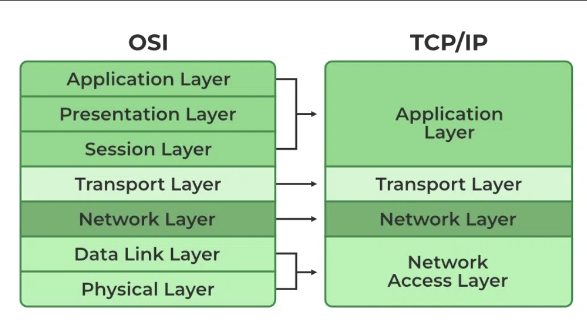
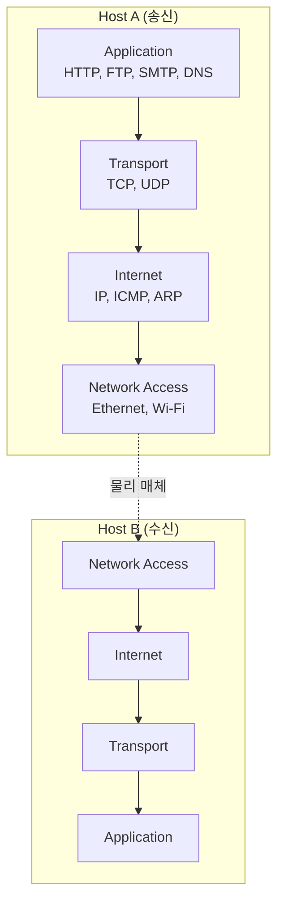
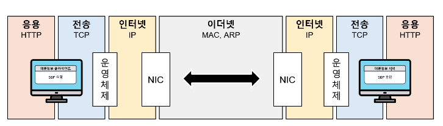
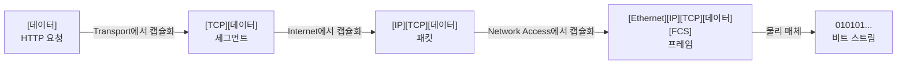
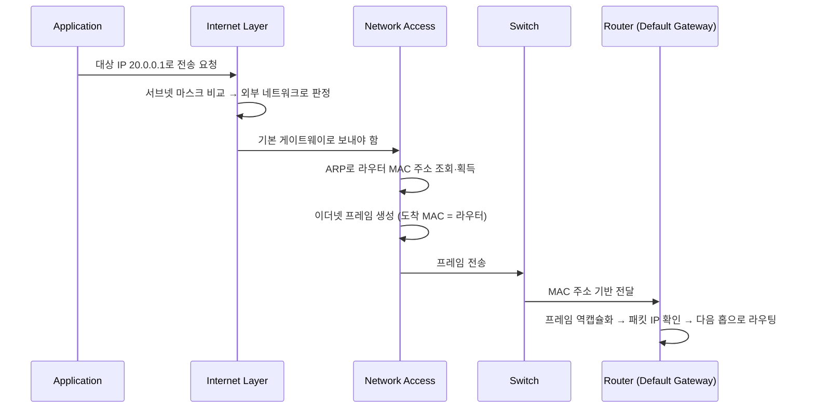

# TCP/IP 4계층 모델

> 최종 업데이트: 2026-06-06 | 기준: TCP/IP Internet Protocol Suite (RFC 1122)

## 개념

**TCP/IP 모델**은 실제 인터넷이 동작하는 **4계층 네트워크 참조 모델**이다. 데이터를 보내고 받는 일을 **물리 전송 → 라우팅 → 종단 간 전달 → 애플리케이션**의 4단계로 나눠 각 계층이 자기 책임만 수행하게 한다.

> 비유하자면 **국제 택배**. 물건을 박스에 담아 송장(애플리케이션 데이터) → 운송장 번호 부여(전송 계층) → 도착 도시 라우팅(인터넷 계층) → 실제 트럭·배·비행기로 운반(네트워크 액세스 계층). 각 단계는 앞 단계가 만든 결과물을 받아 자기 일만 하고 다음 단계로 넘긴다.

핵심 아이디어는 **계층 분리**. 한 계층의 기술이 바뀌어도(예: 이더넷 → Wi-Fi) 위 계층은 영향 없이 그대로 동작한다. 그래서 50년 전에 설계된 IP가 아직도 그대로 굴러간다.

> 이 모델이 곧 **현실 인터넷의 표준**이다. 7계층 OSI 모델은 이론·교육용 어휘로만 살아남았다. OSI 7계층 상세는 [OSI.md](OSI.md), OSI vs TCP/IP 매핑은 아래 참고.

## 배경/역사

- **1969년**: ARPANET 가동 시작. 미 국방부(DoD) ARPA 산하 패킷 교환 네트워크 실험
- **1974년**: **Vint Cerf**와 **Bob Kahn**이 논문 *A Protocol for Packet Network Intercommunication* 발표 — TCP 원안 제시
- **1981년**: IPv4 표준 (RFC 791), TCP 표준 (RFC 793)
- **1983년 1월 1일**: ARPANET이 NCP에서 **TCP/IP로 전환** (인터넷의 공식 생일로 불림)
- **1989년**: RFC 1122에서 TCP/IP를 **4계층 모델**로 공식화
- **1991년**: 팀 버너스 리의 WWW 등장 → HTTP가 응용 계층 표준으로 자리잡음
- **2000년대~**: IPv6 (RFC 8200), QUIC (RFC 9000) 등 진화 지속

> 같은 시기 ISO의 OSI 7계층 표준화 노력은 **TCP/IP에 패배**. 단순하고 이미 동작하던 TCP/IP가 사실상 표준이 됐다.

## OSI 모델과의 관계

| OSI 7계층 | TCP/IP 4계층 | 비고 |
|---|---|---|
| L7 Application | **Application** | OSI L5~7을 한 덩어리로 |
| L6 Presentation |  |  |
| L5 Session |  |  |
| L4 Transport | **Transport** | 그대로 |
| L3 Network | **Internet** | 이름만 다름 |
| L2 Data Link | **Network Access (Link)** | L1+L2 통합 |
| L1 Physical |  |  |

OSI는 7계층으로 잘게 나눠 이론적 깔끔함을 추구했고, TCP/IP는 실제 구현에 맞게 4계층으로 압축했다. OSI 상세는 [OSI.md](OSI.md) 참고.

## 4계층 전체 구조

| 계층 | PDU(데이터 단위) | 주소 | 대표 프로토콜 | 대표 장비 |
|---|---|---|---|---|
| **Application** | Data (메시지) | — | HTTP, FTP, SMTP, DNS, SSH | — |
| **Transport** | Segment(TCP) / Datagram(UDP) | 포트 | TCP, UDP, QUIC | L4 LB, 방화벽 |
| **Internet** | Packet | IP 주소 | IP, ICMP, ARP, OSPF | 라우터, L3 스위치 |
| **Network Access** | Frame / Bit | MAC 주소 | Ethernet, Wi-Fi, PPP | 스위치, NIC, 케이블 |

## 계층별 상세

### 1. Network Access Layer (네트워크 액세스 계층)

> 비유: **편지를 픽업해 지역 우체국까지 배달하는 우편 서비스**. 같은 동네 안에서 물리적으로 옮기는 일.

물리적 연결과 같은 네트워크 안의 인접 장비 사이 전송을 담당. OSI의 **L1(Physical) + L2(Data Link)** 를 합친 계층.

- **다루는 것**: 케이블·전파를 통한 비트 전송, 프레임 단위 데이터 전달, 에러 감지(CRC), 매체 접근 제어(MAC)
- **대표 프로토콜**: [이더넷](../Network-Protocol.md#이더넷-프로토콜), Wi-Fi(IEEE 802.11), PPP, NIC(Network Interface Controller)
- **장비**: 스위치, 브리지, 무선 AP, 허브

#### 프레임 (Frame)

- 네트워크로 나가기 전 **최종 캡슐화된 데이터 단위**
- 출발지·도착지 MAC 주소, 페이로드, 오류 감지 코드(FCS) 포함
- 같은 LAN 안에서만 의미 있음 (라우터 통과 시 새로 만들어짐)

#### MAC 주소

- NIC에 박힌 48bit 식별자 (`AA:BB:CC:DD:EE:FF`)
- 같은 네트워크 안에서 장치를 식별
- 자세한 프레임 구조는 [Network-Protocol.md](../Network-Protocol.md#이더넷-프레임-구조) 참고

---

### 2. Internet Layer (인터넷 계층)

> 비유: **우체국이 편지를 분류해 올바른 도시·거리 주소로 라우팅**. 도시 간 운송을 담당.

서로 다른 네트워크를 가로질러 **패킷을 목적지까지 라우팅**하는 계층. "Inter-net(망과 망 사이)" 통신을 담당한다는 점에서 인터넷이라는 이름의 어원.

- **다루는 것**: 논리적 주소 지정(IP), 라우팅(경로 선택), 패킷 단편화/재조립
- **대표 프로토콜**: IP(IPv4/IPv6), ICMP(ping), **ARP**(IP→MAC 변환), RARP, 라우팅 프로토콜(OSPF, BGP)
- **장비**: 라우터, L3 스위치

#### 패킷 (Packet)

- 데이터 페이로드 + 출발지/도착지 IP 주소, TTL, 패킷 순서 등 헤더 포함
- 같은 패킷이라도 경로가 매번 달라질 수 있음 (라우팅 동적)

#### IP 주소

- 전 세계 어디서든 유일한 논리 주소
- 라우터는 도착지 IP를 보고 **다음 홉(next hop)** 을 결정해 패킷 전달
- IPv4 (32bit, `192.168.0.1`) / IPv6 (128bit, `2001:db8::1`)

---

### 3. Transport Layer (전송 계층)

> 비유: **편지가 분실되지 않고 순서대로 도착하는지 확인하는 우편 서비스의 추적 기능**. 종단 간 전달 품질을 책임짐.

송신 종단과 수신 종단 사이의 **신뢰성·속도 트레이드오프**를 책임지는 계층. **포트 번호**로 어느 애플리케이션인지 식별한다.

- **다루는 것**: 종단 간(end-to-end) 연결 관리, 신뢰성, 흐름 제어, 혼잡 제어, 다중화(포트)
- **대표 프로토콜**: TCP, UDP, **QUIC**(HTTP/3 기반)

#### TCP vs UDP

| 항목 | TCP | UDP |
|---|---|---|
| 연결 | 연결 지향 (3-way handshake) | 비연결 |
| 신뢰성 | 재전송·순서 보장 | 없음 (best-effort) |
| 흐름·혼잡 제어 | ✅ | ❌ |
| 오버헤드 | 큼 | 작음 |
| PDU | **세그먼트** (segment) | **데이터그램** (datagram) |
| 쓰임 | HTTP, SSH, 메일, DB | DNS, VoIP, 게임, 영상 스트리밍 |

#### Port

- 16bit 정수 (0~65535). 한 호스트의 어느 애플리케이션과 통신할지 식별
- OS가 응용 프로그램에 포트 번호를 할당·관리
- Well-known: HTTP `80`, HTTPS `443`, SSH `22`, DNS `53`, FTP `21`
- 자세히 [port-vs-socket.md](../port-vs-socket.md)

---

### 4. Application Layer (응용 계층)

> 비유: **편지를 쓰고, 도착하면 읽는 단계**. 사람이 실제로 의미를 만들고 해석하는 곳.

사용자/애플리케이션이 직접 만지는 최상위 계층. OSI의 **L5(Session) + L6(Presentation) + L7(Application)** 을 모두 포함.

- **다루는 것**: 애플리케이션 프로토콜, 데이터 표현, 세션 관리, 암호화 등
- **대표 프로토콜**: HTTP/HTTPS, FTP, SMTP/IMAP/POP3, DNS, SSH, WebSocket, gRPC

#### 데이터 (Message)

- 응용 프로그램이 만들어내는 원본 데이터
- HTTP 요청, 이메일 본문, DNS 질의 등 사람·기계가 직접 해석하는 의미 단위

> TLS는 보통 응용 계층 위에 라이브러리로 얹어 동작. HTTPS = HTTP + TLS. 상세는 [../보안/TLS/TLS.md](../보안/TLS/TLS.md)

## 캡슐화 흐름

각 계층은 자기 헤더를 붙여 내려가고, 받는 쪽은 역순으로 벗기며 올라간다.

### 전체 흐름

1. **Application Layer**: 송신 서버의 애플리케이션이 대상 서버로 요청(예: HTTP)을 생성
2. **Transport Layer**: 데이터를 TCP(또는 UDP) 세그먼트로 캡슐화 + 포트 번호 부여
3. **Internet Layer**: 세그먼트를 IP 패킷으로 캡슐화 + 출발/도착 IP 주소 부여, 네트워크 라우팅
4. **Network Access Layer**: 패킷을 이더넷 프레임으로 변환 + MAC 주소 부여, 물리 매체로 전송
5. **스위치**: 프레임의 MAC 주소를 보고 같은 LAN 안에서 전달
6. **라우터**: 프레임을 역캡슐화해 패킷의 IP 주소를 보고 다음 네트워크로 전달

## 다른 네트워크의 서버로 요청을 보낼 때

라우터를 거쳐 외부로 나가는 시나리오의 상세 흐름.

1. **IP 주소 결정**: `20.0.0.1`을 목표로 전송 시작
2. **외부/내부 판정**: 인터넷 계층이 대상 IP와 자신의 서브넷 마스크를 비교 → 외부 네트워크
3. **기본 게이트웨이 선택**: 외부면 패킷을 **기본 게이트웨이(라우터)** 로 전달해야 함
4. **ARP 조회**: 네트워크 액세스 계층이 **ARP(Address Resolution Protocol)** 로 라우터의 MAC 주소를 질의
5. **프레임 생성**: ARP로 MAC 주소를 얻으면 이더넷 프레임을 생성 (목적지 MAC = 라우터)
6. **스위치 전달**: 이더넷 프레임이 스위치를 거쳐 라우터로 전달
7. **라우터 처리**: 라우터가 프레임을 역캡슐화해 패킷의 IP 도착지를 확인 → 다음 홉으로 라우팅

> **핵심**: 같은 LAN 안에선 MAC, 외부로 나가면 라우터가 IP를 보고 라우팅. 같은 패킷도 라우터를 거칠 때마다 프레임은 새로 만들어진다(MAC은 홉마다 변경, IP는 끝까지 유지).

## 계층 요약

| 계층 | 데이터 단위 | 장비 | 주요 정보 | 대표 프로토콜 |
|---|---|---|---|---|
| **Application** | Data (메시지) | — | 요청·응답 본문 | HTTP, DNS, SMTP |
| **Transport** | Segment / Datagram | L4 LB, 방화벽 | 포트 번호 | TCP, UDP |
| **Internet** | Packet | 라우터 | IP 주소 | IP, ICMP, ARP |
| **Network Access** | Frame / Bit | 스위치, NIC | MAC 주소 | Ethernet, Wi-Fi |

- **Network Access**: 물리적 전송 및 MAC 주소 지정
- **Internet**: IP 주소 지정 및 라우팅
- **Transport**: TCP/UDP를 통한 종단 간 데이터 전송 (신뢰성·다중화)
- **Application**: 최종 사용자 애플리케이션에 네트워크 서비스 제공

## 관련 문서

- [OSI.md](OSI.md) — OSI 7계층 모델
- [../Network-Basic.md](../Network-Basic.md)
- [../Network-Protocol.md](../Network-Protocol.md) — 이더넷 프레임·MAC 등
- [../port-vs-socket.md](../port-vs-socket.md)
- [../통신-프로토콜/](../통신-프로토콜/)
- [../보안/TLS/TLS.md](../보안/TLS/TLS.md)

## 출처

- https://en.wikipedia.org/wiki/Internet_protocol_suite
- https://www.geeksforgeeks.org/tcp-ip-model/
- [RFC 1122 - Requirements for Internet Hosts](https://datatracker.ietf.org/doc/html/rfc1122)
