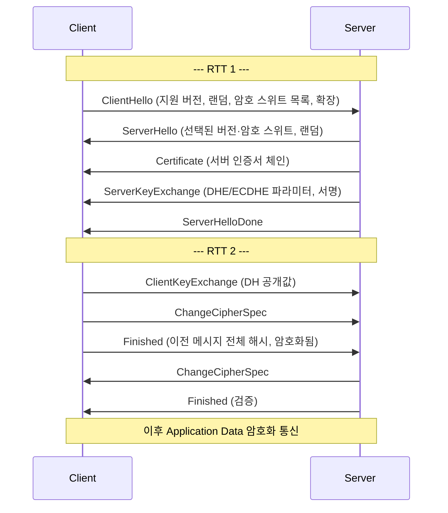
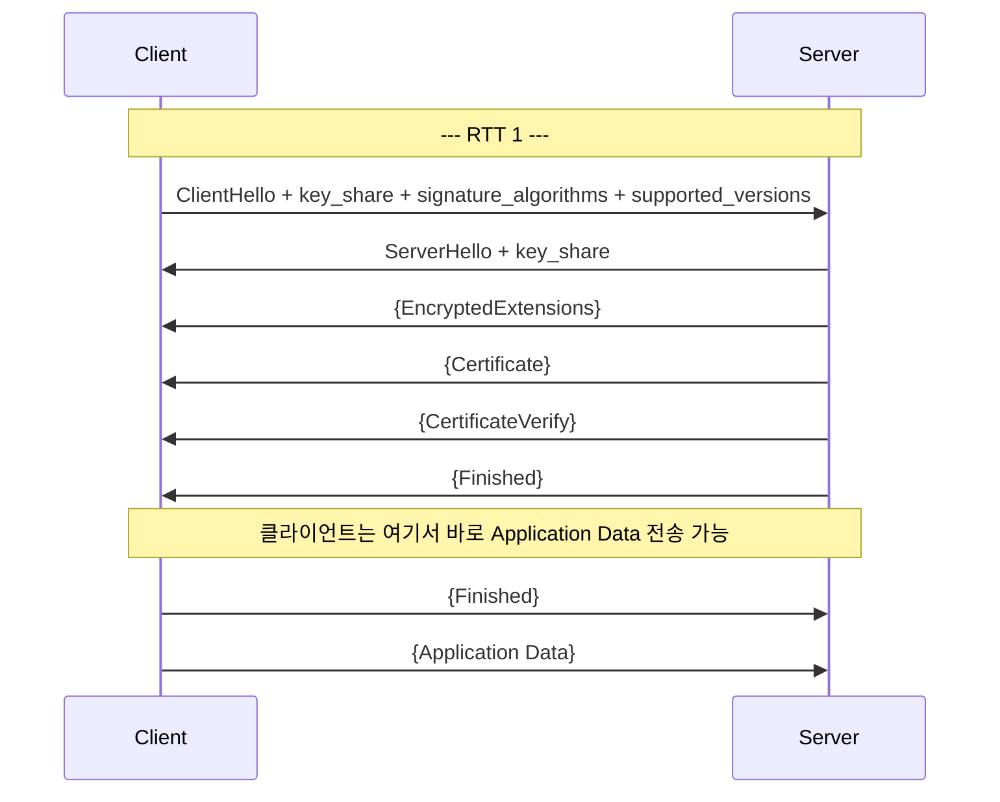

# TLS Handshake

> 최종 업데이트: 2026-05-31 | 기준: TLS 1.3 (RFC 8446), TLS 1.2 (RFC 5246)

## 개념

**TLS Handshake**는 클라이언트와 서버가 암호화 통신을 시작하기 전에, **"어떤 방식으로 안전하게 대화할지"를 합의하는 과정**이다. 사용할 TLS 버전과 암호 알고리즘을 정하고, 서버가 진짜인지 인증서로 확인하며, 양쪽만 아는 대칭키(세션 키)를 만들어낸다.

> 비유하자면 첩보원들이 본 작전을 시작하기 전, 길거리에서 만나서 암구호와 일회용 암호책을 맞추는 짧은 만남이다. 이 만남이 끝나야 비로소 "암호화된 본 통신"이 시작된다.

핸드셰이크가 끝나면 양쪽은 **세션 키(대칭키)** 를 공유한 상태가 되고, 이후의 모든 애플리케이션 데이터는 이 세션 키로 빠르게 암복호화된다. 즉 핸드셰이크는 **비대칭 암호로 대칭키를 안전하게 합의**하는 단계다.

## 배경/역사

- **SSL 1.0** (1994, Netscape): Mark Andreessen 주도, 결함 다수로 미공개
- **SSL 2.0** (1995): 최초 공개 버전. Paul Kocher, Phil Karlton, Alan Freier 설계
- **SSL 3.0** (1996): 사실상의 표준이 됨. POODLE 취약점으로 2014년 폐기
- **TLS 1.0** (1999, RFC 2246): IETF가 SSL을 표준화하며 이름 변경. SSL 3.0과 거의 동일
- **TLS 1.1** (2006, RFC 4346): CBC 공격 대응 (IV 명시)
- **TLS 1.2** (2008, RFC 5246): SHA-256, AEAD, 확장(Extension) 지원. 오래도록 주력 버전
- **TLS 1.3** (2018, RFC 8446): Eric Rescorla 주도. **1-RTT 핸드셰이크**, 0-RTT 재개, 약한 알고리즘 전면 제거. 10년 만의 대수술
- **SSL 2.0/3.0, TLS 1.0/1.1 폐기** (2021, RFC 8996): 이제는 TLS 1.2 이상만 사용해야 함

> "SSL"이라는 이름이 여전히 통용되지만, 현재 동작하는 프로토콜은 모두 **TLS**다. "SSL 인증서"라는 표현도 관습적 잔재.

## 핸드셰이크의 목적

| 목적 | 설명 |
|---|---|
| **버전 협상** | 클라이언트·서버가 지원하는 최고 TLS 버전 결정 |
| **암호 스위트 합의** | 키 교환·서명·대칭 암호·해시 알고리즘 조합 선택 |
| **서버 인증** | 서버가 제시한 인증서가 신뢰할 수 있는 CA가 서명한 것인지 검증 |
| **(선택) 클라이언트 인증** | mTLS의 경우 클라이언트 인증서도 검증 |
| **키 교환** | 양쪽만 아는 대칭 세션 키 생성 (도청자가 보더라도 알 수 없도록) |
| **무결성 확인** | 핸드셰이크 메시지 전체가 변조되지 않았는지 마지막에 검증 |

## TLS 1.2 핸드셰이크 (2-RTT)

TLS 1.2의 전통적인 풀 핸드셰이크. **TCP 연결 후 2왕복(2-RTT)** 만에 암호화 통신 준비가 끝난다.

### 메시지별 역할

| 메시지 | 보내는 쪽 | 핵심 내용 |
|---|---|---|
| **ClientHello** | Client | 지원 TLS 버전, 클라이언트 랜덤(32B), 지원 암호 스위트 목록, 확장(SNI, ALPN 등) |
| **ServerHello** | Server | 선택된 TLS 버전, 서버 랜덤(32B), 선택된 단일 암호 스위트 |
| **Certificate** | Server | X.509 인증서 체인 (서버 인증서 + 중간 CA) |
| **ServerKeyExchange** | Server | (EC)DHE 공개 파라미터 + 인증서 개인키로 서명 |
| **ClientKeyExchange** | Client | RSA면 premaster secret 암호화, ECDHE면 클라 공개값 |
| **ChangeCipherSpec** | 양쪽 | "이제부터는 합의된 세션 키로 암호화한다" 신호 |
| **Finished** | 양쪽 | 지금까지 주고받은 모든 핸드셰이크 메시지의 HMAC. 변조 시 즉시 실패 |

### 키 교환 방식

| 방식 | 동작 | 전방향 안전성(PFS) |
|---|---|---|
| **RSA** | 클라가 premaster를 서버 공개키로 암호화해 전송 | ❌ (서버 개인키 유출 시 과거 통신 전부 복호화 가능) |
| **DHE** | Diffie-Hellman 일회용 키쌍 교환 | ✅ |
| **ECDHE** | 타원곡선 기반 일회용 DH (가장 보편) | ✅ |

> TLS 1.3에서는 **RSA 키 교환 자체가 폐기**되었다. 전방향 안전성 없는 방식은 더 이상 허용되지 않음.

## TLS 1.3 핸드셰이크 (1-RTT)

TLS 1.3은 핸드셰이크를 **1왕복(1-RTT)** 으로 줄였다. 클라이언트가 첫 메시지부터 키 교환 후보 값을 보내고, 서버 응답 직후 클라가 바로 암호화된 데이터를 보낼 수 있다.

`{ ... }`는 핸드셰이크 도중 이미 파생된 키로 **암호화된 메시지**라는 표시. TLS 1.2와 달리 인증서까지 암호화되어 도청자가 어떤 서버에 접속했는지조차 알기 어렵다(SNI 제외).

### TLS 1.2 vs TLS 1.3 비교

| 항목 | TLS 1.2 | TLS 1.3 |
|---|---|---|
| RTT | 2-RTT | **1-RTT** (재개 시 0-RTT) |
| 키 교환 | RSA, DHE, ECDHE | **(EC)DHE만** (PFS 강제) |
| 대칭 암호 | CBC, RC4, GCM 등 다수 | **AEAD만** (AES-GCM, ChaCha20-Poly1305) |
| 해시 | MD5, SHA-1, SHA-256 등 | SHA-256, SHA-384만 |
| 핸드셰이크 암호화 | 평문 | 인증서 등 대부분 **암호화** |
| 압축 | 지원 (CRIME 취약점) | **제거** |
| 재협상(renegotiation) | 지원 | **제거** |
| 0-RTT 재개 | ❌ | ✅ (Early Data) |

## 암호 스위트 (Cipher Suite)

핸드셰이크에서 합의하는 알고리즘 묶음. 표기 방식이 TLS 1.2와 1.3에서 다르다.

### TLS 1.2 표기

`TLS_ECDHE_RSA_WITH_AES_128_GCM_SHA256`

| 구간 | 의미 |
|---|---|
| `ECDHE` | 키 교환 알고리즘 |
| `RSA` | 인증서 서명 알고리즘 |
| `AES_128_GCM` | 대칭 암호 + 모드 |
| `SHA256` | PRF·HMAC 해시 |

### TLS 1.3 표기

`TLS_AES_128_GCM_SHA256`

키 교환·서명 알고리즘은 별도 확장(`supported_groups`, `signature_algorithms`)으로 협상하기 때문에, 암호 스위트에는 **AEAD + 해시**만 남았다.

## 서버 인증서 검증

서버가 보낸 인증서가 진짜 그 도메인의 것인지 확인하는 절차. 한 단계라도 실패하면 핸드셰이크는 즉시 중단된다.

| 검증 항목 | 내용 |
|---|---|
| **서명 체인** | 서버 인증서 → 중간 CA → 루트 CA 순으로 서명 검증. 루트는 OS/브라우저의 신뢰 저장소에 있어야 함 |
| **유효기간** | `notBefore` ≤ 현재 시각 ≤ `notAfter` |
| **도메인 일치** | SAN(Subject Alternative Name)에 접속 도메인이 포함되는지 (CN은 더 이상 사용 안 함) |
| **폐기 여부** | OCSP 또는 CRL로 폐기되지 않았는지 확인. 최근은 **OCSP Stapling**으로 서버가 OCSP 응답을 함께 전달 |
| **키 사용 용도** | `keyUsage`, `extendedKeyUsage`에 `serverAuth` 포함 여부 |
| **CertificateVerify (1.3)** | 서버가 인증서 개인키로 핸드셰이크 해시에 서명한 것을 검증 → 인증서 도난만으로는 위장 불가 |

## SNI (Server Name Indication)

한 IP에서 여러 도메인을 서비스할 때, 서버가 어떤 인증서를 줄지 결정하기 위한 확장. 클라가 `ClientHello`에 접속할 호스트명을 평문으로 담아 보낸다.

- TLS 1.2/1.3 공통으로 평문이라 **도청자가 어떤 도메인에 접속했는지 알 수 있음**
- 이를 가리기 위한 **ECH(Encrypted Client Hello)** 가 표준화 진행 중. Cloudflare 등 일부 인프라에서 이미 사용

## 세션 재개 (Session Resumption)

같은 서버에 다시 접속할 때 풀 핸드셰이크를 생략해 속도를 올리는 메커니즘.

| 방식 | 동작 | 비고 |
|---|---|---|
| **Session ID** (TLS 1.2) | 서버가 ID와 세션 상태를 저장. 클라가 다음 접속 시 ID 제시 | 서버 메모리 부담 |
| **Session Ticket** (TLS 1.2~) | 서버가 세션 상태를 자기 키로 암호화한 티켓을 클라에 발급. 클라가 보관 | 서버 무상태 |
| **PSK** (TLS 1.3) | 이전 세션에서 파생한 사전 공유 키. ticket과 통합됨 | 1.3의 표준 방식 |

### 0-RTT (Early Data)

TLS 1.3의 PSK 기반 재개에서, **클라가 첫 메시지(ClientHello)와 함께 암호화된 애플리케이션 데이터까지 같이 보내는** 기능. 사실상 왕복 없이 데이터 전송이 시작된다.

- **장점**: HTTPS 응답 지연이 극적으로 줄어듦 (CDN/모바일에서 효과 큼)
- **위험**: **재전송 공격(replay attack)** 에 노출. 같은 요청이 여러 번 처리될 수 있음
- **대응**: 0-RTT는 **멱등(idempotent)** 한 요청(GET 등)에만 사용. 결제·상태 변경 요청에는 금지

## mTLS (상호 인증)

서버뿐 아니라 **클라이언트도 인증서를 제시**해 양방향 인증하는 방식. 핸드셰이크에 다음 메시지가 추가된다.

| 메시지 | 역할 |
|---|---|
| `CertificateRequest` (서버 → 클라) | "너도 인증서 내라"는 요청 |
| `Certificate` (클라 → 서버) | 클라이언트 인증서 체인 |
| `CertificateVerify` (클라 → 서버) | 클라가 자기 개인키로 서명 → 인증서 소유 증명 |

쓰임새: 사내 서비스 간 통신, IoT 디바이스 인증, Zero Trust 네트워크. 사용자 단말에는 인증서 배포 부담이 커서 일반 웹에는 잘 쓰이지 않음.

## 핸드셰이크 실패 시 알 만한 것들

운영하다 보면 자주 마주치는 실패 케이스.

- **`SSL_ERROR_NO_CYPHER_OVERLAP`**: 클라·서버가 지원하는 암호 스위트에 교집합이 없음. 한쪽이 너무 구버전이거나 너무 제한적
- **`HANDSHAKE_FAILURE` + 인증서 만료**: 가장 흔한 운영 장애. 모니터링 필수
- **`UNKNOWN_CA`**: 자체 서명 인증서, 또는 중간 인증서 누락. nginx 설정에서 `ssl_certificate`에 풀 체인(`fullchain.pem`) 사용
- **`HOSTNAME_MISMATCH`**: SAN에 도메인이 없음. 와일드카드 인증서(`*.example.com`)는 한 단계만 매치
- **SNI 누락으로 잘못된 인증서 반환**: 매우 오래된 클라이언트(IE on XP 등). 현실적으로 무시 가능

## 관련 문서

- [TLS.md](TLS.md)
- [../../통신-프로토콜/HTTP/HTTP.md](../../통신-프로토콜/HTTP/HTTP.md)
- [../../Network-Protocol.md](../../Network-Protocol.md)
- [../../../../인증/](../../../../인증/)
