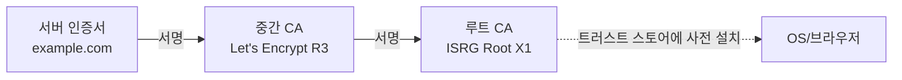

# TLS (Transport Layer Security)

> 최종 업데이트: 2026-05-31 | 기준: TLS 1.3 (RFC 8446), TLS 1.2 (RFC 5246)

## 개념

**TLS**는 두 호스트가 인터넷에서 주고받는 데이터를 **암호화·인증·무결성 보호**해주는 보안 프로토콜이다. TCP 위, 애플리케이션 프로토콜(HTTP, SMTP, gRPC 등) 아래에 끼어들어가 **기존 통신 프로토콜을 감싸 보호**한다.

> 비유하자면 일반 우편 봉투(TCP)에 들어가는 편지(HTTP)에 **봉인된 금고**를 한 겹 더 씌우는 것. 봉투를 뜯어봐도 금고 안의 편지는 발신자·수신자만 열 수 있고, 누가 중간에 바꿔치기하면 즉시 알 수 있다.

TLS는 그 자체로 "무엇을 통신할지"를 정하지 않는다. **HTTP → HTTPS**, **SMTP → SMTPS**, **IMAP → IMAPS** 처럼 다른 프로토콜에 보안 한 겹을 더해주는 보조 프로토콜이다.

## 배경/역사

- **SSL 1.0** (1994, Netscape): Mark Andreessen 주도, 결함 다수로 미공개
- **SSL 2.0** (1995): 최초 공개 버전. Paul Kocher, Phil Karlton, Alan Freier 설계
- **SSL 3.0** (1996): 사실상의 표준. POODLE 취약점으로 2014년 폐기
- **TLS 1.0** (1999, RFC 2246): IETF가 SSL을 표준화하며 이름 변경. SSL 3.0과 거의 동일
- **TLS 1.1** (2006, RFC 4346): CBC 공격 대응(IV 명시)
- **TLS 1.2** (2008, RFC 5246): SHA-256, AEAD, 확장(Extension) 지원. 오래도록 주력 버전
- **TLS 1.3** (2018, RFC 8446): Eric Rescorla 주도. 1-RTT 핸드셰이크, 0-RTT 재개, 약한 알고리즘 전면 제거
- **SSL 2.0/3.0, TLS 1.0/1.1 폐기** (2021, RFC 8996): 현재는 **TLS 1.2 이상만 사용**

> "SSL 인증서", "SSL/TLS"라는 표현이 여전히 통용되지만, 현재 실제로 동작하는 프로토콜은 모두 **TLS**다. SSL이라는 이름은 관습적 잔재.

## 네트워크 계층상 위치

TLS는 전송 계층(TCP)과 응용 계층(HTTP 등) 사이에 위치한다. OSI 모델로는 5~6계층(세션/프리젠테이션) 대응.

| 계층 | 예 |
|---|---|
| 응용 (L7) | HTTP, SMTP, gRPC, IMAP |
| **보안 (TLS)** | **TLS Record + Handshake** |
| 전송 (L4) | **TCP** (TLS는 신뢰성 있는 스트림 필요) |
| 인터넷 (L3) | IP |
| 링크 (L2) | Ethernet |

UDP 기반 통신을 보호하려면 TLS 대신 **DTLS**(Datagram TLS) 또는 **QUIC**(내장 TLS 1.3)이 쓰인다.

## TLS가 보장하는 보안 속성

| 속성 | 내용 | 어떻게 |
|---|---|---|
| **기밀성** (Confidentiality) | 도청자가 내용을 읽지 못함 | 핸드셰이크에서 합의한 세션 키로 AEAD 대칭 암호화 |
| **무결성** (Integrity) | 중간에 변조되면 즉시 탐지 | AEAD 인증 태그, Finished 메시지 해시 검증 |
| **인증** (Authentication) | 상대가 진짜인지 확인 | X.509 인증서 + CA 신뢰 체인. 선택적으로 mTLS |
| **전방향 안전성** (PFS) | 서버 개인키가 미래에 유출돼도 과거 통신은 안전 | (EC)DHE 일회용 키 교환. TLS 1.3은 강제 |
| **재전송 방지** | 같은 메시지 재주입 차단 | 시퀀스 번호가 AEAD nonce에 반영 |

## 구성 요소 (서브 프로토콜)

TLS는 단일 프로토콜이 아니라 **여러 서브 프로토콜의 묶음**이다.

| 서브 프로토콜 | 역할 |
|---|---|
| **Handshake Protocol** | 버전·암호 스위트 협상, 인증서 검증, 세션 키 합의 |
| **Record Protocol** | 합의된 키로 실제 데이터를 암호화/복호화해 전송 |
| **Alert Protocol** | 오류·종료 신호 전달 (`close_notify`, `bad_record_mac` 등) |
| **Change Cipher Spec** | "이제부터 새 키로 암호화한다" 신호 (TLS 1.2까지, 1.3에서 제거) |

### Record Protocol

핸드셰이크가 끝난 뒤 모든 통신은 **레코드(record)** 단위로 잘려 암호화된다.

| 필드 | 설명 |
|---|---|
| Content Type | `handshake`, `application_data`, `alert` 등 |
| Version | 레코드의 TLS 버전 |
| Length | 페이로드 길이 (최대 2^14 바이트) |
| Encrypted Payload | AEAD로 암호화된 데이터 + 인증 태그 |

큰 HTTP 응답도 결국 여러 개의 TLS 레코드로 쪼개져 전송된다. 레코드 단위로 인증 태그가 붙으므로 어느 한 레코드라도 변조되면 즉시 탐지된다.

### Alert Protocol

오류나 종료를 알리는 짧은 메시지. 두 종류.

- **warning**: 경고만 하고 연결 유지 (예: `close_notify`로 정상 종료 통지)
- **fatal**: 즉시 연결 종료 (예: `bad_record_mac`, `handshake_failure`, `certificate_expired`)

## 핸드셰이크 (요약)

TLS의 핵심 단계. 클라이언트와 서버가 본 통신 전에 만나서 **사용할 버전·암호 알고리즘·세션 키**를 합의하고 **서버 인증서를 검증**한다.

| 버전 | RTT | 주요 특징 |
|---|---|---|
| TLS 1.2 | 2-RTT | RSA/DHE/ECDHE 선택, 평문 인증서 |
| TLS 1.3 | **1-RTT** (재개 시 0-RTT) | (EC)DHE만, 인증서 암호화, AEAD 전용 |

핸드셰이크 메시지 흐름, 키 교환 방식, 인증서 검증 절차, mTLS, 0-RTT 재전송 공격 등 디테일은 별도 문서 참고:
**[→ TLS-Handshake.md](TLS-Handshake.md)**

## 인증서 (X.509)

TLS의 신뢰 기반. 서버가 자기가 누구인지 증명하기 위해 핸드셰이크에서 제시하는 디지털 문서.

| 필드 | 내용 |
|---|---|
| Subject | 인증서 주인 (CN, 조직 등) |
| SAN (Subject Alternative Name) | **실제 매칭에 쓰이는 도메인 목록.** CN은 더 이상 사용 X |
| Issuer | 서명한 CA |
| Public Key | 서버의 공개키 |
| Validity | 유효 기간 (`notBefore` / `notAfter`) |
| Signature | 발급 CA의 개인키로 만든 서명 |
| Extensions | `keyUsage`, `extendedKeyUsage`, CRL/OCSP 위치 등 |

### 신뢰 체인

루트 CA의 공개키는 **OS·브라우저에 미리 내장**되어 있다. 서버가 보낸 인증서가 루트까지 거꾸로 서명 체인으로 연결되면 신뢰. 한 단계라도 끊기면 실패.

### 인증서 종류

| 종류 | 내용 | 발급 난이도 |
|---|---|---|
| **DV** (Domain Validation) | 도메인 소유만 확인 | 낮음 (Let's Encrypt 등 무료) |
| **OV** (Organization Validation) | 조직 실재 확인 | 중간 (서류 제출) |
| **EV** (Extended Validation) | 조직 법적 실체 엄격 검증 | 높음 (브라우저 표시 차별화는 사라짐) |
| **와일드카드** | `*.example.com` — 1단계 서브도메인 커버 | DV/OV/EV 모두 가능 |
| **SAN 멀티도메인** | 한 인증서에 여러 도메인 명시 | 가장 흔함 |

### 폐기 확인

발급된 인증서가 중간에 무효화될 수 있다(개인키 유출 등).

| 방식 | 동작 | 현재 상태 |
|---|---|---|
| **CRL** (Certificate Revocation List) | 폐기된 인증서 목록을 다운로드해 확인 | 크기 폭증으로 사실상 사장 |
| **OCSP** | CA의 OCSP 서버에 실시간 질의 | 클라가 직접 호출하면 사생활·성능 문제 |
| **OCSP Stapling** | 서버가 미리 받은 OCSP 응답을 핸드셰이크에 동봉 | **권장** |
| **CRLite, Mozilla OneCRL** | 브라우저가 자체 압축 폐기 목록 배포 | 일부 브라우저 |

## 암호 스위트 (Cipher Suite)

핸드셰이크에서 합의되는 알고리즘 묶음. TLS 1.2와 1.3에서 표기와 구성이 다르다.

| 버전 | 예시 | 포함 항목 |
|---|---|---|
| TLS 1.2 | `TLS_ECDHE_RSA_WITH_AES_128_GCM_SHA256` | 키 교환 + 서명 + 대칭 암호 + 해시 |
| TLS 1.3 | `TLS_AES_128_GCM_SHA256` | **AEAD + 해시만** (키 교환·서명은 별도 확장으로) |

### 현대 권장 조합

| 용도 | 권장 |
|---|---|
| 키 교환 | ECDHE (X25519, secp256r1) |
| 서버 서명 | ECDSA(P-256) 또는 RSA-PSS(2048+) |
| 대칭 암호 | AES-128-GCM, AES-256-GCM, ChaCha20-Poly1305 |
| 해시 | SHA-256, SHA-384 |

> **금지**: RC4, 3DES, CBC 모드(BEAST·Lucky13 취약), MD5, SHA-1, 정적 RSA 키 교환(PFS 없음), DH < 2048bit.

## HTTPS와의 관계

HTTPS는 별도 프로토콜이 아니다. **HTTP 위에 TLS를 씌운 것**이 HTTPS다.

| 항목 | HTTP | HTTPS |
|---|---|---|
| 기본 포트 | 80 | 443 |
| 전송 계층 | TCP | TCP + **TLS** |
| 데이터 | 평문 | TLS 레코드로 암호화 |
| 인증 | 없음 | 서버 인증서 (+선택 mTLS) |

같은 방식으로 `SMTP+TLS → SMTPS(465)`, `IMAP+TLS → IMAPS(993)`, `FTP+TLS → FTPS(990)` 등이 존재.

## QUIC와 TLS 1.3

HTTP/3가 표준이 되면서 TLS가 동작하는 방식도 일부 바뀌었다.

- **HTTP/1.1, HTTP/2**: TCP + TLS 1.2/1.3 (TLS는 TCP 위 별도 레이어)
- **HTTP/3**: **QUIC**(UDP 기반) 내부에 **TLS 1.3 핸드셰이크가 통합**

QUIC은 TLS 1.3을 그대로 끼워넣되, 전송 계층과 핸드셰이크를 합쳐 0~1-RTT 연결 + 패킷 단위 암호화를 제공한다. TCP의 head-of-line blocking 문제를 회피하기 위함.

## 관련 문서

- [TLS-Handshake.md](TLS-Handshake.md)
- [../../통신-프로토콜/HTTP/HTTP.md](../../통신-프로토콜/HTTP/HTTP.md)
- [../../Network-Protocol.md](../../Network-Protocol.md)
- [../../../../인증/](../../../../인증/)
