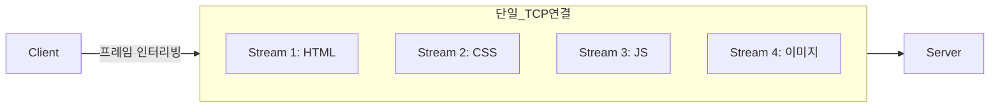

# HTTP 버전별 차이 (0.9 → 1.0 → 1.1 → 2 → 3)

> 최종 업데이트: 2026-05-17 | 기준: HTTP/1.1 (RFC 9110~9112), HTTP/2 (RFC 9113), HTTP/3 (RFC 9114), QUIC (RFC 9000)

## 개념

HTTP는 30년 넘게 진화해 왔지만 **"요청-응답"이라는 의미(semantics)는 그대로 유지**하면서, 그 메시지를 **어떻게 전송하느냐(transport/wire format)** 만 계속 바꿔 왔다. 버전별 차이의 핵심은 거의 전부 **"한 연결로 얼마나 빠르고 효율적으로 여러 요청을 처리하는가"**, 그리고 그 과정에서 생기는 **Head-of-Line(HOL) 블로킹을 어느 계층에서 해소했는가**로 압축된다.

> 비유하자면 같은 "편지(요청/응답 의미)"를 보내는데, 우편 시스템이 **손편지(0.9) → 봉투+소포(1.0) → 같은 배달부 재사용(1.1) → 트럭 한 대에 여러 소포 동시 적재(2) → 도로 자체를 새로 깐 것(3, QUIC)** 으로 발전한 것.

## 배경/역사

| 버전 | 연도 | RFC | 한 줄 요약 |
|------|------|-----|-----------|
| **0.9** | 1991 | (비공식) | GET 한 줄, 헤더·상태코드 없음 |
| **1.0** | 1996 | 1945 | 헤더·상태코드·메서드 도입, 연결당 1요청 |
| **1.1** | 1997 | 2068→2616→9110~9112 | Keep-Alive, Host 필수, chunked, 캐시 |
| **2** | 2015 | 7540→9113 | 바이너리 프레임, 멀티플렉싱, HPACK |
| **3** | 2022 | 9114 | QUIC(UDP) 기반, TCP HOL 블로킹 제거 |

- HTTP/2는 Google의 실험 프로토콜 **SPDY**(2009)를 표준화한 것
- HTTP/3의 전송 계층 **QUIC** 역시 Google이 2012년부터 실험(gQUIC) → IETF 표준화
- 2025년 기준 웹 트래픽은 **HTTP/2가 다수, HTTP/3가 빠르게 확산**, HTTP/1.1은 내부 통신·레거시·디버깅 용도로 여전히 광범위

## HTTP/0.9 — 원시 형태

```http
GET /index.html
```

- **요청**: `GET <path>` 한 줄이 전부. 메서드는 GET만 존재
- **응답**: HTML 본문만. **헤더·상태 코드·Content-Type 없음**
- 요청 후 서버가 연결을 즉시 닫음 → 자원 1개당 연결 1개
- 의의: "하이퍼텍스트를 가져온다"는 최소 개념의 증명

## HTTP/1.0 — 헤더의 등장

```http
GET /index.html HTTP/1.1
User-Agent: Mozilla/5.0
Accept: text/html

HTTP/1.0 200 OK
Content-Type: text/html
Content-Length: 137
```

추가된 것:

- **버전 명시**(`HTTP/1.0`), **상태 코드**(`200`, `404`…)
- **헤더** 도입 → `Content-Type`으로 이미지·JSON 등 임의 데이터 전송 가능
- `POST`, `HEAD` 메서드 추가

한계:

- **연결당 요청 1개** — 매 자원마다 TCP 연결·해제(3-way handshake) 반복 → 이미지 많은 페이지에서 치명적
- (비표준) `Connection: keep-alive`로 우회 시도했으나 표준 아님
- **`Host` 헤더 없음** → 한 IP에 가상 호스트 여러 개 운영 불가

## HTTP/1.1 — 연결 재사용의 시대

HTTP/1.1은 현재까지도 **가장 널리 쓰이는 버전**이며, 사실상 "HTTP의 기본형".

### 1. Persistent Connection (Keep-Alive)

- TCP 연결을 **기본으로 재사용** (`Connection: close`로 명시적 종료)
- 매 요청마다의 3-way handshake·TLS 핸드셰이크 비용 제거

### 2. Pipelining (제한적)

- 응답을 기다리지 않고 **여러 요청을 연달아** 전송
- 그러나 응답은 **요청 순서대로** 와야 함 → **HOL 블로킹 발생**
- 앞 요청이 느리면 뒤 요청 응답이 전부 지연 → 실패작으로 평가, 대부분 브라우저가 기본 비활성화

### 3. Host 헤더 필수

```http
GET /index.html HTTP/1.1
Host: www.example.com    // 필수 — 가상 호스팅의 기반
```

- 한 IP·포트에서 도메인별로 다른 사이트 서빙 → **이름 기반 가상 호스팅** 가능

### 4. Chunked Transfer Encoding

```http
HTTP/1.1 200 OK
Transfer-Encoding: chunked

7\r\n
Mozilla\r\n
0\r\n
\r\n
```

- 전체 크기를 모를 때 **조각(chunk) 단위로 스트리밍** 전송
- `Content-Length` 없이도 응답 가능 → 동적 생성 콘텐츠·SSE의 기반

### 5. 그 외

- 캐시 제어 정교화(`Cache-Control`, `ETag`, `If-None-Match`)
- `OPTIONS`, `PUT`, `DELETE`, `TRACE`, `CONNECT` 메서드
- `100 Continue` (대용량 바디 전송 전 사전 확인)

### HTTP/1.1의 근본 한계

- **HOL 블로킹(애플리케이션 계층)** — 한 연결에서 요청이 직렬 처리됨
- 우회책으로 브라우저는 **도메인당 6개 연결**을 동시에 염 → 연결 수 폭증, 헤더 중복
- **헤더가 매번 평문 반복 전송** — 쿠키 등으로 요청당 수 KB 낭비
- 이를 피하려 **도메인 샤딩, 스프라이트 이미지, 인라이닝** 같은 안티패턴이 성행

## HTTP/2 — 한 연결, 멀티플렉싱

HTTP/2는 **의미(메서드·헤더·상태코드)는 1.1과 동일**하게 두고 **전송 방식만** 전면 교체했다. 그래서 애플리케이션 코드는 대부분 바꿀 필요가 없다.

### 1. 바이너리 프레이밍 (Binary Framing)

- 텍스트 → **바이너리 프레임**으로 인코딩
- 메시지는 **`HEADERS` 프레임 + `DATA` 프레임**으로 분해
- 파싱이 빠르고 오류에 강함

### 2. 멀티플렉싱 (Multiplexing) — 핵심



- 하나의 TCP 연결 안에서 **여러 스트림(Stream)** 이 동시 진행
- 각 요청/응답은 독립된 스트림 ID를 가진 프레임으로 **잘게 쪼개져 섞여(interleaving)** 전송
- **애플리케이션 계층 HOL 블로킹 해소** → 도메인 샤딩·스프라이트 등 안티패턴 불필요

### 3. HPACK 헤더 압축

- 헤더를 **정적/동적 테이블 + 허프만 인코딩**으로 압축
- 반복되는 헤더(쿠키, User-Agent 등)는 인덱스 번호만 전송 → 요청당 수 KB → 수 바이트

### 4. Server Push

- 클라이언트가 요청하지 않은 자원(예: HTML과 함께 필요한 CSS)을 서버가 **선제 전송**
- 캐시 무효화·예측 실패 문제로 실효성 논란 → **Chrome 106(2022)에서 폐기**, 현재는 사실상 사용 안 함 (대안: `103 Early Hints`)

### 5. 스트림 우선순위

- 스트림에 가중치·의존성을 부여해 중요한 자원(HTML/CSS)을 먼저 전송하도록 힌트

### HTTP/2의 남은 한계 — TCP HOL 블로킹

- 애플리케이션 계층 HOL은 풀었지만, **전송 계층(TCP)** 의 HOL은 여전히 존재
- TCP는 **순서 보장 바이트 스트림** → 패킷 하나가 유실되면, 그 뒤에 도착한 (다른 스트림의) 정상 패킷까지 **재전송될 때까지 전부 대기**
- 즉 멀티플렉싱이 무색해짐. 손실률 높은 모바일·무선에서 특히 체감 → **HTTP/3가 해결하려는 바로 그 문제**

## HTTP/3 — 전송 계층을 갈아엎다 (QUIC)

HTTP/3는 TCP를 버리고 **UDP 위에 새로 만든 전송 프로토콜 QUIC**를 쓴다. "HTTP를 QUIC 위에 매핑한 것"이 HTTP/3.

### 1. QUIC = UDP 기반 + 신뢰성·보안 내장

| 계층 | HTTP/2 | HTTP/3 |
|------|--------|--------|
| 애플리케이션 | HTTP/2 | HTTP/3 |
| 보안 | TLS 1.2/1.3 (별도) | **TLS 1.3 내장** |
| 전송 | TCP | **QUIC** |
| 네트워크 | IP | UDP → IP |

- 신뢰성(재전송·순서)·혼잡 제어를 **QUIC이 사용자 공간에서 직접 구현** → OS 커널/네트워크 장비 의존 없이 빠른 진화 가능

### 2. 스트림별 독립 — TCP HOL 블로킹 제거

- QUIC은 **스트림마다 독립적인 순서·재전송 관리**
- 한 스트림의 패킷이 유실돼도 **다른 스트림은 영향 없이 계속 진행**
- HTTP/2가 못 푼 전송 계층 HOL 블로킹을 근본 해소

### 3. 연결 수립 0-RTT / 1-RTT

- TCP+TLS는 연결에 보통 **2~3 RTT** 필요
- QUIC은 핸드셰이크와 TLS를 통합 → **1-RTT**, 재방문 시 **0-RTT**(첫 패킷에 데이터 동봉)

### 4. Connection Migration (연결 마이그레이션)

- 연결을 IP·포트가 아닌 **Connection ID**로 식별
- Wi-Fi ↔ LTE 전환 등으로 IP가 바뀌어도 **연결 유지** (TCP는 끊겨 재수립 필요)

### 5. QPACK 헤더 압축

- HTTP/2의 HPACK을 QUIC의 비순차 스트림 특성에 맞게 재설계한 헤더 압축

### HTTP/3의 현실적 제약

- **UDP 차단·QoS 저하** — 일부 기업 방화벽·NAT가 UDP를 막거나 throttle → TCP로 폴백 필요
- **CPU 사용량** — 암호화·혼잡제어가 사용자 공간이라 고트래픽 서버에서 CPU 부담 증가 가능
- **운영 성숙도** — 디버깅 도구·관측성이 TCP 생태계만큼 성숙하진 않음(개선 중)

## Head-of-Line 블로킹 — 계층별 정리

HTTP 진화사를 관통하는 단 하나의 키워드. 어느 버전이 어느 계층의 HOL을 풀었는지가 핵심.

| 버전 | 애플리케이션 계층 HOL | 전송(TCP/QUIC) 계층 HOL |
|------|---------------------|------------------------|
| HTTP/1.1 (pipelining) | **있음** (응답 순서 강제) | 있음 |
| HTTP/2 | **없음** (스트림 멀티플렉싱) | **있음** (TCP 순서 보장) |
| HTTP/3 | 없음 | **없음** (QUIC 스트림 독립) |

## 버전별 비교 총정리

| 항목 | 1.0 | 1.1 | 2 | 3 |
|------|-----|-----|---|---|
| 전송 | TCP | TCP | TCP | **QUIC/UDP** |
| 연결 재사용 | X | **O (Keep-Alive)** | O | O |
| 동시 요청 | 연결 1개당 1개 | 직렬(파이프라인 한계) | **멀티플렉싱** | 멀티플렉싱(독립) |
| 메시지 포맷 | 텍스트 | 텍스트 | **바이너리** | 바이너리 |
| 헤더 압축 | X | X | **HPACK** | **QPACK** |
| 보안 | 별도 TLS | 별도 TLS | 별도 TLS | **TLS 1.3 내장** |
| 연결 수립 RTT | 1+ | 1+ | 1+ | **0~1 RTT** |
| HOL 블로킹 | 연결 한계 | 앱 계층 | 전송 계층 | **없음** |
| Host 헤더 | 없음 | **필수** | 의사헤더 `:authority` | `:authority` |

## 실무에서 알아야 할 것

- **HTTP/2 적용은 보통 무중단** — 의미가 1.1과 같아 애플리케이션 코드 변경 거의 불필요. 사실상 **TLS + 서버/LB 설정** 문제 (브라우저는 HTTPS에서만 h2 사용)
- **HTTP/2 도입 시 도메인 샤딩·스프라이트는 제거**해야 효과 — 그대로 두면 멀티플렉싱 이점이 상쇄됨
- **업그레이드 협상** — HTTPS에서는 TLS의 **ALPN**으로 `h2`/`http/1.1` 협상. HTTP/3는 응답 헤더 **`Alt-Svc: h3=":443"`** 광고 후 클라이언트가 다음 연결을 QUIC으로 전환
- **내부 통신은 여전히 HTTP/1.1이 흔함** — 디버깅 용이성·도구 호환성 때문. 성능이 중요한 서비스 간 통신은 [[gRPC]](HTTP/2) 채택
- **로드밸런서·CDN 종단점 확인** — 클라이언트↔CDN은 h3인데 CDN↔오리진은 h1인 경우가 흔함. 끝단 성능만 보고 전 구간을 가정하면 안 됨
- **gRPC는 HTTP/2 필수** — HTTP/1.1로 폴백 불가. 프록시·LB가 h2 end-to-end를 지원하는지 반드시 확인
- **HTTP/3 도입 전 UDP 경로 점검** — 사내망·일부 통신사에서 UDP/443이 막히면 자동 폴백되지만 그만큼 이점이 사라짐

## 관련 문서

- [HTTP.md](HTTP.md) — HTTP 기본 개념·메서드·상태코드·헤더
- [../WebSocket/WebSocket.md](../WebSocket/WebSocket.md) — HTTP 업그레이드로 시작하는 양방향 통신
- [../SSE/SSE-(Server-Sent-Events).md](../SSE/SSE-%28Server-Sent-Events%29.md) — chunked 기반 서버 푸시
- [../gRPC.md](../gRPC.md) — HTTP/2 기반 RPC
- [../HTTP-vs-SSE-vs-WebSocket-비교.md](../HTTP-vs-SSE-vs-WebSocket-비교.md)
- [../../Network-Model.md](../../Network-Model.md) — TCP/UDP·계층 모델
