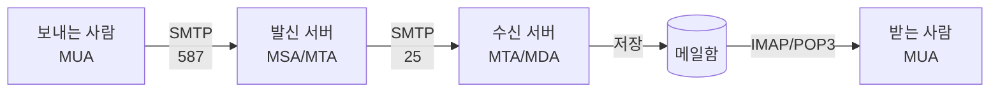

# SMTP (Simple Mail Transfer Protocol)

> 최종 업데이트: 2026-05-10 | 기준: RFC 5321 (SMTP), RFC 6409 (Submission), RFC 3207 (STARTTLS)

## 개념

**SMTP**는 **이메일을 송신할 때** 사용하는 텍스트 기반의 표준 프로토콜이다. 메일 클라이언트가 메일 서버로 메일을 제출(submit)하거나, 메일 서버 사이에서 메일을 전달(relay)할 때 사용된다.

> 비유하자면 "이메일 세계의 우체부". 편지(메일)를 받아 발신지 우체국 → 수신지 우체국까지 배달하는 역할을 담당한다. 단, 받는 사람이 우체통(메일함)에서 편지를 꺼내 읽는 행위는 IMAP/POP3가 담당한다.

## 배경/역사

- **표준 제정**: 1982년, RFC 821 (Jonathan B. Postel) — 초기 SMTP 정의
- **현재 표준**: 2008년, **RFC 5321** — 확장 SMTP(ESMTP) 포함 통합본
- **이름의 유래**: "Simple" — 당시 X.400 같은 복잡한 메일 표준에 비해 단순함을 강조
- **확장 표준 ESMTP**: 1995년 RFC 1869 — `EHLO` 명령으로 서버가 지원하는 확장 기능을 광고할 수 있게 함
- **주요 흐름**: 평문 → SMTP-AUTH(인증) → STARTTLS(암호화) → SPF/DKIM/DMARC(스푸핑 방지) 순으로 보안이 누적되어 왔다

## 이메일 시스템 구성 요소

SMTP를 이해하려면 메일이 거치는 4가지 구성 요소를 먼저 봐야 한다.

| 약어 | 풀네임 | 역할 | 예시 |
|------|--------|------|------|
| **MUA** | Mail User Agent | 사용자가 직접 쓰는 메일 클라이언트 | Gmail 웹, Outlook, Thunderbird |
| **MSA** | Mail Submission Agent | MUA로부터 메일을 제출받는 서버 (587 포트) | Gmail SMTP 서버 |
| **MTA** | Mail Transfer Agent | 메일 서버 간 중계 담당 (25 포트) | Postfix, Sendmail |
| **MDA** | Mail Delivery Agent | 최종 수신자 메일함에 저장 | Dovecot |

## 메일 전달 흐름



- **A → B**: 사용자 인증을 거친 **메일 제출(Submission)**, 587 포트
- **B → C**: 서버 간 **메일 중계(Relay)**, 25 포트
- **D → E**: 메일 수신은 SMTP가 아닌 **IMAP/POP3**

## 포트

| 포트 | 용도 | 보안 | 권장 여부 |
|------|------|------|----------|
| **25** | MTA 간 중계 (서버 ↔ 서버) | 보통 평문 또는 STARTTLS | 클라이언트는 사용 ❌ (대부분 ISP가 차단) |
| **587** | **MSA 제출 (클라이언트 → 서버)** | STARTTLS 권장 | ✅ 클라이언트는 이걸 사용 |
| **465** | SMTPS — 처음부터 TLS로 시작 | TLS 필수 (Implicit) | 일부 환경에서 587 대안 |
| **2525** | 비표준 대체 포트 | TLS | 25/587 차단 시 우회용 |

> 587(STARTTLS)이 표준, 465(SMTPS)는 비공식이었으나 RFC 8314(2018)에서 권장 부활.

## SMTP 명령어와 세션

SMTP는 **텍스트 기반**이라 사람이 읽을 수 있다. 주요 명령어는 다음과 같다.

| 명령어 | 역할 |
|--------|------|
| `HELO` / `EHLO` | 클라이언트 자기소개 (EHLO는 ESMTP — 서버 확장 기능 조회) |
| `MAIL FROM` | 발신자 주소 지정 |
| `RCPT TO` | 수신자 주소 지정 (여러 번 가능) |
| `DATA` | 메일 본문 전송 시작, `.` 한 줄로 종료 |
| `STARTTLS` | 평문 연결을 TLS로 업그레이드 |
| `AUTH` | 인증 (PLAIN, LOGIN, CRAM-MD5 등) |
| `QUIT` | 세션 종료 |

### 실제 세션 예시

```
S: 220 smtp.example.com ESMTP ready
C: EHLO client.example.com
S: 250-smtp.example.com Hello
S: 250-STARTTLS
S: 250 AUTH PLAIN LOGIN
C: STARTTLS
S: 220 Ready to start TLS
... (TLS 핸드셰이크) ...
C: AUTH PLAIN <base64-credentials>
S: 235 Authentication successful
C: MAIL FROM:<alice@example.com>
S: 250 OK
C: RCPT TO:<bob@example.org>
S: 250 OK
C: DATA
S: 354 End data with <CR><LF>.<CR><LF>
C: Subject: Hello
C:
C: 안녕하세요.
C: .
S: 250 OK queued as 12345
C: QUIT
```

## 응답 코드

HTTP 상태코드처럼 3자리 숫자로 응답한다.

| 첫자리 | 의미 | 예시 |
|--------|------|------|
| **2xx** | 성공 | `250 OK` |
| **3xx** | 추가 입력 필요 | `354 Start mail input` |
| **4xx** | 일시적 실패 (재시도 가능) | `421 Service unavailable`, `450 Mailbox busy` |
| **5xx** | 영구 실패 (재시도 무의미) | `550 No such user`, `554 Spam rejected` |

## 보안 메커니즘

SMTP 자체는 평문이라 다양한 보안 계층이 추가되어 발전했다.

| 메커니즘 | 역할 | 비고 |
|---------|------|------|
| **STARTTLS** | 평문 연결을 TLS로 업그레이드 | RFC 3207, 587 포트 표준 |
| **SMTPS (Implicit TLS)** | 처음부터 TLS로 연결 | 465 포트 |
| **SMTP-AUTH** | 발신자 인증 | RFC 4954 — PLAIN/LOGIN/OAUTH2 등 |
| **SPF** | 발신 IP가 도메인 소유자가 허용한 IP인지 검증 | DNS TXT 레코드 |
| **DKIM** | 메일에 도메인 개인키로 서명, 변조 검증 | DNS에 공개키 게시 |
| **DMARC** | SPF/DKIM 실패 시 정책(quarantine/reject) 결정 | DNS 정책 게시 |

> **백엔드 입장에서 메일이 스팸으로 빠지면** 대부분 SPF/DKIM/DMARC 설정 누락이 원인. 발송 도메인의 DNS 설정을 먼저 확인해야 한다.

## 관련 프로토콜 (메일 수신)

SMTP는 **송신 전용**. 메일을 읽으려면 다른 프로토콜이 필요하다.

| 프로토콜 | 방향 | 동작 방식 | 권장 사용 |
|---------|------|----------|----------|
| **SMTP** | 송신 (Push) | 서버로 메일을 밀어 넣음 | 메일 보내기 |
| **POP3** | 수신 (Pull) | 서버에서 다운로드 후 보통 삭제 | 단일 기기 사용 (구식) |
| **IMAP** | 수신 (Pull) | 서버에 보관하며 동기화 | 다중 기기 동기화 (현재 표준) |

## 백엔드 개발자 관점 실무 포인트

- **클라이언트 포트는 587 + STARTTLS** — 25 포트는 ISP/클라우드 제공자가 차단하므로 애플리케이션에서 직접 25로 보내면 실패한다
- **SPF/DKIM/DMARC는 코드가 아니라 DNS** — 라이브러리 설정이 아니라 발신 도메인의 DNS TXT 레코드로 관리. 인프라/도메인 담당자와 협업 필수
- **자체 SMTP 서버 운영은 지양** — IP 평판(reputation) 관리가 매우 어려워 메일이 스팸함으로 빠진다. **AWS SES, SendGrid, Mailgun, Postmark** 같은 전문 서비스 사용 권장
- **재시도 정책** — 4xx 응답은 재시도 가능, 5xx는 영구 실패. 큐 기반 재시도(예: Spring Retry, Bull)와 dead-letter 처리 설계 필요
- **바운스(Bounce) 처리** — 발송 실패 메일이 발신자에게 되돌아오는 메일. 잘못된 주소가 누적되면 IP 평판이 깎이므로 hard bounce는 즉시 발송 리스트에서 제외
- **Rate Limit** — 대부분의 SMTP 제공자(Gmail, SES 등)는 분당/일별 발송량 제한이 있다. 대량 발송은 백오프와 큐잉 필수
- **Reply-To vs From** — `From`은 발신자 주소(SPF/DKIM 검증 대상), `Reply-To`는 회신받을 주소. 트랜잭셔널 메일은 보통 `noreply@` From + 실제 회신 주소를 Reply-To로 분리
- **트랜잭셔널 vs 마케팅 메일 분리** — 비밀번호 재설정 같은 트랜잭셔널 메일과 뉴스레터를 같은 IP/도메인으로 보내면 마케팅 차단에 트랜잭셔널까지 걸린다. **별도 발신 도메인/IP 분리**가 베스트 프랙티스

## 라이브러리/서비스 예시

### Java (Spring Boot)

```java
// build.gradle
implementation 'org.springframework.boot:spring-boot-starter-mail'
```

```java
@Autowired
private JavaMailSender mailSender;

public void send(String to, String subject, String body) {
    SimpleMailMessage msg = new SimpleMailMessage();
    msg.setTo(to);
    msg.setSubject(subject);
    msg.setText(body);
    mailSender.send(msg);
}
```

```yaml
# application.yml — Gmail SMTP 예시
spring:
  mail:
    host: smtp.gmail.com
    port: 587
    username: ${MAIL_USERNAME}
    password: ${MAIL_APP_PASSWORD}
    properties:
      mail.smtp.auth: true
      mail.smtp.starttls.enable: true
```

### Node.js

```javascript
// nodemailer
const transporter = nodemailer.createTransport({
  host: "smtp.example.com",
  port: 587,
  secure: false, // STARTTLS
  auth: { user: "...", pass: "..." }
});
```

### Python

```python
# 표준 라이브러리
import smtplib
from email.message import EmailMessage

msg = EmailMessage()
msg["Subject"] = "Hello"
msg["From"] = "alice@example.com"
msg["To"] = "bob@example.org"
msg.set_content("안녕하세요.")

with smtplib.SMTP("smtp.example.com", 587) as s:
    s.starttls()
    s.login(user, password)
    s.send_message(msg)
```

### 주요 SMTP 서비스

| 서비스 | 특징 |
|--------|------|
| **AWS SES** | 저렴(1000건당 $0.10), AWS 생태계 통합 |
| **SendGrid** | 마케팅+트랜잭셔널 통합, 분석 강력 |
| **Mailgun** | 개발자 친화적 API, 로그 추적 우수 |
| **Postmark** | 트랜잭셔널 전문, 도달률 우수 |
| **Gmail SMTP** | 개인/소규모, 일일 발송 한도 낮음(500건) |

## 관련 문서

- [Network Protocol.md](../Network-Protocol.md)
- [프로토콜의 구성 요소.md](프로토콜의%20구성%20요소.md)
- [DNS.md](../DNS.md) — SPF/DKIM/DMARC는 DNS TXT 레코드로 설정
