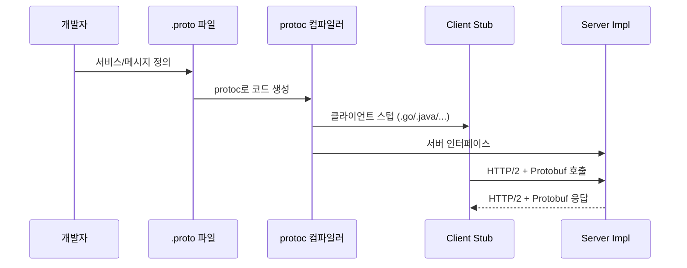

# gRPC

> 최종 업데이트: 2026-05-13 | 기준: gRPC 1.x, Protocol Buffers 3 (proto3)

## 개념

**gRPC**(gRPC Remote Procedure Call)는 Google이 만든 **오픈소스 RPC 프레임워크**로, **HTTP/2를 전송 계층**, **Protocol Buffers(Protobuf)를 IDL/직렬화 포맷**으로 사용한다. 클라이언트가 마치 로컬 함수처럼 원격 서버의 메서드를 호출할 수 있고, 그 호출은 HTTP/2 위에서 바이너리 메시지로 오간다.

> 비유하자면 REST가 "주소(URL)에 편지(JSON)를 보내고 응답을 받는" 우편 시스템이라면, gRPC는 **"같은 회사 내선 전화로 동료 함수를 직접 호출"** 하는 느낌이다. 사용자는 함수 호출만 알면 되고, 네트워크·직렬화는 프레임워크가 처리한다.

## 배경/역사

- **2001~** — Google 내부에서 **Stubby**라는 RPC 시스템을 10년 이상 사용. 수천 개 마이크로서비스 간 통신의 표준이었음
- **2015-02** — Google이 Stubby를 일반화하여 **gRPC v1.0**을 오픈소스로 공개
- **2017** — **CNCF(Cloud Native Computing Foundation)** 에 기증 → Kubernetes, etcd, Envoy 등과 함께 클라우드 네이티브 표준 도구로 자리잡음
- 이름의 'g'는 공식적으로는 **"gRPC Remote Procedure Calls"** 의 재귀 약자이지만, 버전마다 "good/green/glorious…" 등으로 농담처럼 바뀌어 왔다 (`g_stands_for.md` 파일이 깃허브 레포에 있음)
- 주요 채택 사례: **Google, Netflix, Square, Cisco, CoreOS(etcd), Kubernetes 내부 컴포넌트**

## 핵심 구성 요소

| 구성 요소 | 역할 |
|----------|------|
| **Protocol Buffers** | IDL(인터페이스 정의) + 바이너리 직렬화 포맷. `.proto` 파일로 서비스·메시지 정의 |
| **HTTP/2** | 전송 계층. 멀티플렉싱·헤더 압축·서버 푸시 등 활용 |
| **Stub** | 클라이언트가 호출하는 자동 생성 코드. 원격 함수를 로컬 함수처럼 노출 |
| **Service** | 서버 측 인터페이스 구현체. `.proto`에 정의된 메서드를 실제 코드로 구현 |
| **Channel** | 클라이언트-서버 간 논리적 연결. HTTP/2 커넥션 풀을 관리 |

### Protocol Buffers — 왜 JSON이 아닌가?

- **바이너리 포맷** → JSON 대비 페이로드 3~10배 작음
- **스키마 기반** → 컴파일 타임에 타입 검증, IDE 자동완성 가능
- **다국어 코드 생성** → 하나의 `.proto`로 Go/Java/Python/C++/Kotlin 등 스텁 자동 생성
- 단점: **사람이 읽기 어렵고**, 디버깅 시 별도 도구 필요 (e.g. `grpcurl`)

### HTTP/2를 쓰는 이유

- **멀티플렉싱** — 하나의 TCP 연결에서 여러 요청 동시 처리 (HoL Blocking 완화)
- **양방향 스트리밍** — 서버·클라이언트 모두 능동적으로 메시지 푸시 가능
- **헤더 압축(HPACK)** — 반복 호출 시 헤더 오버헤드 최소화
- **바이너리 프레이밍** — Protobuf와 자연스럽게 맞물림

## 4가지 통신 방식

gRPC는 `.proto`에서 메서드 시그니처에 `stream` 키워드를 붙이는 것만으로 4가지 RPC 패턴을 지원한다.

| 방식 | 클라이언트 → 서버 | 서버 → 클라이언트 | 대표 사례 |
|------|------------------|-------------------|-----------|
| **Unary** | 1개 | 1개 | 일반 API 호출 (`GetUser`) |
| **Server streaming** | 1개 | N개 | 실시간 시세, 대용량 다운로드 |
| **Client streaming** | N개 | 1개 | 로그 업로드, 파일 청크 전송 |
| **Bidirectional streaming** | N개 | N개 | 채팅, 음성 인식, 협업 편집 |

```protobuf
// Unary
rpc GetUser (UserRequest) returns (UserResponse);

// Server streaming
rpc ListUsers (Filter) returns (stream User);

// Client streaming
rpc UploadLogs (stream LogEntry) returns (UploadResult);

// Bidirectional streaming
rpc Chat (stream Message) returns (stream Message);
```

## 동작 흐름



1. **`.proto` 파일에 서비스·메시지 정의**
2. **`protoc` 컴파일러**가 각 언어별 스텁/서버 인터페이스 생성
3. 서버는 인터페이스를 **구현(implement)**, 클라이언트는 스텁을 **호출(invoke)**
4. 실제 호출은 HTTP/2 위에서 Protobuf 바이너리 메시지로 송수신

## 코드 예시

### 1. `.proto` 파일 정의

```protobuf
syntax = "proto3";
package user;

option java_package = "com.example.user";

service UserService {
  rpc GetUser (UserRequest) returns (UserResponse);
}

message UserRequest {
  int64 user_id = 1;
}

message UserResponse {
  int64 user_id = 1;
  string name  = 2;
  string email = 3;
}
```

### 2. 코드 생성 (Java/Maven 기준)

```bash
# protoc 직접 실행
protoc --java_out=. --grpc-java_out=. user.proto

# Gradle/Maven 플러그인이 일반적
# mvn compile  (protobuf-maven-plugin이 자동 실행)
```

### 3. 서버 구현 (Java)

```java
public class UserServiceImpl extends UserServiceGrpc.UserServiceImplBase {
    @Override
    public void getUser(UserRequest req, StreamObserver<UserResponse> obs) {
        UserResponse res = UserResponse.newBuilder()
            .setUserId(req.getUserId())
            .setName("홍길동")
            .setEmail("hong@example.com")
            .build();
        obs.onNext(res);
        obs.onCompleted();
    }
}
```

### 4. 클라이언트 호출 (Java)

```java
ManagedChannel channel = ManagedChannelBuilder
    .forAddress("localhost", 50051)
    .usePlaintext()  // 운영에서는 TLS 사용
    .build();

UserServiceGrpc.UserServiceBlockingStub stub =
    UserServiceGrpc.newBlockingStub(channel);

UserResponse res = stub.getUser(
    UserRequest.newBuilder().setUserId(1L).build()
);
```

### 5. 서버 스트리밍 예시

```java
// 서버
@Override
public void listUsers(Filter req, StreamObserver<User> obs) {
    for (User u : repository.findAll(req)) {
        obs.onNext(u);   // 여러 번 호출 가능
    }
    obs.onCompleted();
}

// 클라이언트
stub.listUsers(filter).forEachRemaining(user -> {
    System.out.println(user.getName());
});
```

## REST vs gRPC

| 항목 | REST (HTTP/1.1 + JSON) | gRPC (HTTP/2 + Protobuf) |
|------|------------------------|--------------------------|
| **포맷** | 텍스트(JSON) | 바이너리(Protobuf) |
| **계약** | OpenAPI 등 별도 정의 | `.proto`가 곧 계약 (필수) |
| **코드 생성** | 선택 (openapi-generator 등) | 필수, 공식 도구 제공 |
| **스트리밍** | 단방향(SSE)·WebSocket 별도 | 4가지 RPC 패턴 내장 |
| **브라우저 직접 호출** | 가능 | **불가** (gRPC-Web 필요) |
| **사람이 디버깅** | curl로 쉬움 | `grpcurl` 등 도구 필요 |
| **성능** | 보통 | **빠름** (작은 페이로드, HTTP/2) |
| **에러 표현** | HTTP 상태 코드 | gRPC Status Code (16개) |
| **대표 용도** | 외부 공개 API | **내부 서비스 간 통신** |

> 정리: **외부(브라우저/모바일/3rd-party)에는 REST**, **내부 서비스 간에는 gRPC**가 일반적인 조합. 둘은 대체재가 아니라 보완재.

## 인증·보안

- **전송 보안**: 기본은 `usePlaintext()`이지만 운영에서는 **TLS** 사용이 표준
- **인증 방식**:
  - **Token 기반** — `Metadata`에 `Authorization: Bearer <jwt>` 추가
  - **mTLS** — 양방향 인증서 검증 (서비스 메시 환경에서 흔함)
  - **OAuth 2.0** — `CallCredentials`로 토큰 자동 주입
- **Interceptor**로 인증·로깅·트레이싱을 횡단 관심사로 분리 (Spring AOP·Express middleware와 유사)

```java
// 클라이언트 메타데이터에 토큰 부착
Metadata meta = new Metadata();
meta.put(Metadata.Key.of("authorization", ASCII_STRING_MARSHALLER),
         "Bearer " + token);
stub = MetadataUtils.attachHeaders(stub, meta);
```

## gRPC-Web — 브라우저 지원

브라우저는 HTTP/2 트레일러를 직접 다룰 수 없어 표준 gRPC를 그대로 호출할 수 없다. 이를 위한 변종이 **gRPC-Web**.

- 브라우저 ↔ **Envoy/프록시** 사이는 gRPC-Web(HTTP/1.1 또는 HTTP/2 호환)
- 프록시 ↔ 서버 사이는 일반 gRPC
- 한계: 클라이언트 스트리밍·양방향 스트리밍은 제한적 (서버 스트리밍은 가능)

## 흔한 함정

- **`.proto` 필드 번호는 절대 재사용하지 말 것** — 1, 2, 3 같은 태그는 와이어 포맷의 키. 삭제한 필드 번호를 새 의미로 쓰면 호환성 깨짐. `reserved 3;`로 막아두는 것이 안전
- **`required` 필드는 proto3에서 없어졌다** — 모든 필드가 optional. 누락 시 기본값(0, "", false) 반환되므로 "값이 있다/없다" 구분이 필요하면 `optional` 키워드 또는 wrapper 타입(`google.protobuf.StringValue`) 사용
- **메시지 크기 기본 한도 4MB** — 대용량 파일을 한 번에 보내려 하면 `RESOURCE_EXHAUSTED` 발생. 스트리밍 분할 또는 `maxInboundMessageSize` 조정
- **로드밸런서 호환성** — gRPC는 하나의 HTTP/2 커넥션을 오래 재사용하므로 L4 LB는 트래픽이 한 노드에 쏠림. **L7 LB(Envoy, Linkerd)** 또는 클라이언트 사이드 LB 필요
- **Keepalive 미설정 시 NAT 타임아웃** — 장시간 idle 후 첫 호출이 끊김. `keepAliveTime`/`keepAliveTimeout`을 명시적으로 설정
- **에러는 예외가 아니다** — gRPC Status는 16개의 표준 코드(`NOT_FOUND`, `UNAVAILABLE`, …). HTTP 4xx/5xx와 1:1 매핑되지 않으므로 별도 처리 필요

## 사용 사례

- **마이크로서비스 내부 통신** — Kubernetes 환경의 service-to-service
- **모바일 ↔ 백엔드** — Square, Netflix 등은 모바일 앱에서 직접 gRPC 사용
- **다국어 환경** — Go 서버 ↔ Python 분석 ↔ Java 클라이언트 등 폴리글랏
- **저지연·고처리량** — 게임 매치메이킹, 실시간 분석
- **인프라 도구** — etcd, Kubernetes API의 watch, Envoy xDS 등

## 관련 문서

- [[HTTP]] — gRPC의 전송 계층
- [[WebSocket]] — gRPC 양방향 스트리밍과 비교되는 양방향 통신
- [[REST]] — gRPC와 흔히 비교되는 외부 API 스타일
- [[프로토콜의-구성-요소]] — IDL·직렬화·전송 계층 관점
- [[데이터-전송-및-상호작용-방식]] — Sync/Async·1:1·1:N 등 통신 패러다임
- [[MSA란]] — 마이크로서비스 환경에서의 gRPC 활용
