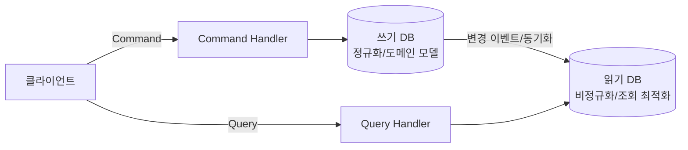

# CQRS (Command Query Responsibility Segregation)

> 최종 업데이트: 2026-05-16 | 기준: Greg Young/Udi Dahan 원전, Axon·Spring 사례

## 개념

**CQRS**는 데이터를 **변경하는 작업(Command)** 과 **조회하는 작업(Query)** 의 **모델을 분리**하는 아키텍처 패턴이다. 하나의 모델로 쓰기와 읽기를 모두 처리하던 전통적인 CRUD 방식과 달리, 쓰기 전용 모델과 읽기 전용 모델을 각각 따로 둔다.

> 비유하자면 **식당의 주방과 메뉴판**. 주문(Command)은 주방으로 가서 요리를 만들고, 손님이 보는 메뉴판(Query)은 보기 좋게 정리된 별도의 결과물이다. 주방 구조와 메뉴판 구성을 굳이 똑같이 맞출 필요가 없다 — 각자 목적에 맞게 최적화하면 된다.

핵심은 "하나의 모델이 쓰기와 읽기를 동시에 만족시키려다 보면 양쪽 다 어중간해진다"는 문제의식이다. 복잡한 도메인 로직이 필요한 쓰기와, 빠르고 다양한 형태가 필요한 읽기는 요구사항이 정반대이기 때문에 분리한다.

## 배경/역사

- **뿌리 — CQS**: Bertrand Meyer가 Eiffel 언어 맥락에서 제시한 **CQS(Command-Query Separation)** 원칙이 기반. "메서드는 상태를 바꾸거나(Command) 값을 반환하거나(Query) 둘 중 하나만 해야 한다"는 **메서드 레벨** 규칙.
- **명명자**: **Greg Young**이 2010년경 CQS를 **아키텍처 레벨**로 확장하며 "CQRS"라는 용어를 만들고 대중화했다. 본인은 2006년부터 이 아이디어를 이야기했다고 언급.
- **선구자 Udi Dahan**: 2008년 8월 블로그, 2009년 12월 [Clarified CQRS](http://udidahan.com/2009/12/09/clarified-cqrs/) 글에서 SOA와 결합한 형태를 먼저 정리. Young·Dahan 모두 당시 ALT.NET / DDD 커뮤니티의 핵심 인물이었고, 단일 발명이라기보다 그 시기의 집단적 산물(scenius)에 가깝다.
- **정착**: Martin Fowler가 2011년 [bliki: CQRS](https://martinfowler.com/bliki/CQRS.html)에서 상세히 기술하며 널리 알려짐.

## CQS vs CQRS

| 구분 | CQS | CQRS |
|------|-----|------|
| 적용 레벨 | **메서드** | **모델/아키텍처** |
| 주장 | 메서드는 명령 또는 조회 중 하나만 | 쓰기 모델과 읽기 모델을 분리 |
| 제안자 | Bertrand Meyer | Greg Young |
| 범위 | 코딩 규칙 | 시스템 설계 패턴 |

> CQRS는 CQS를 시스템 전체로 끌어올린 것이라고 보면 된다.

## 구조

CQRS는 한 가지 고정된 구현이 아니라 **분리 수준에 따라 스펙트럼**으로 존재한다.

| 레벨 | 쓰기/읽기 모델 | 데이터 저장소 | 복잡도 |
|------|--------------|-------------|--------|
| **1. 모델만 분리** | 별도 클래스/객체 | 단일 DB 공유 | 낮음 |
| **2. 저장소까지 분리** | 별도 모델 | 쓰기 DB + 읽기 DB(또는 뷰) | 중간 |
| **3. Event Sourcing 결합** | 이벤트 스트림 → 읽기 뷰 투영 | 이벤트 저장소 + 조회용 DB | 높음 |

대부분의 실무 도입은 **레벨 1~2**다. 레벨 3은 [Event Sourcing](Event-Sourcing.md)과 결합한 고급 형태로, CQRS의 필수 요소가 아니라 **선택적 조합**이라는 점이 자주 오해된다.

## 동작 흐름 (저장소 분리 기준)



쓰기 쪽에서 발생한 변경을 읽기 쪽 모델로 전파하는 동기화 과정이 핵심이며, 이 전파가 비동기일 경우 **최종 일관성(eventual consistency)** 을 받아들여야 한다.

## 코드로 보는 분리

**Command — 반환값 없이 상태만 변경**

```java
public record CreateOrderCommand(String userId, List<Long> itemIds) {}

@Service
class OrderCommandHandler {
    public void handle(CreateOrderCommand cmd) {   // void: 결과를 반환하지 않음
        Order order = Order.create(cmd.userId(), cmd.itemIds());
        orderRepository.save(order);               // 도메인 규칙·트랜잭션 집중
    }
}
```

**Query — 상태 변경 없이 조회 전용 모델 반환**

```java
public record OrderSummaryView(Long orderId, String status, int totalPrice) {}

@Service
class OrderQueryHandler {
    public List<OrderSummaryView> handle(String userId) {
        // 조인·계산을 미리 끝낸 비정규화 뷰를 그대로 반환 (도메인 객체 X)
        return orderViewRepository.findSummariesByUser(userId);
    }
}
```

핵심은 `Order`(쓰기 도메인 모델)와 `OrderSummaryView`(읽기 전용 모델)가 **서로 다른 클래스**라는 점이다.

## 장점과 비용

| 장점 | 비용/주의 |
|------|----------|
| 읽기·쓰기를 **독립적으로 스케일링** (읽기 부하가 큰 서비스에 유리) | 모델·코드가 **2벌**이 되어 복잡도·코드량 증가 |
| 읽기 모델을 조회 목적에 맞게 **비정규화/최적화** 가능 | 저장소 분리 시 **최종 일관성** 문제(쓰기 직후 조회 불일치) |
| 복잡한 쓰기 도메인 로직을 조회 관심사에서 격리 | **단순 CRUD 도메인에는 과도한 오버엔지니어링** |
| Event Sourcing·MSA와 자연스럽게 결합 | 동기화 파이프라인 운영 부담 |

> Martin Fowler의 경고: CQRS는 **도메인의 특정 부분(bounded context)에 한정해서** 써야 하며, 시스템 전체에 무분별하게 적용하면 위험하다.

## 언제 쓰는가

- 읽기와 쓰기의 **부하/요구사항 차이가 큰** 도메인 (예: 주문 생성은 적고 조회는 폭발적인 커머스)
- 쓰기 도메인 로직이 **복잡**하고, 조회는 **다양한 형태**로 빠르게 필요할 때
- [MSA](../../MSA/MSA란.md) 환경에서 서비스별 독립 확장이 필요할 때
- 이벤트 기반 시스템([Event Sourcing](Event-Sourcing.md), [메시지 브로커](../../Messaging-System/메시지-브로커.md))과 결합할 때

반대로 **CRUD로 충분한 단순 도메인이라면 도입하지 않는 것이 정답**이다. CQRS는 "기본 선택지"가 아니라 "특정 문제를 풀기 위한 도구"다.

## 관련 문서

- [Event-Sourcing.md](Event-Sourcing.md) — CQRS와 자주 결합되는 선택적 짝 패턴
- [REST-Architecture.md](REST-Architecture.md) — 또 다른 아키텍처 스타일
- [../../MSA/MSA란.md](../../MSA/MSA란.md) — 서비스별 독립 확장 맥락
- [../../Messaging-System/메시지-브로커.md](../../Messaging-System/메시지-브로커.md) — 읽기/쓰기 모델 동기화 전파 수단

---

**Sources**
- [Command Query Responsibility Segregation — Wikipedia](https://en.wikipedia.org/wiki/Command_Query_Responsibility_Segregation)
- [bliki: CQRS — Martin Fowler](https://martinfowler.com/bliki/CQRS.html)
- [Clarified CQRS — Udi Dahan](http://udidahan.com/2009/12/09/clarified-cqrs/)
- [CQRS is everywhere but few understand it (Part 1: Origins)](https://filipvalentin.github.io/blog/2024/09/cqrs-is-everywhere-but-few-understand-it)
