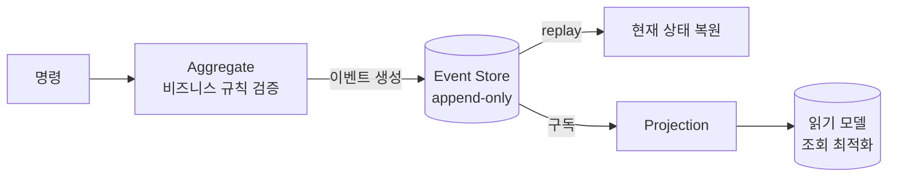

# Event Sourcing (이벤트 소싱)

> 최종 업데이트: 2026-05-16 | 기준: Martin Fowler 원전(2005), Greg Young 명명, Axon·Kafka 사례

## 개념

**Event Sourcing**은 데이터의 **현재 상태**가 아니라, 그 상태에 이르기까지 일어난 **모든 변경 이벤트의 시퀀스**를 저장하는 패턴이다. 현재 상태가 필요하면 처음부터 이벤트들을 순서대로 재생(replay)해서 계산한다.

> 비유하자면 **은행 통장**. 통장에는 "현재 잔고 50만 원"만 적힌 게 아니라 "입금 +30만", "출금 -10만"… 거래 내역이 전부 기록된다. 잔고는 그 내역을 모두 더한 **결과**일 뿐이다. 내역만 있으면 잔고는 언제든 다시 계산할 수 있다.

전통적인 방식(상태 저장)은 `UPDATE`로 이전 값을 덮어써서 **"어떻게 이 상태가 됐는지"가 사라진다**. Event Sourcing은 변경을 덮어쓰지 않고 **추가(append)만** 하므로 전체 이력이 보존된다.

## 배경/역사

- **원전 — Martin Fowler (2005)**: 2000년대 중반 이벤트 기반 시스템 패턴을 정리하며 [Event Sourcing](https://martinfowler.com/eaaDev/EventSourcing.html) 문서로 패턴을 공식화하고 기반 용어를 확립.
- **명명·대중화 — Greg Young**: "event sourcing"이라는 용어를 만들고, [CQRS](CQRS.md)를 제안하는 시점에 함께 실무 패턴으로 발전시켜 공개적으로 알림. Event Sourcing과 CQRS를 함께 정형화한 실무가로 평가됨.
- **현재**: DDD(도메인 주도 설계)·[MSA](../../MSA/MSA란.md)·이벤트 기반 아키텍처에서 핵심 기법으로 자리잡음. 전용 저장소(EventStoreDB/Kurrent)와 Axon Framework 등이 이를 직접 지원.

## 상태 저장 방식과의 비교

| 구분 | 상태 저장 (전통적 CRUD) | Event Sourcing |
|------|------------------------|----------------|
| 저장 대상 | **현재 상태** (덮어쓰기) | **변경 이벤트** (추가만) |
| 과거 이력 | 사라짐 | **전부 보존** |
| 현재 상태 | 바로 조회 | 이벤트 재생으로 계산 |
| 감사/추적 | 별도 로그 필요 | 본질적으로 내장 |
| 복잡도 | 낮음 | 높음 |

## 핵심 구성 요소

| 요소 | 역할 |
|------|------|
| **Event** | 과거에 일어난 사실. 불변(immutable), 과거형으로 명명 (`OrderPlaced`, `MoneyWithdrawn`) |
| **Event Store** | 이벤트를 append-only로 저장하는 저장소 (재생의 원천) |
| **Aggregate** | 이벤트를 적용해 현재 상태를 계산하는 도메인 객체 |
| **Snapshot** | 특정 시점 상태를 캐싱해 재생 비용을 줄이는 최적화 |
| **Projection** | 이벤트를 조회용 읽기 모델로 변환 ([CQRS](CQRS.md)의 읽기 측) |

## 동작 흐름



1. 명령이 들어오면 Aggregate가 비즈니스 규칙을 검증한다.
2. 통과하면 **이벤트를 생성**해 Event Store에 추가한다(상태를 직접 바꾸지 않음).
3. 현재 상태가 필요하면 해당 Aggregate의 이벤트들을 **재생**해 계산한다.
4. Projection이 이벤트를 구독해 조회용 읽기 모델을 갱신한다.

## 코드로 보는 핵심

**이벤트는 불변, 과거형**

```java
public record MoneyDeposited(String accountId, long amount, Instant occurredAt) {}
public record MoneyWithdrawn(String accountId, long amount, Instant occurredAt) {}
```

**상태는 이벤트를 접어서(fold) 계산**

```java
class Account {
    private long balance;

    void apply(MoneyDeposited e) { this.balance += e.amount(); }
    void apply(MoneyWithdrawn e) { this.balance -= e.amount(); }

    static Account replay(List<Object> events) {   // 이벤트 재생으로 현재 상태 복원
        Account acc = new Account();
        events.forEach(acc::applyEvent);
        return acc;
    }
}
```

**스냅샷 — 이벤트가 많아질 때의 최적화**

```text
이벤트 10,000개 전부 재생  → 느림
스냅샷(9,900 시점) + 이후 100개만 재생  → 빠름
```

## 장점과 비용

| 장점 | 비용/주의 |
|------|----------|
| **완전한 감사 로그**가 본질적으로 내장 (금융·이력 추적에 강점) | 이벤트가 쌓이면 **재생 비용 증가** → 스냅샷 필요 |
| 과거 어느 시점이든 상태 재구성 (시간 여행 디버깅) | **이벤트 스키마 변경**이 어려움 (과거 이벤트는 영원히 남음 → 버전·업캐스팅 필요) |
| 같은 이벤트로 **여러 읽기 모델** 파생 가능 | 조회가 즉시성이 아닌 **최종 일관성** 기반 |
| 비동기·분산([MSA](../../MSA/MSA란.md))과 자연스럽게 결합 | 학습 곡선·운영 복잡도 높음, 단순 CRUD엔 과함 |

## CQRS와의 관계

자주 묶이지만 **별개의 패턴**이다.

- **CQRS 없는 Event Sourcing**: 이벤트로 상태를 관리하되 조회도 재생으로 처리 — 조회 성능이 떨어져 실무에선 드묾.
- **Event Sourcing 없는 CQRS**: 쓰기/읽기 모델만 분리, 저장은 일반 DB — 흔한 형태.
- **둘의 결합**: 쓰기 측은 이벤트로 저장, Projection으로 [CQRS](CQRS.md)의 읽기 모델을 만든다 — 가장 강력하지만 가장 복잡한 조합.

> 즉 Event Sourcing은 CQRS의 **선택적 짝**이지 필수 전제가 아니다. 단순 도메인이라면 둘 다 도입하지 않는 것이 정답.

## 관련 문서

- [CQRS.md](CQRS.md) — 자주 결합되는 짝 패턴, 읽기 모델 분리
- [REST-Architecture.md](REST-Architecture.md) — 또 다른 아키텍처 스타일
- [../../MSA/MSA란.md](../../MSA/MSA란.md) — 분산 환경 적용 맥락
- [../../Messaging-System/메시지-브로커.md](../../Messaging-System/메시지-브로커.md) — 이벤트 전파/구독 수단

---

**Sources**
- [Event Sourcing — Martin Fowler](https://martinfowler.com/eaaDev/EventSourcing.html)
- [Event Sourcing Pattern — Azure Architecture Center](https://learn.microsoft.com/en-us/azure/architecture/patterns/event-sourcing)
- [Event Sourcing and CQRS — Kurrent](https://www.kurrent.io/blog/event-sourcing-and-cqrs)
