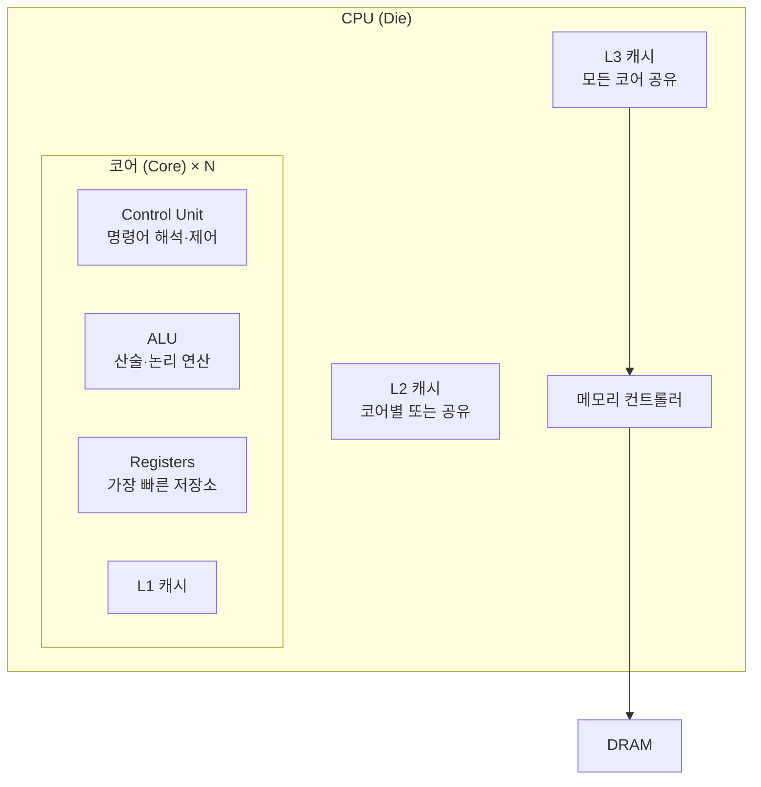
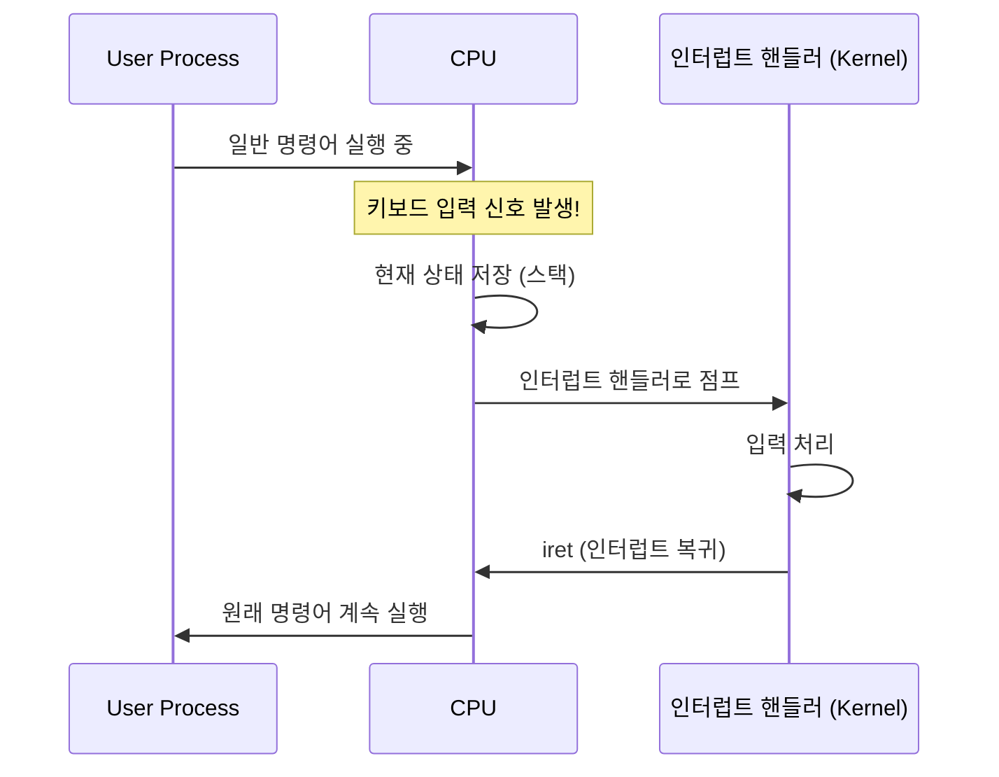

# CPU (Central Processing Unit)

> 최종 업데이트: 2026-06-07 | 기준: x86-64 / ARM64 일반, 멀티코어·하이퍼스레딩

## 개념

**CPU(Central Processing Unit, 중앙처리장치)** 는 컴퓨터의 **두뇌**다. 메모리에서 명령어를 가져와 해석하고, 산술·논리 연산을 수행하며, 결과를 다시 메모리에 쓴다. 모든 프로그램의 실행이 결국 CPU에서 일어난다.

> 비유하자면 **요리사**. 냉장고(디스크)에서 재료를 꺼내 → 작업대(메모리)에 올려 → 작업대 위 손 닿는 도구들(레지스터)을 써서 → 칼질·볶기 같은 실제 조리(연산)를 한다. 요리사가 빠르고 손이 많을수록(클럭↑, 코어↑) 같은 시간에 더 많은 요리(작업)를 해낼 수 있다.

핵심은 **명령어 실행**. 매 클럭 사이클마다 fetch(가져오기) → decode(해석) → execute(실행) → write-back(저장)을 반복한다. 현대 CPU는 이 과정을 **파이프라이닝**, **분기 예측**, **비순차 실행** 등으로 극도로 최적화했다.

> 같이 보면 좋은 문서: [Register.md](Register.md), [Memory.md](Memory.md), [Stack.md](Stack.md), [프로세스.md](프로세스.md), [OS-Thread.md](OS-Thread.md)

## 배경/역사

- **1945년**: **폰 노이만(John von Neumann)** 아키텍처 발표 — "프로그램과 데이터를 같은 메모리에 저장" 모델. 현재까지 거의 모든 CPU의 기본 사상
- **1971년**: Intel **4004** — 세계 최초의 상용 마이크로프로세서 (4bit, 740 kHz)
- **1978년**: Intel **8086** — x86 아키텍처의 시작 (16bit)
- **1985년**: Intel 386 — 32bit + 가상 메모리(페이징) 지원
- **1990년대**: RISC 진영(MIPS, SPARC, **ARM**) 부상. RISC vs CISC 논쟁
- **2003년 AMD64**: 64bit 확장, x86이 사실상 PC 표준 유지
- **2005년경**: 클럭 경쟁의 한계(발열·전력) → **멀티코어 시대** 개막. Intel Core Duo, AMD Athlon X2
- **2010년대~**: 모바일/저전력에서 ARM 압승. Apple Silicon(2020) 이후 데스크톱·서버까지 ARM 확산
- **현재**: x86-64는 데스크톱·서버 다수, ARM은 모바일 거의 전부 + 서버에서 빠르게 점유율 상승, RISC-V는 오픈 ISA로 성장

> 클럭(GHz)을 무한히 올리는 시대는 끝났다. 발열과 양자 효과 때문. 그래서 **코어 수와 효율로 승부**하는 게 현재 추세.

## CPU의 구성 요소



| 구성 요소 | 역할 |
|---|---|
| **Control Unit (CU)** | 명령어를 해석하고 다른 부품에 신호 보냄. CPU의 지휘자 |
| **ALU (Arithmetic Logic Unit)** | 덧셈·뺄셈·AND·OR 등 실제 연산 수행 |
| **FPU (Floating Point Unit)** | 부동소수점 연산 전담 |
| **Registers** | 가장 빠른 임시 저장소. 자세히 [Register.md](Register.md) |
| **L1/L2/L3 Cache** | 메모리 접근을 줄이기 위한 빠른 저장소 |
| **MMU (Memory Management Unit)** | 가상↔물리 주소 변환 |
| **메모리 컨트롤러** | DRAM과의 통신 담당 |

## 명령어 실행 사이클

CPU가 한 명령어를 처리하는 기본 단계.


| 단계 | 설명 |
|---|---|
| **Fetch** | Program Counter(PC)가 가리키는 메모리에서 명령어를 가져옴 |
| **Decode** | 명령어를 해석. 어떤 연산, 어떤 레지스터/메모리를 쓸지 파악 |
| **Execute** | ALU·FPU에서 실제 연산 수행 |
| **Memory** | 필요하면 메모리에서 데이터 읽기·쓰기 |
| **Write-back** | 결과를 레지스터에 저장 |

> 이 5단계를 **파이프라이닝**으로 **동시에 굴린다** — 한 명령어가 끝날 때까지 다음을 안 가져오는 게 아니라, **매 클럭마다 새 명령어를 fetch 시작**해서 여러 단계가 한 클럭 안에 함께 진행된다. 자세히는 아래 [파이프라이닝](#파이프라이닝) 절.

## 클럭 / 코어 / 스레드 / 하이퍼스레딩

CPU 성능을 가르는 4가지 축.

### 클럭 (Clock)

**CPU의 심장박동.** CPU 내부의 모든 회로가 일사불란하게 움직이도록 동기화시키는 **일정 주기의 사각파 신호**다. 1초에 몇 번 째깍이느냐가 곧 GHz.

```
클럭 신호:  _‾|_‾|_‾|_‾|_‾|_‾|_‾|
사이클 #:    1   2   3   4   5   6   7
            ↑   ↑   ↑   ↑   ↑   ↑   ↑
       매 상승 엣지마다 모든 회로가 한 칸 전진
```

- **3 GHz = 초당 30억 사이클** (한 사이클 ≈ 0.33 ns)
- 매 째깍마다 파이프라인의 모든 단계가 **동시에** 한 칸씩 밀린다 (Fetch → Decode → Execute → ...)
- 즉 **fetch가 끝나서 다음 클럭이 째깍하는 게 아니라, 클럭이 째깍할 때마다 fetch·decode·execute가 동시에 한 칸씩 전진**한다 — 클럭이 박자, 파이프라인 단계가 음표

> 비유: **군대 행군의 북소리**. 북이 일정하게 울리고, 모든 병사가 그 박자에 맞춰 동시에 한 발씩 전진. 병사가 발을 디뎌서 북이 울리는 게 아니다.

#### 클럭은 어디서 나오나

CPU 외부의 **수정 진동자(crystal oscillator)** 가 안정적인 저주파 신호를 만들고, CPU 내부의 **PLL(Phase-Locked Loop)** 이 그걸 GHz 수준으로 증폭. PLL 덕분에 부하·온도에 따라 동적으로 주파수를 조절할 수 있다.

#### 클럭 속도의 한계 — 왜 5GHz에서 막혔나

CPU의 **모든 단계는 1 사이클 안에 자기 일을 끝내야** 한다. 가장 느린 단계의 회로 지연 시간이 곧 클럭 주기의 하한.

| 한계 | 내용 |
|---|---|
| **회로 지연** | 신호가 트랜지스터 게이트를 통과하는 데 걸리는 물리적 시간 |
| **발열** | 클럭이 빠를수록 전력 소모 ↑, 발열 ↑ (P ∝ f·V²) |
| **전력** | 모바일·서버 모두 전력 효율이 중요해짐 |
| **신호 무결성** | GHz 단위에선 전선 길이 mm 차이도 타이밍 어긋남 |

→ 발열·전력 한계로 **5GHz 근처에서 클럭 경쟁이 멈춤**(2005년경). 더 이상 클럭으로 못 늘려서 **멀티코어 + IPC 향상 + 효율**로 방향 전환.

#### 파이프라인 단계 잘게 쪼개기

각 단계가 하는 일이 적을수록 한 사이클이 짧아져 클럭을 더 빨리 돌릴 수 있다.

- **고전 5단계**: F → D → E → M → W
- **현대 10~20단계**: 각 단계를 미니 단계로 더 잘게 쪼갬
- **Pentium 4 (2000)**: 무려 31단계까지 — 극단적 고클럭 전략
- 단점: 파이프라인이 길수록 **stall(분기 실패) 비용이 폭증** → Pentium 4가 결국 실패하고 Core 시리즈로 회귀

#### 부스트 클럭 (Turbo Boost / Precision Boost)

발열 여유가 있을 때 CPU가 **일시적으로 정격보다 더 빠르게** 돈다. "기본 3.2GHz / 부스트 5.0GHz" 같은 스펙이 이것.

- 한두 코어만 활성화돼 발열이 적을 때 가장 큰 부스트
- 모든 코어가 풀가동되면 발열 한계로 기본 클럭에 가깝게
- 노트북/모바일은 배터리·온도에 따라 더 보수적

#### 다이내믹 주파수 스케일링 (DVFS)

부하가 적을 땐 클럭과 전압을 함께 낮춰 전력을 절약. 부하가 늘면 다시 올림. 노트북·모바일이 배터리 오래 가는 핵심 기법.

```bash
# Linux에서 현재 CPU 주파수 보기
cat /proc/cpuinfo | grep MHz
cpupower frequency-info
```

> "내 CPU는 3.5GHz인데 왜 2.1GHz로 표시되지?" — 부하가 낮아서 DVFS가 클럭을 낮춘 상태. 작업이 시작되면 곧 올라간다.

### 코어 (Core)

물리적으로 독립된 처리 유닛. 8코어 CPU = 8개의 작업을 진짜로 동시에.

- 같은 CPU 패키지 안에 있지만 각자 독립된 ALU·레지스터·L1·L2 캐시
- L3 캐시·메모리는 코어들이 공유
- **P-core / E-core**: Intel Alder Lake(2021) 이후 고성능 코어와 효율 코어 혼합

### 하드웨어 스레드 (Hardware Thread) / 하이퍼스레딩

한 코어에서 **두 개의 명령어 흐름**을 동시에 처리. 코어의 일부 유닛이 놀고 있을 때 다른 스레드 작업을 끼워넣는 방식.

- Intel: **Hyper-Threading (HT)**
- AMD: **SMT** (Simultaneous Multi-Threading)
- 결과: 8코어 16스레드처럼 표기됨

> 진짜로 코어가 2배가 된 건 아니고 성능 향상은 보통 **20~30% 수준**. 단일 작업에선 효과 미미, 동시 작업이 많을수록 효과 커짐.

### 정리

| 용어 | 의미 |
|---|---|
| **Socket** | 메인보드의 CPU 꽂는 자리 (서버는 2 socket 이상도) |
| **Core** | 물리적 처리 유닛 |
| **Thread (HW)** | OS가 보는 논리 CPU 단위. 보통 코어당 1~2개 |
| **Logical CPU** | OS 입장에서 보이는 CPU 수 (=Socket × Core × Thread) |

> 자바·Go 등이 사용 가능한 코어 수를 조회하면 보통 **논리 CPU 수**를 반환. 16스레드 시스템에선 16으로 보임.

## 캐시 계층 (CPU Cache)

CPU와 메인 메모리 사이의 속도 차이(100배 이상)를 메우는 빠른 SRAM.

| 레벨 | 위치 | 크기 | 속도 |
|---|---|---|---|
| **L1** | 코어 안 | 32~64 KB (명령어/데이터 별도) | ~1 ns |
| **L2** | 코어 안 또는 옆 | 256 KB ~ 1 MB | ~3 ns |
| **L3** | CPU 패키지 (모든 코어 공유) | 수 MB ~ 수십 MB | ~10 ns |

### 캐시 라인 (Cache Line)

캐시는 1바이트씩이 아니라 **64바이트 단위(라인)** 로 메모리에서 가져옴. 한 변수를 읽으면 그 옆 63바이트가 같이 캐싱.

> 그래서 **메모리 인접 접근(공간 지역성)** 이 캐시 hit율을 높인다. 배열 순회가 빠른 이유.

### 캐시 일관성 (Cache Coherence)

멀티코어에서 각 코어가 같은 메모리 주소를 자기 캐시에 따로 들고 있으면 값이 어긋남. **MESI 프로토콜** 등으로 상태(Modified/Exclusive/Shared/Invalid) 관리.

### False Sharing

서로 다른 코어가 같은 캐시 라인의 **다른 변수**를 만질 때 캐시 일관성 트래픽으로 성능이 폭락. 멀티스레드 코드의 숨은 함정.

> Java에선 `@Contended` 어노테이션, C에선 `alignas(64)`로 변수를 다른 캐시 라인에 격리.

## 파이프라이닝 / 분기 예측 / 비순차 실행

현대 CPU의 핵심 최적화 3종.

### 파이프라이닝 (Pipelining)

명령어 실행의 5단계(Fetch/Decode/Execute/Memory/Write-back)를 **공장 컨베이어 벨트처럼** 굴린다. 한 명령어가 끝날 때까지 다음 명령어를 안 가져오는 게 아니라, **매 클럭마다 새 명령어를 fetch**해서 단계가 한 클럭씩 밀려 쌓인다.

#### 비파이프라인 — 한 명령어 끝나야 다음

```
시간:    1  2  3  4  5  6  7  8  9  10
명령1:   F  D  E  M  W
명령2:                F  D  E  M  W
```

5클럭에 1개 처리. CPU 자원 80%가 놀고 있음 (F 단계 중일 땐 D/E/M/W 유닛이 다 놂).

#### 파이프라인 — 매 클럭마다 새 명령어 fetch

```
시간:    1  2  3  4  5  6  7  8
명령1:   F  D  E  M  W
명령2:      F  D  E  M  W
명령3:         F  D  E  M  W
명령4:            F  D  E  M  W
명령5:               F  D  E  M  W
                         ↑
              정상 상태: 매 클럭마다 1개 완료
```

이상적으론 **5배 빠름**. CPU의 각 유닛(Fetch 유닛/Decode 유닛/ALU/MMU/Write-back 유닛)이 항상 다른 명령어를 처리 중. 현대 CPU의 파이프라인은 5단계가 아니라 **10~20단계로 더 잘게 쪼개져** 있어 더 높은 클럭이 가능하다.

> 비유: 세탁기(F) → 건조기(D) → 개기(E) → 정리(M) → 옷장(W). 세탁기 비면 바로 다음 빨래를 넣는다. 매 1시간마다 한 세트가 옷장에 들어가는 효과.

### 슈퍼스칼라 (Superscalar)

현대 CPU는 한술 더 떠서 **매 클럭에 여러 명령어를 동시에** fetch·decode·execute한다. 보통 4~8 wide.

```
시간:   1  2  3  4  5
명령1:  F  D  E  M  W
명령2:  F  D  E  M  W   ← 같은 클럭에 4개 동시
명령3:  F  D  E  M  W
명령4:  F  D  E  M  W
명령5:     F  D  E  M  W
명령6:     F  D  E  M  W
```

이상적으론 **클럭당 4개 명령어 완료(IPC=4)**. 거기에 3GHz면 초당 120억 명령어. Apple M·Intel Core 모두 이 구조.

### Stall — 파이프라인이 깨질 때

파이프라인이 빈 칸(bubble)으로 굴러가야 하는 상황. 쌓아둔 게 무용지물.

| 원인 | 무슨 일 | 손실 |
|---|---|---|
| **분기 예측 실패** (`if`) | 잘못 예측한 쪽 명령어들을 파이프라인에서 버리고 다시 채움 | 10~20 사이클 |
| **데이터 의존성** | 명령1의 결과를 명령2가 써야 하는데 명령1이 아직 안 끝남 | 몇 사이클 |
| **캐시 미스** | Fetch나 Memory 단계에서 RAM까지 가야 함 | 100+ 사이클 |

### 분기 예측 (Branch Prediction)

Stall 중 분기 실패를 막기 위한 핵심 기법. `if`, `for` 같은 분기에서 어느 쪽으로 갈지 **미리 예측**하고 그쪽 명령어를 파이프라인에 미리 넣어둠. 맞으면 큰 이득, 틀리면 비우고 다시 시작.

> 정렬된 배열을 처리하는 게 정렬 안 된 배열보다 빠른 이유 — 분기 예측이 잘 맞아서. 현대 CPU의 분기 예측 정확도는 95%+ 수준.

### 비순차 실행 (Out-of-Order Execution)

Stall이 나는 명령어가 있으면 **순서를 마음대로 바꿔서** 의존성 없는 명령어를 먼저 실행. 결과는 원래 순서대로 정리(retire)해 사용자 입장에선 보이지 않음. 1995년 Pentium Pro부터 본격 적용.

> 2018년 **Spectre/Meltdown** 취약점이 비순차 실행의 부작용. 추측 실행한 결과가 캐시에 남는 걸 악용. 보안 패치로 약간의 성능 저하.

### 정리 — CPU 처리 모델의 진화

| 시기 | 처리 방식 | 이상적 IPC |
|---|---|---|
| 1980년대 초까지 | 한 명령어 끝나고 다음 (비파이프라인) | < 1 |
| 1980년대 후반 RISC | **파이프라이닝** 본격화 | 1 |
| 1995년 Pentium Pro~ | **슈퍼스칼라 + 비순차 실행** | 2~4 |
| 현재 | 파이프라인 10~20단계 + 슈퍼스칼라 4~8 wide + OoO + 정교한 분기 예측 | 4~6 |

## CPU 아키텍처 (ISA)

CPU가 이해하는 명령어 집합. CPU 호환성의 핵심.

### CISC vs RISC

| 항목 | CISC | RISC |
|---|---|---|
| 명령어 종류 | 많고 복잡 (한 명령어가 여러 일) | 적고 단순 (한 명령어 = 한 일) |
| 명령어 길이 | 가변 | 고정 |
| 레지스터 수 | 적음 | 많음 |
| 디코딩 | 복잡 | 단순 |
| 대표 | x86, x86-64 | ARM, RISC-V, MIPS |

> 현대 x86은 내부적으로 CISC 명령어를 RISC 같은 micro-op으로 쪼개서 처리. 경계가 흐려진 지 오래.

### 주요 ISA

| ISA | 진영 | 쓰임 |
|---|---|---|
| **x86-64 (AMD64)** | Intel, AMD | 데스크톱·서버 다수, Windows |
| **ARM64 (AArch64)** | ARM 라이선스 | 모바일 100%, Apple Silicon, AWS Graviton 등 서버도 확산 |
| **RISC-V** | 오픈소스 | 임베디드·연구용, 점진 상용화 |
| **POWER** | IBM | 메인프레임·HPC |

> "x86 코드는 ARM에서 안 돌아간다" — 다른 ISA. 그래서 Rosetta 같은 에뮬레이션 필요.

## 인터럽트 (Interrupt)

CPU가 평소 일을 하다가 **외부/내부 사건**에 즉시 대응하기 위한 메커니즘. OS의 핵심.

| 종류 | 원인 | 예시 |
|---|---|---|
| **하드웨어 인터럽트** | 외부 장치 신호 | 키보드 입력, 네트워크 패킷 도착, 디스크 I/O 완료, 타이머 |
| **소프트웨어 인터럽트** (Trap) | 명시적 시스템 콜 | `int 0x80`, `syscall` 명령 |
| **예외(Exception)** | 실행 중 오류 | Divide by zero, Page Fault, Segmentation Fault |



> 인터럽트가 없으면 CPU는 키보드를 폴링하며 CPU를 낭비해야 했을 것. 인터럽트로 평소엔 다른 일 하다가 사건 시 즉시 대응.

## 컨텍스트 스위칭에서 CPU의 역할

OS가 다른 프로세스/스레드로 전환할 때 CPU가 해야 할 일.

1. **현재 레지스터 값 저장** — PCB/TCB에 모든 범용 레지스터 + PC + SP + FLAGS
2. **TLB 플러시** (프로세스가 바뀌면) — 가상→물리 매핑 캐시 무효화
3. **페이지 테이블 베이스 변경** (프로세스가 바뀌면) — `CR3` 레지스터 갱신
4. **다음 스레드의 레지스터 복원** — PCB/TCB에서 값 가져와 채움

> 같은 프로세스의 스레드끼리는 2·3번 생략 가능 → 그래서 스레드 컨텍스트 스위칭이 프로세스보다 싸다. 자세히는 [OS-Thread.md](OS-Thread.md), [Register.md](Register.md)

## CPU 사용률

### CPU 사용률이란?

**일정 시간 동안 CPU가 실제로 작업을 수행하는 시간의 비율**. 백분율(%)로 표현. 높은 사용률은 CPU가 대부분 시간을 작업에 쓰고 있음을, 낮은 사용률은 유휴 상태임을 의미한다.

### CPU 시간의 구성 요소

| 구분 | 내용 |
|---|---|
| **User** | 사용자 프로세스(애플리케이션)가 CPU를 사용한 시간 |
| **System (kernel)** | OS 커널이 시스템 작업(시스템 콜 등)을 수행한 시간 |
| **Nice** | 우선순위 변경된 사용자 프로세스 시간 (Linux) |
| **I/O Wait** | CPU가 I/O 완료를 기다린 시간 — **CPU 자체는 한가** |
| **Idle** | CPU가 아무 작업도 안 하고 대기 |
| **HW Interrupt (hi)** | 하드웨어 인터럽트 처리 시간 |
| **SW Interrupt (si)** | 소프트웨어 인터럽트 처리 시간 |
| **Steal** | 가상화 환경에서 다른 VM에게 빼앗긴 시간 |

### 계산 방법

특정 시간 간격 동안 CPU가 얼마나 작업했는지를 측정해 비율로 표현.

1. **CPU 시간 측정**: User + System + 인터럽트 시간 합산
2. **총 시간 계산**: 측정 간격 동안의 전체 시간 (작업 + 유휴)
3. **비율 계산**: 작업 시간 ÷ 총 시간 × 100

```
CPU 사용률(%) = (User + System + Interrupt) / Total × 100
```

### 예시

1초 동안 CPU가 다음과 같이 시간을 사용했다고 가정:

| 항목 | 시간 |
|---|---|
| User | 0.4초 |
| System | 0.3초 |
| I/O Wait | 0.2초 |
| Idle | 0.1초 |

총 시간 = 1초, 작업 시간 = User + System = 0.7초

```
CPU 사용률 = (0.4 + 0.3) / 1 × 100 = 70%
```

> **I/O Wait는 사용률에 포함되지 않는다.** CPU가 실제 작업한 게 아니라 외부 장치 응답을 기다린 시간. 그래서 "CPU 사용률은 낮은데 시스템이 느린" 상황이 발생하면 I/O Wait를 의심해야 한다.

### 100%를 넘는 사용률?

`top`에서 종종 `300%`, `1600%` 같은 값을 본다. 멀티코어 시스템에서 **코어별 사용률의 합**으로 표시되기 때문. 8코어면 최대 800%.

## CPU 모니터링 명령어 (Linux)

```bash
top                        # 실시간 CPU 사용률 (코어별 또는 합산)
htop                       # top의 개선판, 코어별 막대그래프
mpstat -P ALL 1            # 코어별 사용률 상세
uptime                     # Load Average (1/5/15분)
nproc                      # 논리 CPU 수
lscpu                      # CPU 아키텍처·소켓·코어·스레드·캐시 정보
cat /proc/cpuinfo          # CPU 상세 정보 (모든 논리 CPU별)
vmstat 1                   # us/sy/id/wa 컬럼이 CPU 시간 분포
pidstat -u 1               # 프로세스별 CPU 사용률
perf top                   # 어떤 함수가 CPU를 많이 쓰는지
```

### Load Average

| 의미 | 값 |
|---|---|
| 1분, 5분, 15분 평균 **실행/대기 중인 작업 수** | `uptime`/`top` 첫 줄에 표시 |
| 논리 CPU 수와 비교 | 8코어 시스템에서 Load 8 = 100% 활용, 16이면 과부하 |

> 사용률이 아니라 **큐 길이** 개념. 사용률 100%여도 Load가 낮으면 단일 작업이 CPU 점유 중일 수 있고, 사용률 50%인데 Load가 높으면 대기가 많음.

## 가상화에서의 CPU

가상화 환경(KVM, Hyper-V, VMware)에선 호스트 CPU를 게스트 VM이 공유.

- **vCPU**: 게스트 VM에게 보이는 가상 CPU. 호스트 코어에 매핑됨
- **CPU Pinning**: 특정 vCPU를 특정 물리 코어에 고정
- **Steal Time (st)**: 다른 VM이 CPU를 가져가서 내 VM이 못 쓴 시간 — 클라우드(AWS·Azure) 운영에서 모니터링 중요
- **Oversubscription**: 실제 코어 수보다 더 많은 vCPU 할당 (16코어 → 32vCPU). 가성비 좋지만 부하 시 성능 저하

## 자주 받는 질문

### Q. 코어 수와 스레드 수가 다른 이유?
A. 하이퍼스레딩(Intel) / SMT(AMD)으로 **한 코어가 두 개의 명령어 흐름**을 처리. 8코어 16스레드가 흔함.

### Q. GHz 높으면 무조건 빠른가?
A. **아니다.** 같은 세대·아키텍처면 GHz가 의미 있지만, 세대가 다르면 IPC(Instructions Per Cycle)가 달라서 단순 비교 불가. Apple M1 3.2GHz가 인텔 4.5GHz를 이기기도 함.

### Q. 자바 코드는 CPU에서 어떻게 도나?
A. `.class` → JVM 바이트코드 → JIT 컴파일러가 **기계어로 변환** → CPU가 실행. 핫 메서드일수록 JIT 최적화가 깊어진다. 자세히는 JVM 관련 문서.

### Q. AI/딥러닝에 GPU를 쓰는 이유?
A. CPU는 코어 8~64개로 복잡한 일 잘함. GPU는 단순한 연산기 수천 개로 **단순·병렬** 작업(행렬 곱)에 압도적. 학습은 GPU, 일반 로직은 CPU.

### Q. ARM이 갑자기 잘나가는 이유?
A. 전력 효율. 같은 작업을 더 적은 전력으로 처리 → 모바일은 배터리, 데이터센터는 전기료. Apple M 시리즈, AWS Graviton이 ARM 데스크톱·서버화의 전환점.

## 관련 문서

- [Register.md](Register.md) — CPU의 가장 빠른 저장소
- [Memory.md](Memory.md) — CPU가 일하는 작업 공간
- [Stack.md](Stack.md) — 함수 호출 추적 메모리 영역
- [프로세스.md](프로세스.md) — CPU가 실행하는 단위
- [OS-Thread.md](OS-Thread.md) — CPU 스케줄링의 단위
- [IO-작업.md](IO-작업.md)
- [../IO-Model.md](../IO-Model.md)
- [../../Linux/시스템-리소스/](../../Linux/시스템-리소스/)

## 출처

- [Intel 64 and IA-32 Architectures Software Developer's Manual](https://www.intel.com/sdm)
- [ARM Architecture Reference Manual (ARM64)](https://developer.arm.com/documentation/ddi0487/)
- [Computer Architecture: A Quantitative Approach (Hennessy & Patterson)]
- [What Every Programmer Should Know About Memory (Ulrich Drepper)](https://akkadia.org/drepper/cpumemory.pdf)
