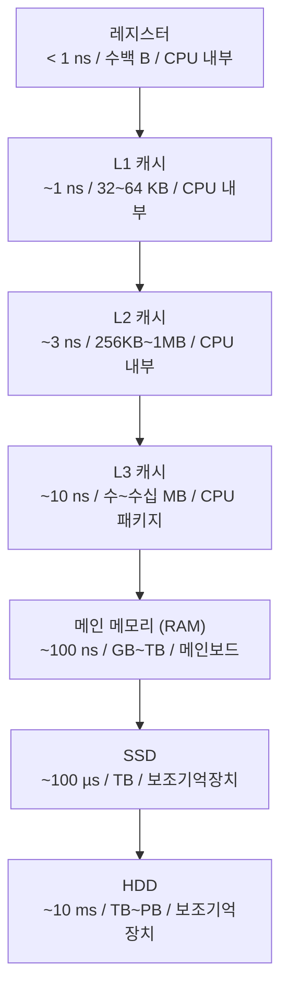
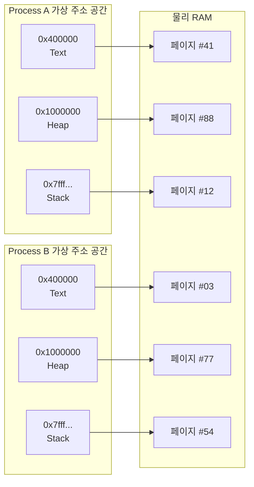
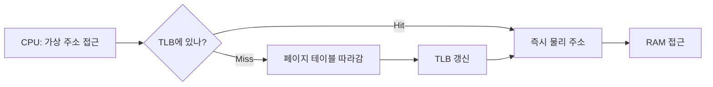
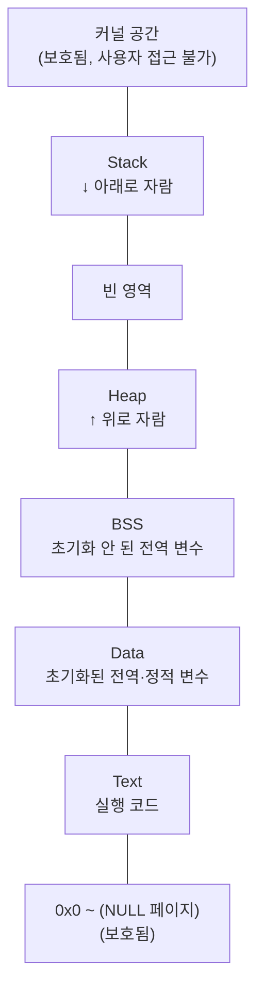

# Memory (메모리)

> 최종 업데이트: 2026-06-07 | 기준: 일반 컴퓨터 구조 (x86-64 / ARM64), DDR4/DDR5, 가상 메모리 시스템

## 개념

**Memory(메모리)** 는 컴퓨터에서 데이터를 임시 저장하는 **전자식 작업 공간**이다. 일반적으로 "메모리"라고 하면 **RAM(Random Access Memory)** 을 가리킨다. CPU가 연산할 데이터와 실행 중인 프로그램의 코드가 여기 올라온다.

> 비유하자면 **책상 위의 작업 공간**. 책장(디스크)에 책이 수만 권 있어도, 지금 읽고 쓰는 책 몇 권은 책상 위(메모리)에 펼쳐둬야 작업이 된다. 책상이 좁으면(메모리 부족) 자주 책장을 들락날락(스와핑) 해서 느려진다. 작업이 끝나면 책상에서 치우고(프로세스 종료) 다른 사람이 책상을 쓴다.

**"메모리"라는 단어는 두 가지 의미로 혼용**된다 — 이 문서가 둘 다 다룬다.

| 의미 | 가리키는 것 |
|---|---|
| **물리 메모리** | 메인보드에 꽂힌 RAM 칩. GB 단위로 사는 그것 |
| **가상 메모리 / 메모리 영역** | OS가 프로세스마다 만들어주는 **가상 주소 공간**. "스택 영역", "힙 영역" 할 때의 그 영역 |

핵심은 **둘이 따로 산다**는 것. 프로세스가 보는 주소(가상)는 실제 RAM의 어디(물리)와 다르다. 그 사이를 OS와 하드웨어(MMU)가 매핑해준다.

> 그래서 [Stack.md](Stack.md), [Register.md](Register.md)에서 말하는 "메모리"는 거의 항상 **가상 주소 공간**을 의미. 실제 RAM 어디에 있는지는 추상화된다.

## 배경/역사

- **1940년대**: 진공관·수은 지연선·드럼 메모리 — 매우 느리고 비쌈
- **1950~60년대**: **자기 코어 메모리(Magnetic Core Memory)** 가 표준. 페라이트 링에 자력으로 비트 저장. "코어 덤프(core dump)"의 어원
- **1968년**: Intel의 전신 격이 **DRAM**(Dynamic RAM) 발명. 트랜지스터 1개 + 커패시터 1개 = 1비트 → 집적도 폭증
- **1970년대**: **가상 메모리** 개념이 IBM System/370·VAX 등에서 상용화. 페이지 단위 관리
- **1985년**: Intel 386이 32bit + 페이징 지원 → PC에서도 가상 메모리 본격화
- **2000년대~**: DDR(Double Data Rate) 세대 진화 (DDR → DDR4 → DDR5). 멀티채널·NUMA
- **2020년대**: CXL(Compute Express Link)로 메모리 풀링, 대용량 RAM(테라바이트급) 보편화

> "메모리"가 RAM을 지칭하게 된 건 본격적으로 1970년대부터. 그 전엔 코어 메모리·드럼 메모리 등이 혼재.

## 메모리 계층 (Memory Hierarchy)

CPU와의 거리/속도/용량/가격이 모두 다른 저장소를 **피라미드 계층**으로 본다.



| 위로 올라갈수록 | 아래로 내려갈수록 |
|---|---|
| 빠름 | 느림 |
| 비쌈 | 쌈 |
| 작음 | 큼 |
| 휘발성 (전원 꺼지면 사라짐) | 비휘발성 (영구 저장) |

> **"메모리"라고 하면 보통 RAM** (계층의 5번째 줄). 그 위 캐시·레지스터는 [CPU.md](CPU.md), [Register.md](Register.md) 참고.

## 물리 메모리 (Physical Memory)

메인보드에 꽂힌 실제 RAM 칩. CPU가 메모리 컨트롤러를 통해 직접 접근한다.

### DRAM vs SRAM

| 항목 | DRAM | SRAM |
|---|---|---|
| 비트당 부품 | 트랜지스터 1 + 커패시터 1 | 트랜지스터 6개 |
| 속도 | 느림 (수십 ns) | 매우 빠름 (ns 단위) |
| 집적도 | 높음 | 낮음 |
| 가격 | 쌈 | 비쌈 |
| 휘발성 | ✅ (주기적 refresh 필요) | ✅ (전원 켜진 동안 유지) |
| 쓰임 | **메인 메모리 (RAM)** | **CPU 캐시 (L1~L3)** |

> 우리가 "32GB RAM"이라 부르는 건 DRAM. L1 캐시는 SRAM.

### DDR 세대

| 세대 | 출시 | 대역폭 (대략) | 전압 |
|---|---|---|---|
| DDR | 2000 | 1.6~3.2 GB/s | 2.5V |
| DDR2 | 2003 | 3.2~8.5 GB/s | 1.8V |
| DDR3 | 2007 | 6.4~17 GB/s | 1.5V |
| DDR4 | 2014 | 12.8~25.6 GB/s | 1.2V |
| **DDR5** | 2020 | **25.6~51.2 GB/s** | **1.1V** |

> 세대가 오를수록 빨라지고 전기는 덜 먹는다. 핀 호환성은 안 됨 — 메인보드/CPU가 지원하는 세대만 사용 가능.

### ECC 메모리

**Error-Correcting Code 메모리.** 비트 한 개의 오류를 자동 검출·정정. 우주선·전자기 간섭으로 0이 1로 바뀌는 일이 실제로 발생함.

- 서버·워크스테이션에선 사실상 필수
- 일반 PC는 비ECC가 표준 (싸고, 일반 용도엔 오류 빈도 낮음)

## 가상 메모리 (Virtual Memory)

**OS와 CPU(MMU)가 협력해 만든 환상**. 각 프로세스에 "넌 메모리 전체를 혼자 쓰는 것 같이 보이게" 해주는 시스템.

### 왜 만들었나

- **격리**: 프로세스 A가 프로세스 B의 메모리를 못 건드리게
- **단순화**: 프로세스가 항상 같은 주소(예: 코드는 `0x400000`)에서 시작한다고 가정 가능
- **물리 메모리보다 큰 작업 공간**: 16GB RAM에서 100GB 프로그램도 실행 가능 (스왑 활용)
- **공유**: 같은 라이브러리를 여러 프로세스가 같은 물리 페이지를 보게 매핑

### 가상 주소 ↔ 물리 주소 매핑



같은 가상 주소(`0x400000`)도 프로세스마다 **물리 RAM의 다른 곳**으로 매핑된다. 그래서 서로 충돌 없이 살 수 있음.

## 페이지·페이지 테이블·MMU·TLB

가상→물리 매핑을 효율적으로 하기 위한 메커니즘.

### Page (페이지)

메모리를 **고정 크기 블록**으로 나눈 단위. 보통 **4KB**(리눅스 기본).

- 가상 메모리에서 4KB 단위로 매핑/이동
- Large Page (2MB), Huge Page (1GB) 옵션도 있음 — DB·JVM에서 성능용으로 사용

### Page Table (페이지 테이블)

"이 가상 페이지는 물리 RAM의 어디인지" 매핑 정보. **프로세스마다 따로** 가짐.

- 64bit 주소 공간이면 페이지 테이블 자체가 거대 → **다단계(multilevel) 페이지 테이블**로 트리 구조
- x86-64는 4단계(또는 5단계)

### MMU (Memory Management Unit)

CPU 안에 있는 하드웨어. 매번 메모리 접근마다 **가상 주소 → 물리 주소 변환**을 자동 수행. 페이지 테이블을 직접 따라가서 변환.

### TLB (Translation Lookaside Buffer)

MMU의 **변환 결과 캐시**. 같은 페이지를 자주 접근하니 매번 페이지 테이블 따라가지 않게 캐싱.



TLB miss는 비싸다. 그래서 **컨텍스트 스위칭이 비싼 이유** 중 하나 — 다른 프로세스로 바뀌면 TLB를 비워야 함.

## 프로세스의 가상 주소 공간

각 프로세스가 보는 메모리 레이아웃. 위가 높은 주소, 아래가 낮은 주소.



| 영역 | 내용 | 자세히 |
|---|---|---|
| **Text** | 실행 코드. 읽기 전용 | — |
| **Data** | 초기화된 전역·정적 변수 | — |
| **BSS** | 초기화 안 된 전역·정적 변수 (0으로 채움) | — |
| **Heap** | 동적 할당 (`malloc`/`new`). 위로 자람 | — |
| **Stack** | 함수 호출 프레임·지역 변수. 아래로 자람 | [Stack.md](Stack.md) |
| **Kernel** | OS 커널 코드·자료구조. 시스템 콜로만 진입 | — |

> "메모리 영역"이라 부를 땐 보통 이 그림의 한 칸을 가리킨다. "스택 영역의 메모리", "힙에 잡힌 메모리" 같은 표현이 그것.

## Page Fault (페이지 폴트)

가상 주소에 접근했는데 해당 페이지가 **물리 RAM에 없을 때** 발생. CPU가 OS에 알려서 처리.

| 종류 | 원인 | 처리 |
|---|---|---|
| **Minor Fault** | 페이지가 RAM엔 있는데 매핑 안 됨 | 매핑만 추가, 빠름 |
| **Major Fault** | 페이지가 디스크(스왑·파일)에 있음 | 디스크에서 RAM으로 로드, **느림** |
| **Invalid Fault** | 잘못된 주소 접근 (NULL, 권한 없음) | `SIGSEGV` → 프로세스 죽음 (Segmentation Fault) |

> Java의 `NullPointerException`이 안 죽이는 이유는 JVM이 먼저 잡아내기 때문. C/C++에선 같은 상황이 즉시 segfault.

## 스와핑 (Swapping)

RAM이 부족할 때 일부 페이지를 **디스크(스왑 영역)** 로 내보내고, 나중에 필요하면 다시 가져옴.

- 장점: 물리 RAM보다 더 큰 작업 공간 가능
- 단점: 디스크 접근은 RAM보다 **10만 배 느림** — 스왑이 활발해지면 시스템이 사실상 멈춤("스래싱(thrashing)")

```bash
# Linux 스왑 상태 확인
free -h
swapon --show
vmstat 1     # si/so 컬럼 = swap-in/out
```

> 프로덕션 서버에선 보통 스왑을 끄거나(`swapoff -a`) 매우 작게 설정. JVM도 스왑된 페이지를 만지면 GC가 폭주.

## 메모리 누수 (Memory Leak)

할당한 메모리를 해제하지 않아 시간이 갈수록 메모리 사용량이 증가하는 버그.

| 언어 | 누수 원인 | 대응 |
|---|---|---|
| C/C++ | `malloc`/`new` 후 `free`/`delete` 누락 | RAII, 스마트 포인터 |
| Java/Kotlin | 정적 컬렉션에 객체 쌓임, 리스너 해제 누락, ThreadLocal 미정리 | 힙 덤프 분석 (Eclipse MAT 등) |
| JavaScript | DOM 참조 잡고 있는 클로저, 이벤트 리스너 미해제 | Chrome DevTools Memory Profiler |
| Go | 종료되지 않는 goroutine이 변수 잡고 있음 | pprof |

> GC 언어도 누수가 난다. GC는 "참조가 끊긴 객체"만 치우니까, 끊지 않으면 평생 안 죽는다.

## 메모리 크기 단위

| 단위 | 값 | 대략 |
|---|---|---|
| 1 KB (kilobyte) | 1,024 B | 텍스트 한 페이지 |
| 1 MB (megabyte) | 1,024 KB | 사진 1장 |
| 1 GB (gigabyte) | 1,024 MB | 영화 1편 (압축) |
| 1 TB (terabyte) | 1,024 GB | 서버 메모리 정도 |

> 디스크 제조사는 1KB = 1,000으로 광고하기도 (10진수 SI). OS·메모리는 1KB = 1,024 (2진수 IEC, 정확히는 KiB).

## Linux 메모리 확인 명령어

```bash
free -h                    # 전체 메모리 / 스왑 사용량
cat /proc/meminfo          # 상세 정보 (60+ 항목)
top                        # 프로세스별 메모리 + 실시간
ps aux --sort=-%mem | head # 메모리 많이 쓰는 프로세스 TOP
pmap -x <PID>              # 프로세스의 가상 주소 공간 맵
cat /proc/<PID>/status     # 특정 프로세스 메모리 상태
vmstat 1                   # VM 통계 (스왑 in/out 포함)
```

> 자세히는 [../../Linux/시스템-리소스/메모리-명령어.md](../../Linux/시스템-리소스/메모리-명령어.md)

## NUMA (Non-Uniform Memory Access)

멀티 CPU 서버에서 **CPU마다 가까운 메모리 / 먼 메모리**가 있는 구조. 가까운 메모리는 빠르고, 먼 메모리는 다른 CPU 통해 가야 해서 느림.

- 큰 서버(데이터센터급)에선 필연
- 잘못된 NUMA 설정으로 DB·JVM 성능이 30%~50% 떨어지는 일이 흔함
- `numactl --hardware`로 토폴로지 확인

## OOM (Out Of Memory)

물리 메모리 + 스왑까지 다 써서 더는 할당 불가. Linux는 **OOM Killer**가 발동해 가장 점수 높은 프로세스를 강제 종료.

```bash
dmesg | grep -i "killed process"   # OOM 발생 이력
```

> 컨테이너 환경에선 cgroup 메모리 한도를 넘으면 OOM 발동. 자바 컨테이너 운영의 핵심 골칫거리.

## 자주 받는 질문

### Q. "메모리"라고 하면 RAM인가 가상 메모리인가?
A. **문맥에 따라 다름.**
- 일반인: 보통 RAM (= 물리 메모리)
- 프로그래머: 거의 항상 **가상 메모리** (프로세스가 보는 주소 공간)
- "8GB 메모리 사야지" → RAM
- "이 변수는 스택 메모리에 있다" → 가상 메모리 영역

### Q. 32bit OS가 4GB RAM 한계인 이유?
A. 32bit 주소 = 2³² = 약 4GB. CPU가 가리킬 수 있는 주소가 4GB까지라 그 이상은 못 봄. 64bit는 이론상 16 EB(엑사바이트).

### Q. 자바 힙은 OS의 힙과 같은 건가?
A. **다르다.** JVM은 OS로부터 큰 메모리 덩어리를 `mmap`/`malloc`으로 받아서 그 안에 **JVM 자체의 힙**을 구현. OS가 보기엔 한 덩어리, JVM 안에선 Eden/Survivor/Old 영역으로 또 쪼개짐. 자세히는 [Java-Memory.md](../../Java/Java-Theory/Java-Memory.md)

### Q. 메모리는 왜 휘발성인가?
A. DRAM은 커패시터에 전하로 비트를 저장하는데, 전기가 끊기면 전하가 사라짐. SSD/HDD는 자성·플래시로 영구 저장.

### Q. 메모리 더 꽂으면 무조건 빨라지나?
A. **부족한 상태**에서만. RAM이 충분하면 더 꽂아도 성능엔 거의 영향 없음. 단, JVM `-Xmx`나 DB `shared_buffers` 같은 설정을 늘리면 효과 봄.

## 관련 문서

- [Stack.md](Stack.md) — 메모리의 한 영역
- [Register.md](Register.md) — 메모리 계층 최상단
- [CPU.md](CPU.md) — 메모리에 접근하는 주체
- [프로세스.md](프로세스.md) — 가상 주소 공간의 소유자
- [OS-Thread.md](OS-Thread.md)
- [../../Java/Java-Theory/Java-Memory.md](../../Java/Java-Theory/Java-Memory.md) — Java 관점
- [../../Java/Java-Theory/JVM-메모리-튜닝.md](../../Java/Java-Theory/JVM-메모리-튜닝.md)
- [../../Linux/시스템-리소스/메모리-명령어.md](../../Linux/시스템-리소스/메모리-명령어.md)

## 출처

- [The Linux Programming Interface (Michael Kerrisk)](https://man7.org/tlpi/)
- [Intel 64 and IA-32 Architectures Software Developer's Manual](https://www.intel.com/sdm)
- [What Every Programmer Should Know About Memory (Ulrich Drepper)](https://akkadia.org/drepper/cpumemory.pdf)
