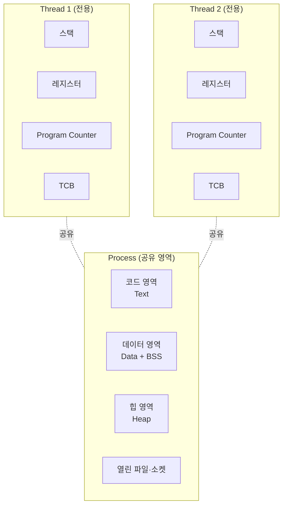
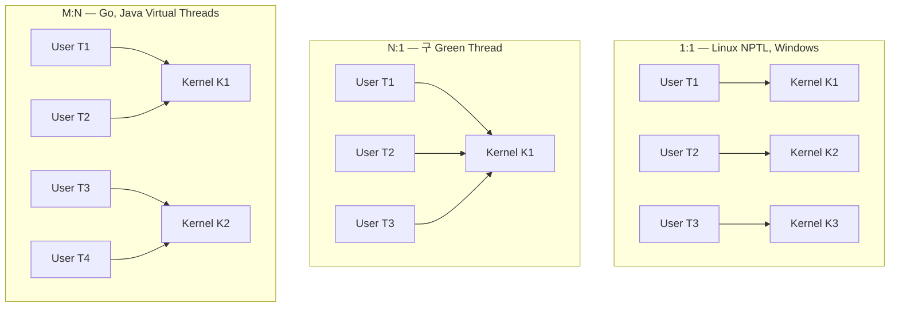
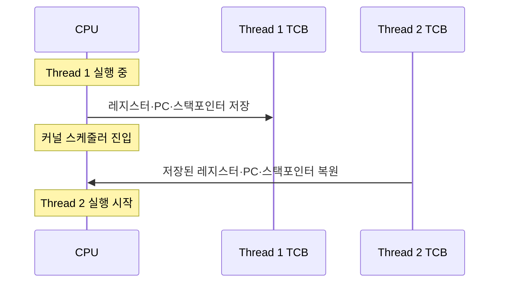
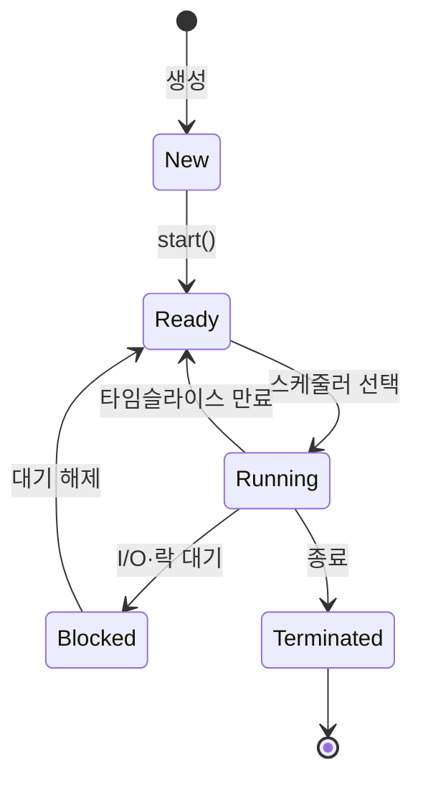

# OS Thread

> 최종 업데이트: 2026-06-07 | 기준: POSIX Threads (IEEE Std 1003.1c-1995), Linux NPTL, Windows Threads

## 개념

**OS Thread**(스레드)는 **운영체제가 스케줄링하는 가장 작은 실행 단위**다. 한 프로세스 안에 여러 개의 스레드가 동시에 존재할 수 있고, 같은 프로세스의 스레드들은 **메모리(코드/데이터/힙)를 공유**하면서 **각자의 스택과 레지스터**만 따로 가진다.

> 비유하자면 **한 사무실(프로세스) 안의 여러 직원(스레드)** 이다. 사무실의 책장·자료·화이트보드(메모리·파일)는 직원들이 공유하지만, 각 직원은 자기 책상(스택)과 머릿속 메모(레지스터)는 따로 쓴다. 직원 한 명이 일하다 멈춰도 사무실은 계속 굴러간다.

핵심 가치는 **자원 공유로 인한 효율성**. 프로세스를 새로 띄우는 것보다 훨씬 싸고, 한 프로세스 안에서 작업을 병렬화하기 좋다. 단점은 **공유 자원에 대한 동시성 문제**(race condition, deadlock 등)가 따라온다는 것.

> 자바·고수준 언어의 스레드(`Thread`, `goroutine`)는 결국 그 아래 어딘가에서 OS 스레드와 매핑된다. 이 매핑 방식이 1:1이냐 M:N이냐가 [Java Virtual Threads](../../Java/Java-Thread/Java-Virtual-Threads.md) 같은 현대 기술의 핵심 차별점이다.

## 배경/역사

- **1960년대**: Multics·OS/360 등에서 **멀티프로그래밍** 개념 등장. 아직 "스레드"라는 별도 추상은 없었음
- **1980년대**: **Mach 커널**(카네기멜런)에서 프로세스를 자원 컨테이너로, 스레드를 실행 단위로 **분리**하는 모델을 본격화
- **1995년**: **POSIX Threads (pthreads)** 표준 채택 — IEEE Std 1003.1c. UNIX 진영 스레드 API의 사실상 표준
- **1996년**: Windows NT 4.0이 커널 레벨 스레드를 본격 지원
- **2003년**: Linux **NPTL (Native POSIX Thread Library)** 도입 — 기존 LinuxThreads를 대체하며 **1:1 매핑 모델** 채택
- **2000년대 후반~**: 멀티코어 CPU 보편화로 스레드의 가치 폭증
- **2020년대**: 동시성 모델이 OS 스레드를 넘어 **사용자 공간 경량 스레드**(Go goroutine, Java Virtual Thread, Kotlin Coroutine)로 확장

> "프로세스 = 자원 단위, 스레드 = 실행 단위"라는 분리가 현대 OS의 표준 모델. 이 분리가 명확해진 게 Mach 이후.

## 프로세스 vs 스레드

| 항목 | Process | Thread |
|---|---|---|
| 정의 | 실행 중인 프로그램 (자원 단위) | 프로세스 안의 실행 흐름 (실행 단위) |
| 메모리 공간 | **독립적** (별도 가상 주소 공간) | **공유** (같은 프로세스 안에서) |
| 생성 비용 | 비쌈 (수 ms) | 저렴 (수 µs) |
| 컨텍스트 스위칭 | 비쌈 (페이지 테이블 교체 등) | 저렴 (레지스터·스택만) |
| 통신 | IPC (파이프, 소켓, 공유 메모리) | 공유 메모리 직접 접근 |
| 안정성 | 한 프로세스가 죽어도 다른 프로세스 무관 | **한 스레드 죽으면 프로세스 전체 영향** |
| 동시성 문제 | 거의 없음 | 락·동기화 필요 |

> 한 컴퓨터 안에서 **여러 일을 동시에 시키고 싶을 때** 프로세스를 늘릴지 스레드를 늘릴지의 선택. 격리가 중요하면 프로세스, 자원 공유와 효율이 중요하면 스레드.

## 스레드의 구성 요소



| 구성 요소 | 공유/전용 | 설명 |
|---|---|---|
| 코드(Text) | 공유 | 실행되는 바이너리 |
| 데이터(Data/BSS) | 공유 | 전역·정적 변수 |
| 힙(Heap) | 공유 | `malloc`·`new`로 할당된 영역 |
| 파일 디스크립터 | 공유 | 열린 파일, 소켓 |
| **스택** | **전용** | 함수 호출 프레임, 지역 변수 |
| **레지스터** | **전용** | CPU 레지스터 값 |
| **Program Counter** | **전용** | 다음 실행할 명령 주소 |
| **TCB** | **전용** | Thread Control Block — OS가 관리하는 메타정보 |

### TCB (Thread Control Block)

OS 커널이 각 스레드를 추적하기 위해 유지하는 자료구조. 컨텍스트 스위칭 시 여기 저장된 값들을 복원한다.

- 스레드 ID
- 스레드 상태 (Ready/Running/Blocked 등)
- 저장된 레지스터·PC
- 스케줄링 정보 (우선순위, 시간 슬라이스)
- 부모 프로세스 포인터
- 스택 포인터

## 커널 스레드 vs 사용자 스레드

"누가 스레드를 관리하는가"에 따른 구분.

| 항목 | Kernel Thread | User Thread |
|---|---|---|
| 관리 주체 | OS 커널 | 사용자 공간 라이브러리·런타임 |
| 스케줄링 | 커널 스케줄러 | 라이브러리 자체 스케줄러 |
| 생성/전환 비용 | 큼 (시스템 콜) | 작음 (함수 호출 수준) |
| 한 스레드 블로킹 시 | 다른 스레드 영향 X (커널이 분리) | **같은 프로세스의 모든 사용자 스레드가 멈출 위험** |
| 멀티코어 활용 | ✅ 자동 | ❌ (별도 기법 필요) |
| 예시 | Linux pthread, Windows Thread | 초기 Java Green Thread, Go goroutine, **Java Virtual Thread** |

> 현대 운영체제는 대부분 **커널 스레드 기반**. 사용자 스레드는 그 위에 라이브러리로 얹어 더 가볍게 만든다(Go·Java Virtual Threads). 이 둘을 매핑하는 게 다음 절의 주제.

## 스레드 매핑 모델

사용자 공간의 스레드와 커널 스레드를 어떻게 매핑할지의 모델.

### 1:1 모델 (Kernel-Level)

- 사용자 스레드 하나당 커널 스레드 하나
- **현재 표준** — Linux(NPTL), Windows, macOS 모두 1:1
- 장점: 단순, 멀티코어 자동 활용, 한 스레드 블로킹돼도 다른 스레드 영향 X
- 단점: 스레드 생성·컨텍스트 스위칭 비용이 OS 수준이라 비쌈

### N:1 모델 (User-Level)

- 여러 사용자 스레드를 **하나의 커널 스레드**에 매핑
- 장점: 매우 가벼움
- 단점: **한 스레드 블로킹 = 전체 멈춤**, 멀티코어 활용 불가
- 초기 Java Green Thread가 이 모델 (현재는 안 씀)

### M:N 모델 (Hybrid)

- 여러 사용자 스레드를 **여러 커널 스레드**에 매핑 (M ≥ N)
- 장점: 1:1의 멀티코어 활용 + N:1의 가벼움
- 단점: 구현 복잡, 스케줄링 두 곳에서 일어남
- 예시: **Go goroutine**, **Java Virtual Threads** (캐리어 스레드 = 커널 스레드, 가상 스레드 = 사용자 스레드)

### 모델 비교



> Java Virtual Threads가 M:N 모델로 "수십만 동시성"을 가능케 한 핵심 원리. 자세히는 [Java-Virtual-Threads.md](../../Java/Java-Thread/Java-Virtual-Threads.md).

## 컨텍스트 스위칭

CPU가 한 스레드에서 다른 스레드로 실행을 옮길 때, **현재 스레드의 상태를 저장**하고 **다음 스레드의 상태를 복원**하는 과정.



### 비용

| 종류 | 대략 비용 |
|---|---|
| 프로세스 컨텍스트 스위치 | ~5 µs (페이지 테이블·TLB 교체) |
| 스레드 컨텍스트 스위치 (같은 프로세스) | ~1 µs (레지스터·스택만) |
| 함수 호출 | ~1 ns |

> 스레드를 너무 많이 만들면 **실제 일보다 컨텍스트 스위칭에 더 많은 시간**을 쓰게 된다. 그래서 전통적으로 스레드 풀로 적정 수(수백 개)를 유지해왔다.

### 발생 시점

- 타임 슬라이스 만료 (선점형)
- 시스템 콜로 블로킹 (I/O 대기)
- 더 높은 우선순위 스레드 등장
- `yield()` 명시적 양보
- 인터럽트 발생

## 스레드 생명주기



| 상태 | 의미 |
|---|---|
| **New** | 생성됐지만 아직 시작 안 함 |
| **Ready (Runnable)** | 실행 가능 상태, CPU 할당 대기 중 |
| **Running** | 현재 CPU에서 실행 중 |
| **Blocked (Waiting)** | I/O·락 대기. CPU 받아도 일 못 함 |
| **Terminated** | 종료됨. 자원 회수 대기 |

## 스레드 안전성과 동시성 문제

메모리를 공유하기 때문에 생기는 본질적 문제들.

| 문제 | 내용 | 방어 |
|---|---|---|
| **Race Condition** | 여러 스레드가 같은 데이터를 동시 수정 → 결과 비결정적 | 락(Mutex), 원자 연산 |
| **Deadlock** | 서로 상대가 점유한 락을 기다리며 영구 대기 | 락 순서 고정, 타임아웃 |
| **Livelock** | 데드락은 아닌데 서로 양보만 하다 진행 안 됨 | 백오프(랜덤 지연) |
| **Starvation** | 일부 스레드가 영원히 CPU·락을 못 받음 | 공정성 보장 스케줄러 |
| **Memory Visibility** | 한 스레드의 변경이 다른 스레드에 안 보임 (캐시 일관성) | `volatile`, 메모리 배리어 |
| **Priority Inversion** | 낮은 우선순위 스레드가 락을 잡아 높은 우선순위 스레드가 대기 | 우선순위 상속 프로토콜 |

### 동기화 도구

| 도구 | 용도 |
|---|---|
| **Mutex / Lock** | 임계 영역(critical section) 한 번에 한 스레드만 진입 |
| **Semaphore** | N개까지 동시 진입 허용 |
| **Condition Variable** | 특정 조건이 될 때까지 대기 (wait/notify) |
| **Spinlock** | 짧은 대기에 락을 반복 확인 (컨텍스트 스위치 회피) |
| **Read-Write Lock** | 읽기는 동시 허용, 쓰기는 단독 |
| **Atomic 연산** | 락 없이 CPU 단위 원자 연산 (CAS 등) |

## OS별 스레드 API

### POSIX Threads (pthreads) — UNIX/Linux/macOS

```c
#include <pthread.h>

void* worker(void* arg) {
    printf("Hello from thread\n");
    return NULL;
}

int main() {
    pthread_t tid;
    pthread_create(&tid, NULL, worker, NULL);
    pthread_join(tid, NULL);  // 완료 대기
    return 0;
}
```

### Windows Threads

```c
#include <windows.h>

DWORD WINAPI worker(LPVOID arg) {
    return 0;
}

int main() {
    HANDLE h = CreateThread(NULL, 0, worker, NULL, 0, NULL);
    WaitForSingleObject(h, INFINITE);
    CloseHandle(h);
    return 0;
}
```

### Linux 시스템 콜 — `clone()`

```c
#include <sched.h>
clone(fn, stack, CLONE_VM | CLONE_FS | CLONE_FILES | CLONE_SIGHAND | CLONE_THREAD, arg);
```

> Linux의 `clone()` 시스템 콜은 프로세스·스레드를 같은 메커니즘으로 만든다. 인자 플래그로 무엇을 공유할지 결정 — 자원 공유를 최대로 하면 스레드, 안 하면 프로세스. `fork()`도 내부적으론 `clone()`을 호출.

## OS별 구현 차이

| OS | 모델 | 라이브러리 |
|---|---|---|
| **Linux** | 1:1 | NPTL (Native POSIX Thread Library) |
| **macOS** | 1:1 | pthreads (Mach 커널 위) |
| **Windows** | 1:1 | Win32 Threads, 사용자 모드 Fibers는 별도 |
| **Solaris** (구형) | M:N → 후에 1:1 | LWP (Lightweight Process) |
| **FreeBSD** | 1:1 | libthr |

> Solaris는 한때 M:N을 시도했지만 결국 1:1로 회귀. M:N은 커널 레벨에선 복잡성 대비 이득이 작았다. 그래서 현대 M:N은 **사용자 공간 런타임**(Go, Java)에서 부활.

## 스레드 풀

전통적으로 스레드는 **생성·소멸이 비싸기 때문에 풀로 재사용**하는 게 표준 패턴.

| 기준 | 적정 풀 크기 (Brian Goetz 공식) |
|---|---|
| **CPU 바운드** | `코어 수 + 1` |
| **I/O 바운드** | `코어 수 × (1 + 대기시간/CPU시간)` |

> 톰캣 기본 200, 일반 백엔드 50~200. 무작정 늘리면 컨텍스트 스위칭 비용으로 역효과. 이 한계를 깨려고 등장한 게 [Java Virtual Threads](../../Java/Java-Thread/Java-Virtual-Threads.md), Go goroutine 같은 M:N 사용자 스레드.

## 멀티스레딩 vs 멀티프로세싱 vs 비동기 I/O

같은 문제(동시성)에 대한 세 가지 접근.

| 접근 | 사상 | 장점 | 단점 |
|---|---|---|---|
| **멀티프로세싱** | 프로세스 여러 개 | 강한 격리, 안정성 | 무거움, IPC 필요 |
| **멀티스레딩** | 스레드 여러 개 | 가볍고 공유 쉬움 | 동시성 버그 위험 |
| **비동기 I/O (이벤트 루프)** | 스레드 1개로 다중 I/O 처리 | 컨텍스트 스위칭 없음 | 콜백 지옥, CPU 바운드 부적합 |
| **M:N 가상 스레드** | 사용자 공간에서 경량 스레드 다중 | 동기 코드 + 고동시성 | 비교적 신기술 |

## 관련 문서

- [프로세스.md](프로세스.md)
- [CPU.md](CPU.md)
- [IO-작업.md](IO-작업.md)
- [../IO-Model.md](../IO-Model.md)
- [../../Java/Java-Thread/Java-Thread-Basic.md](../../Java/Java-Thread/Java-Thread-Basic.md)
- [../../Java/Java-Thread/Java-Virtual-Threads.md](../../Java/Java-Thread/Java-Virtual-Threads.md)
- [../../Java/Java-Thread/Java-Thread-Synchronization.md](../../Java/Java-Thread/Java-Thread-Synchronization.md)
- [../../Java/Java-Thread/Java-Thread-Deadlock-and-Livelock.md](../../Java/Java-Thread/Java-Thread-Deadlock-and-Livelock.md)
- [../../Java/Java-Thread/Java-Thread-Scheduling.md](../../Java/Java-Thread/Java-Thread-Scheduling.md)
- [../../Java/Java-Thread/WAS-Thread.md](../../Java/Java-Thread/WAS-Thread.md)
- [../../Linux/프로세스/프로세스.md](../../Linux/프로세스/프로세스.md)

## 출처

- [POSIX Threads Programming (LLNL)](https://hpc-tutorials.llnl.gov/posix/)
- [The Linux Programming Interface](https://man7.org/tlpi/)
- [NPTL Design Document](https://www.akkadia.org/drepper/nptl-design.pdf)
- IEEE Std 1003.1c-1995 (POSIX.1c, Threads extensions)
