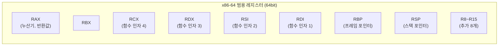
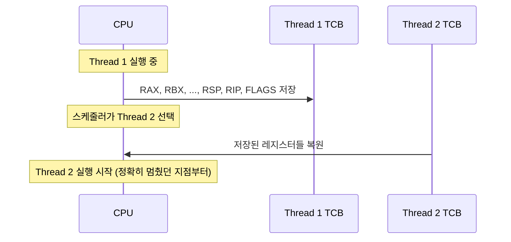

# Register (레지스터)

> 최종 업데이트: 2026-06-07 | 기준: x86-64 (Intel/AMD), ARM64, RISC-V

## 개념

**Register(레지스터)** 는 **CPU 내부에 있는 가장 작고 가장 빠른 저장소**다. 일반적으로 수십~수백 개 존재하며, 크기는 32bit·64bit 정도. CPU가 연산을 할 때 데이터는 **반드시 레지스터에 올라와 있어야** 한다 — 메모리에 있는 값을 바로 더하거나 비교할 수 없다.

> 비유하자면 **요리사의 작업대**. 냉장고(메모리)에서 재료를 꺼내 작업대(레지스터)에 올려야 칼질·볶기 같은 실제 조리(연산)가 가능하다. 작업대는 좁아서 몇 개 안 올라가지만 손이 닿는 거리라 무지 빠르다.

핵심 가치는 **속도**. 메모리 접근이 수십~수백 ns 걸린다면 레지스터 접근은 **1 클럭(< 1 ns)**. CPU가 분초 단위로 굴러가는 게 가능한 건 거의 모든 연산이 레지스터에서 일어나기 때문.

> 컴파일러 최적화의 큰 비중이 "어떤 변수를 레지스터에 두고, 언제 메모리로 내보낼지(spill)"의 결정이다. 좋은 컴파일러일수록 레지스터를 잘 활용해 메모리 접근을 줄인다.

## 배경/역사

- **1945년 폰 노이만 아키텍처**: ENIAC 시대부터 CPU에 누산기(Accumulator)라는 단일 레지스터 존재
- **1960년대**: 다중 범용 레지스터를 가진 컴퓨터 등장 (IBM System/360 — 16개 범용 레지스터)
- **1970년대**: x86의 조상 8086(1978)이 8개의 16bit 범용 레지스터(`AX`, `BX`, ...)
- **1980년대 RISC 혁명**: 레지스터를 **많이 두고** 메모리 접근을 줄이자 — MIPS, SPARC, ARM (32개 이상)
- **2003년 x86-64 (AMD64)**: 64bit 확장 + 범용 레지스터를 8개에서 16개로 늘림 (`R8`~`R15` 추가)
- **현재**: x86-64는 16개 + SIMD/벡터 레지스터 별도, ARM64는 31개 범용 레지스터

> RISC vs CISC 논쟁의 한 축이 "레지스터를 많이 둘 것이냐". RISC는 많이, CISC는 적게. 현대는 CISC도 레지스터를 늘리는 추세.

## 메모리 계층에서의 위치

CPU에서 데이터를 만지는 데 걸리는 시간 차이는 어마어마하다.

| 저장소 | 대략 접근 시간 | 용량 |
|---|---|---|
| **레지스터** | < 1 ns (1 클럭) | 수십~수백 바이트 |
| L1 캐시 | ~1 ns | 32~64 KB |
| L2 캐시 | ~3 ns | 256 KB~1 MB |
| L3 캐시 | ~10 ns | 수 MB~수십 MB |
| 메인 메모리 (DRAM) | ~100 ns | GB~TB |
| SSD | ~100 µs | TB |
| HDD | ~10 ms | TB~PB |

> 레지스터에서 메모리까지 약 **100배 차이**. 그래서 핫 루프에선 변수가 레지스터에 머무는 게 결정적.

## 레지스터의 종류

용도에 따라 분류.

### 범용 레지스터 (General Purpose Register)

산술·논리 연산, 메모리 주소 계산, 함수 인자 전달 등에 자유롭게 쓰임.

| 아키텍처 | 개수 | 이름 예 |
|---|---|---|
| x86 (32bit) | 8 | `EAX`, `EBX`, `ECX`, `EDX`, `ESI`, `EDI`, `EBP`, `ESP` |
| **x86-64** | **16** | `RAX`, `RBX`, ..., `R15` |
| **ARM64** | **31** | `X0`~`X30` |
| RISC-V | 32 | `x0`~`x31` |

### 특수 목적 레지스터

| 레지스터 | 역할 |
|---|---|
| **PC (Program Counter)** | 다음 실행할 명령어 주소 (x86은 `RIP`, ARM은 `PC`) |
| **SP (Stack Pointer)** | 스택의 꼭대기 주소 (x86 `RSP`, ARM `SP`) |
| **FP / BP (Frame Pointer)** | 현재 함수의 스택 프레임 시작 (x86 `RBP`, ARM `X29`) |
| **LR (Link Register)** | 함수 호출 시 돌아갈 주소 저장 (ARM만 별도, x86은 스택) |
| **FLAGS / Status Register** | 비교·연산 결과 플래그 (zero, carry, overflow, sign 등) |
| **Instruction Register** | 현재 디코딩 중인 명령어 |

### 부동소수점 / SIMD / 벡터 레지스터

대량 연산을 한 번에 처리하는 와이드 레지스터.

| 아키텍처 | 레지스터 | 크기 |
|---|---|---|
| x86 SSE | `XMM0`~`XMM15` | 128bit |
| x86 AVX | `YMM0`~`YMM15` | 256bit |
| x86 AVX-512 | `ZMM0`~`ZMM31` | **512bit** |
| ARM NEON | `V0`~`V31` | 128bit |
| ARM SVE | 길이 가변 (128~2048bit) | 가변 |

> 한 명령어로 정수 16개를 동시에 더하는 식. 영상·암호·머신러닝 가속의 핵심.

### 시스템/제어 레지스터

OS·하이퍼바이저가 사용. 페이지 테이블 베이스 주소(`CR3`), 모드 비트, 인터럽트 마스크 등.

## x86-64 범용 레지스터 (참고)



64bit 레지스터의 **하위 비트는 별도 이름으로 접근 가능**:

| 64bit | 32bit | 16bit | 8bit |
|---|---|---|---|
| `RAX` | `EAX` | `AX` | `AL` (하위), `AH` (상위) |
| `RBX` | `EBX` | `BX` | `BL`, `BH` |
| `RCX` | `ECX` | `CX` | `CL`, `CH` |
| `R8` | `R8D` | `R8W` | `R8B` |

> 옛 32bit `EAX`로 작성한 코드가 64bit에서도 그대로 동작하는 이유. 호환성을 위해 모든 크기를 별도로 접근하게 둠.

## 호출 규약 (Calling Convention)

ABI(Application Binary Interface)가 **어떤 레지스터로 인자를 넘기고 반환값을 받을지** 약속해둔다.

### System V AMD64 (Linux/macOS x86-64)

| 용도 | 레지스터 |
|---|---|
| 함수 인자 1~6 | `RDI`, `RSI`, `RDX`, `RCX`, `R8`, `R9` |
| 부동소수점 인자 | `XMM0`~`XMM7` |
| 반환값 | `RAX` (큰 값은 `RAX:RDX`) |
| 호출자 보존 (caller-saved) | `RAX`, `RCX`, `RDX`, `RSI`, `RDI`, `R8`~`R11` |
| 피호출자 보존 (callee-saved) | `RBX`, `RBP`, `R12`~`R15` |

> 7번째 인자부터는 스택으로. 그래서 인자가 6개 이하면 더 빠르다. 자세히는 [Stack.md](Stack.md)

### ARM64 (AAPCS)

| 용도 | 레지스터 |
|---|---|
| 함수 인자 1~8 | `X0`~`X7` |
| 반환값 | `X0` (큰 값은 `X0:X1`) |
| Link Register (반환 주소) | `X30` (LR) |
| Frame Pointer | `X29` (FP) |
| Stack Pointer | `SP` |

> ARM은 인자 8개까지 레지스터로 — x86-64보다 더 많이. 그리고 LR이 별도라 함수 호출이 빠르다.

## Caller-saved vs Callee-saved

함수 호출 시 누가 레지스터를 백업할 책임이 있는지의 약속.

| 종류 | 의미 | 사용 패턴 |
|---|---|---|
| **Caller-saved (volatile)** | 호출자가 미리 백업 | 함수 호출 후 값 보존 안 됨. 임시 변수용 |
| **Callee-saved (non-volatile)** | 피호출자가 백업·복원 | 함수 호출 후에도 값 그대로. 장기 변수용 |

```c
// caller-saved 레지스터에 든 값은
int a = 10;
foo();           // ← 여기서 a가 든 레지스터가 망가질 수 있음
use(a);          // 컴파일러는 a를 미리 스택에 백업하거나 callee-saved로 옮김
```

## 레지스터 할당 (Register Allocation)

컴파일러가 변수를 어떤 레지스터에 둘지 결정하는 과정 — **컴파일러 최적화의 핵심**.

- 변수는 무한히 많고 레지스터는 16개 (x86-64) → 모두 못 담음
- **자주 쓰는 변수는 레지스터**, 덜 쓰는 변수는 메모리(스택)로 **spill**
- 알고리즘: **그래프 컬러링(Graph Coloring)** 이 표준. 변수들이 동시에 살아있는 시점을 그래프로 만들어 색칠 문제로 변환

> JIT 컴파일러(JVM HotSpot, V8)도 똑같이 한다. 좋은 JIT일수록 핫 메서드의 레지스터 할당이 정교.

## 컨텍스트 스위칭에서의 레지스터

스레드/프로세스가 바뀔 때 **현재 레지스터 값 전부를 PCB(또는 TCB)에 저장**하고, 다음 실행할 스레드의 레지스터 값을 복원한다.



> 자세히는 [OS-Thread.md](OS-Thread.md), [프로세스.md](프로세스.md)

## C에서 본 레지스터 (참고)

C 코드가 어떻게 레지스터를 쓰는지 어셈블리로 보기.

```c
int add(int a, int b) {
    return a + b;
}
```

x86-64 (System V ABI)로 컴파일하면:

```asm
add:
    leal (%rdi, %rsi), %eax    ; RDI=a, RSI=b → 더해서 EAX(반환값)
    ret                         ; 스택에서 return address 꺼내 점프
```

함수 인자 두 개가 `RDI`/`RSI`로 들어와서, 결과를 `EAX`(=RAX 하위 32bit)로 반환. 메모리 접근 0번 — 가장 빠른 함수.

> Java도 결국 JIT 컴파일러를 거쳐 비슷한 기계어가 된다. 단지 한 단계 더 거칠 뿐.

## 자주 받는 질문

### Q. C의 `register` 키워드는 뭐 하는 거?
A. "이 변수는 가능하면 레지스터에 두라"는 컴파일러 힌트. 현대 컴파일러는 이걸 **무시**한다 — 컴파일러가 인간보다 더 잘 결정함. C++17부터 deprecated.

### Q. 자바에 레지스터 개념이 있나?
A. JVM은 추상화된 가상 머신이라 사용자 수준에선 레지스터가 안 보이고 **연산 스택(Operand Stack)** 만 노출. 실제 실행 시 JIT이 JVM 명령어를 기계어로 바꾸면서 레지스터를 사용.

### Q. 왜 x86은 레지스터가 적은데 빠를까?
A. CISC 명령어가 한 번에 더 많은 일을 하고, **레지스터 리네이밍**(register renaming)으로 실제 물리 레지스터를 100개 이상 쓰기 때문. 사용자에게 보이는 16개는 논리적 추상.

### Q. 함수 호출이 비싼 이유는?
A. 레지스터 백업(caller/callee-saved), 스택 프레임 push, 인자 정렬, return address 처리 등 약속된 절차가 많아서. 인라이닝이 이 비용을 0으로 만들어준다.

## 관련 문서

- [Stack.md](Stack.md) — SP/FP 레지스터로 관리되는 스택
- [CPU.md](CPU.md)
- [OS-Thread.md](OS-Thread.md) — 컨텍스트 스위칭과 레지스터
- [프로세스.md](프로세스.md)

## 출처

- [Intel 64 and IA-32 Architectures Software Developer's Manual](https://www.intel.com/sdm)
- [System V AMD64 ABI](https://refspecs.linuxfoundation.org/elf/x86_64-abi-0.99.pdf)
- [ARM Architecture Reference Manual (ARM64)](https://developer.arm.com/documentation/ddi0487/)
- [Procedure Call Standard for the Arm 64-bit Architecture (AAPCS64)](https://github.com/ARM-software/abi-aa/blob/main/aapcs64/aapcs64.rst)
