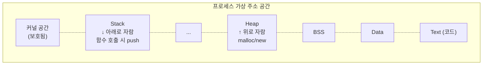
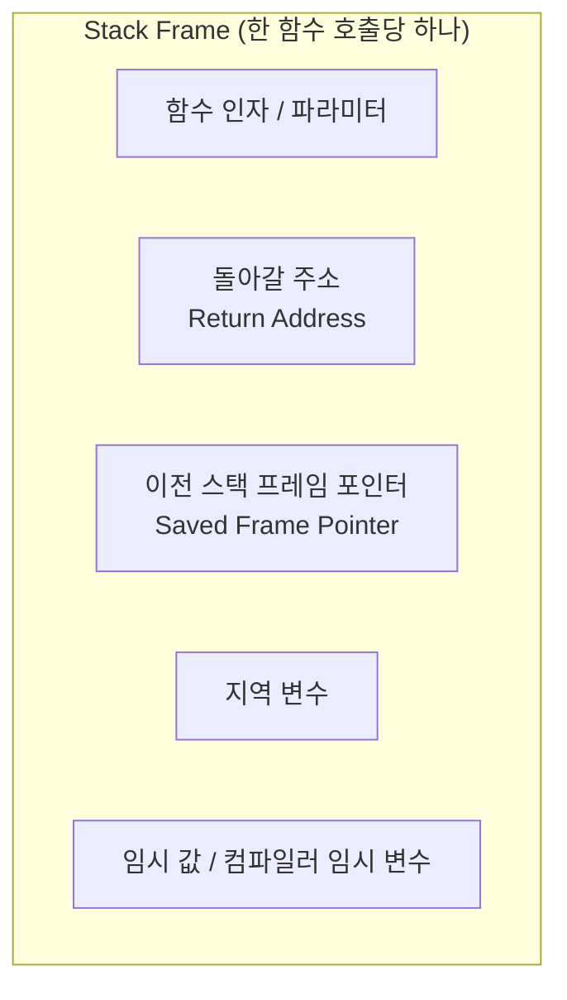
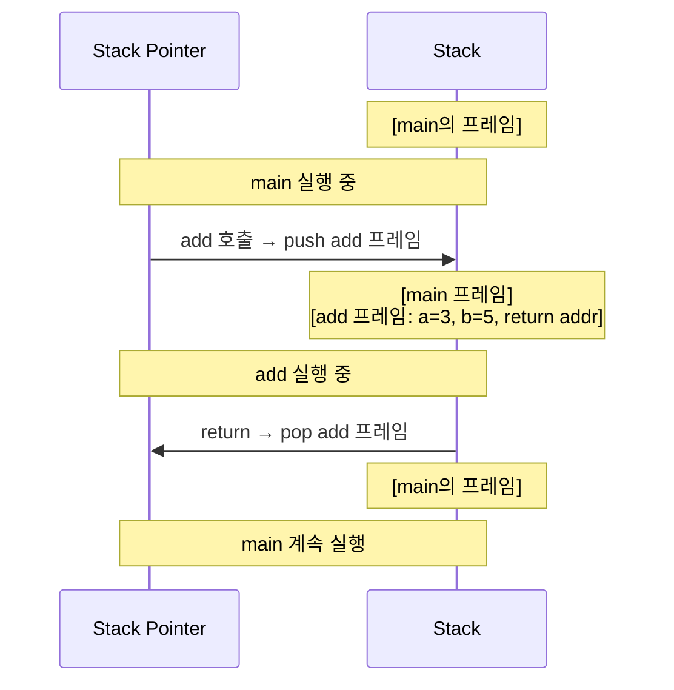
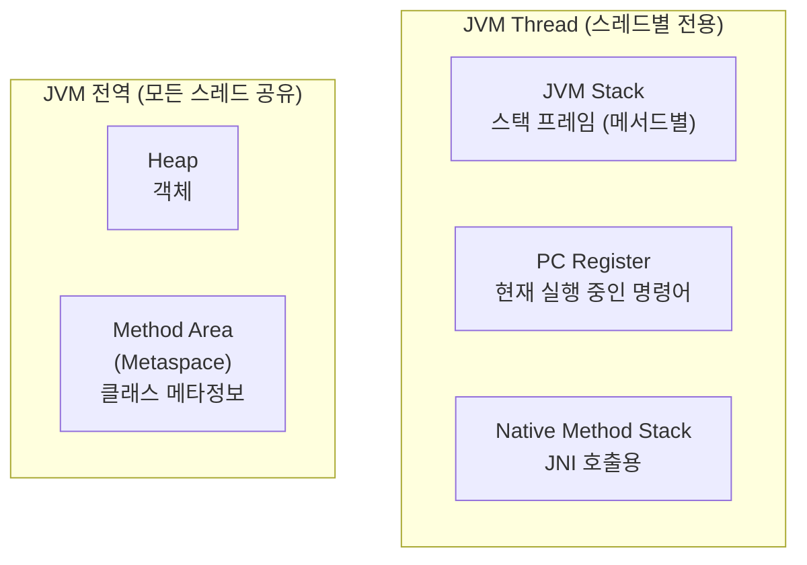

# Stack (스택)

> 최종 업데이트: 2026-06-07 | 기준: 일반 컴퓨터 구조 (x86-64 / ARM64)

## 개념

**Stack(스택)** 은 컴퓨터 구조에서 두 가지 의미로 쓰인다.

1. **자료구조로서의 스택**: 후입선출(LIFO, Last-In-First-Out) 방식의 추상 자료형
2. **메모리 영역으로서의 스택**: 프로세스/스레드의 가상 주소 공간 안에서 **함수 호출 정보를 담는 영역**

이 문서는 **2번 — 프로세스의 Stack 메모리 영역(Call Stack)** 에 집중한다. 자료구조 스택은 별도 자료구조 문서를 참고.

> 비유하자면 **카페테리아의 트레이 더미**. 새 트레이는 위에 올리고(push), 가져갈 땐 맨 위에서 꺼낸다(pop). 함수 호출도 마찬가지 — 함수가 호출되면 그 함수의 정보를 트레이처럼 위에 쌓고, 함수가 끝나면 위에서부터 차례로 치운다.

핵심 가치는 **함수 호출의 추적**. 누가 누구를 어떤 인자로 불렀고, 어디로 돌아가야 하는지를 자동으로 관리한다. 우리가 `return` 한 줄로 호출자에게 돌아갈 수 있는 건 스택 덕분.

> 같은 프로세스 안의 **각 스레드는 자기 스택을 따로 가진다**. 코드·힙은 공유하지만 스택은 전용 — 이게 스레드 격리의 핵심.

## 배경/역사

- **1957년**: 독일의 **Friedrich L. Bauer**와 **Klaus Samelson**이 함수 호출을 위한 스택 메커니즘 제안 (ALGOL 컴파일러 설계 중)
- **1960년대**: ALGOL, PL/I 등 고급 언어가 **재귀 함수**를 지원하면서 스택 기반 호출 규약이 표준화
- **1970년대**: C 언어와 UNIX가 **Activation Record(스택 프레임) 모델**을 대중화
- **1980년대 이후**: x86·ARM 등 모든 주류 CPU 아키텍처가 **하드웨어 레벨로 스택 포인터(SP)** 를 지원
- **현재**: 거의 모든 언어의 함수 호출이 스택 기반. JVM도 메서드별 스택 프레임을 가짐

> 재귀 함수 호출은 스택 없이는 구현이 사실상 불가능. 재귀가 가능한 언어 = 호출 스택이 있는 언어.

## 메모리 영역에서의 위치

프로세스의 가상 주소 공간에서 **가장 높은 주소** 쪽에 자리잡고, **아래로 자란다**(주소 감소 방향).



| 특징 | 설명 |
|---|---|
| **자라는 방향** | 높은 주소 → 낮은 주소 (아래로) |
| **크기 제한** | 보통 1~8MB (OS가 정함, Linux 기본 8MB) |
| **할당/해제** | 컴파일러가 자동으로 push/pop, 직접 관리 불필요 |
| **속도** | 매우 빠름 (스택 포인터만 이동) |
| **수명** | 함수가 살아있는 동안만 |

> 자라는 방향이 위/아래는 아키텍처마다 다른데, 압도적 다수(x86, ARM)는 **아래로 자란다**. 그래서 그림에선 보통 스택을 위쪽에 그린다.

## Stack Frame (스택 프레임)

함수 한 번의 호출마다 만들어지는 **하나의 트레이**. Activation Record라고도 한다.



| 구성 요소 | 역할 |
|---|---|
| **Parameters (인자)** | 호출자가 넘긴 값 |
| **Return Address** | 함수가 끝나면 돌아갈 명령어 주소 |
| **Saved Frame Pointer** | 호출자의 스택 프레임 위치 |
| **Local Variables** | 함수 안에서 선언한 변수들 |
| **Temporaries** | 컴파일러가 만든 임시 저장소 |

### 호출 흐름 예시

```c
int add(int a, int b) {
    int result = a + b;   // ② result는 add의 스택 프레임에
    return result;        // ③ 돌아갈 주소로 점프
}

int main() {
    int x = add(3, 5);    // ① add 호출 시 새 프레임 push
    return 0;
}
```



함수가 끝나면 스택 포인터가 다시 호출자의 프레임 위치로 돌아간다. **push/pop은 사실상 스택 포인터를 이동시키는 한두 개의 명령**일 뿐 — 그래서 매우 빠르다.

## Stack Pointer (SP) & Frame Pointer (FP)

CPU에 있는 두 개의 전용 레지스터.

| 레지스터 | 역할 |
|---|---|
| **Stack Pointer (SP)** | 스택의 **현재 꼭대기** 주소를 가리킴 |
| **Frame Pointer (FP) / Base Pointer (BP)** | 현재 함수의 **프레임 시작** 주소 |

- x86-64: `%rsp` (Stack Pointer), `%rbp` (Base Pointer)
- ARM64: `SP`, `FP` (x29)

> 최적화된 코드에선 Frame Pointer를 생략하고 SP만 쓰기도 한다(`-fomit-frame-pointer`). 디버깅·스택 트레이스가 어려워지는 트레이드오프.

## 콜 스택 (Call Stack)

여러 함수 호출이 누적된 전체 스택. 디버거가 보여주는 **"스택 트레이스(Stack Trace)"** 가 바로 이것.

```
java.lang.NullPointerException
    at com.example.OrderService.calculate(OrderService.java:42)   ← 현재 실행 중
    at com.example.OrderController.create(OrderController.java:18)
    at sun.reflect.NativeMethodAccessorImpl.invoke0(Native Method)
    at org.springframework.web.servlet.DispatcherServlet...
```

위에서부터 **가장 최근에 호출된 함수**. 아래로 갈수록 호출자(부모). 한 함수 호출 = 한 줄.

## 스레드와 스택

**한 프로세스 안의 각 스레드는 자기 스택을 따로 가진다.** 이게 동시 실행이 가능한 근본 이유 — 두 스레드가 같은 함수를 동시에 호출해도 각자 자기 스택 프레임을 가지므로 지역 변수가 섞이지 않는다.

| 영역 | 프로세스 안 공유? |
|---|---|
| Code (Text) | 공유 |
| Data / BSS / Heap | 공유 |
| **Stack** | **스레드마다 전용** |

| 환경 | 기본 스택 크기 |
|---|---|
| Linux pthread | 8 MB |
| Windows | 1 MB |
| Java Platform Thread (`Thread`) | 512 KB ~ 1 MB |
| **Java Virtual Thread** | **가변, 수백 바이트 ~ 수 KB** (힙에 저장) |
| Go goroutine | 2 KB로 시작, 동적 확장 |

> 자세히는 [OS-Thread.md](OS-Thread.md), [Java-Virtual-Threads.md](../../Java/Java-Thread/Java-Virtual-Threads.md)

## Stack vs Heap

같은 프로세스 안의 두 메모리 영역. 용도와 성격이 완전히 다르다.

| 항목 | Stack | Heap |
|---|---|---|
| 할당 시점 | 컴파일 타임에 정해진 양 | **런타임에 동적 할당** |
| 할당 방식 | 함수 진입 시 자동 push | `malloc`, `new` 명시 호출 |
| 해제 방식 | 함수 종료 시 자동 pop | 명시 `free`, `delete` 또는 GC |
| 속도 | 매우 빠름 (SP 이동만) | 상대적 느림 (메모리 관리자 거침) |
| 크기 | 작음 (1~8MB) | 큼 (사실상 가용 메모리 전체) |
| 수명 | 함수 살아있는 동안 | 명시적으로 해제할 때까지 |
| 자라는 방향 | 보통 아래로 | 위로 |
| 스레드 공유 | ❌ 전용 | ✅ 공유 |
| 단편화 | 거의 없음 | 발생함 |

> "지역 변수는 스택에, `new`/`malloc`은 힙에" 가 기본 원칙. Java에선 모든 객체가 힙에, 원시 타입과 참조는 스택에 들어간다.

## Stack Overflow

스택은 크기가 제한적이라서 한도를 넘으면 **스택 오버플로** 에러가 난다.

### 흔한 원인

```c
// ❌ 무한 재귀
int recurse() {
    return recurse();  // 종료 조건 없음 → 스택 무한 push
}
```

```c
// ❌ 너무 깊은 재귀
int factorial(int n) {
    return (n <= 1) ? 1 : n * factorial(n - 1);
}
factorial(1_000_000);  // 100만 단계 재귀 → 스택 폭주
```

```c
// ❌ 거대한 지역 변수
void big_local() {
    char buffer[10 * 1024 * 1024];  // 10MB짜리 지역 배열 → 스택 한도 초과
}
```

### 방어

| 방법 | 설명 |
|---|---|
| **재귀 종료 조건 확인** | 가장 흔한 버그 |
| **재귀 → 반복으로 변환** | 명시적 자료구조 스택 사용 |
| **꼬리 재귀 최적화 (TCO)** | 컴파일러가 재귀를 반복으로 변환 (Scala/Kotlin/Scheme 등 지원, Java는 미지원) |
| **큰 데이터는 힙으로** | `malloc`/`new`로 옮김 |
| **스택 크기 조정** | `ulimit -s` (Linux), JVM `-Xss` |

> Java에서 깊은 재귀는 `StackOverflowError`로 끝난다. **`-Xss2m`** 으로 스레드별 스택 크기를 늘릴 수 있지만 근본 해결은 아니다.

## 보안 — Stack Smashing

스택에 저장된 **Return Address를 덮어써** 임의의 코드로 점프시키는 공격(버퍼 오버플로).

```c
void vulnerable(char* input) {
    char buf[16];
    strcpy(buf, input);  // ❌ 길이 체크 없음 → 16바이트 넘으면 return address 덮어씀
}
```

### 방어 기법 (현대 OS·컴파일러)

| 기법 | 동작 |
|---|---|
| **Stack Canary** | return address 앞에 랜덤 값을 두고 함수 종료 시 검증 — 변조 시 즉시 abort |
| **NX bit (DEP)** | 스택 영역을 실행 불가로 표시 → 덮어쓴 코드가 실행 안 됨 |
| **ASLR** | 스택 시작 주소를 매번 무작위화 → 공격자가 주소 못 맞춤 |
| **Shadow Stack** | return address를 별도 보호 영역에 백업 (Intel CET, ARM PAC) |

## JVM의 스택

JVM은 각 스레드마다 **JVM Stack**(메서드 호출용)과 **Native Stack**(JNI용) 두 가지 스택을 유지.



각 스택 프레임에는 **지역 변수 배열**, **피연산자 스택**(Operand Stack), **현재 메서드의 상수 풀 참조**가 들어간다.

> 자바 스레드 1개당 기본 ~512KB~1MB 스택. 스레드 1만 개 만들면 5~10GB 메모리 소모 → 그래서 Virtual Threads는 힙에 가변 스택 저장.

## 자주 받는 질문

### Q. 왜 스택은 아래로 자라나?
A. 역사적 관습. 초기 컴퓨터에서 코드는 낮은 주소부터, 스택은 가장 높은 주소에서 시작해 양쪽이 충돌 없이 자라도록 설계. 일부 아키텍처(IBM 메인프레임)는 위로 자라기도 함.

### Q. 함수 인자는 스택에만 들어가나?
A. 아니다. 현대 ABI(x86-64 System V, ARM64)는 **레지스터로 먼저** 넘긴다 (보통 처음 4~6개). 그 이상이면 스택에 push. 자세히는 [Register.md](Register.md).

### Q. 클로저(closure)는 스택? 힙?
A. 클로저가 외부 변수를 캡처하면 함수 종료 후에도 그 변수가 살아있어야 하므로 **힙**으로 이동(escape). 그래서 클로저는 일반 함수보다 비싸다.

### Q. 컴파일러가 스택 프레임 안 만들 수도 있나?
A. **인라이닝**(inlining)으로 호출 자체를 없애면 프레임이 안 만들어진다. 그래서 작은 함수일수록 인라인되기 좋다.

## 관련 문서

- [Register.md](Register.md) — CPU 레지스터 (SP/FP 등)
- [프로세스.md](프로세스.md) — 스택은 프로세스 메모리의 한 영역
- [OS-Thread.md](OS-Thread.md) — 스레드마다 전용 스택
- [CPU.md](CPU.md)
- [../자료구조/](../자료구조/) — 자료구조로서의 스택
- [../../Java/Java-Thread/Java-Virtual-Threads.md](../../Java/Java-Thread/Java-Virtual-Threads.md)

## 출처

- [System V AMD64 ABI](https://refspecs.linuxfoundation.org/elf/x86_64-abi-0.99.pdf)
- [Intel 64 and IA-32 Architectures Software Developer's Manual](https://www.intel.com/sdm)
- [The Java Virtual Machine Specification](https://docs.oracle.com/javase/specs/jvms/se21/html/jvms-2.html#jvms-2.5)
