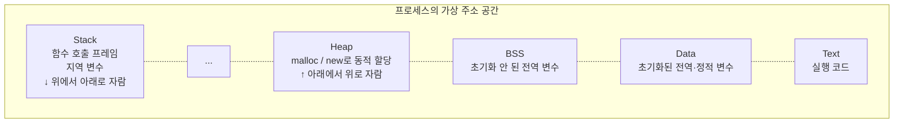
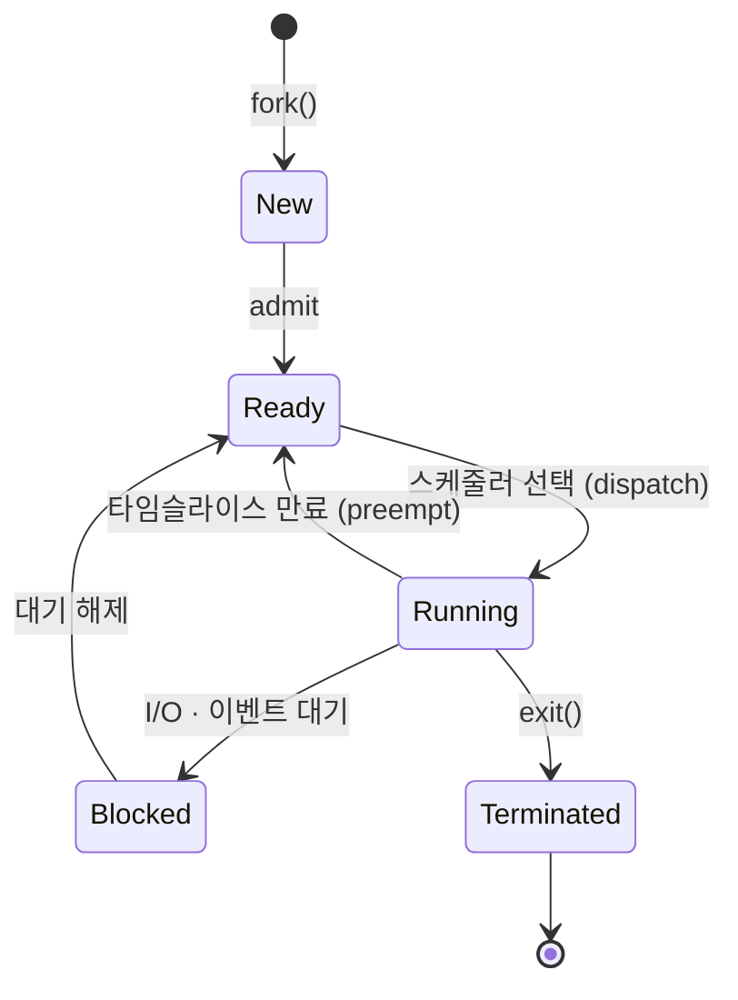

# 프로세스 (Process)

> 최종 업데이트: 2026-06-07 | 기준: POSIX, Linux/Unix 프로세스 모델

## 개념

**프로세스(Process)** 는 **실행 중인 프로그램**이다. 디스크에 있는 실행 파일(프로그램)을 OS가 메모리에 올리고 CPU 시간을 할당하면, 그 순간부터 프로세스가 된다. OS가 자원을 할당하고 관리하는 **기본 단위**.

> 비유하자면 **요리책(프로그램) vs 실제로 요리 중인 주방(프로세스)** 의 관계. 요리책 한 권으로 여러 주방이 동시에 같은 요리를 만들 수 있다(같은 프로그램의 여러 프로세스). 각 주방은 자기 도마·재료·불을 따로 쓰지만(독립 메모리), 같은 요리책을 보고 똑같은 절차를 따른다(같은 코드).

핵심은 **격리**. 각 프로세스는 자신만의 가상 주소 공간을 가져서 다른 프로세스의 메모리를 직접 건드릴 수 없다. 한 프로세스가 죽어도 다른 프로세스엔 영향이 없다(안정성·보안). 대신 프로세스 간 통신(IPC)은 별도 메커니즘이 필요하다.

> 같은 프로세스 안에서 더 가볍게 작업을 나누고 싶을 때 등장하는 게 **스레드**. 프로세스 = 자원 단위, 스레드 = 실행 단위. 자세히는 [OS-Thread.md](OS-Thread.md).

## 배경/역사

- **1960년대 초**: 초기 컴퓨터는 한 번에 한 프로그램만 실행 (배치 처리)
- **1961년 CTSS**: MIT에서 최초의 **시분할 시스템**(Compatible Time-Sharing System) 등장 — 여러 사용자가 동시에 컴퓨터 사용
- **1969년 UNIX**: Ken Thompson·Dennis Ritchie의 UNIX가 **`fork()` + `exec()`** 모델을 표준화 — 현대 프로세스 모델의 원형
- **1970년대 후반**: 가상 메모리·페이징 도입으로 프로세스 격리가 본격화
- **1980년대 Mach 커널**: 프로세스를 **자원 컨테이너**, 스레드를 **실행 단위**로 분리 — 현대적 분리 모델
- **2000년대~**: 컨테이너(Linux namespace + cgroups)가 프로세스 격리의 확장된 형태로 등장 — Docker의 토대

> "Everything is a process"는 UNIX의 핵심 철학. 셸·서버·데몬·심지어 커널 일부까지 프로세스로 표현된다.

## 프로그램 vs 프로세스 vs 인스턴스

| 용어 | 의미 | 비유 |
|---|---|---|
| **Program** | 디스크에 있는 실행 파일 (정적 바이너리) | 요리책 |
| **Process** | 그 프로그램을 메모리에 올려 실행 중인 인스턴스 (동적) | 실제 요리 중인 주방 |
| **Thread** | 프로세스 안에서 실제로 일하는 실행 흐름 | 주방의 요리사 |

같은 프로그램이라도 **두 번 실행하면 두 개의 프로세스**가 된다(예: 크롬 탭마다 별도 프로세스). 각자 독립된 PID와 메모리를 가진다.

## 프로세스의 메모리 구조



| 영역 | 내용 | 특징 |
|---|---|---|
| **Text (Code)** | 기계어 명령 | 읽기 전용, 같은 프로그램 인스턴스 간 공유 가능 |
| **Data** | 초기화된 전역·정적 변수 | 프로그램 시작 시 초기값으로 채움 |
| **BSS** | 초기화 안 된 전역·정적 변수 | 0으로 초기화 |
| **Heap** | 동적 할당 영역 (`malloc`, `new`) | 위로 자람, 직접 관리 |
| **Stack** | 함수 호출 프레임, 지역 변수 | 아래로 자람, 자동 관리 |

> 같은 프로세스의 스레드는 위 영역을 **모두 공유**하되 **스택만 따로** 가진다.

## PCB (Process Control Block)

OS 커널이 각 프로세스를 관리하기 위해 유지하는 자료구조. 컨텍스트 스위칭의 핵심 자료.

| 항목 | 내용 |
|---|---|
| **PID** | 프로세스 고유 식별자 |
| **PPID** | 부모 프로세스 ID |
| **상태** | Ready / Running / Blocked 등 |
| **레지스터 값** | PC, SP, 범용 레지스터 (컨텍스트 스위칭 시 저장) |
| **스케줄링 정보** | 우선순위, CPU 사용량, 시간 슬라이스 |
| **메모리 정보** | 페이지 테이블, 세그먼트 정보 |
| **파일 디스크립터 테이블** | 열린 파일·소켓 목록 |
| **자식 프로세스 목록** | 자신이 생성한 자식들 |

> 리눅스에선 `task_struct`라는 이름의 구조체로 구현. 컨텍스트 스위칭은 결국 "현재 PCB 저장 + 다음 PCB 복원".

## 프로세스 상태와 생명주기



| 상태 | 의미 |
|---|---|
| **New** | 프로세스가 생성되는 중 |
| **Ready** | 실행 가능, CPU 할당 대기 |
| **Running** | 현재 CPU에서 실행 중 |
| **Blocked (Waiting)** | I/O·이벤트 대기. CPU 받아도 못 함 |
| **Terminated (Zombie)** | 종료됐지만 부모가 회수 안 한 상태 |

### 좀비(Zombie) vs 고아(Orphan)

| 상태 | 원인 | 처리 |
|---|---|---|
| **Zombie** | 자식이 종료했는데 부모가 `wait()`로 종료 코드를 안 가져감 | 부모가 `wait()` 호출하거나 부모 종료 시 `init`(PID 1)이 회수 |
| **Orphan** | 부모가 먼저 죽고 자식만 남음 | `init`(또는 `systemd`)이 양자처럼 입양 |

> 좀비가 쌓이면 PID가 고갈된다. 데몬 작성 시 자식 회수 처리는 필수.

## 프로세스 생성 — fork & exec

UNIX의 고전적 두 단계 모델.

```c
pid_t pid = fork();           // 1. 자기 자신을 복제 → 부모/자식 두 프로세스
if (pid == 0) {
    // 자식 프로세스
    execvp("/bin/ls", args);  // 2. 자기 메모리를 다른 프로그램으로 교체
} else {
    // 부모 프로세스
    wait(NULL);               // 자식 종료 대기
}
```

- **`fork()`**: 호출한 프로세스를 **그대로 복제**. 반환값으로 부모는 자식 PID를, 자식은 0을 받음 → 분기
- **`exec()`**: 현재 프로세스의 메모리를 **다른 프로그램의 코드로 교체**. PID는 유지
- 셸이 명령어를 실행하는 방식이 정확히 이 패턴 (`fork` + `exec` + `wait`)

> 리눅스에선 `fork()`도 내부적으론 `clone()` 시스템 콜의 한 형태. 어떤 자원을 공유할지 플래그로 제어한다.

### Copy-on-Write (CoW)

`fork()`가 메모리를 통째로 복사하면 비쌀 텐데, 실제론 **공유하다가 누군가 쓰면 그때 복사**한다. 그래서 `fork()` 자체는 매우 빠름. 가상 메모리 + 페이지 테이블 트릭.

## 사용자 모드 vs 커널 모드

같은 프로세스도 실행 권한에 따라 두 모드를 오간다.

| 모드 | 권한 | 접근 가능 자원 |
|---|---|---|
| **User Mode** | 제한 | 자기 가상 주소 공간만, 직접 하드웨어 접근 불가 |
| **Kernel Mode** | 전권 | 모든 메모리, 하드웨어, 다른 프로세스 |

사용자 모드에서 하드웨어·파일·네트워크를 다루려면 **시스템 콜**(syscall)로 커널 모드에 진입한다.

```
User App
   │  read(fd, buf, n)
   ▼
[시스템 콜 진입]
   │
   ▼
Kernel — 디스크에서 데이터 읽음
   │
   ▼
[복귀]
   │
   ▼
User App 계속 실행
```

> 모드 전환 자체에 비용이 있어서 시스템 콜이 많으면 느려진다. 이게 비동기 I/O·io_uring 등이 등장한 이유.

## IPC (Inter-Process Communication)

프로세스 간 메모리 격리가 강해서 통신할 땐 별도 메커니즘이 필요.

| 방식 | 동작 | 쓰임새 |
|---|---|---|
| **Pipe** | 부모-자식 간 단방향 바이트 스트림 | 셸의 `\|` (파이프) |
| **Named Pipe (FIFO)** | 파일시스템에 이름 가진 파이프 | 무관계 프로세스 간 |
| **Message Queue** | 커널 큐에 메시지 단위 송수신 | 구조화된 메시지 교환 |
| **Shared Memory** | 같은 물리 메모리를 여러 프로세스가 매핑 | **가장 빠름**, 동기화 별도 필요 |
| **Semaphore** | 카운터로 자원 접근 제어 | 동기화 |
| **Signal** | 비동기 알림 (`SIGTERM`, `SIGKILL` 등) | 종료·중단 신호 |
| **Socket** | 네트워크 + 로컬(UNIX Domain Socket) | 범용. 다른 호스트와도 통신 가능 |
| **Memory-Mapped File** | 파일을 메모리에 매핑해 공유 | 큰 데이터 공유 |

> 같은 머신 안에선 **공유 메모리**가 빠르고, 코드가 깔끔하길 원하면 **소켓**·**메시지 큐**가 일반적. 클라우드/MSA에선 결국 네트워크 소켓 기반 IPC(HTTP, gRPC, Kafka)로 옮겨감.

## 프로세스 vs 스레드

| 항목 | Process | Thread |
|---|---|---|
| 메모리 공간 | **독립적** (별도 가상 주소 공간) | **공유** (같은 프로세스 안에서) |
| 생성 비용 | 비쌈 (수 ms) | 저렴 (수 µs) |
| 컨텍스트 스위칭 | 비쌈 (페이지 테이블·TLB 교체) | 저렴 (레지스터·스택만) |
| 통신 | IPC 필요 | 공유 메모리 직접 |
| 안정성 | 강한 격리 | 한 스레드 죽으면 프로세스 전체 영향 |
| 동시성 문제 | 거의 없음 | 락·동기화 필요 |

> 자세히는 [OS-Thread.md](OS-Thread.md)

## 프로세스 스케줄링

OS 스케줄러가 Ready 상태 프로세스 중 누구를 CPU에 올릴지 결정.

| 알고리즘 | 동작 | 특징 |
|---|---|---|
| **FCFS** (First-Come First-Served) | 들어온 순서대로 | 단순, 긴 작업이 짧은 작업을 막음(Convoy Effect) |
| **SJF** (Shortest Job First) | 가장 짧은 작업 우선 | 최적 평균 대기시간, but 길이 예측 어려움 |
| **Round Robin** | 타임슬라이스 단위로 돌아가며 | 시분할에 적합 |
| **Priority Scheduling** | 우선순위 높은 것 먼저 | Starvation 위험 → Aging 기법 |
| **MLFQ** (Multi-Level Feedback Queue) | 여러 우선순위 큐 + 동적 이동 | 리눅스·윈도우 실무 표준 |
| **CFS** (Completely Fair Scheduler) | 모든 프로세스에 공평한 CPU 시간 | Linux 기본 (2007~) |

## 명령어 (Linux/Unix)

```bash
ps aux                    # 모든 프로세스 목록
ps -ef | grep nginx       # 특정 프로세스 찾기
top                       # 실시간 모니터링
htop                      # top의 개선판 (인터랙티브)
pidof nginx               # 프로세스명 → PID
kill -9 1234              # PID 1234에 SIGKILL
killall nginx             # 이름으로 일괄 종료
nice -n 10 ./heavy        # 우선순위 낮춰서 실행
renice -n 5 -p 1234       # 실행 중 프로세스 우선순위 변경
strace -p 1234            # 시스템 콜 추적
lsof -p 1234              # 프로세스가 연 파일·소켓
```

> Linux 관점 자세히는 [../../Linux/프로세스/프로세스.md](../../Linux/프로세스/프로세스.md)

## 데몬(Daemon) 프로세스

백그라운드에서 서비스를 제공하는 **장기 실행 프로세스**. UNIX 관례로 이름이 `d`로 끝남 (`sshd`, `httpd`, `systemd`).

특징:
- 부모가 `init`/`systemd` (PID 1)
- 터미널과 분리됨 (TTY 없음)
- 로그는 파일이나 syslog로

> 한때 직접 데몬화하는 코드(double fork + setsid)를 짰지만, 요즘은 `systemd` 같은 서비스 매니저가 알아서 처리.

## 컨테이너 — 격리의 확장

리눅스 컨테이너는 결국 **프로세스 + 격리(namespace) + 자원 제한(cgroups)** 의 조합이다. 컨테이너는 가상머신이 아니라, 호스트 위에서 도는 **격리된 프로세스 무리**.

- **Namespace**: PID·네트워크·마운트·UTS 등 자원의 이름 공간을 격리 (다른 컨테이너의 프로세스는 안 보임)
- **cgroups**: CPU·메모리·I/O 사용량 제한

> Docker가 새로 만든 게 아니라 리눅스가 이미 가진 기능을 묶어 쓰기 좋게 포장한 것.

## 관련 문서

- [OS-Thread.md](OS-Thread.md) — 스레드 (실행 단위)
- [CPU.md](CPU.md)
- [IO-작업.md](IO-작업.md)
- [../IO-Model.md](../IO-Model.md)
- [../../Linux/프로세스/프로세스.md](../../Linux/프로세스/프로세스.md)
- [../../Java/Java-Process/Java-Process-Basic.md](../../Java/Java-Process/Java-Process-Basic.md)
- [../../DevOps/](../../DevOps/) — 컨테이너 관련

## 출처

- [The Linux Programming Interface (Michael Kerrisk)](https://man7.org/tlpi/)
- [Operating System Concepts (Silberschatz et al.)]
- [POSIX.1-2017](https://pubs.opengroup.org/onlinepubs/9699919799/)
