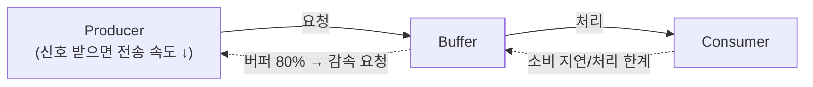

# Buffering (버퍼링 / 큐잉)

> 최종 업데이트: 2026-05-13 | 백엔드 트래픽 제어 관점

## 개념

Buffering은 **들어오는 데이터/요청을 즉시 처리하지 못할 때 임시 저장소(버퍼/큐)에 쌓아두고 입력 속도와 처리 속도를 분리하는 기법**이다. 두 속도 간 차이를 흡수해 시스템 안정성을 높인다.

> 식당의 대기 줄과 같다. 주방에서 한 번에 만들 수 있는 음식은 한정되어 있지만, 손님이 몰리면 받아둔 주문(버퍼)을 차례로 처리한다. 줄이 너무 길어지면 받기를 멈추거나 손님이 떠나야(드롭) 한다.

- **버퍼**와 **큐**는 거의 같은 의미로 쓰이지만, 큐는 **FIFO 순서**를 강조하고, 버퍼는 **속도 흡수** 목적을 강조
- 적용 위치: 네트워크 소켓, 로그 수집, 메시지 처리, API 요청 등
- 핵심 결정: **얼마나** 버퍼링할 것인가, **꽉 차면** 어떻게 할 것인가

## 왜 필요한가

| 상황 | 버퍼가 없으면 |
|---|---|
| 순간 트래픽 폭증 | 처리 못한 요청 즉시 드롭 → 사용자 실패 |
| 생산자/소비자 속도 차이 | 빠른 쪽이 느린 쪽을 기다림 → 자원 낭비 |
| 일시적 다운스트림 장애 | 모든 요청 실패 → 데이터 손실 |
| 배치 처리 최적화 | 개별 처리로 비효율적 |

## 버퍼 종류

| 종류 | 위치 | 예시 | 영속성 |
|---|---|---|---|
| **메모리 버퍼** | 프로세스 내 | `BlockingQueue`, `Channel`, `BufferedReader` | 휘발성 |
| **메시지 큐** | 별도 미들웨어 | Kafka, RabbitMQ, SQS | 디스크 영속 |
| **디스크 버퍼** | 로컬 파일 | Fluentd `buffer file`, Loki WAL | 영속 |
| **OS 버퍼** | 커널 | TCP 송수신 버퍼, 파이프 버퍼 | 휘발성 |

## 큐가 꽉 찼을 때 정책

가장 중요한 설계 결정이다.

| 정책 | 동작 | 적합 상황 |
|---|---|---|
| **Block** | 생산자를 멈춤 (블로킹) | 데이터 유실 절대 불가 |
| **Drop Newest (Tail Drop)** | 새 요청을 버림 | 기존 처리가 더 중요 |
| **Drop Oldest (Head Drop)** | 가장 오래된 것을 버림 | 최신 데이터가 더 중요 (실시간 시세 등) |
| **Reject (Fail Fast)** | 즉시 에러 반환 | 사용자에게 빨리 알려야 함 (HTTP 503) |
| **Spillover** | 디스크/2차 저장소로 흘림 | 유실 안 되면서 메모리는 보호 |

## 백프레셔 (Backpressure)

버퍼가 차오를 때 **생산자에게 "천천히 보내"라고 알리는 메커니즘**.



백프레셔를 거는 방식은 **누가 흐름의 주도권을 쥐느냐**로 갈린다.

> 뷔페에 비유하면 — **Push**는 직원이 계속 접시를 가져다주는 식이라 "그만 주세요"라고 *말해야* 멈춘다. **Pull**은 내가 필요할 때 가서 떠오는 식이라, 안 가면 그냥 안 쌓인다(자연스러운 백프레셔).

### Push 방식

생산자가 기본적으로 데이터를 *밀어 넣는다*. 따라서 백프레셔를 걸려면 소비자가 **"앞으로 n개만 더 보내"라는 demand 신호를 명시적으로 위로 보내야** 한다. 이 신호 프로토콜이 없으면 빠른 생산자가 느린 소비자를 덮어 버퍼가 무한히 자라거나 **OOM**.

- 예: Reactive Streams(Project Reactor, RxJava)의 `subscription.request(n)`, TCP 흐름 제어(수신 윈도우)
- 장점: 데이터가 즉시 흘러 **latency 낮음**
- 단점: demand 신호 프로토콜이 필수 → 구현 복잡, 신호 누락 시 폭주 위험

```java
subscription.request(10);   // "10개까지만 받을게" — 소비자가 위로 보내는 demand
// 10개 처리 후 다시 request(10) ... 처리 가능한 만큼만 당겨옴
```

### Pull 방식

소비자가 처리 가능할 때 **직접 가지러 간다**. 더 못 당기면 안 가져오면 그만이라 **백프레셔가 구조적으로 내장**돼 있다 — 별도 신호 프로토콜이 불필요.

- 예: Kafka `consumer.poll()`, JDBC 커서, Iterator
- 장점: 단순함, 자연스러운 백프레셔, 소비자 메모리 안전
- 단점: 폴링 주기만큼 latency 추가. **밀린 데이터가 소비자가 아니라 상류(브로커 디스크)에 쌓임** → Kafka retention 초과 시 유실 가능하므로 컨슈머 lag 모니터링 필수

```java
while (true) {
    var records = consumer.poll(Duration.ofMillis(500));  // 처리 가능할 때만 당김
    process(records);                                      // 느리면 다음 poll이 늦어질 뿐
}
```

| 구분 | Push | Pull |
|---|---|---|
| 흐름 주도 | 생산자가 밀어냄 | 소비자가 당겨감 |
| 백프레셔 | **명시적 신호 필요**(`request(n)`) | **구조적으로 내장** |
| latency | 낮음 (즉시 전달) | 폴링 주기만큼 지연 |
| 백로그 위치 | 소비자 측 버퍼 (OOM 위험) | 상류/브로커 (lag·retention 관리) |
| 대표 예 | Reactive Streams, TCP | Kafka consumer, JDBC 커서 |

## 버퍼 크기의 트레이드오프

| 크기 | 장점 | 단점 |
|---|---|---|
| 작은 버퍼 | 메모리 절약, 낮은 latency | 버스트 흡수력 약함, 드롭 빈번 |
| 큰 버퍼 | 버스트 잘 흡수 | **bufferbloat** (큐잉 지연 증가), OOM 위험 |

**Bufferbloat**: 버퍼가 너무 크면 요청이 큐에서 오래 기다리느라 latency가 폭증하는 현상. "버퍼는 클수록 좋다"는 통념을 깬 사례로, 2010년경 Jim Gettys가 명명.

## 구현 예시

### Java BlockingQueue (메모리 버퍼)

```java
BlockingQueue<Request> queue = new ArrayBlockingQueue<>(1000);

// Producer
boolean accepted = queue.offer(request, 100, TimeUnit.MILLISECONDS);
if (!accepted) {
    return Response.status(503).build();  // 큐 풀, 거부
}

// Consumer
while (true) {
    Request req = queue.take();  // 비면 블록
    process(req);
}
```

### Spring WebFlux (Reactive Buffer)

```java
Flux.from(requests)
    .onBackpressureBuffer(1000,
        dropped -> log.warn("Dropped: {}", dropped),
        BufferOverflowStrategy.DROP_OLDEST)
    .flatMap(this::process, 10)  // 동시 처리 10개
    .subscribe();
```

### Fluentd Buffer 설정

```text
<buffer>
  @type file
  path /var/log/fluentd-buffer
  chunk_limit_size 8MB
  total_limit_size 8GB
  flush_interval 10s
  overflow_action drop_oldest_chunk
</buffer>
```

로그 수집기는 디스크 버퍼로 다운스트림 장애를 견디는 게 일반적.

### TCP 송수신 버퍼

OS 커널이 관리. 네트워크 카드와 애플리케이션 사이의 속도 차를 흡수.

```bash
sysctl net.ipv4.tcp_rmem  # 수신 버퍼 (min default max)
sysctl net.ipv4.tcp_wmem  # 송신 버퍼
```

## Rate Limiting과의 관계

[[Rate-Limiting]]에서 Leaky Bucket과 Token Bucket 모두 내부에 버퍼/큐를 사용한다.

| 패턴 | 버퍼 역할 |
|---|---|
| Leaky Bucket | 들어온 요청을 큐에 쌓고 일정 속도로 누수 |
| Token Bucket | 토큰 없을 때 요청을 큐에 두고 충전 대기 |
| 일반 큐잉 | 처리 가능할 때까지 보관 |

## 모니터링 포인트

| 메트릭 | 의미 |
|---|---|
| 큐 길이 (current size) | 평소 80% 이상이면 처리 부족 신호 |
| 대기 시간 (queue time) | bufferbloat 조기 감지 |
| 드롭 수 (dropped count) | 정책에 따라 일부는 정상이지만 추세는 봐야 함 |
| 처리량 (throughput) | 소비자 속도 (생산 속도와 비교) |

## 관련 문서

- [[Rate-Limiting]] — 버퍼를 활용한 트래픽 제어 (Leaky/Token Bucket)
- [[Ticker]] — 주기적 flush, 큐 처리 트리거
- [[1)-Kafka-개념]] — 영속 메시지 큐의 대표 사례
- [[fluentd]] — 로그 수집에서의 버퍼 설계
