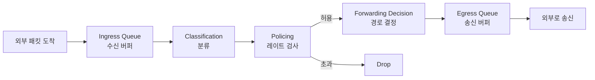

# Ingress (인그레스)

> 최종 업데이트: 2026-05-14 | 네트워크/트래픽 제어 관점

## 개념

Ingress는 **시스템(네트워크 장비, 호스트, 인터페이스 등) 입장에서 외부로부터 안으로 들어오는 트래픽 방향**을 말한다. 반대 방향은 Egress(나가는 트래픽).

> 건물 출입구를 떠올리면 쉽다. 사람이 건물로 **들어오는** 문이 Ingress, **나가는** 문이 Egress. 보안 검색대(방화벽), 대기 줄(큐), 입장 통제(rate limit)는 모두 ingress 쪽에서 일어난다.

핵심은 "방향"이라는 개념이라서 적용 대상에 따라 의미가 살짝씩 달라진다:

| 적용 대상 | Ingress의 의미 |
|---|---|
| 네트워크 장비 (스위치/라우터) | 인터페이스로 **수신**되는 패킷 |
| 호스트 (서버/PC) | NIC가 **받는** 패킷 |
| 쿠버네티스 클러스터 | 클러스터 **외부 → 내부** HTTP 트래픽 |
| 클라우드 보안 그룹 | 인스턴스로 **들어오는** 연결 규칙 |
| Linux tc | NIC로 **수신**되는 패킷에 적용되는 qdisc |

## 배경/역사

- **어원**: 라틴어 *ingressus* (들어감) / *egressus* (나감). 네트워크에서는 1980~90년대 QoS(Quality of Service) 논의가 본격화되면서 패킷 방향을 구분할 표준 용어로 정착
- **QoS와 함께 발전**: Cisco IOS의 QoS 모델이 ingress/egress queue를 명시적으로 구분하면서 업계 표준 용어가 됨. ingress 단계에서는 classification·marking·policing, egress 단계에서는 queueing·scheduling·shaping을 수행하는 패턴이 일반화
- **현대적 확장**: 컨테이너/클라우드 시대에 와서는 단순 패킷 방향을 넘어 "클러스터 외부 → 내부" 같은 **경계(boundary) 통과 방향**의 의미로도 확장됨 (예: 쿠버네티스 Ingress 리소스)

## Ingress vs Egress

| 구분 | Ingress | Egress |
|---|---|---|
| 방향 | 외부 → 내부 (수신) | 내부 → 외부 (송신) |
| 주요 작업 | 분류, 마킹, 폴리싱(policing) | 큐잉, 스케줄링, 셰이핑(shaping) |
| 정책 정밀도 | 비교적 단순 (drop or pass) | 정교 (우선순위 큐, 대역폭 분배) |
| 제어 시점 | "받을지 말지" 결정 | "언제·어떻게 보낼지" 결정 |
| 대표 예시 | 방화벽 inbound rule, rate limit | QoS 우선순위 큐, traffic shaping |

> **왜 egress 쪽이 더 정교한가**: 들어오는 패킷은 이미 도착했기 때문에 거부/통과 외에는 선택지가 좁다. 반면 나가는 패킷은 내가 보내는 시점·순서를 통제할 수 있어 셰이핑·우선순위 조정의 여지가 크다.

## Ingress Queue

수신한 패킷이 **처리(라우팅/필터링/포워딩) 전에 대기**하는 버퍼. 순간적인 트래픽 폭증을 흡수해 패킷 드롭을 줄이는 역할.

> 고속도로 톨게이트의 진입 대기 차선. 처리 속도(톨게이트 게이트 수)보다 도착 속도(차량)가 빠를 때 일단 줄을 세워둔다.

### 동작 흐름



### 큐가 가득 찼을 때

자세한 큐 관리 정책은 [[Buffering]] 참고. 네트워크 장비에서 자주 쓰이는 정책:

| 정책 | 동작 |
|---|---|
| **Tail Drop** | 새로 들어온 패킷을 그냥 버림 (가장 단순) |
| **RED (Random Early Detection)** | 큐가 일정 수준 차면 **확률적으로 미리** 버려 혼잡 회피 |
| **WRED (Weighted RED)** | RED를 트래픽 클래스별 가중치로 적용 (중요한 트래픽은 덜 버림) |

## 적용 사례

### 1) 네트워크 장비 (Cisco IOS)

```
! 인터페이스의 ingress 트래픽에 정책 적용
interface GigabitEthernet0/1
  service-policy input INGRESS_POLICY
```

`input`이 ingress, `output`이 egress. ingress 쪽에서는 보통 polic(레이트 제한)이나 marking(DSCP/CoS 표시)을 한다.

### 2) Linux Traffic Control (tc)

```bash
# eth0 인터페이스의 ingress qdisc 추가
tc qdisc add dev eth0 handle ffff: ingress

# 들어오는 트래픽 10Mbps로 제한
tc filter add dev eth0 parent ffff: protocol ip prio 1 \
  u32 match ip src 0.0.0.0/0 police rate 10mbit burst 10k drop
```

Linux는 egress qdisc는 매우 다양(htb, fq_codel 등)하지만 **ingress qdisc는 기능이 제한적** — 셰이핑 없이 폴리싱(drop)만 가능. 위 비대칭성이 "egress가 더 정교하다"는 일반 원칙과 일치.

### 3) NIC Multi-Queue (RSS)

현대 NIC는 ingress queue를 여러 개 두고 CPU 코어별로 분배(Receive Side Scaling)해서 처리량을 늘린다. 하나의 큐가 한 CPU 코어에 묶이는 구조.

```bash
# NIC의 ingress 큐 개수 확인
ethtool -l eth0
```

### 4) 클라우드 보안 그룹 (AWS)

```
Ingress Rules (인바운드):
  - TCP 443 from 0.0.0.0/0   ← 외부에서 들어오는 HTTPS 허용
  - TCP 22  from 10.0.0.0/16 ← 내부 VPC에서 들어오는 SSH만 허용

Egress Rules (아웃바운드):
  - All traffic to 0.0.0.0/0 ← 인스턴스에서 나가는 트래픽 전부 허용
```

방화벽([[방화벽]])의 inbound/outbound rule이 본질적으로 ingress/egress 정책.

### 5) 쿠버네티스 Ingress (별개의 리소스)

쿠버네티스에서 `Ingress`는 **리소스 이름**이기도 한데, 의미는 같은 맥락이다 — **클러스터 외부에서 내부 서비스로 들어오는 HTTP/HTTPS 트래픽 라우팅 규칙**.

```yaml
apiVersion: networking.k8s.io/v1
kind: Ingress
metadata:
  name: my-ingress
spec:
  rules:
    - host: api.example.com
      http:
        paths:
          - path: /
            pathType: Prefix
            backend:
              service: { name: api-service, port: { number: 80 } }
```

K8s Ingress는 "ingress 방향 트래픽 처리"라는 일반 개념의 **특정 응용**이다. 큐가 아니라 라우팅 규칙이라는 점이 네트워크 장비 ingress queue와의 차이.

## 정리

- Ingress는 **방향 개념** — "내 시스템 입장에서 들어오는 쪽"
- 어디에 적용되느냐에 따라 큐, 정책, 규칙, 리소스 등으로 구체화됨
- Egress와 짝지어 이해하는 게 핵심. 일반적으로 **ingress는 단순·필수 제어**, **egress는 정교한 품질 제어**

## 관련 문서

- [[Buffering]] — 큐가 가득 찼을 때 정책, 백프레셔 등 일반적 버퍼링 개념
- [[Rate-Limiting]] — ingress 단계에서 자주 적용되는 폴리싱 기법
- [[방화벽]] — ingress/egress rule의 응용
- [[트래픽과-대역폭]] — QoS 셰이핑/폴리싱과 직결되는 기초
