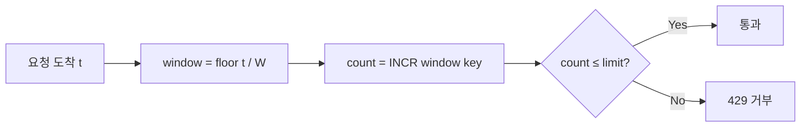
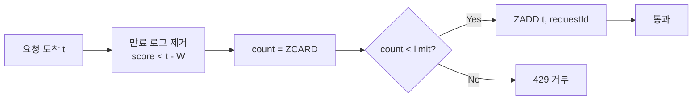
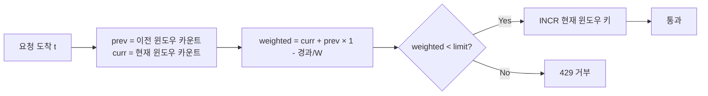
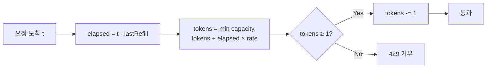
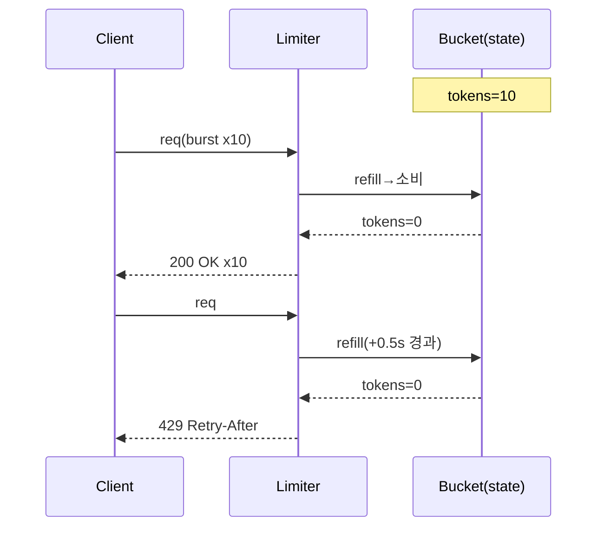
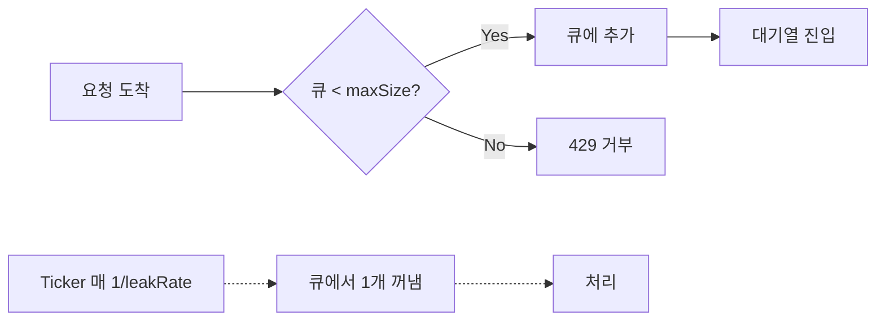

# Rate Limiting (속도 제한 / 쓰로틀링)

> 최종 업데이트: 2026-05-13 | 일반 백엔드/네트워크 관점


## 개념

Rate Limiting은 **단위 시간당 처리할 요청 수를 제한하는 트래픽 제어 기법**이다. 한도를 넘는 요청은 거부(reject)하거나 지연(delay)시켜 시스템이 과부하로 무너지지 않도록 보호한다. 한국어로는 흔히 **쓰로틀링(throttling)** 또는 **속도 제한**이라 부른다.

> 클럽 입장 통제와 같다. 매장 정원이 100명이면, 들어가려는 사람이 200명이어도 100명만 들여보내고 나머지는 입구에서 기다리거나 돌려보낸다. 안에 있는 사람들의 안전(서비스 품질)을 지키기 위함.

- 목적: 과부하 방지, 비용 통제, 공정한 자원 분배, 악의적 트래픽 차단
- 적용 위치: 클라이언트 → CDN → API Gateway → 애플리케이션 → DB 어디든 가능
- 응답 방식: 거절(HTTP 429), 큐잉(대기), 토큰 소비(과금)

실무에서 가장 헷갈리는 축은 **한도를 넘었을 때 거절하느냐, 지연하느냐**다. 같은 알고리즘이라도 이 응답 모드에 따라 용도가 완전히 갈린다.

| 응답 모드 | 동작 | 보호 대상 | 대표 알고리즘 | 예시 |
|---|---|---|---|---|
| **거절형** (admission control) | 한도 초과 시 즉시 `429` 반환 | 우리 서버 입구 | Fixed/Sliding Window, Token Bucket | 로그인 brute-force 차단, 공개 API 쿼터 |
| **페이서형** (pacing) | 거절 안 하고 큐에 쌓아 **일정 속도로 천천히 소비** | **하위 시스템**(DB, 외부 게이트웨이) | **Leaky Bucket** | 50만 건 대량 문자/푸시 발송, 배치 처리 |

> 예: 수신자 50만 명짜리 문자 발송 요청은 거절할 수 없다. 전부 큐에 적재한 뒤, worker가 rate limiter를 **거절이 아니라 blocking acquire(토큰 없으면 대기)**로 사용해 게이트웨이가 견디는 TPS로만 흘려보낸다. 이것이 페이서형이며, 아래 [Leaky Bucket](#5-leaky-bucket-누수-버킷) 섹션이 정확히 이 케이스다.

## 배경/역사

원래 **ATM/네트워크 트래픽 정형화(traffic shaping)** 분야에서 발전한 기법이다.

- **1986년**: Jonathan S. Turner가 **Leaky Bucket** 알고리즘을 ATM 네트워크 셀 통제용으로 제안 (논문 "New directions in communications")
- 비슷한 시기 **Token Bucket**이 IP 네트워크 QoS(품질 보증) 영역에서 등장
- 2000년대 웹 API 폭증과 함께 **API Rate Limiting**으로 영역 확장 — Twitter(2006), GitHub 등이 공개 API 보호를 위해 도입
- **2012년 RFC 6585**: HTTP `429 Too Many Requests` 상태 코드 표준화
- 2010년대 후반: 분산 환경 대응으로 Redis 기반 분산 Rate Limiter(예: `rate-limiter-flexible`, Bucket4j Hazelcast) 보편화

## 왜 필요한가

| 보호 대상 | 시나리오 |
|---|---|
| **서버 자원** | 트래픽 폭증으로 CPU/메모리/커넥션 풀 고갈 |
| **하위 시스템** | DB, 외부 API 호출량 제어 (특히 유료 API) |
| **공정성** | 한 사용자가 자원을 독점하지 않도록 분배 |
| **보안** | 무차별 대입, 크롤링, DDoS 완화 |
| **비용** | 클라우드 사용량 기반 과금 통제 |

## 주요 알고리즘

아래 동작 흐름 설명에서 공통으로 쓰는 기호:

| 기호 | 의미 |
|---|---|
| `t` | 요청이 들어온 순간의 현재 시각 (Unix 타임스탬프 — 코드에선 `System.currentTimeMillis()` 같은 큰 정수) |
| `W` | 윈도우 길이 (제한 기준 시간, 예: 60초 = 60000ms) |
| `limit` | 윈도우당 허용 요청 수 |

### 1. Fixed Window Counter (고정 윈도우)

시간을 고정 구간(예: 1분 단위)으로 잘라 각 구간 안에서 N개까지만 허용. 구간이 바뀌면 카운터를 0으로 리셋한다.

> 영화관 매표와 같다. 회차마다 100석을 새로 열고, 회차가 바뀌면 카운터를 처음부터 다시 센다. 직전 회차에 몇 명이 들어왔든 신경 안 씀.

**동작 흐름:**



1. **요청 도착** — 현재 시각 `t`를 읽음
2. **윈도우 식별** — `floor(t / W)`로 "지금이 몇 번째 시간 칸인지" 번호를 구함 (W=윈도우 길이). 타임라인을 W초 단위로 토막 내 번호를 매기는 것 — 예를 들어 W=60일 때 t=10초·59초는 모두 0번 칸, t=60초부터는 1번 칸. 같은 칸 = 같은 카운터 공유
3. **카운터 증가** — 그 구간 키의 카운트를 1 증가. 첫 증가면 키에 TTL 설정 (구간 끝나면 자동 삭제)
4. **한도 비교** — `count ≤ limit`이면 통과, 초과면 `429` 거부
5. **구간 전환** — 시각이 다음 구간으로 넘어가면 새 키가 0부터 시작 (이전 카운트와 무관)

**경계 폭주 시각화:**

| 시각 | 0~59초 카운트 | 60~119초 카운트 | 비고 |
|---|---|---|---|
| 59초 | 100개 도착 | - | 한도 도달 |
| 60초 | (만료) | 0으로 리셋 | - |
| 61초 | - | 100개 도착 | 모두 통과 |

평균 한도 100/min인데 **59~61초 사이 2초 동안 200개 통과** → 사실상 한도 무력화.

**언제 쓰나 / 피하나:**

| 적합 | 부적합 |
|---|---|
| 구현 단순성이 최우선 | 정확한 한도가 필수 (결제, 유료 외부 API) |
| 트래픽이 균일해서 경계 효과 미미 | 어뷰저가 경계 폭주를 노릴 수 있는 환경 |
| 로깅/분석용 카운팅 | DDoS 방어 (경계 직전 폭주로 우회됨) |

### 2. Sliding Window Log (슬라이딩 윈도우 로그)

각 요청의 타임스탬프를 모두 기록하고, "현재 시각 − 윈도우 길이" 이후의 로그만 세어 한도와 비교한다. 매 요청마다 만료된 로그를 청소하면서 평가.

> 출입 기록부에 모든 입장 시각을 적어두고, 새 입장자가 올 때마다 "최근 1시간 안의 기록"만 다시 셈. 시간이 흐르면 옛 기록은 자동으로 윈도우 밖으로 밀려나감.

보통 Redis Sorted Set(score = 타임스탬프)으로 구현한다. 만료 제거 → 카운트 → 추가가 여러 명령으로 나뉘어 race condition이 생길 수 있으므로, 정확한 원자성이 필요하면 Lua 스크립트로 묶어 실행한다.

**동작 흐름:**



1. **요청 도착** — 현재 시각 `t`
2. **만료 로그 제거** — Sorted Set에서 score(= 타임스탬프)가 `t − W`보다 오래된 항목 일괄 삭제 → 윈도우 밖 기록 청소
3. **현재 개수 조회** — 남은 항목 수(`ZCARD`)가 곧 최근 W초 동안의 요청 수
4. **한도 비교** — `count < limit`이면 통과, 아니면 `429` 거부
5. **로그 추가** — 통과 시 현재 요청의 타임스탬프를 Sorted Set에 추가 (다음 평가의 대상이 됨)

**시간별 상태 변화 (한도 5/min, 윈도우 60초):**

| 시각 | 이벤트 | 로그 상태 (타임스탬프) | 카운트 | 결과 |
|---|---|---|---|---|
| 0초 | 요청 A | [0] | 1 | 통과 |
| 10초 | 요청 B | [0, 10] | 2 | 통과 |
| 20초 | 요청 C | [0, 10, 20] | 3 | 통과 |
| 30초 | 요청 D | [0, 10, 20, 30] | 4 | 통과 |
| 40초 | 요청 E | [0, 10, 20, 30, 40] | 5 | 통과 (한도 도달) |
| 50초 | 요청 F | [0, 10, 20, 30, 40] | 5 | **거부** |
| 65초 | 요청 G | [10, 20, 30, 40, 65] | 5 | 통과 (0초 만료) |

**메모리 비용:** 사용자 N명 × 평균 활성 요청 M개 ≒ N × M 타임스탬프. 사용자가 100만이고 분당 평균 30요청이면 3천만 엔트리.

**언제 쓰나 / 피하나:**

| 적합 | 부적합 |
|---|---|
| 정확한 한도가 필수 (결제, 유료 API) | 사용자가 많고 요청 빈도가 높은 경우 (메모리 폭증) |
| 트래픽이 적은 내부 시스템 | 초당 수만 요청 처리하는 핫패스 |
| 정밀 분석/감사 로그가 필요한 경우 | 메모리 효율이 중요한 환경 |

### 3. Sliding Window Counter (슬라이딩 윈도우 카운터)

이전 윈도우와 현재 윈도우 **두 개만** 카운터로 유지. 현재 윈도우의 진행률에 따라 이전 카운트를 가중치로 합산해 평가. Fixed Window의 단순함과 Sliding Log의 정확성을 절충.

> 한 달 식비 예산을 짤 때, 이번 달 쓴 금액에 "지난달 쓴 금액 중 아직 안 지난 비율만큼"을 더해서 판단하는 것과 비슷. 월초엔 지난달 영향이 크고, 월말엔 거의 0.

**계산 공식:**

```text
가중 카운트 = 현재 윈도우 카운트
           + 이전 윈도우 카운트 × ((윈도우 길이 − 현재 윈도우 경과 시간) / 윈도우 길이)
```

**동작 흐름:**



1. **요청 도착** — 현재 시각 `t`, 현재 윈도우 번호와 윈도우 내 경과 시간 계산
2. **두 카운터 조회** — 이전 윈도우 카운트(`prev`)와 현재 윈도우 카운트(`curr`)를 가져옴
3. **가중 합산** — `weighted = curr + prev × (1 − 경과/W)` — 현재 윈도우가 진행될수록 이전 영향이 선형 감소
4. **한도 비교** — `weighted < limit`이면 통과, 아니면 `429` 거부
5. **현재 윈도우 증가** — 통과 시 현재 윈도우 키만 `INCR` (이전 윈도우는 시간이 지나며 자연히 가중치 0으로 소멸)

**시간별 상태 변화 (한도 100/분):**

| 시각 | 상황 | 이전(0~60초) | 현재(60~120초) | 경과 | 가중 카운트 | 결과 |
|---|---|---|---|---|---|---|
| 60초 시점 | 이전 분에 80개 처리됨 | 80 | 0 | 0% | 0 + 80 × 1.0 = **80** | 통과 |
| 75초 | 30개 추가됨 | 80 | 30 | 25% | 30 + 80 × 0.75 = **90** | 통과 (10 남음) |
| 90초 | 20개 더 도착 | 80 | 50 | 50% | 50 + 80 × 0.5 = **90** | 통과 |
| 100초 | 15개 도착 | 80 | 65 | 67% | 65 + 80 × 0.33 = **91.4** | 14개 통과 가능 |
| 120초 | 분 경계 통과 | 100 (이전이 됨) | 0 | 0% | 0 + 100 × 1.0 = **100** | 한도 도달 |

이전 분의 영향이 시간이 갈수록 선형 감소 → 경계 폭주가 자연스럽게 평탄화됨.

**언제 쓰나 / 피하나:**

| 적합 | 부적합 |
|---|---|
| 대부분의 API Rate Limiting (현실적 디폴트) | 토큰/크레딧이 정확히 N개여야 하는 회계성 시스템 |
| Fixed Window의 경계 문제는 싫지만 Log는 무거울 때 | 트래픽이 윈도우 내 매우 불균등한 경우 (가중 평균이 왜곡) |
| **Cloudflare 운영 검증** (수십억 요청/일) | - |

### 4. Token Bucket (토큰 버킷)

버킷에 일정 주기로 토큰을 채워두고, 요청 시 토큰을 1개씩 소비. 토큰이 0이면 거부. 토큰이 쌓여 있으면 한꺼번에 소비 가능 → **버스트 허용**이 핵심.

> 동전 저금통에 매초 동전이 한 개씩 떨어진다. 평소엔 안 쓰다가 자판기 앞에서 모아둔 동전을 한 번에 쏟아 음료 10개 살 수 있음. 단, 저금통 용량(capacity)을 넘어서 쌓이진 않음.

**핵심 파라미터:**

| 파라미터 | 의미 | 튜닝 효과 |
|---|---|---|
| **capacity** | 최대 보관 토큰 수 | 크게 → 큰 버스트 허용 / 작게 → 평탄한 트래픽 강제 |
| **refillRate** | 초당 충전 속도 | 장기 평균 처리율 결정 |

실제로는 [[Ticker]]를 안 돌려도 되고, **요청이 들어올 때 경과시간만큼 lazy하게 충전**하는 게 일반적 (메모리/CPU 절약).

**동작 흐름:**



1. **요청 도착** — 현재 시각 `t`
2. **경과 시간 계산** — 마지막 충전 이후 흐른 시간 `elapsed = t − lastRefill`
3. **lazy 충전** — `tokens + elapsed × rate`만큼 채우되 `capacity`를 넘지 않음 (별도 [[Ticker]] 스레드 불필요)
4. **토큰 확인** — `tokens ≥ 1`이면 1개 소비 후 통과, 없으면 `429` 거부
5. **버스트 특성** — 안 쓰는 동안 토큰이 `capacity`까지 쌓여, 한꺼번에 몰린 요청을 그 한도까지 즉시 통과

**시간별 상태 변화 (capacity=10, refillRate=1/s):**

| 시각 | 들어온 요청 | 충전 | 토큰 잔량 | 통과/거부 |
|---|---|---|---|---|
| 0초 | — | (시작 시 10) | 10 | — |
| 10초 | 10개 일시 도착 | +0 (이미 가득) | 10 → 0 | **10개 모두 통과** (버스트) |
| 11초 | 2개 도착 | +1 | 1 → 0 | 1개 통과, 1개 거부 |
| 12초 | 0개 | +1 | 1 | — |
| 13초 | 0개 | +1 | 2 | — |
| 20초 | 5개 도착 | +7 (10까지) | 9 → 4 | 5개 모두 통과 |
| 21초 | 6개 도착 | +1 | 5 → 0 | 5개 통과, 1개 거부 |

**시퀀스 다이어그램:**



**언제 쓰나 / 피하나:**

| 적합 | 부적합 |
|---|---|
| 일반 API 서비스의 사실상 표준 | 하위 시스템이 **균일한 입력 속도**를 요구할 때 (Leaky Bucket이 적합) |
| 사용자 패턴이 가끔 몰아치는 경우 (배치, 페이지 로드 등) | 회계성 정확도가 필요한 곳 |
| **AWS API Gateway, Stripe, GitHub API** 등 채택 | - |

### 5. Leaky Bucket (누수 버킷)

들어오는 요청을 큐에 쌓고, **일정 속도(leak rate)로** 큐에서 빼내 처리. 큐가 꽉 차면 새 요청 거부. 출력 속도가 항상 일정한 게 핵심. 앞서 말한 **페이서형(pacing)의 대표 구현**이 바로 이것 — 거절이 아니라 "쌓아두고 천천히 소비"가 목적이다.

> 깔때기에 물을 부으면 위는 빠르게 부어도 아래로는 천천히 일정하게 떨어진다. 깔때기가 넘치면 물이 흘러내려 버려진다(드롭).

**구현 변형 — Meter 방식 (Nginx `limit_req`):**

실제 큐 없이 **가상 "수위(level)" 변수** 하나로 처리. 요청마다 `level += 1`, 시간 흐름에 따라 `level -= leakRate × elapsed`로 수위가 빠짐. `level`이 `maxSize`를 넘으면 거부. 요청별 객체를 안 만들어 메모리 효율이 훨씬 좋다.

**동작 흐름:**



**입력 경로 (요청이 들어올 때):**

1. **요청 도착** — 현재 큐 길이 확인
2. **용량 비교** — `큐 길이 < maxSize`이면 큐에 추가, 가득 찼으면 `429` 거부
3. **대기열 진입** — 추가된 요청은 처리될 때까지 FIFO로 대기 (즉시 응답이 아니라 지연 가능)

**출력 경로 (Ticker가 별도로):**

4. **주기적 누수** — [[Ticker]]가 `1/leakRate` 간격으로 큐에서 정확히 1개 꺼냄
5. **일정 속도 처리** — 입력이 폭주해도 출력은 항상 `leakRate`로 평탄 → 하위 시스템 보호

**시간별 상태 변화 (maxSize=5, leakRate=1/s, Queue 방식):**

| 시각 | 들어온 요청 | 큐 상태 (FIFO) | 처리 | 거부 |
|---|---|---|---|---|
| 0초 | A | [A] | — | — |
| 0.1초 | B, C, D | [A, B, C, D] | — | — |
| 0.2초 | E, F | [A, B, C, D, E] | — | **F 거부** (큐 풀) |
| 1초 | — | [B, C, D, E] | A 처리 | — |
| 2초 | — | [C, D, E] | B 처리 | — |
| 3초 | G | [C, D, E, G] (?) | C 처리 후 G 추가 | — |

출력은 정확히 1초 간격 → **하위 시스템이 받는 트래픽이 평탄**.

**Token Bucket과의 핵심 차이:**

| 항목 | Token Bucket | Leaky Bucket |
|---|---|---|
| 출력 속도 | **가변** (버스트 가능) | **항상 일정** |
| 주된 보호 대상 | 시스템 자체 한도 | **하위 시스템** (DB, 외부 API) |
| 대기 | 거부 (또는 외부 큐잉) | **내장 큐**에서 대기 |
| 지연 (latency) | 즉시 응답 (통과 또는 즉시 거부) | 큐 대기 시간만큼 지연 가능 |
| 비유 | 동전 저금통 | 깔때기 |

**언제 쓰나 / 피하나:**

| 적합 | 부적합 |
|---|---|
| 하위 시스템(DB, 결제 게이트웨이)이 일정 속도 이상 못 견딜 때 | 사용자 응답 latency가 critical한 곳 (큐 대기 시간 발생) |
| 스트리밍/송출처럼 **출력이 균일**해야 하는 시스템 | 정상 트래픽도 가끔 몰아치는 패턴 |
| **Nginx `limit_req`**, traffic shaper | 즉각적인 fail-fast가 필요한 결제 API |

### 알고리즘 비교

| 알고리즘 | 정확도 | 메모리 | 버스트 허용 | 출력 속도 |
|---|---|---|---|---|
| Fixed Window | 낮음 (경계문제) | 매우 적음 | 의도치 않게 2배까지 | 들쭉날쭉 |
| Sliding Log | 매우 높음 | 많음 | 가능 | 들쭉날쭉 |
| Sliding Counter | 높음 | 적음 | 가능 | 들쭉날쭉 |
| Token Bucket | 높음 | 적음 | **제어된 버스트** | 평균은 일정 |
| Leaky Bucket | 높음 | 큐 크기만큼 | **불가** | **항상 일정** |

## 적용 위치별 특성

| 위치 | 장점 | 단점 |
|---|---|---|
| **CDN/Edge** (Cloudflare, CloudFront) | 서버 도달 전 차단 → 최대 효과 | IP 기반이라 사용자 식별 약함 |
| **API Gateway** (Kong, AWS API Gateway) | 인증과 결합해 사용자별 제한 가능 | 게이트웨이 자체가 병목 가능 |
| **애플리케이션 미들웨어** (Spring Filter, Express middleware) | 비즈니스 로직 활용 (역할별 제한 등) | 요청이 서버까지 들어옴 |
| **DB/외부 API 호출 단** | 백엔드 보호에 직접적 | 사용자 입장에서는 늦은 거부 |

## 식별자 — "누구를" 제한할 것인가

| 식별자 | 특징 |
|---|---|
| IP 주소 | 비로그인 사용자 제어, NAT 환경에서 오탐 가능 |
| API Key / User ID | 인증된 사용자 단위, 가장 정확 |
| Endpoint 별 | 비싼 API는 더 엄격하게 |
| Tenant / Plan별 | SaaS — 요금제별 차등 한도 |
| 글로벌 | 시스템 전체 보호용 (전체 RPS 상한) |

## HTTP 응답 컨벤션

`429 Too Many Requests`와 함께 다음 헤더를 보내는 것이 표준.

| 헤더 | 의미 |
|---|---|
| `Retry-After` | 몇 초 후 / 언제 재시도 가능한지 |
| `X-RateLimit-Limit` | 전체 한도 |
| `X-RateLimit-Remaining` | 남은 요청 수 |
| `X-RateLimit-Reset` | 리셋 시각 (Unix timestamp) |

```http
HTTP/1.1 429 Too Many Requests
Retry-After: 60
X-RateLimit-Limit: 100
X-RateLimit-Remaining: 0
X-RateLimit-Reset: 1715600000
```

## 분산 환경 고려사항

| 이슈 | 대응 |
|---|---|
| 인스턴스마다 별도 카운터 → 한도 무력화 | 중앙 저장소(Redis, Memcached) 사용 |
| Redis 라운드트립 지연 | Lua 스크립트로 원자성+성능 동시 확보 |
| Redis 장애 시 fail-open vs fail-closed | 비즈니스 중요도에 따라 정책 결정 |
| 클럭 동기화 | TTL 기반 설계로 회피 (절대 시각 의존 X) |

## 비슷한 개념과의 구분

| 개념 | 역할 |
|---|---|
| **Rate Limiting** | 양 자체를 제한 (한도 초과 시 거부/지연) |
| **Debouncing** | 마지막 호출만 처리 (검색창 자동완성) |
| **Backpressure** | 하류가 느리면 상류에게 천천히 보내라고 신호 |
| **Circuit Breaker** | 장애 감지 시 아예 차단 (ON/OFF) |
| **Load Shedding** | 과부하 시 일부 요청 의도적으로 폐기 |
| **Bulkhead** | 자원 풀을 격리해 한쪽 장애가 전체로 번지지 않도록 분리 |

## 관련 문서

- [[Buffering]] — Leaky Bucket의 큐, Token Bucket의 대기열
- [[Ticker]] — 토큰 충전 주기 신호
- [[Nginx-설정]] — `limit_req`, `limit_conn` 실제 적용
- [[트래픽과-대역폭]] — 트래픽 기본 개념
