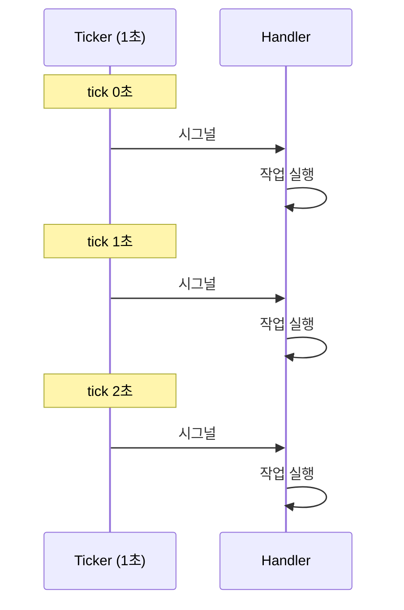

# Ticker (주기 신호)

> 최종 업데이트: 2026-05-13 | 일반 프로그래밍/백엔드 관점

## 개념

Ticker는 **일정 시간 간격으로 신호(시그널)를 보내는 메커니즘**이다. 시계가 초침을 가듯 정해진 주기마다 이벤트를 발생시켜, 코드가 그 신호를 받아 무언가를 실행하게 한다.

> 메트로놈과 같다. 일정한 박자로 "탁"하고 신호를 보내면, 연주자(코드)는 그 신호에 맞춰 음을 친다. Ticker 자체가 일을 하는 게 아니라 **언제 할지를 알려주는 시계**다.

- 핵심: **주기성** + **시그널 전달**
- Timer와의 차이: Timer는 **1회성**, Ticker는 **반복**
- 흔한 용도: heartbeat, polling, 토큰 충전, 메트릭 수집, 캐시 만료 검사

## Timer vs Ticker

| 항목 | Timer | Ticker |
|---|---|---|
| 발생 횟수 | 1회 | 반복 |
| 정지 필요 | 자동 종료 | **명시적 stop 필요** |
| 대표 API | `setTimeout`, `time.AfterFunc` | `setInterval`, `time.NewTicker` |
| 사용 예 | 디바운스, 타임아웃 | 주기 작업, polling |

## 동작 방식



내부적으로 **OS 타이머 인터럽트** 또는 **이벤트 루프**가 주기를 측정하고, 약속된 채널 또는 콜백으로 신호를 전달한다.

## Spring Boot 구현

### `@Scheduled` — 어노테이션 방식

가장 간단한 방식. 메서드에 붙이면 스프링이 주기적으로 호출한다. (`@SpringBootApplication`이나 설정 클래스에 `@EnableScheduling` 필요)

```java
@Scheduled(fixedRate = 1000)
public void heartbeat() {
    log.info("ping");
}
```

`fixedRate`는 시작 시각 기준 주기, `fixedDelay`는 종료 후 대기 — 미묘한 차이 주의.

### `ScheduledExecutorService` — 프로그래밍 방식

주기를 런타임에 동적으로 정하거나 빈으로 직접 관리해야 할 때.

```java
ScheduledExecutorService scheduler = Executors.newScheduledThreadPool(1);
scheduler.scheduleAtFixedRate(
    () -> doSomething(),
    0,        // 초기 지연
    1,        // 주기
    TimeUnit.SECONDS
);
```

## fixedRate vs fixedDelay

| 모드 | 동작 | 작업이 1초 걸리고 주기가 1초이면 |
|---|---|---|
| **fixedRate** | 시작 시각 기준 주기 | 다음 작업이 즉시 시작 (겹칠 수 있음) |
| **fixedDelay** | 종료 후 대기 | 작업 끝나고 1초 후 다음 시작 (총 2초 간격) |

## 사용 사례

| 사례 | 설명 |
|---|---|
| **Heartbeat** | 살아있다고 주기적으로 신호 (Kafka consumer, Eureka 등) |
| **Polling** | DB/외부 API 주기 조회 |
| **토큰 충전** | [[Rate-Limiting]] Token Bucket의 토큰 보충 |
| **버퍼 Flush** | [[Buffering]] 일정 주기로 큐 비우기 (배치) |
| **TTL/만료 검사** | 캐시 expiration 정리 |
| **메트릭 수집** | Prometheus scrape, 시스템 통계 |
| **세션 정리** | 만료된 세션 제거 |

## 관련 문서

- [[Rate-Limiting]] — 토큰 충전 주기 신호
- [[Buffering]] — 주기적 버퍼 flush
- [[Quartz-Scheduler]] — 클러스터 환경 스케줄러
- [[@Scheduled]] — Spring 어노테이션 기반 스케줄
- [[Cron-Expression]] — 복잡한 주기 표현
