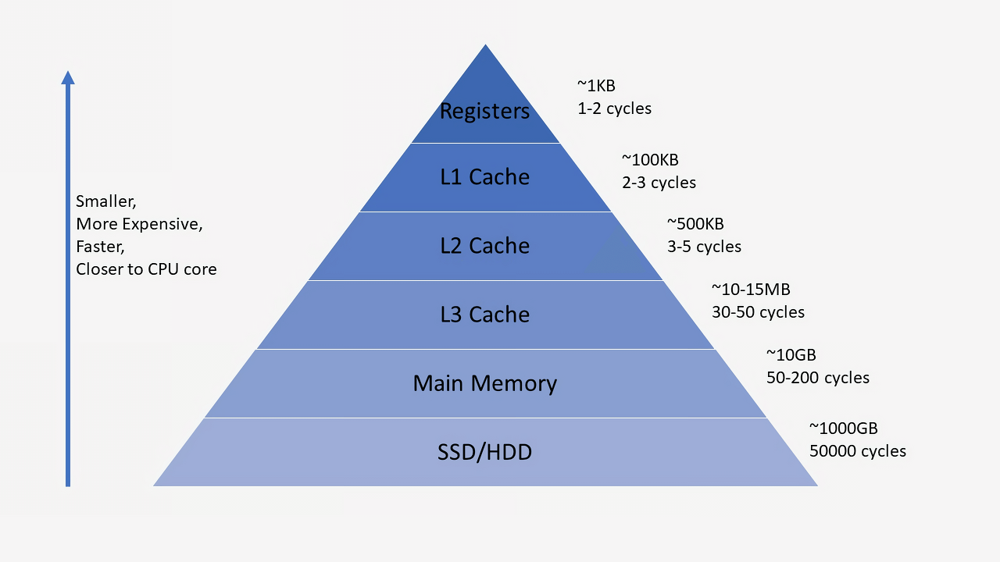
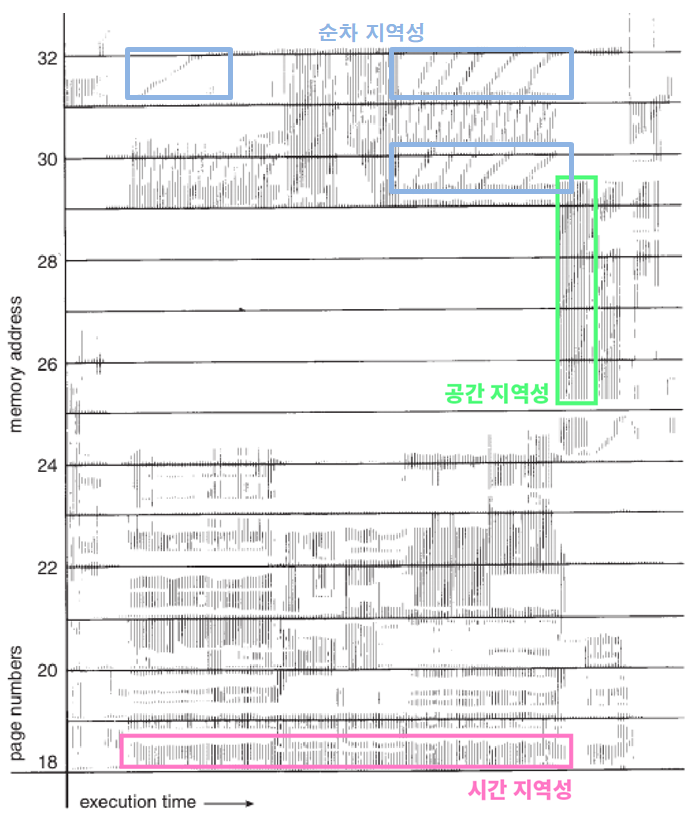
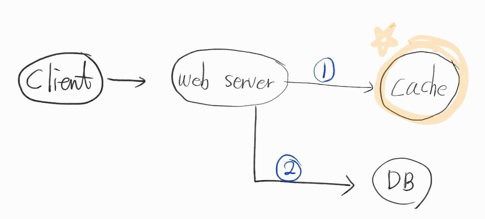
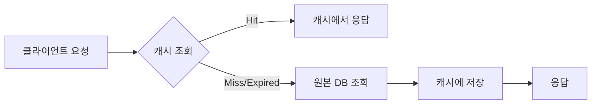
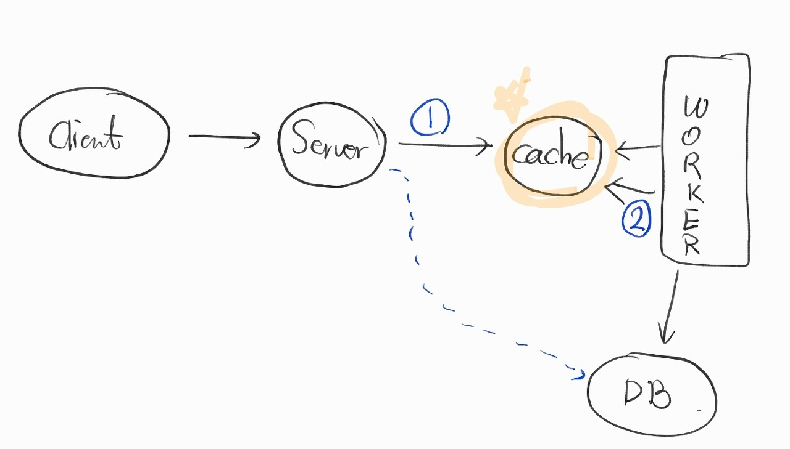
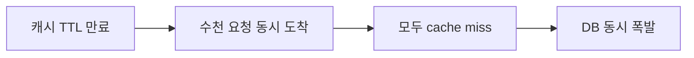

# Cache (캐시)

> 최종 업데이트: 2026-05-03 | CPU 캐시·HTTP 캐시·분산 캐시 통합 / 백엔드 실무 중심



## 개념

캐시는 **자주 사용되는 데이터·연산 결과를 더 빠른 저장소에 미리 복사해 두는 임시 저장 계층**이다. 원본 저장소보다 작고 비싸지만 훨씬 빠르다.

> 비유: 도서관에서 자주 보는 책을 책상에 쌓아두는 것. 매번 서가에 가는 것보다 빠르지만, 책상은 작고 한정적이라 무엇을 둘지 선택해야 한다.

핵심 명제: **속도와 공간/비용의 트레이드오프**. 작고 빠른 저장소(L1 → 메모리 → 디스크 → 네트워크)에 단계적으로 데이터를 두어 평균 접근 시간을 낮춘다.

## 배경/역사

캐시의 발상은 **메모리 계층(memory hierarchy)** 개념에서 출발했다. 어원은 프랑스어 *cacher*(숨기다) → 영어 "은닉처".

- **1968** IBM System/360 Model 85 — 최초의 상용 CPU 캐시 도입
- **1980~90년대** L1/L2 다단계 CPU 캐시 표준화. 메모리 계층 이론 정립
- **1996~1999** HTTP/1.1 RFC 2068/2616 — `Cache-Control` 헤더로 웹 캐시 표준화
- **1998** Akamai 창업 — CDN(Content Delivery Network) 상용화
- **2003** **Memcached** 출시 (Brad Fitzpatrick, LiveJournal) — 분산 인메모리 캐시 시대 개막
- **2009** **Redis** 출시 (Salvatore Sanfilippo) — 데이터 구조 서버로 확장. 현재 분산 캐시의 사실상 표준
- **2010년대** Cloudflare·AWS CloudFront 대중화로 엣지 캐싱이 표준
- **2020년대** AI 추론 캐시(KV cache, prompt cache) 등장 — LLM 응답 비용·지연 절감의 핵심 기법

## 캐시가 적용되는 계층

| 계층 | 적용 사례 | 비교 대상 |
|---|---|---|
| **CPU 캐시** | L1/L2/L3 — CPU와 RAM 사이 완충 | RAM (느림) |
| **OS 페이지 캐시** | 디스크 I/O 결과를 메모리에 캐싱 | 디스크 |
| **Application 캐시** | 인메모리 객체 캐싱 (JVM heap 등) | DB·외부 API |
| **분산 캐시** | Redis·Memcached — 여러 서버 공유 | DB |
| **DB 캐시** | Buffer Pool, Query Result Cache | 디스크 |
| **HTTP 캐시** | 브라우저·프록시·CDN | 원본 서버 |
| **CDN 엣지 캐시** | CloudFront·Cloudflare — 지리적으로 가까운 곳 | 원본 서버 |

→ 모든 계층은 **"느린 단계 앞에 더 빠른 단계를 두는"** 같은 원리.

## 캐시 위치별 분류: Local vs Distributed

| 구분 | Local Cache (in-process) | Distributed Cache |
|---|---|---|
| 위치 | 애플리케이션 프로세스 내 (heap) | 별도 서버 (Redis 등) |
| 속도 | 매우 빠름 (네트워크 X) | 빠름 (네트워크 1 hop) |
| 일관성 | 인스턴스마다 다름 — 동기화 어려움 | 모든 인스턴스가 같은 데이터 |
| 메모리 | 앱 heap 사용 → GC 영향 | 외부 서버 — 앱 heap 무관 |
| 장애 영향 | 앱 재시작 시 사라짐 | 캐시 서버 분리되어 격리 가능 |
| 대표 도구 | Caffeine, Ehcache, Guava Cache | Redis, Memcached, Hazelcast |
| 적합 상황 | 작고 자주 읽는 데이터 (코드, 환율 등) | 세션, 토큰, 공유 상태 |

> 실무에서는 **2단계 캐시(Local L1 + Distributed L2)**가 흔하다. Local에서 못 찾으면 Distributed → 그래도 못 찾으면 DB.

## 왜 캐시가 효과적인가 — 지역성 원리



**파레토의 법칙**: 상위 20% 데이터가 전체 트래픽의 80%를 차지한다. 그래서 자주 쓰이는 상위 20%만 캐싱해도 큰 효과.

| 지역성 | 정의 | 예시 |
|---|---|---|
| **시간적 지역성** (Temporal) | 한 번 접근된 데이터는 곧 다시 접근될 가능성 ↑ | 세션 토큰, 최근 본 상품 |
| **공간적 지역성** (Spatial) | 특정 데이터 근처 주소도 함께 접근될 가능성 ↑ | 배열 순회, 페이지 단위 로딩 |
| **순차 지역성** (Sequential) | 데이터가 순차적으로 액세스 | 로그 스캔, 스트리밍 |

> CPU 캐시는 한 메모리 주소에 접근할 때 **블록(cache line) 전체**를 가져온다 — 공간적 지역성을 활용.

## 캐시 동작 패턴 — 기본 흐름





1. 데이터 요청 → **캐시 먼저 탐색**
2. **Cache Miss** 또는 **expiration**(유효기간 종료) → 원본 DB 조회 후 캐시에 저장/갱신
3. **Cache Hit** → 캐시에서 즉시 응답

> CDN(Amazon CloudFront, Cloudflare 등)도 같은 구조 — 정적 파일 버전.

### 동시 쓰기가 많은 경우 (티케팅·이벤트)



1. 클라이언트가 웹서버에 쓰기 요청
2. 웹서버는 **Cache에 먼저 데이터 쓰고** 응답 반환 (빠른 응답)
3. 별도 Worker 서버가 캐시의 데이터를 주기적으로 DB에 영속화

→ 단점: 캐시 서버가 죽으면 미반영 데이터 유실. **디스크 영속화(AOF/RDB)** 또는 **Replication**으로 가용성 확보.

## 캐시 전략 (Read/Write Patterns)

### Read 패턴

| 전략 | 흐름 | 장점 | 단점 |
|---|---|---|---|
| **Cache-Aside** (Lazy Loading) | 앱이 캐시 확인 → 없으면 DB 조회 후 캐시 저장 | 가장 일반적, 구현 간단 | Cache miss 시 지연 발생, Stale data 가능 |
| **Read-Through** | 앱은 캐시만 호출. 캐시 미스 시 캐시 라이브러리가 DB 조회 후 채움 | 앱 코드 단순화 | 캐시 라이브러리 의존, Cache miss 첫 요청 지연 |
| **Refresh-Ahead** | TTL 만료 *전*에 백그라운드로 미리 갱신 | Cache miss 거의 없음 | 예측 잘못하면 불필요한 갱신, 구현 복잡 |

```java
// Cache-Aside 예시 (가장 일반적)
public User getUser(Long id) {
    User cached = cache.get(id);
    if (cached != null) return cached;
    User user = repository.findById(id);
    cache.put(id, user, Duration.ofMinutes(10));
    return user;
}
```

### Write 패턴

| 전략 | 흐름 | 장점 | 단점 |
|---|---|---|---|
| **Write-Through** | 캐시와 DB에 동시 쓰기 | 일관성 강함 | 쓰기 지연 ↑ |
| **Write-Behind** (Write-Back) | 캐시에만 쓰기 → 비동기 DB 반영 | 쓰기 매우 빠름 | 캐시 장애 시 데이터 유실 |
| **Write-Around** | 캐시 거치지 않고 DB에만 쓰기 | 자주 안 읽는 데이터에 적합 | 첫 읽기 항상 cache miss |

```java
// Write-Through 예시
public void updateUser(User user) {
    repository.save(user);
    cache.put(user.getId(), user);
}

// Write-Around 예시 (드물게 읽는 로그성 데이터)
public void appendAuditLog(AuditLog log) {
    repository.save(log);
    // 캐시 안 함 — 거의 다시 안 읽음
}
```

## 캐시 삭제 정책

### TTL (Expiration)

각 데이터에 **만료 시간** 설정. 만료되면 자동 무효화.

| TTL 패턴 | 사용처 |
|---|---|
| 짧은 TTL (수 초~수 분) | 자주 변하는 데이터 (실시간 가격, 재고) |
| 중간 TTL (수십 분~수 시간) | 사용자 프로필, 설정값 |
| 긴 TTL (하루 이상) | 코드 테이블, 정적 콘텐츠 |
| TTL 없음 | 명시적 무효화로만 관리 (위험, 권장 X) |

### Eviction Algorithm (저장 공간 부족 시 삭제)

| 알고리즘 | 기준 | 적합한 워크로드 |
|---|---|---|
| **LRU** (Least Recently Used) | 가장 오래 안 쓴 것 삭제 | 일반적, 시간 지역성 강한 데이터 |
| **LFU** (Least Frequently Used) | 가장 적게 쓴 것 삭제 | 핫 데이터 분명한 경우 |
| **FIFO** | 먼저 들어온 것 삭제 | 순차 처리 (드묾) |
| **Random** | 무작위 | 단순 구현 (Memcached 일부 모드) |
| **TTL-only** | 시간만 기준 | 명시적 만료 관리 |

> Redis 기본 정책은 `noeviction`(가득 차면 쓰기 거절). 캐시 용도라면 `allkeys-lru` 권장.

## 캐시 장애 패턴 (실무에서 진짜 무서운 것들)

### 1. Cache Stampede (Thundering Herd)

캐시 만료 순간 **동시 다발 요청이 모두 DB로 몰림** → DB 폭발.



**대응**:
- **Mutex/Lock** — 첫 요청만 DB 조회, 나머지는 대기
- **Probabilistic Early Expiration** — TTL 만료 *전부터* 일정 확률로 갱신
- **Refresh-Ahead** — 만료 전 백그라운드 갱신
- **Stale-while-revalidate** — 만료된 값을 잠시 더 쓰면서 백그라운드 갱신

### 2. Cache Penetration

**존재하지 않는 키에 대한 반복 요청** → 매번 DB까지 내려감.

**대응**:
- **Null 캐싱** — 존재하지 않는 결과도 짧은 TTL로 캐싱
- **Bloom Filter** — DB에 없는 키를 사전 차단

### 3. Cache Avalanche

**대량의 캐시가 동시에 만료** → 일제히 DB 폭발 (대규모 stampede).

**대응**:
- **TTL Jitter** — TTL에 랜덤 오프셋 추가 (예: 600s ± 60s)
- **다단계 캐시** — Local + Distributed 분산
- **Circuit Breaker** — DB 보호

### 4. Hot Key

**특정 키에 트래픽 집중** → 그 캐시 노드만 과부하 (이벤트·티켓팅 시).

**대응**:
- **Local Cache로 분산** — 분산 캐시 앞에 in-process 캐시 배치
- **Replica 분산** — 같은 키를 여러 노드에 복제
- **샤드 분리** — 핫 키만 별도 샤드

## "캐시 무효화는 컴퓨터 과학의 두 가지 어려운 문제 중 하나"

> "There are only two hard things in Computer Science: cache invalidation and naming things."
> — Phil Karlton (Netscape)

캐시의 본질적 어려움. **언제·어떻게 무효화할지**가 항상 트레이드오프:
- TTL이 짧으면 → DB 부하 ↑, 일관성 ↑
- TTL이 길면 → DB 부하 ↓, Stale data 위험

명시적 무효화(`cache.evict(key)`)도 분산 환경에선 **모든 노드에 전파**해야 해서 까다롭다 (pub/sub 또는 Redis cluster 사용).

## 분산 캐시 솔루션 비교

| 항목 | Redis | Memcached |
|---|---|---|
| 데이터 구조 | String, List, Set, Hash, Sorted Set, Stream, Bitmap, HyperLogLog 등 | String만 (key-value) |
| 영속화 | RDB·AOF 지원 | 메모리만 (재시작 시 휘발) |
| 복제·클러스터링 | Replication + Sentinel + Cluster | 단순 분산 (consistent hashing) |
| 트랜잭션·Lua 스크립트 | 지원 | 미지원 |
| pub/sub | 지원 | 미지원 |
| 멀티스레드 | 6.0+ I/O 멀티스레드, 명령 처리는 단일 스레드 | 멀티스레드 |
| 적합 상황 | 캐시 + 큐·랭킹·세션·분산 락 | 순수 단순 캐시 (대용량 메모리) |

> **2026년 기준 거의 모든 신규 프로젝트는 Redis 채택.** Memcached는 매우 단순한 캐시 전용 케이스에서만.

## HTTP 캐시

웹 응답의 `Cache-Control`·`ETag`·`Last-Modified` 헤더로 브라우저·프록시·CDN의 캐시 동작을 정밀 제어. RFC 9111(2022)이 최신 표준이며 `max-age`/`no-cache`/`no-store`/`private`/`public`/`s-maxage`/`stale-while-revalidate`/`immutable` 등 다양한 디렉티브가 존재.

> 디렉티브 전체 표·재검증(304 Not Modified)·Strong/Weak ETag·Vary 헤더·자원 종류별 권장 정책은 [HTTP Cache](Http%20Cache.md) 참조.

## CDN (Content Delivery Network)

지리적으로 분산된 **엣지 서버**에 정적 파일을 캐싱해 사용자에게 가까운 곳에서 응답.

| CDN | 운영사 | 특징 |
|---|---|---|
| **CloudFront** | AWS | AWS 통합 강함 |
| **Cloudflare** | Cloudflare | 무료 티어, DDoS 보호, Workers(엣지 컴퓨팅) |
| **Akamai** | Akamai | 가장 오래됨 (1998~), 엔터프라이즈 |
| **Fastly** | Fastly | 실시간 무효화, VCL 커스터마이징 |

핵심 효과: **레이턴시 ↓** (사용자 ↔ 엣지) + **원본 서버 부하 ↓** (대부분 트래픽이 엣지에서 처리).

## 캐시 메트릭

운영하면서 반드시 모니터링:

| 메트릭 | 정의 | 목표 |
|---|---|---|
| **Hit Ratio** | hits / (hits + misses) | 보통 > 80%, 핫 데이터 > 95% |
| **Miss Rate** | 1 - Hit Ratio | 낮을수록 좋음 |
| **Eviction Rate** | 단위 시간당 축출 건수 | 과도하면 메모리 증설 또는 TTL 조정 |
| **Latency (p95/p99)** | 캐시 응답 시간 | < 1ms (Local), < 5ms (Distributed) |
| **Memory Usage** | 캐시 메모리 사용량 | maxmemory 대비 90% 미만 유지 |
| **Connection Count** | 클라이언트 연결 수 | 풀 한도 점검 |

> Hit ratio가 50% 이하면 **캐시 효과가 거의 없음**. 캐시 키 설계 또는 TTL을 재검토해야 함.

## 백엔드 개발자 관점 실무 포인트

- **TTL은 필수** — `cache.put(key, value)` 형태로 TTL 없이 쓰지 말 것. 메모리 폭발과 stale data의 시작
- **Cache key 네이밍 표준** — `service:entity:id:version` 형태. 예: `payment:order:12345:v2`. 버전 prefix로 deploy 시 일괄 무효화
- **직렬화 주의** — JSON vs 바이너리. Spring `@Cacheable` 기본은 JDK 직렬화 → 클래스 변경 시 역직렬화 실패 위험. JSON 또는 Protobuf 권장
- **null 처리 정책 명시** — `cache.get(key)`가 null일 때 "캐시 미스"인지 "null이 캐싱된 값"인지 구분 필요. Optional 또는 sentinel 값 사용
- **분산 락은 Redis로** — 재고 차감, 중복 결제 방지 등엔 Redisson이나 `SET NX EX` 활용. Cache stampede에도 활용
- **TTL Jitter 적용** — 모든 TTL에 ±10% 랜덤 오프셋. Avalanche 방지의 가장 단순한 방법
- **Local + Distributed 2단계** — Caffeine(L1) + Redis(L2) 조합이 표준. 로컬에서 못 찾으면 Redis, Redis에서도 없으면 DB
- **무효화 이벤트는 pub/sub로** — 분산 환경에서 모든 인스턴스의 Local 캐시를 동기화하려면 Redis pub/sub 활용
- **Cache-Aside가 기본 전략** — Read-Through·Write-Through는 캐시 라이브러리에 강하게 의존. Cache-Aside가 가장 유연
- **무엇을 캐싱하지 *말지*도 중요** — 자주 변하는 데이터, 사용자별 1회성 응답, 작성 위주 데이터는 캐싱 X
- **모니터링 필수** — Hit ratio, Memory usage, Eviction rate를 대시보드에 항상 표시. 50% 이하 hit ratio는 즉시 점검 대상
- **Spring 어노테이션** — `@Cacheable`(Read), `@CachePut`(Write-Through), `@CacheEvict`(무효화). Caffeine 또는 RedisCacheManager와 결합

## 한 줄 요약

> **캐시 = "느린 단계 앞에 더 빠른 단계를 두는" 메모리 계층 원리의 일반화.** CPU L1부터 CDN 엣지까지 모두 같은 발상. 핵심 트레이드오프는 **속도 vs 일관성**이며, 실무 난점은 캐시 무효화·Stampede·Avalanche 같은 장애 패턴이다. **Cache-Aside + TTL Jitter + Hit ratio 모니터링** 세 가지가 시작점, 분산 환경에선 Redis가 사실상 표준.

## 관련 문서

- [HTTP Cache](Http%20Cache.md) — 웹 응답 캐시(`Cache-Control`/`ETag`/`Vary`) 정밀 가이드
- [Springboot Cache](Springboot%20Cache.md) — Spring `@Cacheable` 등 어노테이션 실전
- [Redis](../Redis/) — 분산 캐시 사실상 표준

## 참조

- AWS, [Database Caching Strategies Using Redis](https://docs.aws.amazon.com/whitepapers/latest/database-caching-strategies-using-redis/welcome.html)
- AWS, [What is Caching?](https://aws.amazon.com/caching/)
- Microsoft Learn, [Cache-Aside pattern](https://learn.microsoft.com/en-us/azure/architecture/patterns/cache-aside)
- MDN, [HTTP Caching](https://developer.mozilla.org/en-US/docs/Web/HTTP/Caching)
- [RFC 9111 — HTTP Caching](https://www.rfc-editor.org/rfc/rfc9111) (2022, HTTP/1.1 캐시 표준 갱신본)
- Redis, [Eviction policies](https://redis.io/docs/latest/develop/reference/eviction/)
- [Phil Karlton 인용 출처 (Martin Fowler 정리)](https://www.martinfowler.com/bliki/TwoHardThings.html)
- https://mangkyu.tistory.com/69
- https://zangzangs.tistory.com/110
- https://bang-jh.tistory.com/3
