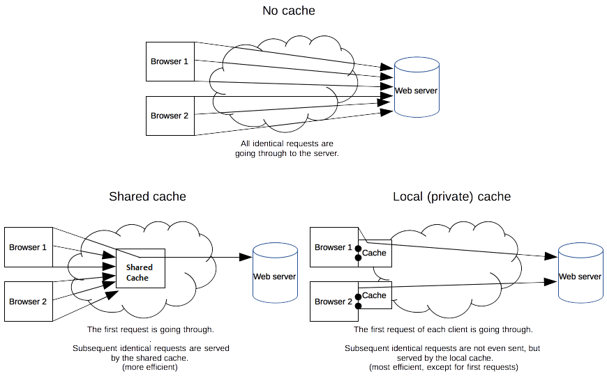
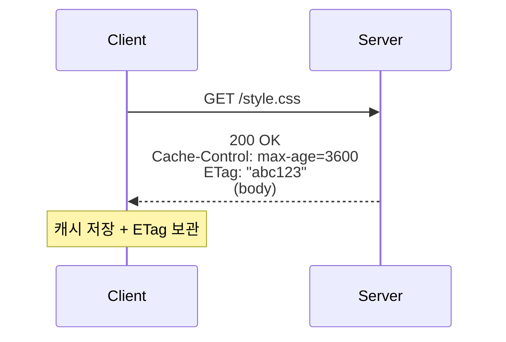
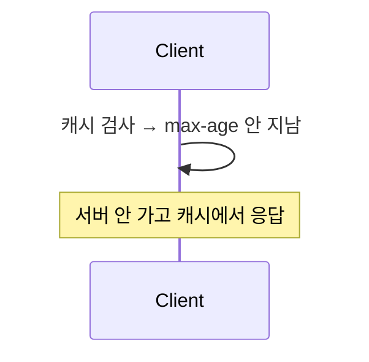
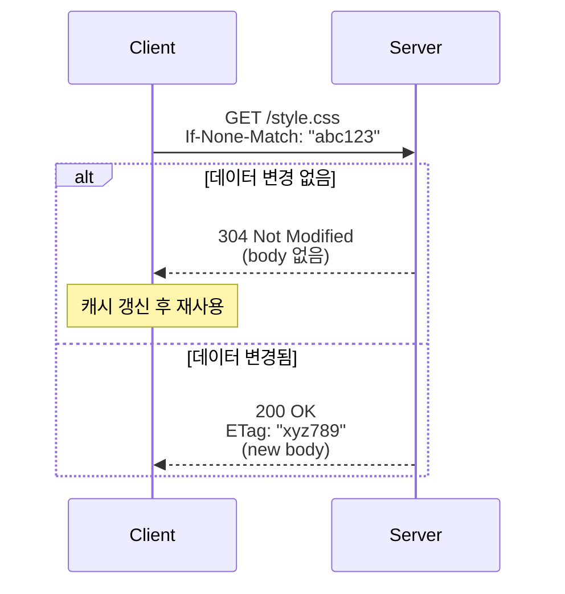

# HTTP Cache (HTTP 캐시)

> 최종 업데이트: 2026-05-03 | RFC 9111 (2022 최신 표준) 기준



## 개념

HTTP 캐시는 **브라우저·프록시·CDN이 서버 응답을 저장해두고 같은 요청이 오면 서버를 거치지 않고 응답하는 메커니즘**이다. HTTP 헤더로 캐시 정책이 결정된다.

> 비유: 동네 편의점에서 자주 사는 물건은 편의점에 재고가 있다. 매번 도매상까지 안 가도 됨. 단, 편의점 재고가 너무 오래되면 신선도(신선한 데이터)에 문제가 생기니 유효기간 관리가 핵심.

핵심 명제: **"재사용 가능한 응답"을 명시적으로 표시**해 네트워크 비용·서버 부하·지연 시간을 줄인다. 요청 헤더와 응답 헤더의 약속으로 동작한다.

## 배경/역사

웹 초기에는 캐시 정책이 모호했다. HTTP 표준의 진화는 거의 캐시 표준의 진화 역사다.

- **1996** HTTP/1.0 (RFC 1945) — `Expires`, `Pragma: no-cache`만 존재. 단순함
- **1997~1999** HTTP/1.1 초기 표준 (RFC 2068 → 2616) — **`Cache-Control` 헤더 도입**, `ETag`, `If-None-Match`, `Vary` 등 정교한 캐시 메커니즘 정식화
- **2014** RFC 7234 — HTTP/1.1 명세에서 **캐시 부분만 별도 분리**해 정리
- **2022** **RFC 9111** — 현재 최신 캐시 표준. `must-understand`, `stale-while-revalidate`, `stale-if-error` 등 현대적 디렉티브 정리
- **2010년대** Cloudflare·Fastly가 `stale-while-revalidate`·실시간 무효화로 엣지 캐시 표준 확장
- **2020년대** Service Worker·HTTP/3·Early Hints(103) 등 캐시와 결합된 새 기법들

> 같은 `Cache-Control` 헤더라도 **명세 발표 연도에 따라 사용 가능한 디렉티브가 다르다**. 최신은 RFC 9111.

## 캐시 위치 — 누가 캐싱하는가

| 위치 | 운영 주체 | 특징 | `Cache-Control` 영향 |
|---|---|---|---|
| **브라우저 캐시** | 사용자 브라우저 (private) | 사용자별 격리. 디스크/메모리 캐시 | `private`, `max-age` |
| **Forward Proxy** | 회사 인터넷, ISP | 여러 사용자 공유 (shared) | `public`, `s-maxage` |
| **CDN 엣지 캐시** | Cloudflare, CloudFront 등 | 지리적으로 분산된 shared 캐시 | `public`, `s-maxage`, `stale-while-revalidate` |
| **Reverse Proxy** | 서비스 운영사 (서버 앞단) | Nginx·Varnish | `s-maxage` |

> 응답 헤더 하나가 여러 위치에서 동시에 해석된다. `private`이면 브라우저만, `public`이면 모두.

> ⚠️ **Forward Proxy 캐시는 HTTPS 일반화(2015~)로 사실상 사양.** TLS 암호화된 트래픽을 중간 프록시가 들여다볼 수 없어 캐싱 불가. 그래서 요즘 "프록시 캐시"라고 하면 거의 **Reverse Proxy 또는 CDN**을 의미.

## 실무 표준 셋업

### 위치별 실무 사용 빈도

| 위치 | 사용 빈도 | 비고 |
|---|---|---|
| **브라우저 캐시** | ⭐⭐⭐⭐⭐ 거의 모든 서비스 | 헤더만 잘 주면 자동 동작. 비용 0 |
| **CDN 엣지** | ⭐⭐⭐⭐⭐ 사실상 표준 | Cloudflare 무료 티어로 소규모도 채택 증가 |
| **Reverse Proxy 캐시** | ⭐⭐ 사내 시스템 일부 | CDN 있으면 보통 생략 |
| **Forward Proxy 캐시** | ⭐ 거의 사양 | HTTPS로 못 캐싱하게 됨 |

→ **표준 조합은 "브라우저 + CDN"**. Reverse Proxy 캐시는 CDN 없는 사내 시스템 정도에서만.

### 자원 종류별 실무 패턴 (어디에 캐시할지 + 정책)

| 자원 | 어디에 캐시 | 정책 |
|---|---|---|
| **해시된 정적 파일** (style.abc.css) | 브라우저 + CDN | `public, max-age=31536000, immutable` (1년) |
| **해시 없는 정적 파일** (logo.png) | 브라우저 + CDN | `public, max-age=86400` (1일) |
| **HTML 페이지** | 브라우저 + CDN (짧게) | `no-cache` 또는 `max-age=300` |
| **API GET (공개 데이터)** | 브라우저 + CDN | `public, max-age=60~600`, `stale-while-revalidate` |
| **API GET (사용자별)** | 브라우저만 | `private, no-cache` |
| **API POST/PUT/DELETE** | 캐시 X | `no-store` |
| **인증·결제·민감 정보** | 캐시 X | `no-store` |

### 대표 도구

**CDN** (양대 산맥은 Cloudflare·CloudFront):

| CDN | 시장 위치 | 특징 |
|---|---|---|
| **Cloudflare** | 점유율 1위 | 무료 티어 강력, DDoS 보호, Workers(엣지 컴퓨팅) |
| **AWS CloudFront** | AWS 생태계 표준 | S3·ALB와 통합 쉬움 |
| **Akamai** | 엔터프라이즈 (1998~) | 가장 오래됨, 비쌈 |
| **Fastly** | 개발자 친화 | 실시간 무효화(150ms), VCL 커스터마이징 |
| **Vercel / Netlify** | 정적 호스팅 통합 | Next.js·React 등과 결합. 자체 CDN 포함 |

**Reverse Proxy 캐시**:

| 도구 | 용도 |
|---|---|
| **Nginx** | 가장 흔함. `proxy_cache` 디렉티브로 간단 캐싱 |
| **Varnish** | 캐시 전문. 고성능 + VCL 커스터마이징 |
| **HAProxy** | 주로 로드밸런서. 캐시는 보조 |
| **Apache Traffic Server** | 대규모 트래픽 (Yahoo가 만든 오픈소스) |

### 한국 실무 전형

| 회사 규모 | 보통 셋업 |
|---|---|
| **스타트업/소규모** | Cloudflare 무료 티어 + 브라우저 캐시 |
| **중간 규모** | AWS CloudFront + S3(정적) + ALB(동적) + 브라우저 |
| **대규모** | 다중 CDN (Cloudflare + Akamai 등) + Nginx Reverse Proxy + 브라우저 |
| **사내 시스템** (인터넷 노출 X) | Nginx Reverse Proxy + 브라우저 |

## 핵심 동작 흐름

### 1. 첫 요청 (캐시 없음)



### 2. 두 번째 요청 — Cache Hit (Fresh)



### 3. 만료 후 — 재검증 (Revalidation)



## `Cache-Control` 디렉티브

**응답 헤더용** (서버 → 클라이언트):

| 디렉티브 | 의미 | 사용 예 |
|---|---|---|
| `max-age=N` | N초 동안 캐시 fresh로 간주 | `max-age=3600` |
| `s-maxage=N` | shared 캐시(CDN/프록시)용 max-age. 우선 적용 | `s-maxage=86400` |
| `no-cache` | 캐시는 가능하나 사용 전 **반드시 재검증** | 자주 변하는 페이지 |
| `no-store` | **절대 캐시 금지**. 메모리에도 저장 X | 결제·인증 응답 |
| `private` | 브라우저(개인)만 캐시. CDN/프록시 X | 사용자별 데이터 |
| `public` | 모든 캐시 가능 | 정적 파일 |
| `must-revalidate` | 만료된 응답을 그대로 쓰지 말 것 (504 응답 강제) | 금융 데이터 |
| `proxy-revalidate` | shared 캐시에만 must-revalidate 적용 | — |
| `immutable` | 만료 전엔 절대 안 변함 — 재검증 생략 가능 | 해시된 정적 파일 |
| `stale-while-revalidate=N` | 만료된 값을 N초간 재사용하며 백그라운드 갱신 | 빠른 응답 + 신선도 |
| `stale-if-error=N` | 원본 에러 시 N초간 만료된 값 사용 | 가용성 ↑ |
| `no-transform` | 프록시가 응답 변형(이미지 압축 등) 금지 | — |

**요청 헤더용** (클라이언트 → 서버):

| 디렉티브 | 의미 |
|---|---|
| `no-cache` | 강제 재검증 요청 (Ctrl+F5) |
| `no-store` | 응답을 캐시 금지 요청 |
| `max-age=0` | 만료된 것으로 간주하고 재검증 |
| `only-if-cached` | 캐시에서만 응답. 없으면 504 |

```http
# 정적 파일 (1년 캐싱 + 절대 안 변함)
Cache-Control: public, max-age=31536000, immutable

# 사용자 대시보드 (재검증 강제)
Cache-Control: private, no-cache

# 결제 응답
Cache-Control: no-store

# 뉴스 피드 (10분 fresh + 1시간 stale 허용)
Cache-Control: public, max-age=600, stale-while-revalidate=3600
```

## 재검증 (Revalidation) — 두 가지 메커니즘

만료된 캐시를 그대로 버리지 않고 **"바뀌었는지만 묻는"** 가벼운 요청.

### 1. ETag (Entity Tag) + `If-None-Match`

| 헤더 | 보내는 쪽 | 의미 |
|---|---|---|
| `ETag: "abc123"` | 서버 → 클라 | 컨텐츠 버전 식별자 (해시·버전·랜덤) |
| `If-None-Match: "abc123"` | 클라 → 서버 | "이 ETag와 같으면 변경 없음" |

서버 응답:
- 일치 → **304 Not Modified** (body 없음, 캐시 재사용)
- 불일치 → **200 OK** + 새 ETag + 새 body

### 2. Last-Modified + `If-Modified-Since`

| 헤더 | 보내는 쪽 | 의미 |
|---|---|---|
| `Last-Modified: Wed, 21 Oct 2026 07:28:00 GMT` | 서버 → 클라 | 마지막 수정 시각 |
| `If-Modified-Since: Wed, 21 Oct 2026 07:28:00 GMT` | 클라 → 서버 | "이 시각 이후 변경됐나?" |

→ 시간 단위가 **초 단위 정밀도**라 1초 안에 여러 번 변경되는 데이터엔 부정확. **ETag가 더 권장**.

### 두 헤더가 모두 있을 때

`If-None-Match` (ETag)가 우선. ETag로 비교하고, 안 되면 `If-Modified-Since`로 폴백.

## ETag: Strong vs Weak

| 종류 | 표기 | 의미 |
|---|---|---|
| **Strong ETag** | `"abc123"` | 바이트 단위 동일 보장 |
| **Weak ETag** | `W/"abc123"` | 의미상 동일 (압축 차이·줄바꿈 차이 무시) |

> 실무에선 **Weak ETag로 충분한 경우가 많다**. Strong ETag는 다양한 표현(Accept-Encoding 등)에서 다 다른 ETag를 만들어야 해서 운영이 까다로움.

ETag 생성 전략:
- 컨텐츠 해시 (MD5/SHA1) — 정확하지만 비용 ↑
- 버전 번호 — 빠르지만 의미 충돌 가능
- 수정 시각 + 크기 조합 — 가벼운 절충안

## Vary 헤더 — 같은 URL, 다른 캐시

같은 `/api/data` URL이라도 **요청 헤더에 따라 응답이 다르면** 캐시는 별도 항목으로 저장돼야 한다.

```http
Vary: Accept-Encoding, Accept-Language
```

→ 캐시는 `(URL, Accept-Encoding 값, Accept-Language 값)`을 키로 사용. 압축 방식·언어별로 별도 캐시.

| 자주 쓰는 Vary 값 | 의미 |
|---|---|
| `Accept-Encoding` | gzip/br/identity별 |
| `Accept-Language` | ko/en/ja별 |
| `User-Agent` | 모바일/데스크톱별 (캐시 효율 낮음, 비권장) |
| `Origin` | CORS — 출처별 |
| `Cookie` | 사용자별 — 사실상 캐시 불가화 |

> `Vary: User-Agent`는 캐시를 거의 무력화. 진짜 필요한 경우만 사용.

## 한계와 Cache Busting (캐시 무효화)

HTTP 캐시의 본질적 한계: **만료(`max-age`) 전엔 변경된 콘텐츠를 클라이언트가 못 본다.**

> 예: `style.css`를 7일 캐싱했는데 어제 디자인을 바꿨다 → 사용자는 6일 더 옛 디자인을 봄.

### 해결: 파일명에 버전·해시 포함 (Cache Busting)

```html
<!-- Bad: 같은 URL, 캐시가 옛날 버전 반환 -->
<link rel="stylesheet" href="/style.css">

<!-- Good: 파일 내용이 바뀌면 URL이 바뀜 -->
<link rel="stylesheet" href="/style.3da37df.css">
<link rel="stylesheet" href="/style.css?v=42">
```

→ Webpack·Vite 같은 번들러가 빌드 시 자동으로 해시 prefix/suffix 부여. 그래서 정적 파일에 `Cache-Control: public, max-age=31536000, immutable`을 안전하게 줄 수 있다.

> 자원 종류별 정책 매트릭스는 위 [실무 표준 셋업 — 자원 종류별 실무 패턴](#자원-종류별-실무-패턴-어디에-캐시할지--정책) 참조.

## 안티패턴

| 안티패턴 | 왜 위험 |
|---|---|
| `no-cache`와 `no-store` 혼동 | `no-cache`는 "캐시 OK, 재검증 필수", `no-store`는 "절대 캐시 금지". 자주 헷갈림 |
| 정적 파일에 `Cache-Control` 미설정 | 브라우저별 휴리스틱(heuristic caching)으로 의도 못한 캐싱 발생 |
| HTML에 긴 `max-age` | 새 배포 후에도 사용자가 옛 페이지 봄 → 사용자 격리 |
| 민감 정보에 `Cache-Control` 미설정 | 프록시·CDN이 캐시해서 다른 사용자가 볼 위험 |
| Strong ETag 무리하게 사용 | 압축·표현 변형마다 다른 ETag 필요 → 캐시 효율 ↓ |
| `Vary: User-Agent` 남발 | 캐시 키 폭발 → 사실상 캐싱 불가 |
| Cache busting 없이 파일 갱신 | 사용자별로 옛 자원·새 자원 섞여 깨진 화면 |
| `Pragma: no-cache`만 사용 | HTTP/1.0 호환용. HTTP/1.1에선 `Cache-Control` 사용 |

## 백엔드 개발자 관점 실무 포인트

- **정적 파일은 빌드 시 해시 prefix + `immutable`** — Webpack/Vite·Rollup·esbuild 모두 지원
- **API 기본은 `private, no-cache`** — 명시적으로 캐시할 응답만 `public, max-age=...` 부여
- **인증·결제 응답은 `no-store`** — `Cache-Control: no-store, private` 조합
- **Spring 설정** — `ResponseEntity.ok().cacheControl(CacheControl.maxAge(1, HOURS).cachePublic()).body(...)` 또는 WebMvcConfigurer로 정적 자원 일괄 설정
- **ETag 자동 생성** — Spring `ShallowEtagHeaderFilter` 또는 Nginx `etag on`. 다만 응답 본문 전체를 해싱해야 해서 큰 응답엔 부담
- **Last-Modified 사용 시 초 정밀도 한계 인지** — 같은 초 내 변경은 못 잡음
- **CDN과 origin의 정책 분리** — `s-maxage`는 CDN용, `max-age`는 브라우저용. 다르게 설정 가능
- **`Vary` 헤더는 신중히** — 압축은 거의 필수(`Accept-Encoding`), 그 외는 캐시 효율 검토 후
- **CORS와 캐시** — `Vary: Origin` 또는 `Access-Control-Allow-Origin: *`. 사용자별 ACAO를 동적으로 주려면 `Vary: Origin` 필수
- **API 버전 관리와 결합** — `/v1/users` URL 자체에 버전을 박으면 변경 시 URL 바뀜 → 캐시 자연 무효화
- **CDN 무효화(purge) API 사용 시점** — 긴급 변경 시. 그러나 cache busting URL이 표준 답
- **로그인 상태 응답은 캐시 금지** — `private` + `no-cache` 또는 `no-store`. 프록시가 다른 사용자에게 노출할 위험
- **개발 시 `Disable cache` 켜고 테스트** — 캐시 동작 자체를 테스트할 땐 별도 시나리오 (Chrome DevTools "Network → Disable cache")

## 한 줄 요약

> **HTTP 캐시 = HTTP 헤더로 약속된 "응답 재사용 규약".** RFC 9111(2022)이 최신 표준이며, `Cache-Control` 디렉티브로 위치(브라우저/프록시/CDN)·정책(만료/재검증/영속)을 정밀 제어한다. 핵심은 **fingerprint된 정적 파일은 `immutable` 1년, HTML은 `no-cache` 재검증, API는 기본 `private no-cache`, 민감 정보는 `no-store`** 조합. 한계인 만료 전 갱신 불가는 **파일명 해시(cache busting)**로 해결.

## 관련 문서

- [Cache 개념](Cache-개념.md) — 캐시 일반론(메모리 계층·전략·장애 패턴)
- [Cache 폴더](.) — 분산 캐시·Redis 등

## 참조

- [RFC 9111 — HTTP Caching](https://www.rfc-editor.org/rfc/rfc9111) (2022, 최신 표준)
- [MDN — HTTP Caching](https://developer.mozilla.org/ko/docs/Web/HTTP/Caching)
- [MDN — Cache-Control](https://developer.mozilla.org/en-US/docs/Web/HTTP/Headers/Cache-Control)
- [MDN — ETag](https://developer.mozilla.org/en-US/docs/Web/HTTP/Headers/ETag)
- [Google web.dev — HTTP Cache](https://web.dev/articles/http-cache)
- [Cloudflare — What is HTTP caching?](https://www.cloudflare.com/learning/cdn/what-is-caching/)
- https://www.youtube.com/watch?v=NxFJ-mJdVNQ
