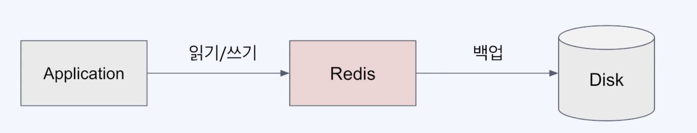
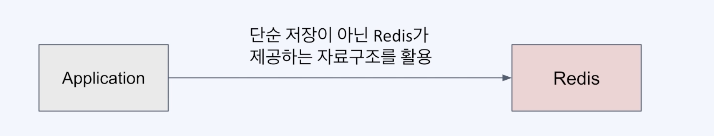

## Redis와 NoSQL

## NoSQL 정의
- Not Only SQL
- No SQL
- 관계형 DB에서 사용하는 SQL을 사용하지 않겠다
- 비 관계형 데이터베이스

## NoSQL 종류

- Key-value
  - **Redis**, Memcached, Riak, DynamoDB(aws)
- Wide-column
  - 각 row마다 다른 스키마를 가질 수 있음.
  - Cassandra, HBase, Google BigTable
- Document
  - Key-value 안에 계층적인 Object가 들어감. Json으로 된 object가 들어간다
  - MongoDB
- Graph
  - 그래프로 표현되는 데이터
  - 관계를 표현하기 좋음
  - Neo4j, OrientDB, AgensGraph

## NoSQL로서의 Redis

- DBMS의 성격이 있음.
- 영속성을 지원(백업)하기는 하지만 기본적으로 영속성을 위한 DB는 아님.
- DBMS보다는 빠른 캐시의 성격으로 대표됨.
- NoSQL DB로 분류되는 key-value store
- **다양한 자료구조** 지원  
  - string, hash, set, list

### External Heap으로서의 Redis
- 외부 메모리
- Application이 장애가 나도 Redis의 데이터는 보존됨 (단기적으로)

### DBMS로의 Redis
- Redis의 영속화 수단을 이용해 DBMS처럼 이용
- 속도를 희생해야되는 비효울.

### middleware로서의 Redis
- redis가 제공하는 자료구조를 활용해 복잡한 로직을 쉽게 구현
